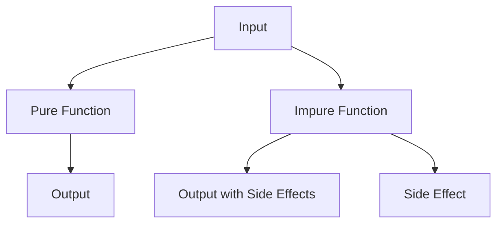

## 10.17. Referential Transparency and Purity

In the realm of functional programming, referential transparency and purity are foundational concepts that contribute to writing robust, predictable, and maintainable code. Clojure, as a functional programming language, embraces these principles, allowing developers to harness the power of immutability and functional purity. In this section, we will delve into the significance of referential transparency and purity, explore how side effects can compromise these principles, and provide practical examples to illustrate the differences between pure and impure functions. By the end of this guide, you'll understand why writing pure functions is a best practice in Clojure and how it can enhance your software development process.

### Understanding Referential Transparency

**Referential Transparency** is a property of expressions in programming that allows them to be replaced with their corresponding values without changing the program's behavior. This concept is crucial in functional programming because it ensures that functions behave predictably and consistently.

#### Definition and Significance

Referential transparency implies that an expression can be substituted with its evaluated result without affecting the program's outcome. This property is significant because it enables:

- **Predictability**: Code behaves consistently, making it easier to reason about.
- **Composability**: Functions can be combined and reused without unexpected side effects.
- **Testability**: Functions can be tested in isolation, as their output depends solely on their input.

#### Example of Referential Transparency

Consider the following Clojure code snippet:

```clojure
(defn add [x y]
  (+ x y))

;; Referentially transparent expression
(let [result (add 2 3)]
  (* result 2))
```

In this example, the expression `(add 2 3)` is referentially transparent because it can be replaced with `5` without altering the program's behavior:

```clojure
(let [result 5]
  (* result 2))
```

Both expressions yield the same result, demonstrating referential transparency.

### The Role of Pure Functions

**Pure Functions** are functions that adhere to the principles of referential transparency. They have two main characteristics:

1. **Deterministic**: Given the same input, a pure function will always produce the same output.
2. **Side-Effect Free**: Pure functions do not modify any state or interact with the outside world (e.g., no I/O operations).

#### Benefits of Pure Functions

- **Ease of Testing**: Pure functions can be tested independently, as they do not rely on external state.
- **Parallelization**: Pure functions can be executed in parallel without concerns about shared state.
- **Memoization**: Results of pure functions can be cached, improving performance for repeated calls with the same arguments.

#### Example of a Pure Function

Here's an example of a pure function in Clojure:

```clojure
(defn square [x]
  (* x x))

;; Usage
(square 4) ;; => 16
```

The `square` function is pure because it consistently returns the same result for the same input and does not produce side effects.

### Contrasting Pure and Impure Functions

To fully appreciate the value of pure functions, it's essential to understand how impure functions differ. Impure functions may produce side effects or rely on external state, making them less predictable and harder to test.

#### Example of an Impure Function

Consider the following impure function:

```clojure
(defn impure-add [x]
  (println "Adding 5 to" x)
  (+ x 5))

;; Usage
(impure-add 10) ;; Prints "Adding 5 to 10" and returns 15
```

The `impure-add` function is impure because it performs a side effect (printing to the console) and its behavior is not solely determined by its input.

#### Implications of Impurity

- **Testing Challenges**: Impure functions require complex setups to test due to their reliance on external state or side effects.
- **Unpredictability**: The presence of side effects can lead to unexpected behavior, especially in concurrent environments.
- **Reduced Reusability**: Impure functions are less composable and harder to reuse in different contexts.

### Encouraging Purity in Clojure

Clojure's design encourages the use of pure functions and immutability, making it easier to adhere to functional programming principles. Here are some strategies to promote purity in your Clojure code:

#### Use Immutable Data Structures

Clojure's core data structures (lists, vectors, maps, and sets) are immutable by default, supporting the creation of pure functions. By avoiding mutable state, you can ensure that your functions remain side-effect free.

#### Leverage Higher-Order Functions

Higher-order functions, such as `map`, `reduce`, and `filter`, allow you to compose pure functions and operate on collections without introducing side effects.

```clojure
(defn double [x]
  (* 2 x))

(map double [1 2 3 4]) ;; => (2 4 6 8)
```

#### Avoid Global State

Minimize the use of global variables or mutable references (e.g., atoms, refs) to maintain purity. When state management is necessary, consider using Clojure's concurrency primitives to manage state changes explicitly.

### Visualizing Referential Transparency and Purity

To better understand the concept of referential transparency and purity, let's visualize the flow of data through pure and impure functions using a flowchart.



**Description**: This flowchart illustrates the difference between pure and impure functions. Pure functions transform input directly into output without side effects, while impure functions produce output and may also cause side effects.

### Try It Yourself

To solidify your understanding of referential transparency and purity, try modifying the following code examples:

1. Convert the `impure-add` function into a pure function by removing the side effect (printing).
2. Create a new pure function that calculates the factorial of a number using recursion.
3. Experiment with higher-order functions to transform a collection of numbers into their squares.

### References and Further Reading

- [Functional Programming Concepts](https://en.wikipedia.org/wiki/Functional_programming)
- [Clojure Documentation](https://clojure.org/)
- [Pure Functions and Side Effects](https://www.freecodecamp.org/news/functional-programming-concepts-with-javascript-examples/)

### Knowledge Check

To reinforce your understanding of referential transparency and purity, let's test your knowledge with some quiz questions.

## **Ready to Test Your Knowledge?**



### What is referential transparency?

- [x] The property of expressions that allows them to be replaced with their corresponding values without changing the program's behavior.
- [ ] The ability of a function to modify global state.
- [ ] The process of optimizing code for performance.
- [ ] The use of mutable data structures.

> **Explanation:** Referential transparency ensures that expressions can be replaced with their evaluated results without affecting the program's behavior.

### Which of the following is a characteristic of pure functions?

- [x] They are deterministic and produce the same output for the same input.
- [ ] They modify global state.
- [ ] They perform I/O operations.
- [ ] They rely on external state.

> **Explanation:** Pure functions are deterministic and do not produce side effects, making them predictable and testable.

### What is a side effect in the context of functional programming?

- [x] Any observable interaction with the outside world, such as modifying state or performing I/O operations.
- [ ] The result of a function call.
- [ ] The use of immutable data structures.
- [ ] The process of function composition.

> **Explanation:** Side effects are interactions with the outside world that can affect the predictability and testability of functions.

### Why are pure functions easier to test?

- [x] Because their output depends solely on their input and they do not rely on external state.
- [ ] Because they modify global state.
- [ ] Because they perform I/O operations.
- [ ] Because they are written in Clojure.

> **Explanation:** Pure functions are easier to test because they are deterministic and do not produce side effects.

### How can you promote purity in Clojure code?

- [x] Use immutable data structures and avoid global state.
- [ ] Use mutable data structures and rely on global state.
- [ ] Perform I/O operations within functions.
- [ ] Use side effects to manage state.

> **Explanation:** Using immutable data structures and avoiding global state helps maintain purity in Clojure code.

### What is the benefit of referential transparency in functional programming?

- [x] It makes code more predictable and easier to reason about.
- [ ] It allows for the use of mutable data structures.
- [ ] It enables functions to modify global state.
- [ ] It requires complex testing setups.

> **Explanation:** Referential transparency ensures predictability and ease of reasoning, as expressions can be replaced with their evaluated results.

### Which of the following is an example of an impure function?

- [x] A function that prints to the console and returns a value.
- [ ] A function that calculates the square of a number.
- [ ] A function that adds two numbers.
- [ ] A function that returns a constant value.

> **Explanation:** A function that prints to the console is impure because it produces a side effect.

### What is the role of higher-order functions in promoting purity?

- [x] They allow for the composition of pure functions without introducing side effects.
- [ ] They modify global state.
- [ ] They perform I/O operations.
- [ ] They rely on external state.

> **Explanation:** Higher-order functions enable the composition of pure functions, maintaining purity and avoiding side effects.

### Why is immutability important in functional programming?

- [x] It prevents state changes, ensuring that functions remain pure and predictable.
- [ ] It allows for the modification of global state.
- [ ] It enables functions to perform I/O operations.
- [ ] It requires complex testing setups.

> **Explanation:** Immutability prevents state changes, supporting the creation of pure functions and maintaining predictability.

### True or False: Pure functions can be executed in parallel without concerns about shared state.

- [x] True
- [ ] False

> **Explanation:** Pure functions do not rely on shared state, making them suitable for parallel execution without concerns about state conflicts.



Remember, mastering referential transparency and purity is just the beginning of your journey in functional programming with Clojure. As you continue to explore these concepts, you'll discover new ways to write elegant, efficient, and maintainable code. Keep experimenting, stay curious, and enjoy the journey!
