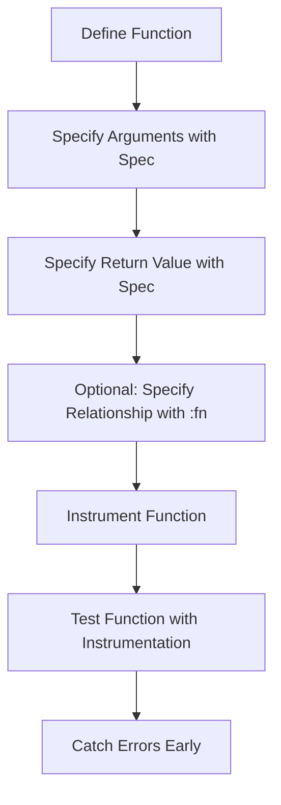

## 10.18. Using `spec` for Function Specifications and Instrumentation

Clojure Spec is a powerful library that allows developers to define specifications for data and functions. It provides a way to describe the structure of data, validate it, and generate test data. In this section, we will explore how to use Clojure Spec to specify function contracts, validate inputs and outputs, and instrument functions for testing. We will introduce function specs and their syntax, demonstrate how to use `fdef` to define function specifications, and provide examples of instrumenting functions and checking conformance. Additionally, we will discuss the benefits of using Clojure Spec for debugging and documentation, and highlight its integration with testing frameworks.

### Introduction to Clojure Spec

Clojure Spec is a library for describing the structure of data and functions in Clojure. It allows you to define specifications for data structures, validate data against these specifications, and generate test data that conforms to the specifications. Clojure Spec is particularly useful for:

- **Validating Data**: Ensuring that data conforms to a specified structure.
- **Testing**: Generating test data and checking that functions behave correctly.
- **Documentation**: Providing a clear description of the expected structure of data and functions.

### Function Specifications with `fdef`

In Clojure Spec, function specifications are defined using the `fdef` macro. This macro allows you to specify the arguments, return value, and optional side effects of a function. The syntax for `fdef` is as follows:

```clojure
(require '[clojure.spec.alpha :as s])

(s/fdef my-function
  :args (s/cat :arg1 spec1 :arg2 spec2)
  :ret spec3
  :fn (s/and #(= (:arg1 %) (:ret %))))
```

- **`:args`**: Specifies the structure of the function's arguments using a spec.
- **`:ret`**: Specifies the structure of the function's return value.
- **`:fn`**: An optional predicate that describes the relationship between the arguments and the return value.

### Example: Defining a Function Specification

Let's define a simple function that adds two numbers and specify its contract using `fdef`.

```clojure
(require '[clojure.spec.alpha :as s])

(defn add [x y]
  (+ x y))

(s/fdef add
  :args (s/cat :x number? :y number?)
  :ret number?
  :fn (s/and #(= (+ (:x %) (:y %)) (:ret %))))
```

In this example, we define a function `add` that takes two arguments `x` and `y`, both of which should be numbers. The return value is also a number, and we specify that the return value should be the sum of `x` and `y`.

### Instrumenting Functions

Instrumentation is a process where Clojure Spec checks that a function is called with arguments that conform to its specification. This is particularly useful for debugging and testing, as it can catch errors early in the development process.

To instrument a function, use the `stest/instrument` function from the `clojure.spec.test.alpha` namespace:

```clojure
(require '[clojure.spec.test.alpha :as stest])

(stest/instrument `add)
```

Once a function is instrumented, any call to it with non-conforming arguments will result in a runtime exception.

### Example: Instrumenting and Testing a Function

Let's see how instrumentation works with our `add` function.

```clojure
(stest/instrument `add)

;; This will work fine
(add 1 2)

;; This will throw an exception because "a" is not a number
(add "a" 2)
```

### Benefits of Using Clojure Spec

Using Clojure Spec for function specifications and instrumentation offers several benefits:

- **Early Error Detection**: By specifying the expected structure of function arguments and return values, you can catch errors early in the development process.
- **Improved Documentation**: Function specifications serve as documentation, making it clear what a function expects and returns.
- **Enhanced Testing**: Clojure Spec can generate test data that conforms to specifications, making it easier to test functions thoroughly.

### Integration with Testing Frameworks

Clojure Spec integrates well with testing frameworks such as `clojure.test`. You can use the `stest/check` function to automatically test functions against their specifications.

```clojure
(require '[clojure.test :refer :all])

(deftest add-test
  (is (= 3 (add 1 2))))

(stest/check `add)
```

### Visualizing Function Specifications

To better understand how function specifications work, let's visualize the process using a flowchart.



This flowchart illustrates the steps involved in defining and using function specifications with Clojure Spec.

### Try It Yourself

To get hands-on experience with Clojure Spec, try modifying the `add` function to handle more complex data structures, such as vectors or maps. Define specifications for these data structures and instrument the function to ensure it behaves correctly.

### Knowledge Check

Before we wrap up, let's test your understanding of using Clojure Spec for function specifications and instrumentation.

## **Ready to Test Your Knowledge?**



### What is the primary purpose of Clojure Spec?

- [x] To describe the structure of data and functions
- [ ] To replace all testing frameworks
- [ ] To compile Clojure code
- [ ] To manage dependencies

> **Explanation:** Clojure Spec is designed to describe the structure of data and functions, allowing for validation, testing, and documentation.

### What does the `:args` key in `fdef` specify?

- [x] The structure of the function's arguments
- [ ] The function's return value
- [ ] The function's side effects
- [ ] The function's name

> **Explanation:** The `:args` key in `fdef` specifies the structure of the function's arguments using a spec.

### How do you instrument a function in Clojure Spec?

- [x] Using `stest/instrument`
- [ ] Using `s/instrument`
- [ ] Using `spec/instrument`
- [ ] Using `test/instrument`

> **Explanation:** The `stest/instrument` function from the `clojure.spec.test.alpha` namespace is used to instrument functions.

### What happens when a function is called with non-conforming arguments after instrumentation?

- [x] A runtime exception is thrown
- [ ] The function returns `nil`
- [ ] The function logs a warning
- [ ] The function continues execution

> **Explanation:** When a function is instrumented and called with non-conforming arguments, a runtime exception is thrown.

### Which of the following is a benefit of using Clojure Spec?

- [x] Early error detection
- [x] Improved documentation
- [ ] Faster code execution
- [ ] Reduced memory usage

> **Explanation:** Clojure Spec helps in early error detection and improves documentation by specifying the expected structure of data and functions.

### What is the role of the `:ret` key in `fdef`?

- [x] To specify the structure of the function's return value
- [ ] To specify the function's arguments
- [ ] To specify the function's side effects
- [ ] To specify the function's name

> **Explanation:** The `:ret` key in `fdef` specifies the structure of the function's return value.

### How can Clojure Spec enhance testing?

- [x] By generating test data that conforms to specifications
- [ ] By replacing all existing tests
- [ ] By compiling tests faster
- [ ] By reducing test code size

> **Explanation:** Clojure Spec can generate test data that conforms to specifications, enhancing the thoroughness of testing.

### What is the purpose of the `:fn` key in `fdef`?

- [x] To describe the relationship between arguments and return value
- [ ] To specify the function's name
- [ ] To specify the function's side effects
- [ ] To specify the function's documentation

> **Explanation:** The `:fn` key in `fdef` is an optional predicate that describes the relationship between the function's arguments and its return value.

### Can Clojure Spec be used for data validation?

- [x] True
- [ ] False

> **Explanation:** Clojure Spec is designed to validate data against specified structures, making it a powerful tool for data validation.

### Is Clojure Spec integrated with `clojure.test`?

- [x] True
- [ ] False

> **Explanation:** Clojure Spec integrates well with `clojure.test`, allowing for automatic testing of functions against their specifications.



### Conclusion

Clojure Spec is a versatile tool that enhances the robustness and reliability of Clojure applications. By defining clear specifications for functions and data, developers can catch errors early, improve documentation, and streamline testing processes. As you continue to explore Clojure Spec, remember to experiment with different data structures and specifications to fully leverage its capabilities. Keep learning, stay curious, and enjoy the journey of mastering Clojure!
