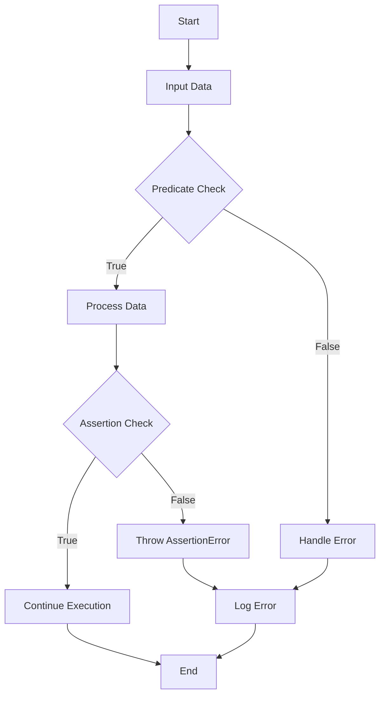

## 10.19. The Role of Predicates and Assertion Functions

In the world of functional programming, ensuring the correctness and safety of your code is paramount. Clojure, with its emphasis on immutability and functional purity, provides powerful tools to help developers maintain these qualities. Among these tools are predicates and assertion functions, which play a crucial role in enforcing invariants and validating data throughout an application. In this section, we will delve into the concepts of predicates and assertions, explore their usage in Clojure, and demonstrate how they contribute to writing robust and reliable code.

### Understanding Predicates in Clojure

**Predicates** are functions that return a boolean value (`true` or `false`) based on a given condition. They are fundamental in conditional logic, allowing you to make decisions in your code. In Clojure, predicates are often used to test properties of data, validate inputs, and enforce constraints.

#### Built-in Predicate Functions

Clojure provides a rich set of built-in predicate functions that cover a wide range of common use cases. Here are some examples:

- **`even?` and `odd?`**: Check if a number is even or odd.
- **`nil?`**: Determine if a value is `nil`.
- **`empty?`**: Check if a collection is empty.
- **`string?`, `number?`, `map?`, `vector?`**: Test the type of a value.

Let's see some of these predicates in action:

```clojure
;; Check if a number is even
(even? 4) ;=> true

;; Check if a value is nil
(nil? nil) ;=> true
(nil? 42) ;=> false

;; Check if a collection is empty
(empty? []) ;=> true
(empty? [1 2 3]) ;=> false

;; Check the type of a value
(string? "Hello") ;=> true
(map? {:key "value"}) ;=> true
```

#### Custom Predicate Functions

While built-in predicates are useful, you often need to define custom predicates to suit specific requirements. Creating a custom predicate is straightforward: simply define a function that returns a boolean value.

```clojure
;; Define a custom predicate to check if a number is positive
(defn positive? [n]
  (> n 0))

;; Use the custom predicate
(positive? 5) ;=> true
(positive? -3) ;=> false
```

### The Power of Predicates in Conditional Logic

Predicates are integral to conditional logic in Clojure. They are commonly used with conditional constructs like `if`, `when`, `cond`, and `filter`. Let's explore how predicates enhance these constructs:

#### Using Predicates with `if` and `when`

The `if` and `when` constructs rely on predicates to determine which branch of code to execute.

```clojure
;; Using a predicate with if
(defn check-even [n]
  (if (even? n)
    (str n " is even")
    (str n " is odd")))

(check-even 4) ;=> "4 is even"
(check-even 5) ;=> "5 is odd"

;; Using a predicate with when
(defn print-if-positive [n]
  (when (positive? n)
    (println n "is positive")))

(print-if-positive 3) ;=> Prints "3 is positive"
(print-if-positive -1) ;=> Does nothing
```

#### Filtering Collections with Predicates

Predicates are also used to filter collections, allowing you to extract elements that satisfy a certain condition.

```clojure
;; Filter even numbers from a list
(filter even? [1 2 3 4 5 6]) ;=> (2 4 6)

;; Filter positive numbers using a custom predicate
(filter positive? [-3 -2 -1 0 1 2 3]) ;=> (1 2 3)
```

### Assertion Functions in Clojure

While predicates help in decision-making, **assertion functions** are used to enforce invariants and validate assumptions in your code. Assertions are a way to check that certain conditions hold true during execution, and they can be invaluable for catching errors early.

#### Using `assert` in Clojure

Clojure provides the `assert` function to perform runtime checks. If the condition specified in `assert` evaluates to false, an `AssertionError` is thrown.

```clojure
;; Use assert to check a condition
(defn divide [numerator denominator]
  (assert (not (zero? denominator)) "Denominator cannot be zero")
  (/ numerator denominator))

(divide 10 2) ;=> 5
(divide 10 0) ;=> Throws AssertionError: Denominator cannot be zero
```

#### Creating Custom Assertion Functions

In addition to `assert`, you can create custom assertion functions to encapsulate complex validation logic. This approach allows you to reuse validation logic across your codebase.

```clojure
;; Define a custom assertion function
(defn assert-positive [n]
  (assert (positive? n) "Number must be positive"))

;; Use the custom assertion function
(defn calculate-square-root [n]
  (assert-positive n)
  (Math/sqrt n))

(calculate-square-root 9) ;=> 3.0
(calculate-square-root -9) ;=> Throws AssertionError: Number must be positive
```

### Enhancing Code Safety and Correctness

Predicates and assertions play a vital role in enhancing the safety and correctness of your code. By validating inputs and enforcing invariants, they help prevent errors and ensure that your code behaves as expected.

#### Benefits of Using Predicates and Assertions

1. **Early Error Detection**: Assertions catch errors early in the development process, making debugging easier and reducing the risk of bugs in production.
2. **Improved Code Clarity**: Predicates and assertions make your code more readable by clearly expressing the conditions and assumptions.
3. **Reusability**: Custom predicates and assertions can be reused across your codebase, promoting consistency and reducing duplication.
4. **Documentation**: Assertions serve as a form of documentation, indicating the expected behavior and constraints of your code.

### Thoughtful Use of Assertions

While assertions are powerful, they should be used thoughtfully. Here are some best practices to consider:

- **Use Assertions for Critical Checks**: Focus on conditions that are critical to the correctness of your program.
- **Avoid Overuse**: Excessive assertions can clutter your code and impact performance. Use them judiciously.
- **Provide Meaningful Messages**: Include informative error messages in your assertions to aid debugging.
- **Test Assertions**: Ensure that your assertions are tested and that they accurately reflect the intended constraints.

### Visualizing Predicate and Assertion Usage

To better understand how predicates and assertions fit into the flow of a Clojure program, let's visualize their interaction using a flowchart.



**Diagram Description**: This flowchart illustrates the typical flow of a Clojure program using predicates and assertions. Data is inputted, and a predicate check determines whether to process the data or handle an error. After processing, an assertion check ensures that the data meets certain conditions before continuing execution.

### Try It Yourself

To deepen your understanding of predicates and assertions, try modifying the examples provided. Here are some suggestions:

- Create a custom predicate to check if a string is a palindrome.
- Implement an assertion function that verifies a list contains only unique elements.
- Experiment with filtering collections using different predicates.

### References and Further Reading

- [Clojure Documentation on Predicates](https://clojure.org/reference/predicates)
- [Clojure Documentation on Assertions](https://clojure.org/reference/assert)
- [Functional Programming in Clojure](https://www.braveclojure.com/)

### Knowledge Check

To reinforce your understanding of predicates and assertions in Clojure, let's test your knowledge with some quiz questions.

## **Ready to Test Your Knowledge?**



### What is a predicate in Clojure?

- [x] A function that returns a boolean value
- [ ] A function that modifies data
- [ ] A function that always returns `nil`
- [ ] A function that performs I/O operations

> **Explanation:** A predicate is a function that returns a boolean value, typically used to test conditions.

### Which built-in predicate checks if a collection is empty?

- [ ] `nil?`
- [ ] `even?`
- [x] `empty?`
- [ ] `string?`

> **Explanation:** The `empty?` predicate checks if a collection is empty.

### What does the `assert` function do in Clojure?

- [ ] Modifies data
- [x] Checks a condition and throws an error if false
- [ ] Performs I/O operations
- [ ] Always returns `true`

> **Explanation:** The `assert` function checks a condition and throws an `AssertionError` if the condition is false.

### How can you define a custom predicate in Clojure?

- [x] By creating a function that returns a boolean value
- [ ] By modifying a built-in predicate
- [ ] By using the `assert` function
- [ ] By performing I/O operations

> **Explanation:** A custom predicate is defined by creating a function that returns a boolean value based on a condition.

### What is the purpose of assertions in Clojure?

- [ ] To modify data
- [x] To enforce invariants and validate assumptions
- [ ] To perform I/O operations
- [ ] To always return `nil`

> **Explanation:** Assertions are used to enforce invariants and validate assumptions in your code.

### Which of the following is a best practice for using assertions?

- [x] Use assertions for critical checks
- [ ] Use assertions excessively
- [ ] Avoid providing error messages
- [ ] Never test assertions

> **Explanation:** It's best to use assertions for critical checks and provide informative error messages.

### What happens if an assertion fails in Clojure?

- [ ] The program continues execution
- [x] An `AssertionError` is thrown
- [ ] The program performs I/O operations
- [ ] The program returns `nil`

> **Explanation:** If an assertion fails, an `AssertionError` is thrown, halting execution.

### How can predicates enhance code safety?

- [x] By validating inputs and enforcing constraints
- [ ] By modifying data
- [ ] By performing I/O operations
- [ ] By always returning `nil`

> **Explanation:** Predicates enhance code safety by validating inputs and enforcing constraints.

### Which predicate checks if a number is even?

- [ ] `odd?`
- [x] `even?`
- [ ] `nil?`
- [ ] `empty?`

> **Explanation:** The `even?` predicate checks if a number is even.

### True or False: Assertions should be used excessively in Clojure.

- [ ] True
- [x] False

> **Explanation:** Assertions should be used judiciously, focusing on critical checks to avoid cluttering the code.



Remember, this is just the beginning. As you progress, you'll build more complex and interactive applications. Keep experimenting, stay curious, and enjoy the journey!
