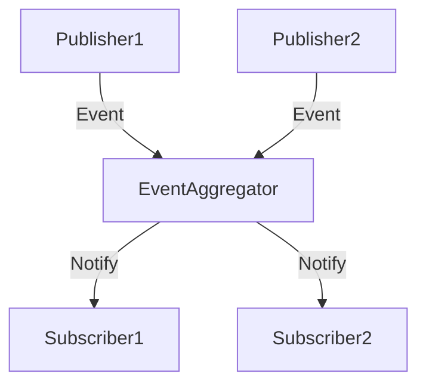

## 10.2 Event Aggregator in Clojure

In the realm of software design, managing events efficiently is crucial for building scalable and maintainable systems. The Event Aggregator pattern plays a pivotal role in simplifying event management by centralizing subscriptions and notifications. This pattern is particularly beneficial in reducing the coupling between publishers and subscribers, thereby enhancing modularity. In this section, we will delve into the Event Aggregator pattern, its implementation in Clojure, and its advantages in building robust applications.

### Introduction to the Event Aggregator Pattern

The Event Aggregator pattern is designed to collect events from various sources and distribute them to interested subscribers. By acting as a central hub for event management, it simplifies the process of handling events and reduces direct dependencies between components. This pattern is especially useful in systems where multiple components need to react to the same events or when events need to be processed before being dispatched.

### Detailed Explanation

#### Key Components of the Event Aggregator Pattern

1. **Event Aggregator**: The central component that manages event subscriptions and notifications.
2. **Publishers**: Components that generate events and send them to the Event Aggregator.
3. **Subscribers**: Components that register interest in specific events and receive notifications when those events occur.

#### Workflow of the Event Aggregator Pattern

1. **Subscription**: Subscribers register their interest in specific events with the Event Aggregator.
2. **Publishing**: Publishers send events to the Event Aggregator.
3. **Notification**: The Event Aggregator notifies all interested subscribers about the occurrence of an event.

### Implementing an Event Aggregator in Clojure

Let's explore how to implement the Event Aggregator pattern in Clojure using functional programming principles and Clojure's concurrency primitives.

#### Step 1: Define the Event Aggregator

We start by defining a function `event-aggregator` that takes a map of handlers and returns a map with `publish` and `subscribe` functions.

```clojure
(defn event-aggregator [handlers]
  {:publish (fn [event data]
              (when-let [event-handlers (get handlers event)]
                (doseq [handler event-handlers]
                  (handler data))))
   :subscribe (fn [event handler]
                (swap! handlers update event conj handler))})
```

#### Step 2: Initialize the Aggregator with an Atom

We use an atom to hold the event handlers, allowing for safe concurrent updates.

```clojure
(def handlers (atom {}))
(def aggregator (event-aggregator handlers))
```

#### Step 3: Subscribe to Events

Subscribers can register their interest in specific events using the `subscribe` function.

```clojure
((:subscribe aggregator) :order-placed
  (fn [order]
    (println "Order placed:" order)))
```

#### Step 4: Publish Events

Publishers can send events to the aggregator using the `publish` function.

```clojure
((:publish aggregator) :order-placed {:id 101 :items ["Book" "Pen"]})
```

### Advanced Features

#### Aggregating Events Before Notifying

In some scenarios, it might be beneficial to aggregate events before notifying subscribers. This can be achieved by buffering events and publishing an aggregate event after certain conditions are met.

```clojure
(def event-buffer (atom []))

(defn aggregate-and-publish [event data]
  (swap! event-buffer conj data)
  (when (should-publish?)
    ((:publish aggregator) :aggregated-event @event-buffer)
    (reset! event-buffer [])))
```

#### Implementing Filtering or Transformation Logic

The Event Aggregator can also include logic to filter or transform events before dispatching them to subscribers. This allows subscribers to receive only relevant data or enriched event information.

### Visualizing the Event Aggregator Pattern

Below is a conceptual diagram illustrating the Event Aggregator pattern:



### Use Cases

1. **Microservices Communication**: In a microservices architecture, the Event Aggregator can manage communication between services by centralizing event handling.
2. **UI Event Handling**: In complex user interfaces, the Event Aggregator can simplify the management of UI events by decoupling event sources from handlers.
3. **Logging and Monitoring**: Aggregating log events from various parts of an application for centralized processing and monitoring.

### Advantages and Disadvantages

#### Advantages

- **Decoupling**: Reduces direct dependencies between publishers and subscribers.
- **Modularity**: Enhances the modularity of the system by centralizing event management.
- **Scalability**: Facilitates scaling by managing a large number of events efficiently.

#### Disadvantages

- **Single Point of Failure**: The Event Aggregator can become a bottleneck or a single point of failure if not designed properly.
- **Complexity**: Introducing an Event Aggregator can add complexity to the system architecture.

### Best Practices

- **Use Atoms for State Management**: Utilize Clojure's atoms to manage state safely in a concurrent environment.
- **Design for Scalability**: Ensure the Event Aggregator can handle a large volume of events without becoming a bottleneck.
- **Implement Error Handling**: Include robust error handling to manage failures in event processing.

### Conclusion

The Event Aggregator pattern is a powerful tool for managing events in a decoupled and modular manner. By centralizing event handling, it simplifies the architecture and enhances the scalability of applications. Implementing this pattern in Clojure leverages the language's strengths in functional programming and concurrency, resulting in efficient and maintainable solutions.

## Quiz Time!



### What is the primary purpose of the Event Aggregator pattern?

- [x] To centralize event management and reduce coupling between publishers and subscribers.
- [ ] To increase the complexity of event handling.
- [ ] To directly connect publishers and subscribers.
- [ ] To replace all other design patterns.

> **Explanation:** The Event Aggregator pattern centralizes event management, reducing coupling between publishers and subscribers.

### How does the Event Aggregator pattern enhance modularity?

- [x] By decoupling publishers and subscribers.
- [ ] By increasing dependencies between components.
- [ ] By making all components aware of each other.
- [ ] By using global variables.

> **Explanation:** The pattern enhances modularity by decoupling publishers and subscribers, allowing them to operate independently.

### In Clojure, what concurrency primitive is used to manage event handlers safely?

- [x] Atom
- [ ] Ref
- [ ] Agent
- [ ] Var

> **Explanation:** Atoms are used to manage state safely in a concurrent environment in Clojure.

### What is a potential disadvantage of the Event Aggregator pattern?

- [x] It can become a single point of failure.
- [ ] It simplifies the system architecture.
- [ ] It reduces the number of events.
- [ ] It increases direct dependencies.

> **Explanation:** The Event Aggregator can become a single point of failure if not designed properly.

### How can events be aggregated before notifying subscribers?

- [x] By buffering events and publishing an aggregate event.
- [ ] By notifying subscribers immediately.
- [ ] By ignoring some events.
- [ ] By using global variables.

> **Explanation:** Events can be buffered and an aggregate event can be published after certain conditions are met.

### What is a common use case for the Event Aggregator pattern?

- [x] Microservices communication
- [ ] Direct database access
- [ ] Static website generation
- [ ] File system operations

> **Explanation:** The pattern is commonly used in microservices communication to manage events centrally.

### Which of the following is NOT an advantage of the Event Aggregator pattern?

- [ ] Decoupling
- [ ] Modularity
- [x] Increased complexity
- [ ] Scalability

> **Explanation:** Increased complexity is a disadvantage, not an advantage, of the Event Aggregator pattern.

### What should be included in the Event Aggregator to manage failures?

- [x] Robust error handling
- [ ] More publishers
- [ ] Fewer subscribers
- [ ] Global variables

> **Explanation:** Robust error handling should be included to manage failures in event processing.

### How does the Event Aggregator pattern affect scalability?

- [x] It facilitates scaling by managing a large number of events efficiently.
- [ ] It reduces scalability by adding more components.
- [ ] It has no effect on scalability.
- [ ] It decreases the number of events.

> **Explanation:** The pattern facilitates scaling by efficiently managing a large number of events.

### True or False: The Event Aggregator pattern directly connects publishers and subscribers.

- [ ] True
- [x] False

> **Explanation:** The Event Aggregator pattern does not directly connect publishers and subscribers; it centralizes event management to reduce coupling.


