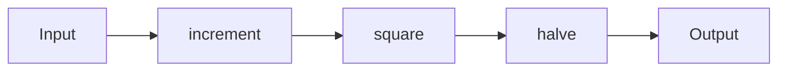

## 10.2. Higher-Order Functions and Function Composition

In the world of functional programming, higher-order functions and function composition are powerful tools that enable developers to write modular, reusable, and elegant code. Clojure, being a functional language, embraces these concepts, allowing developers to build complex systems with simplicity and clarity. In this section, we will delve into the intricacies of higher-order functions and function composition, demonstrating how these techniques can lead to cleaner and more abstract code.

### Understanding Higher-Order Functions

Higher-order functions are functions that can take other functions as arguments or return them as results. This concept is fundamental in functional programming, allowing for greater abstraction and code reuse.

#### Key Characteristics of Higher-Order Functions

- **Function as Arguments**: Higher-order functions can accept functions as parameters, allowing you to pass behavior as data.
- **Function as Return Values**: They can return functions, enabling the creation of function factories or closures.
- **Abstraction and Reusability**: By abstracting behavior, higher-order functions promote code reuse and modularity.

#### Example: Using Higher-Order Functions

Let's consider a simple example of a higher-order function in Clojure:

```clojure
;; Define a higher-order function that takes a function and a collection
(defn apply-to-all [f coll]
  (map f coll))

;; Define a simple function to be used as an argument
(defn square [x]
  (* x x))

;; Use the higher-order function
(apply-to-all square [1 2 3 4 5])
;; => (1 4 9 16 25)
```

In this example, `apply-to-all` is a higher-order function that takes a function `f` and a collection `coll`, applying `f` to each element of `coll`. The `square` function is passed as an argument to `apply-to-all`, demonstrating how behavior can be abstracted and reused.

### Function Composition in Clojure

Function composition is the process of combining two or more functions to produce a new function. In Clojure, this is often achieved using the `comp` and `partial` functions.

#### Using `comp` for Function Composition

The `comp` function takes multiple functions as arguments and returns a new function that is the composition of those functions. The functions are applied from right to left.

```clojure
;; Define two simple functions
(defn add-one [x] (+ x 1))
(defn double [x] (* x 2))

;; Compose the functions
(def add-one-and-double (comp double add-one))

;; Use the composed function
(add-one-and-double 3)
;; => 8
```

In this example, `add-one-and-double` is a composed function that first applies `add-one` to its argument and then `double` to the result. This demonstrates how function composition can lead to more concise and readable code.

#### Using `partial` for Partial Application

The `partial` function allows you to fix a certain number of arguments to a function, returning a new function with fewer arguments.

```clojure
;; Define a function with multiple arguments
(defn multiply [x y] (* x y))

;; Create a partially applied function
(def double (partial multiply 2))

;; Use the partially applied function
(double 5)
;; => 10
```

Here, `partial` is used to create a new function `double` that multiplies its argument by 2. This technique is useful for creating specialized functions from more general ones.

### Advanced Function Manipulation

Higher-order functions and function composition can be combined to perform advanced function manipulation, enabling the creation of complex behaviors from simple building blocks.

#### Example: Building a Function Pipeline

A function pipeline is a sequence of functions applied in a specific order, where the output of one function becomes the input of the next. This can be achieved using `comp` or by chaining functions manually.

```clojure
;; Define a series of transformations
(defn increment [x] (+ x 1))
(defn square [x] (* x x))
(defn halve [x] (/ x 2))

;; Create a function pipeline using comp
(def process (comp halve square increment))

;; Apply the pipeline
(process 3)
;; => 8.0
```

In this example, `process` is a function pipeline that increments, squares, and then halves its input. This demonstrates how function composition can lead to cleaner and more abstract code.

### Visualizing Function Composition

To better understand function composition, let's visualize the process using a flowchart. This diagram illustrates how functions are applied in sequence, with each function's output becoming the next function's input.



This flowchart represents the function pipeline we created earlier, showing the flow of data through each transformation.

### Encouraging Function Pipelines

Thinking in terms of function pipelines encourages developers to break down complex problems into smaller, more manageable pieces. By composing simple functions, you can build sophisticated systems that are easy to understand and maintain.

#### Benefits of Function Pipelines

- **Modularity**: Functions can be developed and tested independently.
- **Reusability**: Functions can be reused in different pipelines or contexts.
- **Clarity**: Pipelines provide a clear and concise representation of data flow.

### Try It Yourself

Experiment with the concepts we've covered by modifying the code examples. Try creating your own higher-order functions and function compositions. Consider how you can use these techniques to simplify and enhance your code.

### Knowledge Check

To reinforce your understanding, consider the following questions:

- What is a higher-order function, and how does it differ from a regular function?
- How does function composition improve code readability and maintainability?
- In what scenarios might you use `partial` to create specialized functions?

### Summary

In this section, we've explored the power of higher-order functions and function composition in Clojure. By leveraging these techniques, you can build modular, reusable, and elegant code that is easy to understand and maintain. Remember, this is just the beginning. As you progress, you'll discover even more ways to harness the power of functional programming in Clojure. Keep experimenting, stay curious, and enjoy the journey!

## **Ready to Test Your Knowledge?**



### What is a higher-order function?

- [x] A function that takes other functions as arguments or returns them as results
- [ ] A function that only performs arithmetic operations
- [ ] A function that is defined at a higher level in the code
- [ ] A function that cannot be composed with other functions

> **Explanation:** Higher-order functions are those that can take other functions as arguments or return them as results, enabling greater abstraction and code reuse.

### How does the `comp` function work in Clojure?

- [x] It composes multiple functions into a single function, applying them from right to left
- [ ] It concatenates strings
- [ ] It compares two values
- [ ] It compiles Clojure code

> **Explanation:** The `comp` function in Clojure takes multiple functions and returns a new function that is the composition of those functions, applying them from right to left.

### What does the `partial` function do?

- [x] It creates a new function with some arguments pre-filled
- [ ] It divides a function into smaller parts
- [ ] It applies a function to a subset of a collection
- [ ] It partially evaluates a function

> **Explanation:** The `partial` function creates a new function with some arguments pre-filled, allowing for partial application of functions.

### Which of the following is a benefit of function pipelines?

- [x] Modularity
- [x] Reusability
- [x] Clarity
- [ ] Complexity

> **Explanation:** Function pipelines promote modularity, reusability, and clarity by breaking down complex problems into smaller, manageable pieces.

### What is the result of `(comp inc dec)` applied to 5?

- [x] 5
- [ ] 6
- [ ] 4
- [ ] 10

> **Explanation:** The `comp` function will first apply `dec` to 5, resulting in 4, and then `inc` to 4, resulting in 5.

### How can higher-order functions lead to cleaner code?

- [x] By abstracting behavior and promoting code reuse
- [ ] By increasing the number of lines of code
- [ ] By making code more complex
- [ ] By reducing the need for functions

> **Explanation:** Higher-order functions abstract behavior and promote code reuse, leading to cleaner and more maintainable code.

### What is a common use case for the `partial` function?

- [x] Creating specialized functions from more general ones
- [ ] Dividing a collection into parts
- [ ] Comparing two values
- [ ] Compiling Clojure code

> **Explanation:** The `partial` function is commonly used to create specialized functions from more general ones by fixing some arguments.

### What is the output of `(partial + 5)` applied to 10?

- [x] 15
- [ ] 5
- [ ] 10
- [ ] 50

> **Explanation:** The `partial` function creates a new function that adds 5 to its argument, so applying it to 10 results in 15.

### What is the primary advantage of using function composition?

- [x] It allows for the creation of new functions by combining existing ones
- [ ] It reduces the need for variables
- [ ] It increases the complexity of code
- [ ] It limits the use of functions

> **Explanation:** Function composition allows for the creation of new functions by combining existing ones, promoting code reuse and abstraction.

### True or False: Function pipelines can only be created using the `comp` function.

- [ ] True
- [x] False

> **Explanation:** Function pipelines can be created using `comp`, but they can also be created by chaining functions manually or using other techniques.


