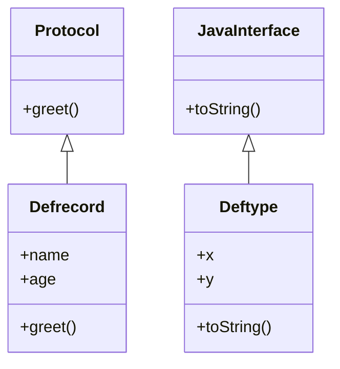

## 10.20. Algebraic Data Types with `deftype` and `defrecord`

Algebraic data types (ADTs) are a powerful feature in functional programming languages, allowing developers to define complex data structures in a concise and expressive manner. In Clojure, `deftype` and `defrecord` are two constructs that enable the creation of custom data types, providing both performance benefits and a structured way to represent data. This section will delve into these constructs, illustrating their use, differences, and integration with Clojure's ecosystem.

### Understanding `deftype` and `defrecord`

#### `deftype`

`deftype` in Clojure is used to define a new data type with a fixed set of fields. It is a low-level construct that provides a way to create efficient, mutable objects that can implement interfaces and protocols. `deftype` is ideal for scenarios where performance is critical, as it allows for the creation of Java-like classes with direct field access.

**Example: Defining a Custom Type with `deftype`**

```clojure
(deftype Point [x y]
  Object
  (toString [this]
    (str "Point(" x ", " y ")")))

;; Creating an instance of Point
(def p (Point. 3 4))

;; Accessing fields
(println (.x p))  ; Output: 3
(println (.y p))  ; Output: 4

;; Using the custom toString method
(println (.toString p))  ; Output: Point(3, 4)
```

In this example, `Point` is a custom type with `x` and `y` fields. The `toString` method is overridden to provide a custom string representation.

#### `defrecord`

`defrecord` is similar to `deftype` but is designed for creating immutable data structures with named fields. It automatically implements several interfaces, including `IPersistentMap`, making it behave like a map. `defrecord` is preferred when you need a structured, immutable data representation with efficient field access.

**Example: Defining a Custom Record with `defrecord`**

```clojure
(defrecord Person [name age])

;; Creating an instance of Person
(def john (->Person "John Doe" 30))

;; Accessing fields
(println (:name john))  ; Output: John Doe
(println (:age john))   ; Output: 30

;; Using map-like functions
(println (assoc john :age 31))  ; Output: #user.Person{:name "John Doe", :age 31}
```

Here, `Person` is a record with `name` and `age` fields. It supports map-like operations, making it versatile for various use cases.

### Differences Between `deftype` and `defrecord`

While both `deftype` and `defrecord` allow for the creation of custom data types, they serve different purposes and have distinct characteristics:

- **Mutability**: `deftype` creates mutable objects, while `defrecord` creates immutable ones.
- **Field Access**: `deftype` provides direct field access, which is faster, whereas `defrecord` fields are accessed like map entries.
- **Protocol Implementation**: Both can implement protocols, but `defrecord` automatically implements several collection-related interfaces.
- **Use Cases**: Use `deftype` for performance-critical, mutable data structures and `defrecord` for immutable, structured data that behaves like a map.

### Interoperability with Protocols and Java Classes

Both `deftype` and `defrecord` can implement protocols, allowing for polymorphic behavior. They can also implement Java interfaces, making them highly interoperable with Java classes.

**Example: Implementing a Protocol with `defrecord`**

```clojure
(defprotocol Greet
  (greet [this]))

(defrecord FriendlyPerson [name]
  Greet
  (greet [this]
    (str "Hello, my name is " name)))

(def alice (->FriendlyPerson "Alice"))

(println (greet alice))  ; Output: Hello, my name is Alice
```

In this example, `FriendlyPerson` implements the `Greet` protocol, providing a custom greeting method.

### Performance and Structure Benefits

Using `deftype` and `defrecord` offers several benefits:

- **Performance**: `deftype` provides fast field access and is suitable for performance-sensitive applications.
- **Structure**: `defrecord` offers a structured way to represent data, with built-in support for map-like operations.
- **Interoperability**: Both constructs seamlessly integrate with Clojure's protocol system and Java's interface mechanism.

### Visualizing the Relationship Between `deftype`, `defrecord`, and Protocols

To better understand how `deftype` and `defrecord` interact with protocols and Java classes, consider the following diagram:



This diagram illustrates that `defrecord` can implement protocols, while `deftype` can implement Java interfaces.

### Try It Yourself

Experiment with the provided examples by modifying the fields and methods. Try creating a new protocol and implementing it with both `deftype` and `defrecord`. Observe how the behavior changes based on the construct used.

### Knowledge Check

- What are the primary differences between `deftype` and `defrecord`?
- How do `deftype` and `defrecord` interoperate with protocols?
- When would you choose `deftype` over `defrecord`?

### Summary

In this section, we've explored how `deftype` and `defrecord` enable the creation of custom data types in Clojure. We've seen how they differ in terms of mutability, field access, and use cases. By understanding these constructs, you can create efficient and structured data representations that integrate seamlessly with Clojure's ecosystem.

Remember, this is just the beginning. As you progress, you'll build more complex and interactive applications using these powerful constructs. Keep experimenting, stay curious, and enjoy the journey!

## **Ready to Test Your Knowledge?**



### What is the primary purpose of `deftype` in Clojure?

- [x] To create efficient, mutable objects with direct field access
- [ ] To create immutable data structures with named fields
- [ ] To implement protocols automatically
- [ ] To provide map-like behavior

> **Explanation:** `deftype` is used for creating efficient, mutable objects with direct field access, suitable for performance-critical applications.

### How does `defrecord` differ from `deftype` in terms of mutability?

- [x] `defrecord` creates immutable data structures
- [ ] `defrecord` creates mutable data structures
- [ ] Both create mutable data structures
- [ ] Both create immutable data structures

> **Explanation:** `defrecord` creates immutable data structures, whereas `deftype` creates mutable ones.

### Which construct automatically implements several collection-related interfaces?

- [ ] `deftype`
- [x] `defrecord`
- [ ] Both
- [ ] Neither

> **Explanation:** `defrecord` automatically implements several collection-related interfaces, making it behave like a map.

### What is a key benefit of using `deftype`?

- [x] Fast field access
- [ ] Automatic protocol implementation
- [ ] Map-like operations
- [ ] Built-in immutability

> **Explanation:** `deftype` provides fast field access, which is beneficial for performance-sensitive applications.

### Can both `deftype` and `defrecord` implement protocols?

- [x] Yes
- [ ] No

> **Explanation:** Both `deftype` and `defrecord` can implement protocols, allowing for polymorphic behavior.

### What is a typical use case for `defrecord`?

- [x] Creating structured, immutable data representations
- [ ] Creating mutable objects for performance
- [ ] Implementing Java interfaces
- [ ] Providing direct field access

> **Explanation:** `defrecord` is used for creating structured, immutable data representations with map-like behavior.

### How do you access fields in a `defrecord`?

- [x] Like map entries
- [ ] Direct field access
- [ ] Using getter methods
- [ ] Through protocols

> **Explanation:** Fields in a `defrecord` are accessed like map entries, supporting map-like operations.

### Which construct is preferred for performance-critical applications?

- [x] `deftype`
- [ ] `defrecord`
- [ ] Both
- [ ] Neither

> **Explanation:** `deftype` is preferred for performance-critical applications due to its fast field access.

### Can `defrecord` implement Java interfaces?

- [x] Yes
- [ ] No

> **Explanation:** `defrecord` can implement Java interfaces, making it interoperable with Java classes.

### True or False: `deftype` provides map-like behavior.

- [ ] True
- [x] False

> **Explanation:** `deftype` does not provide map-like behavior; this is a feature of `defrecord`.


