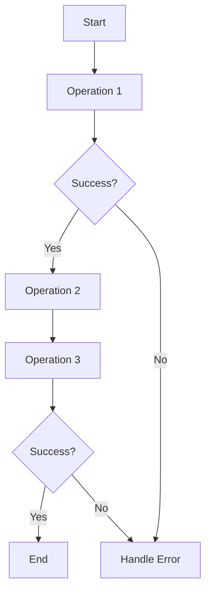

## 10.3. Functional Error Handling with Monads

In the realm of functional programming, monads are a powerful abstraction that can simplify complex operations, especially when dealing with error handling. In this section, we will delve into the use of monads for functional error handling in Clojure, focusing on the `Maybe` (or `Option`) monad and the `Either` monad. We will explore how these monads enable chaining operations while managing errors gracefully, using the [Cats library](https://github.com/funcool/cats) in Clojure.

### Introduction to Monads

Monads are a fundamental concept in functional programming that provide a way to structure programs. They allow us to build computations as a series of steps, encapsulating values and the context in which they are computed. Monads enable us to handle side effects, manage state, and deal with errors in a clean and composable manner.

#### What is a Monad?

A monad is a design pattern used to handle program-wide concerns in a functional way. It consists of three primary components:

1. **Type Constructor**: A way to wrap a value in a monadic context.
2. **Unit Function (also known as `return` or `pure`)**: A function that takes a value and returns it in a monadic context.
3. **Bind Function (also known as `flatMap` or `>>=`)**: A function that chains operations on monadic values, allowing the context to be managed implicitly.

Monads provide a way to sequence operations, ensuring that each step is executed in the context of the previous one.

### The Role of Monads in Error Handling

In functional programming, error handling can be elegantly managed using monads. By encapsulating errors within a monadic context, we can chain operations without having to explicitly check for errors at each step. This leads to cleaner and more maintainable code.

#### The `Maybe` Monad

The `Maybe` monad, also known as the `Option` monad, is used to represent computations that might fail. It encapsulates an optional value, which can either be `Some` (indicating the presence of a value) or `None` (indicating the absence of a value).

##### Using the `Maybe` Monad in Clojure

Let's explore how to use the `Maybe` monad in Clojure with the Cats library.

First, ensure you have the Cats library included in your project:

```clojure
;; Add to your project.clj dependencies
[funcool/cats "2.3.0"]
```

Here's a simple example demonstrating the use of the `Maybe` monad:

```clojure
(ns example.maybe
  (:require [cats.core :as m]
            [cats.monad.maybe :as maybe]))

;; A function that might return a value or nil
(defn safe-divide [numerator denominator]
  (if (zero? denominator)
    (maybe/nothing)
    (maybe/just (/ numerator denominator))))

;; Using the Maybe monad to chain operations
(defn divide-and-add [x y z]
  (m/mlet [a (safe-divide x y)
           b (safe-divide a z)]
    (m/return (+ a b))))

;; Example usage
(println (divide-and-add 10 2 5))  ;; => Just 7.0
(println (divide-and-add 10 0 5))  ;; => Nothing
```

In this example, `safe-divide` returns a `Maybe` monad. The `divide-and-add` function uses `m/mlet` to chain operations, automatically handling the `Nothing` case without explicit checks.

#### The `Either` Monad

The `Either` monad is another powerful tool for error handling. It represents a computation that can result in either a value (`Right`) or an error (`Left`). This makes it ideal for scenarios where you want to capture and propagate error information.

##### Using the `Either` Monad in Clojure

Here's how you can use the `Either` monad with the Cats library:

```clojure
(ns example.either
  (:require [cats.core :as m]
            [cats.monad.either :as either]))

;; A function that might fail
(defn parse-int [s]
  (try
    (either/right (Integer/parseInt s))
    (catch Exception e
      (either/left (str "Error parsing integer: " (.getMessage e))))))

;; Using the Either monad to chain operations
(defn add-parsed-integers [s1 s2]
  (m/mlet [x (parse-int s1)
           y (parse-int s2)]
    (m/return (+ x y))))

;; Example usage
(println (add-parsed-integers "10" "20"))  ;; => Right 30
(println (add-parsed-integers "10" "abc")) ;; => Left "Error parsing integer: For input string: \"abc\""
```

In this example, `parse-int` returns an `Either` monad. The `add-parsed-integers` function chains operations using `m/mlet`, propagating errors automatically.

### Chaining Operations with Monads

Monads enable us to chain operations in a way that manages context implicitly. This is particularly useful for error handling, as it allows us to focus on the logic of our program without being bogged down by error-checking code.

#### Benefits of Using Monads for Error Handling

1. **Composability**: Monads allow us to compose complex operations from simpler ones, making code more modular and reusable.
2. **Separation of Concerns**: By encapsulating error handling within monads, we separate error management from business logic.
3. **Readability**: Code that uses monads for error handling is often more readable, as it avoids nested conditionals and explicit error checks.

#### Challenges of Using Monads

1. **Learning Curve**: Understanding monads can be challenging for developers new to functional programming.
2. **Abstraction Overhead**: While monads simplify error handling, they introduce an additional layer of abstraction that can make debugging more difficult.
3. **Library Dependency**: Using monads in Clojure often requires external libraries like Cats, which may not be ideal for all projects.

### Visualizing Monad Operations

To better understand how monads work, let's visualize the flow of operations using a simple flowchart.



This flowchart represents a series of operations chained together using monads. If any operation fails, the error is propagated and handled appropriately.

### Try It Yourself

Experiment with the code examples provided. Try modifying the `safe-divide` and `parse-int` functions to introduce different types of errors and see how the monads handle them. Consider adding logging or additional error information to the `Either` monad to enhance error reporting.

### External Resources

For more information on monads and the Cats library, check out the following resources:

- [Cats Library](https://github.com/funcool/cats)
- [Monads in Functional Programming](https://en.wikipedia.org/wiki/Monad_(functional_programming))

### Knowledge Check

Let's reinforce what we've learned with some questions and exercises.

## **Ready to Test Your Knowledge?**



### What is a monad in functional programming?

- [x] A design pattern used to handle program-wide concerns in a functional way.
- [ ] A type of data structure used for storing values.
- [ ] A specific function used for error handling.
- [ ] A programming language feature specific to Clojure.

> **Explanation:** A monad is a design pattern that provides a way to structure programs, handling concerns like error management in a functional manner.

### Which monad is used to represent computations that might fail?

- [x] Maybe Monad
- [ ] Either Monad
- [ ] List Monad
- [ ] State Monad

> **Explanation:** The Maybe Monad is used to represent computations that might fail, encapsulating an optional value.

### What does the `Either` monad represent?

- [x] A computation that can result in either a value or an error.
- [ ] A computation that always succeeds.
- [ ] A computation that returns multiple values.
- [ ] A computation that handles state changes.

> **Explanation:** The Either Monad represents a computation that can result in either a value (`Right`) or an error (`Left`).

### How does the `m/mlet` function help in chaining operations?

- [x] It allows chaining operations while managing context implicitly.
- [ ] It executes operations in parallel.
- [ ] It converts monadic values to plain values.
- [ ] It handles side effects explicitly.

> **Explanation:** The `m/mlet` function helps in chaining operations by managing the monadic context implicitly, allowing for clean and readable code.

### What is a benefit of using monads for error handling?

- [x] Composability
- [x] Separation of Concerns
- [ ] Increased complexity
- [ ] Reduced readability

> **Explanation:** Monads provide composability and separation of concerns, making code more modular and readable.

### What is a challenge of using monads?

- [x] Learning Curve
- [ ] Increased performance
- [ ] Simplified debugging
- [ ] Reduced abstraction

> **Explanation:** Understanding monads can be challenging for developers new to functional programming, as they introduce an additional layer of abstraction.

### What is the role of the `bind` function in a monad?

- [x] It chains operations on monadic values.
- [ ] It initializes a monadic context.
- [ ] It converts monadic values to plain values.
- [ ] It handles side effects explicitly.

> **Explanation:** The `bind` function chains operations on monadic values, allowing the context to be managed implicitly.

### Which library is commonly used in Clojure for working with monads?

- [x] Cats
- [ ] Ring
- [ ] Compojure
- [ ] Leiningen

> **Explanation:** The Cats library is commonly used in Clojure for working with monads, providing implementations for various monadic structures.

### True or False: Monads can help in managing side effects in functional programming.

- [x] True
- [ ] False

> **Explanation:** True. Monads can help in managing side effects by encapsulating them within a monadic context, allowing for clean and composable code.

### Which of the following is NOT a component of a monad?

- [ ] Type Constructor
- [ ] Unit Function
- [x] Loop Function
- [ ] Bind Function

> **Explanation:** A monad consists of a type constructor, a unit function, and a bind function. A loop function is not a component of a monad.



Remember, this is just the beginning. As you progress, you'll build more complex and interactive applications using monads for error handling. Keep experimenting, stay curious, and enjoy the journey!
