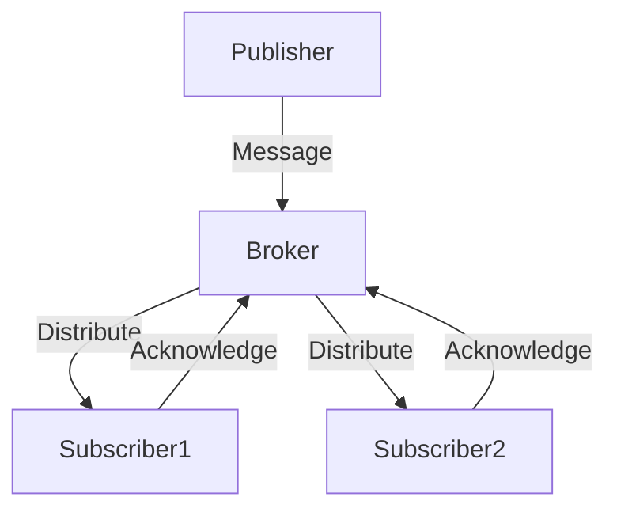

## 10.3 Publish-Subscribe in Clojure

The Publish-Subscribe (Pub/Sub) pattern is a powerful messaging paradigm that facilitates loose coupling between components in a system. In this pattern, publishers emit messages to specific topics without needing to know the subscribers, while subscribers listen to topics of interest and handle messages as they arrive. This decoupling allows for scalable and flexible system architectures.

### Introduction

In Clojure, the `core.async` library provides robust tools for implementing the Pub/Sub pattern. By leveraging channels, topics, and asynchronous processing, `core.async` enables efficient message distribution and handling. This article explores how to set up a Pub/Sub system using `core.async`, manage multiple topics and subscribers, and ensure reliable message delivery.

### Detailed Explanation

The Publish-Subscribe pattern consists of three main components:

1. **Publisher:** The entity that sends messages to a topic.
2. **Subscriber:** The entity that receives messages from a topic.
3. **Broker:** The intermediary that manages subscriptions and message distribution.

In Clojure, `core.async` channels act as the broker, facilitating communication between publishers and subscribers.

#### Setting Up a Pub/Sub System Using `core.async`

To implement a Pub/Sub system in Clojure, we first need to set up a channel and a publication:

```clojure
(require '[clojure.core.async :refer [chan pub sub >!! <! go-loop]])

(def message-channel (chan))
(def message-pub (pub message-channel :topic))
```

- **Channel (`message-channel`):** Acts as the conduit for messages.
- **Publication (`message-pub`):** Manages topics and subscriptions.

#### Publishing Messages to a Topic

Publishers send messages to a specific topic using the following function:

```clojure
(defn publish [topic message]
  (>!! message-channel {:topic topic :message message}))
```

This function places a message onto the channel, tagged with a topic identifier.

#### Subscribing to a Topic

Subscribers listen for messages on a topic by creating a subscription:

```clojure
(defn subscribe [topic handler]
  (let [subscription (chan)]
    (sub message-pub topic subscription)
    (go-loop []
      (when-let [msg (<! subscription)]
        (handler (:message msg))
        (recur)))))
```

- **Subscription Channel:** Each subscriber has a dedicated channel for receiving messages.
- **Handler Function:** Processes incoming messages.

#### Example Usage

Let's see how to use the Pub/Sub system with a practical example:

- **Publishing Messages:**

  ```clojure
  (publish :news {:headline "New Clojure Version Released" :content "Details..."})
  ```

- **Subscribing to Messages:**

  ```clojure
  (subscribe :news
    (fn [article]
      (println "Received article:" (:headline article))))
  ```

In this example, a message about a new Clojure version is published to the `:news` topic, and a subscriber prints the headline upon receiving the message.

### Managing Multiple Topics and Subscribers

To handle multiple topics and subscribers, consider supporting wildcard topics or patterns for flexible subscriptions. This can be achieved by extending the `pub` and `sub` functions to match topics based on patterns.

### Handling Unsubscription and Cleanup

To unsubscribe from a topic and clean up resources, use the following function:

```clojure
(defn unsubscribe [topic subscription]
  (unsub message-pub topic subscription)
  (close! subscription))
```

This function removes the subscription and closes the associated channel.

### Ensuring Reliable Message Delivery

For critical systems, consider implementing acknowledgment mechanisms and message persistence:

- **Acknowledgments:** Ensure that messages are processed successfully by subscribers.
- **Persistence:** Store messages in a durable medium to prevent data loss in case of failures.

### Visualizing the Pub/Sub Workflow

Below is a conceptual diagram illustrating the Pub/Sub workflow:



### Advantages and Disadvantages

**Advantages:**

- **Decoupling:** Publishers and subscribers are independent, promoting modularity.
- **Scalability:** Easily add or remove subscribers without affecting publishers.
- **Flexibility:** Support for multiple topics and dynamic subscriptions.

**Disadvantages:**

- **Complexity:** Managing subscriptions and message delivery can become complex.
- **Latency:** Potential delays in message delivery due to asynchronous processing.

### Best Practices

- **Use Channels Wisely:** Optimize channel usage to prevent bottlenecks.
- **Error Handling:** Implement robust error handling in subscriber handlers.
- **Resource Management:** Ensure proper cleanup of channels and subscriptions.

### Conclusion

The Publish-Subscribe pattern in Clojure, implemented using `core.async`, offers a powerful mechanism for building scalable and decoupled systems. By understanding the components and workflow, developers can effectively leverage this pattern to enhance communication in their applications.

## Quiz Time!



### What is the main purpose of the Publish-Subscribe pattern?

- [x] To enable loosely coupled communication between components
- [ ] To tightly couple components for better performance
- [ ] To ensure synchronous communication
- [ ] To replace all direct method calls

> **Explanation:** The Publish-Subscribe pattern is designed to enable loosely coupled communication between components, allowing them to interact without direct dependencies.

### In the Pub/Sub pattern, what role does the broker play?

- [x] Manages subscriptions and message distribution
- [ ] Acts as a subscriber
- [ ] Acts as a publisher
- [ ] Stores messages permanently

> **Explanation:** The broker in the Pub/Sub pattern manages subscriptions and distributes messages from publishers to subscribers.

### How does a subscriber receive messages in the provided Clojure example?

- [x] By subscribing to a topic and using a handler function
- [ ] By directly calling the publisher
- [ ] By polling the message channel
- [ ] By using a synchronous method call

> **Explanation:** In the example, a subscriber receives messages by subscribing to a topic and using a handler function to process incoming messages.

### What is the purpose of the `publish` function in the Clojure example?

- [x] To send messages to a specific topic
- [ ] To receive messages from a topic
- [ ] To unsubscribe from a topic
- [ ] To create a new topic

> **Explanation:** The `publish` function is used to send messages to a specific topic in the Pub/Sub system.

### Which Clojure library is used to implement the Pub/Sub pattern in the example?

- [x] core.async
- [ ] clojure.java.io
- [ ] clojure.data.json
- [ ] clojure.string

> **Explanation:** The `core.async` library is used to implement the Pub/Sub pattern in the provided Clojure example.

### What is a potential disadvantage of the Pub/Sub pattern?

- [x] Managing subscriptions and message delivery can become complex
- [ ] It tightly couples components
- [ ] It requires synchronous communication
- [ ] It limits scalability

> **Explanation:** A potential disadvantage of the Pub/Sub pattern is that managing subscriptions and message delivery can become complex.

### How can you ensure reliable message delivery in a Pub/Sub system?

- [x] Implement acknowledgment mechanisms and message persistence
- [ ] Use synchronous communication
- [ ] Limit the number of subscribers
- [ ] Use direct method calls

> **Explanation:** To ensure reliable message delivery, implement acknowledgment mechanisms and message persistence.

### What is the role of the `unsubscribe` function in the Clojure example?

- [x] To remove a subscription and close the associated channel
- [ ] To add a new subscription
- [ ] To publish a message
- [ ] To create a new topic

> **Explanation:** The `unsubscribe` function removes a subscription and closes the associated channel.

### What is an advantage of using the Pub/Sub pattern?

- [x] It promotes modularity and scalability
- [ ] It requires less code
- [ ] It ensures synchronous communication
- [ ] It tightly couples components

> **Explanation:** An advantage of the Pub/Sub pattern is that it promotes modularity and scalability by decoupling components.

### True or False: In the Pub/Sub pattern, publishers need to know the subscribers.

- [x] False
- [ ] True

> **Explanation:** In the Pub/Sub pattern, publishers do not need to know the subscribers, allowing for loose coupling.


