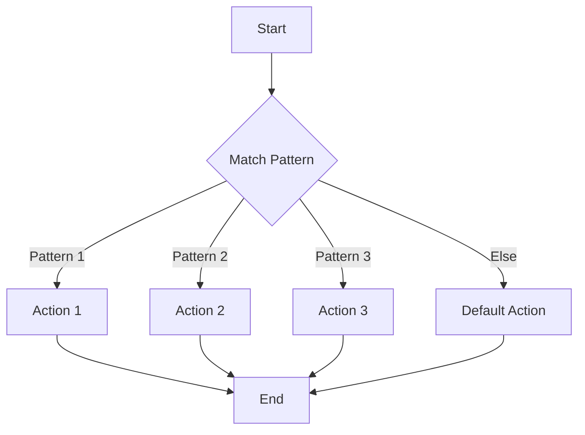

## 10.4. Pattern Matching with `core.match`

Pattern matching is a powerful feature in many functional programming languages, allowing developers to concisely and expressively handle complex data structures. In Clojure, the `core.match` library brings this capability to the table, enabling developers to match on values, types, and structures with ease. This section will guide you through the essentials of pattern matching using `core.match`, illustrating its advantages, usage, and real-world applications.

### What is Pattern Matching?

Pattern matching is a mechanism for checking a value against a pattern. It is a more expressive and readable alternative to traditional conditional logic, such as `if` or `case` statements. Pattern matching allows you to destructure data, match specific values, and even perform type checks, all within a single construct.

#### Advantages of Pattern Matching

- **Conciseness**: Reduces boilerplate code by allowing complex conditions to be expressed succinctly.
- **Readability**: Makes code easier to understand by clearly expressing the intent of the logic.
- **Expressiveness**: Supports matching on complex data structures, including nested structures and specific types.
- **Safety**: Encourages exhaustive handling of all possible cases, reducing runtime errors.

### Introducing `core.match`

`core.match` is a Clojure library that provides pattern matching capabilities. It allows you to match against various data structures, including lists, vectors, maps, and sets. With `core.match`, you can simplify your code by replacing complex conditional logic with clear and concise pattern matching expressions.

#### Installation

To use `core.match`, you need to add it to your project dependencies. If you're using Leiningen, add the following to your `project.clj`:

```clojure
:dependencies [[org.clojure/core.match "1.0.0"]]
```

### Basic Usage of `core.match`

Let's start with a simple example to demonstrate the basic usage of `core.match`. Consider a function that categorizes a number as positive, negative, or zero:

```clojure
(require '[clojure.core.match :refer [match]])

(defn categorize-number [n]
  (match [n]
    [0] "zero"
    [(pos? n)] "positive"
    [(neg? n)] "negative"))

;; Example usage
(categorize-number 5)  ;; => "positive"
(categorize-number -3) ;; => "negative"
(categorize-number 0)  ;; => "zero"
```

In this example, `match` is used to check the value of `n` against different patterns. The function `pos?` checks if the number is positive, while `neg?` checks if it's negative.

### Matching on Values and Types

`core.match` allows you to match on specific values and types. This can be particularly useful when dealing with heterogeneous collections or when you need to perform different actions based on the type of data.

#### Example: Matching on Types

```clojure
(defn describe [x]
  (match [(type x)]
    [java.lang.String] "It's a string!"
    [java.lang.Integer] "It's an integer!"
    [java.lang.Double] "It's a double!"
    :else "Unknown type"))

;; Example usage
(describe "Hello") ;; => "It's a string!"
(describe 42)     ;; => "It's an integer!"
(describe 3.14)   ;; => "It's a double!"
```

In this example, `match` is used to determine the type of `x` and return a corresponding description.

### Matching on Data Structures

One of the most powerful features of `core.match` is its ability to match on complex data structures. This includes lists, vectors, maps, and even nested structures.

#### Example: Matching on Vectors

```clojure
(defn vector-info [v]
  (match v
    [] "Empty vector"
    [x] (str "Single element: " x)
    [x y] (str "Two elements: " x " and " y)
    [x y & rest] (str "Starts with " x " and " y ", rest: " rest)))

;; Example usage
(vector-info [])          ;; => "Empty vector"
(vector-info [1])         ;; => "Single element: 1"
(vector-info [1 2])       ;; => "Two elements: 1 and 2"
(vector-info [1 2 3 4 5]) ;; => "Starts with 1 and 2, rest: (3 4 5)"
```

In this example, `match` is used to destructure the vector `v` and handle different cases based on its length.

### Simplifying Conditional Logic

Pattern matching can greatly simplify conditional logic, making your code more readable and maintainable. Instead of chaining multiple `if` or `case` statements, you can use `match` to express all conditions in a single construct.

#### Example: Simplifying Conditional Logic

```clojure
(defn fizzbuzz [n]
  (match [(mod n 3) (mod n 5)]
    [0 0] "FizzBuzz"
    [0 _] "Fizz"
    [_ 0] "Buzz"
    :else n))

;; Example usage
(map fizzbuzz (range 1 16))
;; => (1 2 "Fizz" 4 "Buzz" "Fizz" 7 8 "Fizz" "Buzz" 11 "Fizz" 13 14 "FizzBuzz")
```

In this example, `match` is used to implement the FizzBuzz logic in a concise and readable manner.

### Performance Considerations

While `core.match` provides powerful pattern matching capabilities, it's important to consider performance implications, especially in performance-critical applications. Pattern matching can introduce overhead, particularly when matching against complex or deeply nested structures. It's crucial to benchmark and profile your code to ensure that pattern matching does not become a bottleneck.

### Real-World Scenarios

Pattern matching is beneficial in various real-world scenarios, such as:

- **Parsing and transforming data**: Easily destructure and transform complex data structures.
- **Implementing interpreters**: Match on abstract syntax trees (ASTs) to implement language interpreters or compilers.
- **Handling protocol messages**: Match on different message types in network protocols or communication systems.

### Visualizing Pattern Matching

To better understand how pattern matching works, let's visualize the process using a flowchart. This diagram illustrates the flow of pattern matching in a simple function:



**Diagram Description**: This flowchart represents the decision-making process in pattern matching. The function starts by evaluating the input against various patterns. If a pattern matches, the corresponding action is executed. If no patterns match, a default action is taken.

### Try It Yourself

Experiment with the examples provided in this section. Try modifying the patterns and see how the behavior changes. For instance, add more patterns to the `fizzbuzz` function or try matching on different data structures in the `vector-info` function. This hands-on approach will deepen your understanding of pattern matching in Clojure.

### External Resources

For further reading and exploration, check out the following resources:

- [core.match on Clojure.org](https://clojure.org/guides/core_match)
- [core.match GitHub Repository](https://github.com/clojure/core.match)

### Knowledge Check

To reinforce your understanding of pattern matching with `core.match`, consider the following questions and exercises:

1. What are the advantages of using pattern matching over traditional conditional logic?
2. How can you use `core.match` to match on both values and types?
3. Provide an example of a real-world scenario where pattern matching would be beneficial.
4. What are some performance considerations when using `core.match`?
5. Modify the `fizzbuzz` function to include a new rule for numbers divisible by 7.

### Summary

Pattern matching with `core.match` is a powerful tool in the Clojure developer's toolkit. It simplifies complex conditional logic, enhances code readability, and provides a robust mechanism for handling diverse data structures. As you continue to explore Clojure, keep experimenting with pattern matching to unlock its full potential.

Remember, this is just the beginning. As you progress, you'll build more complex and interactive applications. Keep experimenting, stay curious, and enjoy the journey!

## **Ready to Test Your Knowledge?**



### What is one advantage of using pattern matching in Clojure?

- [x] It reduces boilerplate code.
- [ ] It increases code complexity.
- [ ] It makes code harder to read.
- [ ] It is slower than traditional conditional logic.

> **Explanation:** Pattern matching reduces boilerplate code by allowing complex conditions to be expressed succinctly.

### Which library provides pattern matching capabilities in Clojure?

- [x] core.match
- [ ] clojure.core
- [ ] clojure.match
- [ ] match.core

> **Explanation:** The `core.match` library provides pattern matching capabilities in Clojure.

### How can you match on types using `core.match`?

- [x] By using the `type` function in the pattern.
- [ ] By using `instance?` in the pattern.
- [ ] By using `class` in the pattern.
- [ ] By using `isa?` in the pattern.

> **Explanation:** You can match on types by using the `type` function in the pattern.

### What is a potential performance consideration when using `core.match`?

- [x] Pattern matching can introduce overhead.
- [ ] Pattern matching always improves performance.
- [ ] Pattern matching is faster than all other conditional logic.
- [ ] Pattern matching has no impact on performance.

> **Explanation:** Pattern matching can introduce overhead, especially when matching against complex or deeply nested structures.

### In which scenario is pattern matching particularly beneficial?

- [x] Parsing and transforming data.
- [ ] Writing simple arithmetic functions.
- [ ] Implementing basic loops.
- [ ] Handling single-value conditions.

> **Explanation:** Pattern matching is particularly beneficial in parsing and transforming complex data structures.

### What does the `match` function return if no patterns match?

- [x] It executes a default action.
- [ ] It throws an exception.
- [ ] It returns `nil`.
- [ ] It returns the input value.

> **Explanation:** If no patterns match, the `match` function executes a default action.

### How can pattern matching improve code readability?

- [x] By clearly expressing the intent of the logic.
- [ ] By using more lines of code.
- [ ] By adding complexity to the code.
- [ ] By hiding the logic in macros.

> **Explanation:** Pattern matching improves code readability by clearly expressing the intent of the logic.

### What is the purpose of the `:else` clause in `core.match`?

- [x] To handle cases where no other patterns match.
- [ ] To match on specific values.
- [ ] To match on specific types.
- [ ] To optimize performance.

> **Explanation:** The `:else` clause is used to handle cases where no other patterns match.

### Can `core.match` be used to match on nested data structures?

- [x] True
- [ ] False

> **Explanation:** `core.match` can be used to match on nested data structures, allowing for complex pattern matching.

### What is the first step to use `core.match` in a Clojure project?

- [x] Add it to your project dependencies.
- [ ] Import it in your namespace.
- [ ] Install it globally.
- [ ] Compile it from source.

> **Explanation:** The first step to use `core.match` is to add it to your project dependencies.


