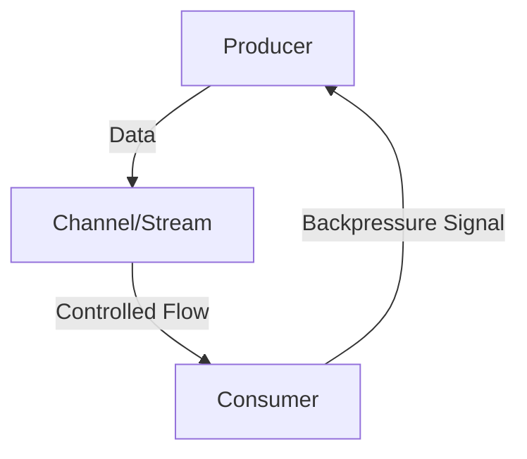

## 10.5 Reactive Streams Pattern in Clojure

In modern software development, handling asynchronous data processing efficiently is crucial, especially in systems where components operate at varying speeds. The Reactive Streams pattern addresses this need by providing a framework for asynchronous data processing with backpressure, allowing consumers to control the flow of data. This pattern is particularly relevant in Clojure, where libraries like `core.async` and `manifold` offer robust tools for implementing reactive streams.

### Introduction

Reactive Streams are designed to handle asynchronous data flows, ensuring that producers do not overwhelm consumers by providing backpressure mechanisms. This pattern is essential for building responsive and resilient systems, particularly in environments with fluctuating data rates and processing capabilities.

### Detailed Explanation

Reactive Streams enable efficient, non-blocking communication between components. They are particularly useful in scenarios where data producers and consumers operate at different speeds, as they allow consumers to signal their capacity to handle data, preventing overproduction and potential system overloads.

#### Key Concepts

- **Asynchronous Data Processing:** Reactive Streams facilitate non-blocking data processing, allowing systems to handle data asynchronously without waiting for each operation to complete.
- **Backpressure:** This mechanism allows consumers to control the rate of data flow, ensuring they are not overwhelmed by data they cannot process in time.
- **Composable Pipelines:** Reactive Streams can be composed into complex processing pipelines, enabling sophisticated data transformations and filtering.

### Implementing Reactive Streams Using `core.async`

Clojure's `core.async` library provides powerful abstractions for asynchronous programming, including channels that can be used to implement reactive streams.

#### Create Channels with Buffering

Channels in `core.async` can be buffered to handle bursts of data efficiently.

```clojure
(require '[clojure.core.async :refer [chan >! <! go go-loop]])

(def producer-ch (chan 100)) ; Buffer size of 100
(def consumer-ch (chan))
```

#### Producer with Backpressure Awareness

A producer can generate data and send it to a channel, respecting the consumer's ability to process data.

```clojure
(go-loop [n 0]
  (>! producer-ch n)
  (recur (inc n)))
```

#### Consumer Controlling the Flow

The consumer retrieves data from the channel, processing it at its own pace.

```clojure
(go-loop []
  (when-let [value (<! producer-ch)]
    (do-something-with value)
    (recur)))
```

### Using Manifold for Stream Processing

Manifold is another Clojure library that simplifies stream processing with built-in support for backpressure.

#### Add Dependency

To use Manifold, add it to your project dependencies.

```clojure
;; project.clj
[manifold "0.1.9"]
```

#### Require Namespace

Import the necessary Manifold namespaces.

```clojure
(require '[manifold.stream :as s])
```

#### Create and Manipulate Streams

Manifold streams allow for easy creation and manipulation of data streams.

```clojure
(def source (s/stream))
(def processed (s/map inc source))

(s/consume println processed)

(dotimes [i 10]
  (s/put! source i))
```

#### Handle Backpressure Automatically

Manifold automatically manages backpressure, ensuring that data flows smoothly between producers and consumers.

### Compose Complex Stream Pipelines

Reactive Streams can be composed into complex pipelines for advanced data processing.

```clojure
(def pipeline
  (-> source
      (s/map inc)
      (s/filter even?)
      (s/map #(* % 2))))

(s/consume println pipeline)
```

### Manage Errors and Completion

Handling errors and stream completion is crucial for robust stream processing.

- **Stream Completion:** Use `s/on-closed` and `s/on-drained` to handle stream completion events.
- **Error Handling:** Catch and handle exceptions within the stream processing to ensure system stability.

### Visual Aids

#### Conceptual Diagram of Reactive Streams



This diagram illustrates the flow of data from a producer to a consumer through a channel or stream, with backpressure signals controlling the flow.

### Use Cases

Reactive Streams are ideal for applications requiring:

- **Real-time Data Processing:** Systems that process data in real-time, such as financial trading platforms or IoT applications.
- **Responsive User Interfaces:** Applications where user interactions trigger asynchronous data processing.
- **Scalable Microservices:** Distributed systems where services communicate asynchronously, benefiting from controlled data flow.

### Advantages and Disadvantages

#### Advantages

- **Efficiency:** Non-blocking, asynchronous processing improves system responsiveness.
- **Scalability:** Backpressure mechanisms prevent system overloads, enhancing scalability.
- **Composability:** Streams can be easily composed into complex processing pipelines.

#### Disadvantages

- **Complexity:** Implementing reactive streams can introduce complexity, especially in error handling and stream management.
- **Learning Curve:** Developers may need to familiarize themselves with new libraries and paradigms.

### Best Practices

- **Use Appropriate Buffer Sizes:** Choose buffer sizes that balance throughput and memory usage.
- **Handle Errors Gracefully:** Implement robust error handling to maintain system stability.
- **Monitor Stream Performance:** Regularly monitor and optimize stream performance to ensure efficiency.

### Comparisons

Reactive Streams can be compared to traditional blocking I/O and event-driven architectures. Unlike blocking I/O, reactive streams provide non-blocking data processing, and compared to event-driven systems, they offer more structured data flow control through backpressure.

### Conclusion

Reactive Streams in Clojure provide a powerful pattern for handling asynchronous data processing with backpressure. By leveraging libraries like `core.async` and `manifold`, developers can build efficient, scalable systems that handle data flows gracefully. As you explore this pattern, consider the specific needs of your application and the trade-offs involved in implementing reactive streams.

## Quiz Time!



### What is the primary purpose of Reactive Streams?

- [x] To handle asynchronous data processing with backpressure
- [ ] To provide synchronous data processing
- [ ] To simplify database transactions
- [ ] To enhance user interface design

> **Explanation:** Reactive Streams are designed to handle asynchronous data processing with backpressure, allowing consumers to control the flow of data.

### Which Clojure library is commonly used for implementing reactive streams?

- [x] core.async
- [x] manifold
- [ ] clojure.spec
- [ ] ring

> **Explanation:** Both `core.async` and `manifold` are commonly used in Clojure for implementing reactive streams.

### What mechanism do Reactive Streams use to prevent consumers from being overwhelmed?

- [x] Backpressure
- [ ] Buffering
- [ ] Caching
- [ ] Polling

> **Explanation:** Backpressure is used in Reactive Streams to allow consumers to control the rate of data flow, preventing them from being overwhelmed.

### In `core.async`, what function is used to send data to a channel?

- [x] >!
- [ ] <!
- [ ] put!
- [ ] send!

> **Explanation:** The `>!` function is used in `core.async` to send data to a channel.

### How does Manifold handle backpressure?

- [x] Automatically manages demand signals between producers and consumers
- [ ] Requires manual configuration
- [ ] Does not support backpressure
- [ ] Uses polling

> **Explanation:** Manifold automatically manages demand signals between producers and consumers to handle backpressure.

### What is a key advantage of using Reactive Streams?

- [x] Non-blocking, asynchronous processing
- [ ] Simplified synchronous processing
- [ ] Reduced memory usage
- [ ] Enhanced database performance

> **Explanation:** Reactive Streams provide non-blocking, asynchronous processing, improving system responsiveness.

### Which of the following is a disadvantage of Reactive Streams?

- [x] Complexity in implementation
- [ ] Lack of scalability
- [ ] Inefficient data processing
- [ ] Limited to synchronous operations

> **Explanation:** Implementing reactive streams can introduce complexity, especially in error handling and stream management.

### What is the role of `s/on-closed` in Manifold?

- [x] To handle stream completion events
- [ ] To send data to a stream
- [ ] To create a new stream
- [ ] To apply transformations to a stream

> **Explanation:** `s/on-closed` is used in Manifold to handle stream completion events.

### Which of the following is a best practice when implementing Reactive Streams?

- [x] Use appropriate buffer sizes
- [ ] Avoid error handling
- [ ] Use synchronous processing
- [ ] Limit stream composition

> **Explanation:** Using appropriate buffer sizes is a best practice to balance throughput and memory usage in Reactive Streams.

### Reactive Streams are particularly useful in which type of applications?

- [x] Real-time data processing systems
- [ ] Static web pages
- [ ] Simple command-line tools
- [ ] Basic file storage systems

> **Explanation:** Reactive Streams are ideal for real-time data processing systems, where asynchronous data handling is crucial.


