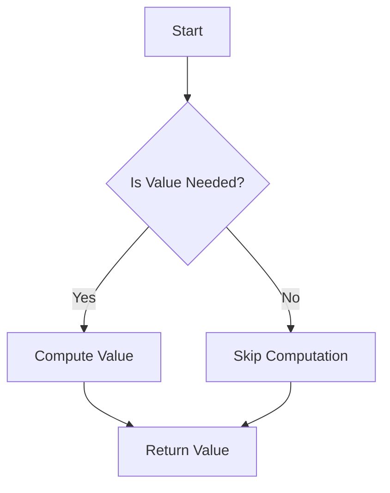

## 10.5. Using Lazy Sequences for Efficient Computation

In the realm of functional programming, lazy sequences are a powerful tool that Clojure developers can leverage to enhance the efficiency of their computations. By deferring the evaluation of expressions until their results are needed, lazy sequences help conserve resources and manage large or infinite data sets effectively. In this section, we will delve into the concept of lazy evaluation, explore its benefits and potential drawbacks, and provide best practices for working with lazy sequences in Clojure.

### Understanding Lazy Evaluation

Lazy evaluation is a strategy that delays the computation of an expression until its value is actually required. This approach can lead to significant performance improvements, especially when dealing with large data sets or computationally expensive operations. In Clojure, lazy sequences are a core feature that embodies this concept, allowing developers to work with potentially infinite sequences without incurring the cost of computing all elements upfront.

#### Benefits of Lazy Evaluation

1. **Resource Conservation**: By computing values only when needed, lazy evaluation reduces memory and CPU usage, which is particularly beneficial when dealing with large data sets.
2. **Infinite Data Structures**: Lazy sequences enable the creation and manipulation of infinite data structures, such as streams of numbers, without running into memory constraints.
3. **Improved Performance**: In scenarios where only a subset of data is required, lazy evaluation can significantly reduce the amount of computation performed, leading to faster execution times.

### Lazy Sequences in Clojure

In Clojure, lazy sequences are realized using the `lazy-seq` macro and functions like `map`, `filter`, and `range`, which return lazy sequences by default. Let's explore some examples to understand how laziness can improve performance.

#### Example 1: Generating an Infinite Sequence

```clojure
(defn infinite-numbers []
  (lazy-seq (cons 0 (map inc (infinite-numbers)))))

(take 10 (infinite-numbers))
;; => (0 1 2 3 4 5 6 7 8 9)
```

In this example, `infinite-numbers` generates an infinite sequence of numbers starting from 0. The `lazy-seq` macro ensures that each subsequent number is computed only when needed, allowing us to work with an infinite sequence efficiently.

#### Example 2: Filtering a Large Data Set

```clojure
(defn even-numbers [coll]
  (filter even? coll))

(def large-seq (range 1 1000000))

(take 5 (even-numbers large-seq))
;; => (2 4 6 8 10)
```

Here, `even-numbers` filters a large sequence to retain only even numbers. The `filter` function returns a lazy sequence, ensuring that only the necessary elements are computed, thus conserving resources.

### Potential Drawbacks of Lazy Sequences

While lazy sequences offer numerous benefits, they also come with potential pitfalls that developers should be aware of:

1. **Retaining References**: Lazy sequences can inadvertently retain references to head elements, leading to memory leaks if not handled carefully.
2. **Debugging Challenges**: Since lazy sequences defer computation, debugging can become more complex, as the actual computation may not occur where expected.
3. **Unexpected Evaluation**: In some cases, lazy evaluation can lead to unexpected behavior if side effects are involved, as the timing of evaluation is deferred.

### Best Practices for Working with Lazy Sequences

To effectively utilize lazy sequences in Clojure, consider the following best practices:

1. **Avoid Side Effects**: Ensure that functions used with lazy sequences are pure and free of side effects to prevent unexpected behavior.
2. **Realize Sequences When Necessary**: Use functions like `doall` or `dorun` to force the realization of a lazy sequence when side effects are required or to avoid retaining references.
3. **Use `take` and `drop` Wisely**: When working with infinite sequences, use `take` and `drop` to control the portion of the sequence you need, preventing unnecessary computation.

### Handling Large or Infinite Data Sets

Lazy sequences are particularly useful when dealing with large or infinite data sets. By deferring computation, they allow developers to work with data that would otherwise be infeasible to handle in memory. This capability is crucial in scenarios such as data streaming, real-time analytics, and processing large files.

#### Example 3: Processing a Large File

```clojure
(defn process-file [file-path]
  (with-open [rdr (clojure.java.io/reader file-path)]
    (doall
      (map println (line-seq rdr)))))

(process-file "large-file.txt")
```

In this example, `line-seq` returns a lazy sequence of lines from a file, allowing us to process each line without loading the entire file into memory. The `doall` function ensures that the sequence is fully realized, triggering the side effect of printing each line.

### Visualizing Lazy Evaluation

To better understand how lazy evaluation works, consider the following diagram illustrating the flow of lazy sequence computation:



**Caption**: This diagram illustrates the decision-making process in lazy evaluation, where values are computed only when needed.

### References and Further Reading

- [Clojure Documentation on Lazy Sequences](https://clojure.org/reference/lazy)
- [Functional Programming in Clojure](https://www.functionalprogramming.com/clojure)
- [MDN Web Docs on Lazy Evaluation](https://developer.mozilla.org/en-US/docs/Web/JavaScript/Reference/Global_Objects/Promise)

### Knowledge Check

To reinforce your understanding of lazy sequences in Clojure, consider the following questions and exercises:

1. **What is lazy evaluation, and how does it benefit computation?**
2. **Provide an example where lazy sequences improve performance.**
3. **What are some potential drawbacks of using lazy sequences?**
4. **Explain how to handle large data sets using lazy sequences.**
5. **Modify the `infinite-numbers` function to generate an infinite sequence of odd numbers.**

### Embrace the Journey

Remember, mastering lazy sequences is just one step in your journey to becoming a proficient Clojure developer. As you continue to explore the language, you'll discover even more powerful tools and techniques to enhance your programming skills. Keep experimenting, stay curious, and enjoy the journey!

## **Ready to Test Your Knowledge?**



### What is lazy evaluation?

- [x] A strategy that delays computation until the result is needed
- [ ] A method of eager computation
- [ ] A technique for parallel processing
- [ ] A way to optimize memory usage

> **Explanation:** Lazy evaluation defers the computation of expressions until their values are required, conserving resources and improving performance.

### How can lazy sequences improve performance?

- [x] By deferring computation until necessary
- [ ] By computing all values upfront
- [ ] By using more memory
- [ ] By increasing CPU usage

> **Explanation:** Lazy sequences improve performance by computing values only when needed, reducing unnecessary computation and resource usage.

### What is a potential drawback of lazy sequences?

- [x] Retaining references to head elements
- [ ] Immediate computation of all elements
- [ ] Increased memory usage
- [ ] Simplified debugging

> **Explanation:** Lazy sequences can retain references to head elements, leading to memory leaks if not managed properly.

### Which function forces the realization of a lazy sequence?

- [x] `doall`
- [ ] `map`
- [ ] `filter`
- [ ] `reduce`

> **Explanation:** `doall` forces the realization of a lazy sequence, ensuring all elements are computed.

### How can you handle large data sets with lazy sequences?

- [x] By processing data incrementally
- [ ] By loading all data into memory
- [ ] By using eager evaluation
- [ ] By avoiding lazy sequences

> **Explanation:** Lazy sequences allow for incremental processing of large data sets, conserving memory and resources.

### What is the purpose of the `lazy-seq` macro?

- [x] To create lazy sequences
- [ ] To force sequence realization
- [ ] To perform eager computation
- [ ] To optimize memory usage

> **Explanation:** The `lazy-seq` macro is used to create lazy sequences in Clojure, enabling deferred computation.

### What is a best practice when working with lazy sequences?

- [x] Avoid side effects
- [ ] Use side effects frequently
- [ ] Realize sequences immediately
- [ ] Retain references to head elements

> **Explanation:** Avoiding side effects ensures that lazy sequences behave predictably and efficiently.

### How can you generate an infinite sequence of numbers in Clojure?

- [x] By using `lazy-seq` and `map`
- [ ] By using `reduce`
- [ ] By using `filter`
- [ ] By using `doall`

> **Explanation:** `lazy-seq` and `map` can be used to generate infinite sequences by deferring computation.

### What is the role of `take` in lazy sequences?

- [x] To limit the number of elements processed
- [ ] To force sequence realization
- [ ] To filter elements
- [ ] To sort elements

> **Explanation:** `take` limits the number of elements processed in a lazy sequence, preventing unnecessary computation.

### True or False: Lazy sequences are always the best choice for all computations.

- [ ] True
- [x] False

> **Explanation:** While lazy sequences offer many benefits, they are not always the best choice for all computations, especially when side effects or immediate results are required.


