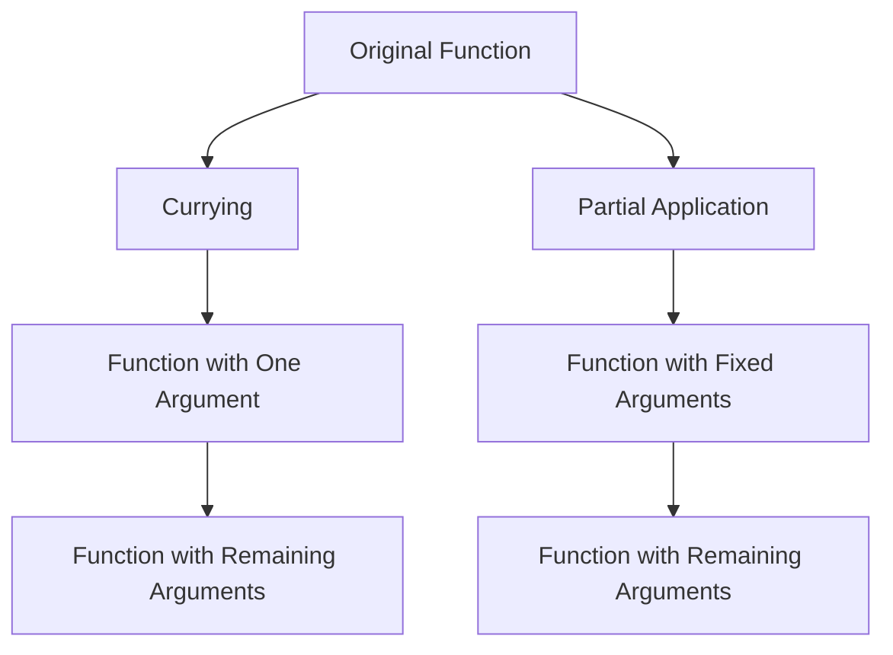

## 10.6. Currying and Partial Application

Currying and partial application are powerful techniques in functional programming that allow developers to create specialized functions from more general ones. These concepts are particularly useful in Clojure, a language that embraces functional programming paradigms. In this section, we will explore these techniques in depth, providing clear explanations, practical examples, and insights into their benefits and potential limitations.

### Understanding Currying

**Currying** is a technique in functional programming where a function with multiple arguments is transformed into a sequence of functions, each taking a single argument. This allows for the creation of more specialized functions by fixing some of the arguments of a function.

#### Example of Currying

In Clojure, currying is not built-in as it is in some other functional languages like Haskell. However, we can achieve similar behavior using higher-order functions and closures.

```clojure
(defn curried-add [x]
  (fn [y]
    (+ x y)))

;; Usage
(def add-five (curried-add 5))
(println (add-five 10)) ; Output: 15
```

In this example, `curried-add` is a function that takes one argument `x` and returns another function that takes a second argument `y`. The returned function adds `x` and `y` together.

### Understanding Partial Application

**Partial application** is the process of fixing a few arguments of a function, producing another function of smaller arity. In Clojure, the `partial` function is used to achieve partial application.

#### Example of Partial Application

```clojure
(defn add [x y]
  (+ x y))

(def add-ten (partial add 10))

;; Usage
(println (add-ten 5)) ; Output: 15
```

Here, `add-ten` is a partially applied function that fixes the first argument of the `add` function to `10`. The resulting function takes one argument and adds it to `10`.

### Using `partial` and Anonymous Functions

Clojure provides the `partial` function to facilitate partial application. Additionally, anonymous functions can be used to achieve similar results.

#### Using `partial`

```clojure
(defn multiply [x y]
  (* x y))

(def double (partial multiply 2))

;; Usage
(println (double 5)) ; Output: 10
```

#### Using Anonymous Functions

```clojure
(defn multiply [x y]
  (* x y))

(def double (fn [y] (multiply 2 y)))

;; Usage
(println (double 5)) ; Output: 10
```

Both approaches achieve the same result, but `partial` provides a more concise and expressive way to create partially applied functions.

### Benefits of Currying and Partial Application

1. **Code Reuse**: By creating specialized functions, we can reuse code more effectively, reducing duplication and improving maintainability.

2. **Clarity**: Currying and partial application can make code more readable by breaking down complex functions into simpler, more understandable components.

3. **Flexibility**: These techniques allow for greater flexibility in function composition, enabling developers to build complex behaviors from simple functions.

4. **Functional Composition**: Currying and partial application facilitate functional composition, allowing developers to chain functions together in a clean and expressive manner.

### Potential Caveats and Limitations

1. **Performance Overhead**: Currying and partial application can introduce performance overhead due to the creation of additional functions and closures.

2. **Complexity**: While these techniques can simplify code in some cases, they can also introduce complexity if overused or applied inappropriately.

3. **Readability**: In some cases, excessive use of currying and partial application can make code harder to read, especially for developers unfamiliar with these concepts.

### Try It Yourself

Experiment with the following code examples to deepen your understanding of currying and partial application in Clojure. Try modifying the functions to see how changes affect the behavior.

```clojure
;; Experiment with currying
(defn curried-subtract [x]
  (fn [y]
    (- x y)))

(def subtract-five (curried-subtract 5))
(println (subtract-five 3)) ; Output: 2

;; Experiment with partial application
(defn divide [x y]
  (/ x y))

(def half (partial divide 2))
(println (half 10)) ; Output: 0.2
```

### Visualizing Currying and Partial Application

To better understand the flow of currying and partial application, let's visualize the process using a flowchart.



**Caption**: This diagram illustrates the transformation of an original function into curried and partially applied functions, showing how arguments are fixed or transformed into a sequence of functions.

### Key Takeaways

- **Currying** transforms a function with multiple arguments into a sequence of functions, each taking a single argument.
- **Partial Application** fixes some arguments of a function, producing a new function with fewer arguments.
- **Clojure's `partial` function** provides a concise way to achieve partial application.
- **Benefits** include improved code reuse, clarity, and flexibility, but be mindful of potential performance overhead and complexity.

### References and Further Reading

- [Clojure Documentation on Partial](https://clojure.org/reference/partial)
- [Functional Programming Concepts](https://www.martinfowler.com/articles/function-composition.html)
- [Currying and Partial Application in Functional Programming](https://en.wikipedia.org/wiki/Currying)

## **Ready to Test Your Knowledge?**



### What is currying in functional programming?

- [x] Transforming a function with multiple arguments into a sequence of functions, each taking a single argument.
- [ ] Fixing some arguments of a function to create a new function with fewer arguments.
- [ ] Creating anonymous functions for specific tasks.
- [ ] Using macros to generate functions dynamically.

> **Explanation:** Currying involves transforming a function with multiple arguments into a sequence of functions, each taking a single argument.

### What does the `partial` function in Clojure do?

- [x] Fixes some arguments of a function, producing a new function with fewer arguments.
- [ ] Transforms a function into a sequence of functions, each taking a single argument.
- [ ] Creates a closure over a function.
- [ ] Generates a macro for function creation.

> **Explanation:** The `partial` function in Clojure fixes some arguments of a function, producing a new function with fewer arguments.

### Which of the following is a benefit of using currying and partial application?

- [x] Improved code reuse and clarity.
- [ ] Increased complexity and performance overhead.
- [ ] Reduced flexibility in function composition.
- [ ] Harder to read code.

> **Explanation:** Currying and partial application improve code reuse and clarity by breaking down complex functions into simpler components.

### How can you achieve currying in Clojure?

- [x] By using higher-order functions and closures.
- [ ] By using the `partial` function.
- [ ] By using macros.
- [ ] By using Java interop.

> **Explanation:** Currying in Clojure can be achieved using higher-order functions and closures, as Clojure does not have built-in currying.

### What is a potential caveat of using currying and partial application?

- [x] Performance overhead due to additional functions and closures.
- [ ] Improved readability and maintainability.
- [ ] Increased flexibility in function composition.
- [ ] Simplified code structure.

> **Explanation:** Currying and partial application can introduce performance overhead due to the creation of additional functions and closures.

### Which function can be used for partial application in Clojure?

- [x] `partial`
- [ ] `map`
- [ ] `reduce`
- [ ] `filter`

> **Explanation:** The `partial` function in Clojure is specifically designed for partial application.

### What is the result of `(partial + 5)` in Clojure?

- [x] A function that adds 5 to its argument.
- [ ] A function that subtracts 5 from its argument.
- [ ] A function that multiplies its argument by 5.
- [ ] A function that divides its argument by 5.

> **Explanation:** `(partial + 5)` creates a function that adds 5 to its argument.

### How can you create a partially applied function without using `partial`?

- [x] By using an anonymous function.
- [ ] By using a macro.
- [ ] By using Java interop.
- [ ] By using a loop.

> **Explanation:** An anonymous function can be used to create a partially applied function without using `partial`.

### What is the primary purpose of currying?

- [x] To transform a function with multiple arguments into a sequence of functions, each taking a single argument.
- [ ] To fix some arguments of a function, producing a new function with fewer arguments.
- [ ] To create anonymous functions for specific tasks.
- [ ] To use macros for function generation.

> **Explanation:** The primary purpose of currying is to transform a function with multiple arguments into a sequence of functions, each taking a single argument.

### True or False: Currying and partial application are the same concepts.

- [ ] True
- [x] False

> **Explanation:** Currying and partial application are related but distinct concepts. Currying transforms a function into a sequence of functions, while partial application fixes some arguments of a function.



Remember, this is just the beginning. As you progress, you'll build more complex and interactive applications using currying and partial application. Keep experimenting, stay curious, and enjoy the journey!
