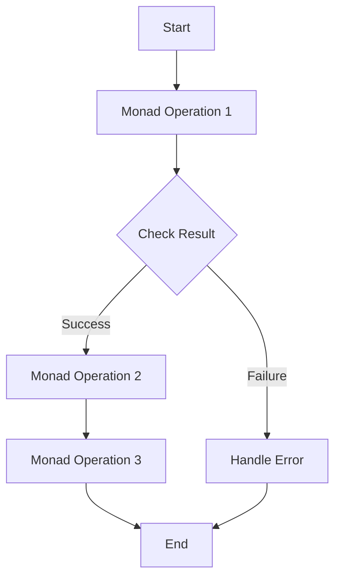

## 10.7. Monads and Monad Transformers

Monads are a powerful and often misunderstood concept in functional programming. They provide a way to structure programs generically, allowing for the composition of computations while managing side effects. In Clojure, monads can be particularly useful for handling state, I/O, and other side effects in a clean and manageable way. This section will delve into the intricacies of monads and monad transformers, using the Cats library to illustrate these concepts.

### Understanding Monads

**Monads** are a type of abstract data type used to represent computations instead of data in the domain of programming. They are a design pattern used to handle program-wide concerns in a functional way, such as state or I/O.

#### Key Concepts of Monads

1. **Functor**: A functor is a type that implements a map function, which applies a function to a wrapped value. In Clojure, this is akin to using `map` on a collection.

2. **Applicative**: An applicative extends a functor by allowing functions that are themselves wrapped in the context to be applied to wrapped values.

3. **Monad**: A monad is an extension of an applicative that supports chaining operations. It provides two primary operations:
   - **`bind` (also known as `flatMap` or `>>=`)**: This operation takes a monadic value and a function that returns a monadic value, chaining them together.
   - **`return` (also known as `unit`)**: This operation takes a value and wraps it in a monadic context.

#### Monad Laws

Monads must adhere to three laws to ensure consistent behavior:

1. **Left Identity**: `return a >>= f` is equivalent to `f a`.
2. **Right Identity**: `m >>= return` is equivalent to `m`.
3. **Associativity**: `(m >>= f) >>= g` is equivalent to `m >>= (\x -> f x >>= g)`.

### Monads in Clojure with Cats

The [Cats library](https://github.com/funcool/cats) is a popular library in Clojure that provides abstractions for functional programming, including monads.

#### Example: The Maybe Monad

The `Maybe` monad is used to handle computations that might fail. It encapsulates an optional value, representing either a value (`Just`) or no value (`Nothing`).

```clojure
(require '[cats.core :as m])
(require '[cats.monad.maybe :as maybe])

(defn safe-divide [num denom]
  (if (zero? denom)
    (maybe/nothing)
    (maybe/just (/ num denom))))

(def result
  (m/mlet [x (safe-divide 10 2)
           y (safe-divide x 0)]
    (m/return (+ x y))))

(println result) ; Output: #<Nothing>
```

In this example, `safe-divide` returns a `Maybe` monad. The `m/mlet` macro is used to chain operations, and if any operation returns `Nothing`, the entire computation short-circuits.

### Monad Transformers

While monads are powerful, they can become cumbersome when dealing with multiple monadic contexts. This is where **monad transformers** come into play. They allow you to combine multiple monads into a single monad, simplifying the handling of multiple effects.

#### Purpose of Monad Transformers

Monad transformers provide a way to stack monads, allowing you to work with multiple effects in a single computation. This is particularly useful when dealing with nested monadic structures, such as a `Maybe` within an `Either`.

#### Example: Using Monad Transformers

Let's consider a scenario where we want to handle both optional values and error handling. We can use the `MaybeT` transformer to combine `Maybe` and `Either`.

```clojure
(require '[cats.monad.either :as either])
(require '[cats.monad.maybe :as maybe])
(require '[cats.monad.maybe-t :as maybe-t])

(defn safe-divide [num denom]
  (if (zero? denom)
    (either/left "Division by zero")
    (either/right (/ num denom))))

(defn divide-and-check [num denom]
  (maybe-t/maybe-t
    (m/mlet [x (safe-divide num denom)
             y (safe-divide x 2)]
      (m/return (+ x y)))))

(def result (divide-and-check 10 0))
(println result) ; Output: #<Left "Division by zero">
```

In this example, `MaybeT` is used to combine `Maybe` and `Either`, allowing us to handle both optional values and errors in a single computation.

### Handling State, I/O, and Side Effects

Monads are particularly useful for managing state, I/O, and other side effects in a functional way. Let's explore how monads can be used for these purposes.

#### State Management with the State Monad

The `State` monad allows you to manage state in a functional way, threading state through a series of computations.

```clojure
(require '[cats.monad.state :as state])

(defn increment-state [s]
  (state/state
    (fn [state]
      [state (inc state)])))

(defn run-state []
  (let [initial-state 0
        computation (m/mlet [x (increment-state)
                             y (increment-state)]
                      (m/return (+ x y)))]
    (state/run-state computation initial-state)))

(println (run-state)) ; Output: [1 2]
```

In this example, the `State` monad is used to increment a state value, threading it through a series of computations.

#### I/O and Side Effects with the IO Monad

The `IO` monad is used to handle I/O operations in a functional way, encapsulating side effects.

```clojure
(require '[cats.effect.io :as io])

(defn read-input []
  (io/io
    (fn []
      (println "Enter a number:")
      (Integer. (read-line)))))

(defn io-example []
  (m/mlet [x (read-input)
           y (read-input)]
    (io/io
      (fn []
        (println "Sum:" (+ x y))))))

(io/run-io (io-example))
```

In this example, the `IO` monad is used to encapsulate I/O operations, allowing them to be composed in a functional way.

### Advanced Usage and Complexities

While monads and monad transformers are powerful, they can introduce complexities, especially when dealing with multiple monadic contexts. It's important to understand the underlying principles and use them judiciously.

#### Potential Complexities

1. **Nested Monads**: Dealing with nested monads can be challenging, as it requires understanding how to combine and transform them effectively.
2. **Monad Transformers**: While they simplify handling multiple effects, they can introduce additional complexity in understanding and managing the monadic stack.
3. **Performance Considerations**: Monads can introduce overhead, especially in performance-critical applications. It's important to balance the benefits of monads with potential performance impacts.

### Visualizing Monads and Monad Transformers

To better understand the flow of monadic operations, let's visualize the process using a flowchart.



**Caption**: This flowchart illustrates the flow of monadic operations, where each operation is dependent on the success of the previous one. In case of failure, an error handling path is taken.

### Conclusion

Monads and monad transformers are powerful tools in functional programming, providing a way to manage effects and compose computations in a clean and structured manner. By leveraging libraries like Cats, Clojure developers can harness the power of monads to handle state, I/O, and other side effects effectively. While they introduce some complexities, understanding and using monads can lead to more robust and maintainable code.

### Ready to Test Your Knowledge?



### What is a monad in functional programming?

- [x] An abstract data type used to represent computations
- [ ] A data structure for storing values
- [ ] A type of loop in functional programming
- [ ] A method for optimizing performance

> **Explanation:** Monads are abstract data types used to represent computations and manage side effects in functional programming.

### Which operation is used to chain monadic computations?

- [x] `bind`
- [ ] `map`
- [ ] `filter`
- [ ] `reduce`

> **Explanation:** The `bind` operation, also known as `flatMap` or `>>=`, is used to chain monadic computations.

### What is the purpose of monad transformers?

- [x] To combine multiple monads into a single monad
- [ ] To optimize monadic computations
- [ ] To convert monads into functors
- [ ] To handle errors in monadic computations

> **Explanation:** Monad transformers allow you to combine multiple monads into a single monad, simplifying the handling of multiple effects.

### Which library in Clojure provides abstractions for functional programming, including monads?

- [x] Cats
- [ ] Core.Async
- [ ] Ring
- [ ] Compojure

> **Explanation:** The Cats library provides abstractions for functional programming in Clojure, including monads.

### What does the `Maybe` monad represent?

- [x] An optional value that might be present or absent
- [ ] A computation that always succeeds
- [ ] A collection of values
- [ ] A type of loop in functional programming

> **Explanation:** The `Maybe` monad represents an optional value that might be present (`Just`) or absent (`Nothing`).

### How does the `State` monad help in functional programming?

- [x] It manages state in a functional way by threading state through computations
- [ ] It optimizes stateful computations
- [ ] It converts stateful computations into pure functions
- [ ] It handles errors in stateful computations

> **Explanation:** The `State` monad manages state in a functional way by threading state through a series of computations.

### What is the role of the `IO` monad?

- [x] To encapsulate I/O operations and side effects
- [ ] To optimize I/O operations
- [ ] To convert I/O operations into pure functions
- [ ] To handle errors in I/O operations

> **Explanation:** The `IO` monad encapsulates I/O operations and side effects, allowing them to be composed in a functional way.

### What is a potential complexity of using monads?

- [x] Dealing with nested monads can be challenging
- [ ] Monads always improve performance
- [ ] Monads simplify all computations
- [ ] Monads eliminate all side effects

> **Explanation:** Dealing with nested monads can be challenging, as it requires understanding how to combine and transform them effectively.

### True or False: Monad transformers can introduce additional complexity in understanding and managing the monadic stack.

- [x] True
- [ ] False

> **Explanation:** While monad transformers simplify handling multiple effects, they can introduce additional complexity in understanding and managing the monadic stack.

### Which operation in monads is equivalent to wrapping a value in a monadic context?

- [x] `return`
- [ ] `bind`
- [ ] `map`
- [ ] `filter`

> **Explanation:** The `return` operation, also known as `unit`, is used to wrap a value in a monadic context.



Remember, mastering monads and monad transformers is a journey. Keep experimenting, stay curious, and enjoy the process of learning and applying these powerful concepts in your Clojure projects!
