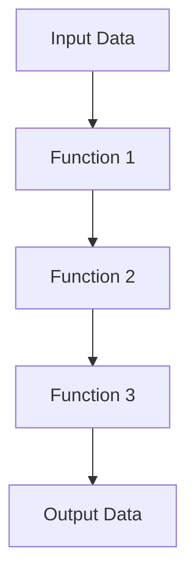

## 10.8. Composition of Functions and Pipelines

In the realm of functional programming, the composition of functions and the construction of pipelines are foundational techniques that enable developers to build complex operations from simple, reusable components. This approach not only enhances code readability but also promotes the separation of concerns, making systems more modular and maintainable. In this section, we will delve into the philosophy of function composition, explore the use of threading macros in Clojure, and demonstrate how to create effective pipelines for data transformation.

### The Philosophy of Function Composition

Function composition is a core concept in functional programming, where the output of one function becomes the input of another. This allows developers to build complex operations by chaining simple functions together. The philosophy behind function composition is to break down problems into smaller, manageable pieces and then combine these pieces to solve larger problems.

In Clojure, function composition is often achieved using the `comp` function, which takes multiple functions as arguments and returns a new function that is the composition of those functions. The `comp` function applies the rightmost function first and then applies each function from right to left.

```clojure
(defn add-one [x] (+ x 1))
(defn square [x] (* x x))

(def add-one-and-square (comp square add-one))

(println (add-one-and-square 4)) ; Output: 25
```

In this example, `add-one-and-square` is a composed function that first adds one to its argument and then squares the result.

### Benefits of Function Composition

1. **Modularity**: By composing functions, you can create modular code where each function has a single responsibility. This makes it easier to test and maintain.

2. **Reusability**: Composed functions can be reused in different contexts, reducing code duplication.

3. **Readability**: Function composition can make code more readable by clearly expressing the flow of data through a series of transformations.

4. **Separation of Concerns**: Each function in a composition can focus on a specific task, leading to a clear separation of concerns.

### Pipelines and Threading Macros

In addition to function composition, Clojure provides powerful threading macros (`->` and `->>`) that facilitate the creation of pipelines for data transformation. These macros allow you to express a sequence of operations in a linear, readable manner.

#### The `->` Threading Macro

The `->` macro, also known as the "thread-first" macro, is used to pass the result of one expression as the first argument to the next expression. This is particularly useful when dealing with functions that take the data as their first argument.

```clojure
(-> 4
    add-one
    square
    println) ; Output: 25
```

In this example, the value `4` is passed to `add-one`, and the result is then passed to `square`, followed by `println`.

#### The `->>` Threading Macro

The `->>` macro, or "thread-last" macro, is used when you want to pass the result of one expression as the last argument to the next expression. This is useful for functions that take the data as their last argument.

```clojure
(defn append-exclamation [s] (str s "!"))
(defn reverse-string [s] (apply str (reverse s)))

(->> "hello"
     append-exclamation
     reverse-string
     println) ; Output: !olleh
```

Here, the string `"hello"` is first transformed by `append-exclamation`, and the result is then reversed by `reverse-string`.

### Creating Reusable Function Components

To fully leverage the power of function composition and pipelines, it's important to design functions that are small, focused, and reusable. Each function should perform a single task, making it easy to combine with other functions.

#### Example: Data Transformation Pipeline

Let's consider a practical example where we transform a collection of data using a pipeline. Suppose we have a list of numbers, and we want to filter out even numbers, square the remaining numbers, and then sum the results.

```clojure
(defn is-odd? [n] (odd? n))
(defn sum [coll] (reduce + coll))

(->> [1 2 3 4 5 6 7 8 9 10]
     (filter is-odd?)
     (map square)
     sum
     println) ; Output: 165
```

In this pipeline, we first filter the list to keep only odd numbers, then map each number to its square, and finally reduce the list by summing the squares.

### Designing Systems as Compositions of Functions

When designing systems in Clojure, it's beneficial to think in terms of function composition and pipelines. By breaking down complex operations into smaller functions and composing them, you can create systems that are easier to understand, test, and maintain.

#### Example: Building a Simple Web Server

Consider a simple web server that processes HTTP requests. We can use function composition to handle different aspects of request processing, such as parsing, validation, and response generation.

```clojure
(defn parse-request [request]
  ;; Parse the request
  )

(defn validate-request [parsed-request]
  ;; Validate the request
  )

(defn generate-response [validated-request]
  ;; Generate a response
  )

(defn handle-request [request]
  (-> request
      parse-request
      validate-request
      generate-response))

;; Example usage
(handle-request some-http-request)
```

In this example, `handle-request` is a composed function that processes an HTTP request by parsing it, validating it, and generating a response.

### Encouraging Experimentation

To truly master function composition and pipelines in Clojure, it's important to experiment and practice. Try modifying the examples provided, or create your own pipelines to solve different problems. The more you practice, the more intuitive these concepts will become.

### Visualizing Function Composition and Pipelines

To better understand how function composition and pipelines work, let's visualize the flow of data through a series of transformations using a Mermaid.js diagram.



In this diagram, data flows from the input through a series of functions, each transforming the data in some way, until it reaches the final output.

### References and Further Reading

- [Clojure Documentation](https://clojure.org/reference)
- [Functional Programming Concepts](https://en.wikipedia.org/wiki/Functional_programming)
- [Threading Macros in Clojure](https://clojure.org/guides/threading_macros)

### Knowledge Check

To reinforce your understanding of function composition and pipelines in Clojure, try answering the following questions and challenges.

## **Ready to Test Your Knowledge?**



### What is the primary benefit of function composition in functional programming?

- [x] Modularity and reusability
- [ ] Increased complexity
- [ ] Reduced readability
- [ ] Faster execution

> **Explanation:** Function composition promotes modularity and reusability by allowing developers to build complex operations from simple, reusable components.

### Which threading macro is used to pass the result of one expression as the first argument to the next expression?

- [x] `->`
- [ ] `->>`
- [ ] `comp`
- [ ] `map`

> **Explanation:** The `->` macro, also known as the "thread-first" macro, is used to pass the result of one expression as the first argument to the next expression.

### In the following code, what will be the output of `(->> "hello" append-exclamation reverse-string println)`?

- [x] `!olleh`
- [ ] `hello!`
- [ ] `olleh!`
- [ ] `!hello`

> **Explanation:** The `->>` macro threads the result of each expression as the last argument to the next expression, resulting in the string being reversed after appending an exclamation mark.

### What is the purpose of the `comp` function in Clojure?

- [x] To compose multiple functions into a single function
- [ ] To compare two values
- [ ] To compile Clojure code
- [ ] To concatenate strings

> **Explanation:** The `comp` function in Clojure is used to compose multiple functions into a single function, applying them from right to left.

### How does function composition enhance code readability?

- [x] By clearly expressing the flow of data through transformations
- [ ] By increasing the number of lines of code
- [ ] By using complex syntax
- [ ] By reducing the number of functions

> **Explanation:** Function composition enhances code readability by clearly expressing the flow of data through a series of transformations, making it easier to understand.

### Which of the following is a benefit of using pipelines in Clojure?

- [x] Improved code readability
- [ ] Increased code complexity
- [ ] Reduced modularity
- [ ] Slower execution

> **Explanation:** Pipelines in Clojure improve code readability by allowing developers to express a sequence of operations in a linear, readable manner.

### What is the role of the `->` macro in the following code snippet?

```clojure
(-> 4
    add-one
    square
    println)
```

- [x] It threads the value `4` through the functions `add-one`, `square`, and `println`.
- [ ] It reverses the order of function application.
- [ ] It compiles the code.
- [ ] It concatenates strings.

> **Explanation:** The `->` macro threads the value `4` through the functions `add-one`, `square`, and `println`, passing the result of each as the first argument to the next.

### What is the output of the following code?

```clojure
(defn double [x] (* x 2))
(defn increment [x] (+ x 1))

(-> 5
    double
    increment
    println)
```

- [x] `11`
- [ ] `10`
- [ ] `12`
- [ ] `6`

> **Explanation:** The value `5` is doubled to `10`, and then incremented to `11`, which is printed.

### What is the key advantage of designing systems as compositions of functions?

- [x] Easier to understand, test, and maintain
- [ ] Increased complexity
- [ ] Reduced performance
- [ ] More lines of code

> **Explanation:** Designing systems as compositions of functions makes them easier to understand, test, and maintain by promoting modularity and separation of concerns.

### True or False: The `->>` macro is used to pass the result of one expression as the first argument to the next expression.

- [ ] True
- [x] False

> **Explanation:** False. The `->>` macro is used to pass the result of one expression as the last argument to the next expression.



Remember, mastering function composition and pipelines is a journey. Keep experimenting, stay curious, and enjoy the process of building elegant and efficient Clojure code!
