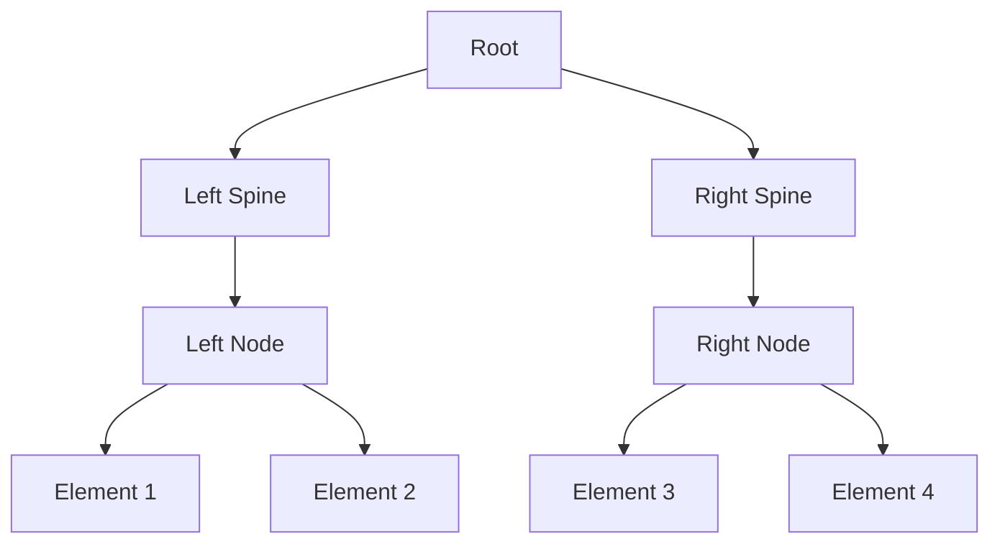
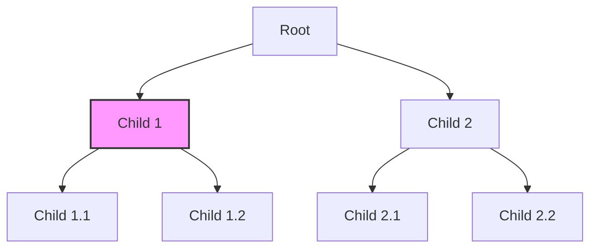

## 10.9. Functional Data Structures

Functional data structures are a cornerstone of functional programming, providing the means to handle data immutably and efficiently. In Clojure, these structures are pivotal for writing robust and performant applications. This section delves into advanced functional data structures, such as finger trees and zippers, exploring their characteristics, use cases, and implementations in Clojure.

### Importance of Specialized Data Structures in Functional Programming

Functional programming emphasizes immutability, where data structures are not modified in place but rather transformed into new versions. This immutability ensures thread safety and predictability, crucial for concurrent programming. However, immutability can introduce performance challenges, as naive implementations may lead to inefficient operations. Specialized functional data structures address these challenges by providing efficient immutable operations.

### Overview of Advanced Functional Data Structures

#### Finger Trees

Finger trees are a versatile data structure that can serve as a foundation for various other structures, such as sequences, priority queues, and deques. They provide efficient access to both ends of the sequence, making them suitable for applications requiring fast insertions and deletions at both ends.

**Characteristics of Finger Trees:**

- **Amortized Efficiency**: Finger trees offer amortized constant time access to the ends and logarithmic time for other operations.
- **Flexibility**: They can be adapted to implement various data structures.
- **Persistence**: Like all functional data structures, finger trees are persistent, meaning previous versions remain accessible after modifications.

**Use Cases for Finger Trees:**

- Implementing sequences with efficient access to both ends.
- Building priority queues where elements can be efficiently added or removed.
- Creating deques for applications requiring double-ended queue operations.

#### Zippers

Zippers provide a way to navigate and update immutable data structures efficiently. They are particularly useful for tree-like structures, allowing localized updates without reconstructing the entire structure.

**Characteristics of Zippers:**

- **Localized Updates**: Zippers enable updates at specific locations within a structure.
- **Navigation**: They provide a means to traverse data structures efficiently.
- **Persistence**: Like other functional structures, zippers maintain previous versions after updates.

**Use Cases for Zippers:**

- Navigating and updating XML or JSON-like data structures.
- Implementing editors for tree-like data, such as abstract syntax trees.
- Enabling efficient updates in hierarchical data models.

### Operations on Functional Data Structures

#### Finger Trees Operations

Let's explore some basic operations on finger trees using Clojure.

```clojure
(ns functional-data-structures.finger-trees
  (:require [clojure.data.finger-tree :as ft]))

;; Creating a finger tree
(def my-tree (ft/empty))

;; Adding elements to the front
(def tree-with-elements (-> my-tree
                            (ft/conj-front 1)
                            (ft/conj-front 2)
                            (ft/conj-front 3)))

;; Accessing the front element
(def front-element (ft/peek-front tree-with-elements))

;; Removing the front element
(def tree-after-pop (ft/pop-front tree-with-elements))

;; Adding elements to the back
(def tree-with-back-elements (ft/conj-back tree-with-elements 4))

;; Accessing the back element
(def back-element (ft/peek-back tree-with-back-elements))

;; Removing the back element
(def tree-after-back-pop (ft/pop-back tree-with-back-elements))
```

In this example, we demonstrate creating a finger tree, adding elements to both ends, and accessing or removing elements efficiently.

#### Zipper Operations

Now, let's look at how zippers can be used to navigate and update a tree structure.

```clojure
(ns functional-data-structures.zippers
  (:require [clojure.zip :as zip]))

;; Creating a simple tree
(def my-tree {:value 1
              :children [{:value 2 :children []}
                         {:value 3 :children [{:value 4 :children []}]}]})

;; Creating a zipper for the tree
(def my-zipper (zip/vector-zip my-tree))

;; Navigating to the first child
(def first-child (zip/down my-zipper))

;; Navigating to the next sibling
(def next-sibling (zip/right first-child))

;; Updating a node's value
(def updated-zipper (zip/edit next-sibling assoc :value 5))

;; Converting back to a tree
(def updated-tree (zip/root updated-zipper))
```

This example illustrates how to create a zipper, navigate through a tree, update a node, and convert the zipper back to a tree structure.

### Libraries Implementing Functional Data Structures in Clojure

Clojure's ecosystem provides several libraries that implement functional data structures, making it easier to leverage their power in your applications.

- **clojure.data.finger-tree**: A library providing an implementation of finger trees, allowing efficient sequence operations.
- **clojure.zip**: Part of Clojure's core library, this provides zippers for navigating and updating tree-like structures.
- **clojure.data.avl**: Implements AVL trees, another type of balanced tree structure for efficient sorted data operations.

### Visualizing Functional Data Structures

To better understand the structure and operations of finger trees and zippers, let's visualize them using Mermaid.js diagrams.

#### Finger Tree Structure



*Figure 1: A simplified representation of a finger tree structure.*

#### Zipper Navigation



*Figure 2: Navigating a tree using a zipper, with the current focus highlighted.*

### Key Takeaways

- Functional data structures are essential for efficient immutable operations in functional programming.
- Finger trees and zippers are advanced structures that provide flexibility and efficiency.
- Clojure offers libraries like `clojure.data.finger-tree` and `clojure.zip` to implement these structures.
- Visualizing these structures helps in understanding their operations and applications.

### Try It Yourself

Experiment with the provided code examples by modifying them to suit different scenarios. For instance, try adding more elements to the finger tree or navigating deeper into the tree with zippers. This hands-on approach will deepen your understanding of functional data structures.

### Further Reading

For more information on functional data structures and their implementations, consider exploring the following resources:

- [Clojure's Official Documentation](https://clojure.org/reference/data_structures)
- [Finger Trees: A Simple General-purpose Data Structure](https://www.staff.city.ac.uk/~ross/papers/FingerTree.html)
- [Zippers: A Functional Pearl](https://www.cs.bham.ac.uk/~hxt/research/zipper/)

## **Ready to Test Your Knowledge?**



### What is a key characteristic of functional data structures?

- [x] Immutability
- [ ] Mutability
- [ ] In-place modification
- [ ] Dynamic typing

> **Explanation:** Functional data structures are immutable, meaning they do not change in place but create new versions upon modification.

### Which data structure provides efficient access to both ends of a sequence?

- [x] Finger trees
- [ ] Linked lists
- [ ] Binary trees
- [ ] Hash maps

> **Explanation:** Finger trees are designed to provide efficient access and updates to both ends of a sequence.

### What is a zipper primarily used for?

- [x] Navigating and updating tree-like structures
- [ ] Sorting elements
- [ ] Hashing data
- [ ] Managing concurrency

> **Explanation:** Zippers are used for navigating and updating tree-like structures efficiently.

### Which library provides an implementation of finger trees in Clojure?

- [x] clojure.data.finger-tree
- [ ] clojure.zip
- [ ] clojure.core
- [ ] clojure.data.avl

> **Explanation:** The `clojure.data.finger-tree` library provides an implementation of finger trees in Clojure.

### What operation does `zip/edit` perform in a zipper?

- [x] Updates a node's value
- [ ] Deletes a node
- [ ] Adds a new node
- [ ] Navigates to the root

> **Explanation:** `zip/edit` is used to update a node's value in a zipper.

### What is the primary advantage of using functional data structures?

- [x] Thread safety and predictability
- [ ] Faster in-place updates
- [ ] Reduced memory usage
- [ ] Simplicity of implementation

> **Explanation:** Functional data structures provide thread safety and predictability due to their immutable nature.

### Which data structure can be adapted to implement priority queues?

- [x] Finger trees
- [ ] Zippers
- [ ] Linked lists
- [ ] Arrays

> **Explanation:** Finger trees can be adapted to implement priority queues due to their flexible structure.

### What does the `zip/root` function do?

- [x] Converts a zipper back to a tree
- [ ] Navigates to the root node
- [ ] Deletes the root node
- [ ] Adds a new root node

> **Explanation:** `zip/root` converts a zipper back to its original tree structure.

### True or False: Zippers are mutable data structures.

- [ ] True
- [x] False

> **Explanation:** Zippers are immutable, like other functional data structures, allowing for persistent updates.

### Which of the following is NOT a characteristic of finger trees?

- [ ] Amortized efficiency
- [ ] Flexibility
- [ ] Persistence
- [x] In-place modification

> **Explanation:** Finger trees are immutable and do not support in-place modification.



Remember, this is just the beginning. As you progress, you'll build more complex and interactive applications using these powerful data structures. Keep experimenting, stay curious, and enjoy the journey!
