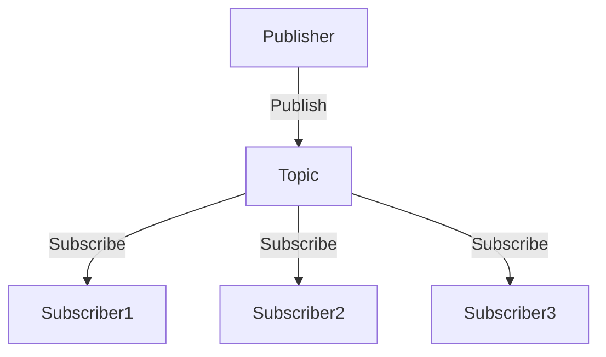
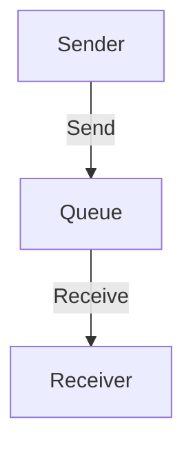

## 11.1. Message-Oriented Middleware

### Introduction to Message-Oriented Middleware

Message-Oriented Middleware (MOM) is a critical component in the architecture of modern enterprise applications. It serves as a communication layer that facilitates the exchange of messages between distributed systems, enabling them to operate independently while still being part of a cohesive application ecosystem. By decoupling the communication between different components, MOM enhances scalability, reliability, and flexibility.

### What is Message-Oriented Middleware?

Message-Oriented Middleware is a software infrastructure that supports sending and receiving messages between distributed systems. It acts as an intermediary that ensures messages are delivered reliably and efficiently, even in complex and heterogeneous environments. MOM systems can handle various message patterns, such as point-to-point and publish/subscribe, making them versatile tools for enterprise integration.

### The Role of MOM in Enterprise Applications

In enterprise applications, MOM plays a pivotal role by:

- **Decoupling Components**: By using MOM, components can communicate without being directly connected. This decoupling allows for greater flexibility and easier maintenance.
- **Enhancing Scalability**: MOM systems can handle large volumes of messages, allowing applications to scale horizontally by adding more instances of services.
- **Improving Reliability**: With features like message persistence and guaranteed delivery, MOM ensures that messages are not lost even if a system component fails.

### Benefits of Message-Oriented Middleware

#### Decoupling

Decoupling is one of the primary benefits of using MOM. By separating the message sender from the receiver, MOM allows each component to evolve independently. This separation reduces the risk of changes in one part of the system affecting others, leading to more robust and maintainable applications.

#### Scalability

MOM systems are designed to handle high-throughput environments. They can distribute messages across multiple consumers, enabling applications to process large volumes of data efficiently. This scalability is crucial for applications that experience variable loads or need to handle peak traffic gracefully.

#### Reliability

Reliability in MOM is achieved through mechanisms like message persistence, acknowledgments, and retries. These features ensure that messages are delivered even in the face of network failures or system crashes. By providing guaranteed delivery, MOM systems help maintain data integrity across distributed systems.

### Examples of Message-Oriented Middleware Systems

Several MOM systems are widely used in the industry, each with its unique features and strengths. Two popular examples are RabbitMQ and Apache Kafka.

#### RabbitMQ

RabbitMQ is a robust, open-source message broker that implements the Advanced Message Queuing Protocol (AMQP). It supports various messaging patterns, including point-to-point and publish/subscribe, and offers features like message routing, load balancing, and fault tolerance.

#### Apache Kafka

Apache Kafka is a distributed streaming platform known for its high throughput and low latency. It is designed to handle real-time data feeds and is often used for building data pipelines and streaming applications. Kafka's architecture is based on a distributed commit log, making it highly scalable and fault-tolerant.

### How Clojure Interacts with MOM Systems

Clojure, with its functional programming paradigm and seamless Java interoperability, is well-suited for integrating with MOM systems. Libraries like `langohr` for RabbitMQ and `clj-kafka` for Kafka provide idiomatic Clojure interfaces to these systems, allowing developers to leverage their full capabilities.

#### Interacting with RabbitMQ in Clojure

To interact with RabbitMQ in Clojure, you can use the `langohr` library. Here's a simple example of how to publish and consume messages using `langohr`:

```clojure
(ns example.rabbitmq
  (:require [langohr.core :as rmq]
            [langohr.channel :as lch]
            [langohr.queue :as lq]
            [langohr.basic :as lb]))

(defn publish-message [channel queue message]
  (lb/publish channel "" queue message))

(defn consume-messages [channel queue]
  (lq/declare channel queue {:durable true})
  (lb/consume channel queue (fn [ch {:keys [delivery-tag]} ^bytes payload]
                              (println "Received message:" (String. payload))
                              (lb/ack ch delivery-tag))))

(defn -main []
  (let [conn (rmq/connect)
        channel (lch/open conn)]
    (publish-message channel "my-queue" "Hello, RabbitMQ!")
    (consume-messages channel "my-queue")))
```

In this example, we establish a connection to RabbitMQ, open a channel, and declare a queue. We then publish a message to the queue and set up a consumer to receive messages.

#### Interacting with Kafka in Clojure

For Kafka, the `clj-kafka` library provides a straightforward way to produce and consume messages. Here's an example:

```clojure
(ns example.kafka
  (:require [clj-kafka.producer :as producer]
            [clj-kafka.consumer :as consumer]))

(defn produce-message [topic message]
  (producer/send-message {:topic topic :value message}))

(defn consume-messages [topic]
  (consumer/consume {:topic topic}
                    (fn [msg]
                      (println "Received message:" (:value msg)))))

(defn -main []
  (produce-message "my-topic" "Hello, Kafka!")
  (consume-messages "my-topic"))
```

This code demonstrates how to send and receive messages with Kafka using `clj-kafka`. We define functions to produce and consume messages, specifying the topic and message content.

### Patterns in Message-Oriented Middleware

MOM systems support various messaging patterns that cater to different communication needs. Two common patterns are publish/subscribe and message queues.

#### Publish/Subscribe Pattern

In the publish/subscribe pattern, messages are sent by publishers to a topic, and subscribers receive messages from that topic. This pattern is ideal for broadcasting messages to multiple consumers and is commonly used in event-driven architectures.



*Diagram: Publish/Subscribe Pattern*

#### Message Queues

Message queues provide a point-to-point communication model where messages are sent to a queue and consumed by a single receiver. This pattern is suitable for load balancing and task distribution.



*Diagram: Message Queue Pattern*

### Clojure and MOM Patterns

Clojure's functional programming features and concurrency primitives make it an excellent choice for implementing MOM patterns. The language's emphasis on immutability and state management aligns well with the requirements of distributed systems.

#### Implementing Publish/Subscribe in Clojure

Using Clojure's core.async library, we can implement a simple publish/subscribe pattern:

```clojure
(ns example.pubsub
  (:require [clojure.core.async :as async]))

(defn publish [topic message]
  (async/put! topic message))

(defn subscribe [topic]
  (let [ch (async/chan)]
    (async/sub topic ch)
    ch))

(defn -main []
  (let [topic (async/pub (async/chan))]
    (async/go-loop []
      (let [msg (async/<! (subscribe topic))]
        (println "Received message:" msg)
        (recur)))
    (publish topic "Hello, Subscribers!")))
```

In this example, we create a topic using `async/pub` and define functions to publish and subscribe to messages. The `go-loop` continuously listens for messages and prints them as they arrive.

### Design Considerations for MOM

When designing systems with MOM, consider the following:

- **Message Durability**: Ensure messages are persisted to prevent data loss.
- **Fault Tolerance**: Design for failure by implementing retries and acknowledgments.
- **Scalability**: Plan for horizontal scaling by distributing messages across multiple consumers.
- **Security**: Protect message integrity and confidentiality through encryption and access controls.

### Clojure's Unique Features for MOM

Clojure's unique features, such as its immutable data structures and powerful concurrency primitives, provide a solid foundation for building robust MOM systems. The language's seamless Java interoperability allows developers to leverage existing MOM libraries and tools, enhancing productivity and flexibility.

### Differences and Similarities with Other Patterns

MOM patterns share similarities with other communication patterns, such as event-driven architectures and service-oriented architectures. However, MOM focuses specifically on message exchange, providing specialized features like message routing and transformation.

### Conclusion

Message-Oriented Middleware is a powerful tool for building scalable, reliable, and decoupled distributed systems. By leveraging Clojure's unique features and libraries, developers can effectively integrate MOM systems like RabbitMQ and Kafka into their applications. As you explore MOM, remember to consider design considerations and patterns that align with your application's requirements.

### Try It Yourself

Experiment with the provided code examples by modifying the message content, topics, or queues. Try implementing additional features like message filtering or priority queues to deepen your understanding of MOM in Clojure.

## **Ready to Test Your Knowledge?**



### What is the primary role of Message-Oriented Middleware (MOM) in enterprise applications?

- [x] To facilitate communication between distributed systems
- [ ] To store large volumes of data
- [ ] To provide user authentication
- [ ] To manage database transactions

> **Explanation:** MOM acts as a communication layer that facilitates the exchange of messages between distributed systems.

### Which of the following is a benefit of using MOM?

- [x] Decoupling components
- [x] Enhancing scalability
- [ ] Reducing code complexity
- [ ] Increasing user interface responsiveness

> **Explanation:** MOM decouples components and enhances scalability by allowing systems to communicate independently and handle large volumes of messages.

### What is RabbitMQ?

- [x] A message broker that implements AMQP
- [ ] A database management system
- [ ] A web server
- [ ] A file storage system

> **Explanation:** RabbitMQ is a robust, open-source message broker that implements the Advanced Message Queuing Protocol (AMQP).

### How does Clojure interact with RabbitMQ?

- [x] Using the `langohr` library
- [ ] Through direct HTTP requests
- [ ] By embedding RabbitMQ within Clojure code
- [ ] Using SQL queries

> **Explanation:** Clojure interacts with RabbitMQ using the `langohr` library, which provides idiomatic Clojure interfaces to RabbitMQ.

### What pattern is commonly used for broadcasting messages to multiple consumers?

- [x] Publish/Subscribe
- [ ] Point-to-Point
- [ ] Request/Response
- [ ] Master/Slave

> **Explanation:** The publish/subscribe pattern is ideal for broadcasting messages to multiple consumers.

### Which Clojure library is used for interacting with Kafka?

- [x] `clj-kafka`
- [ ] `langohr`
- [ ] `core.async`
- [ ] `ring`

> **Explanation:** The `clj-kafka` library provides a straightforward way to produce and consume messages with Kafka in Clojure.

### What is a key feature of Apache Kafka?

- [x] High throughput and low latency
- [ ] Built-in user interface
- [ ] Automatic code generation
- [ ] Integrated development environment

> **Explanation:** Apache Kafka is known for its high throughput and low latency, making it suitable for real-time data feeds.

### Which pattern provides a point-to-point communication model?

- [x] Message Queues
- [ ] Publish/Subscribe
- [ ] Observer
- [ ] Factory

> **Explanation:** Message queues provide a point-to-point communication model where messages are sent to a queue and consumed by a single receiver.

### What is a design consideration when using MOM?

- [x] Message durability
- [ ] User interface design
- [ ] Code readability
- [ ] Color scheme selection

> **Explanation:** Message durability is crucial to prevent data loss in MOM systems.

### True or False: Clojure's immutable data structures are beneficial for building MOM systems.

- [x] True
- [ ] False

> **Explanation:** Clojure's immutable data structures provide a solid foundation for building robust MOM systems by ensuring data consistency and integrity.


