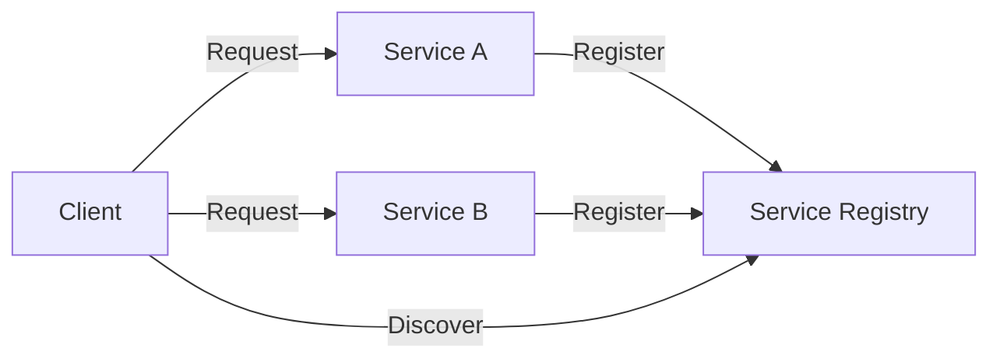

## 11.1 Service Discovery in Clojure

In the realm of microservices, service discovery is a crucial pattern that enables services to dynamically find and communicate with each other in a distributed environment. This article delves into the intricacies of service discovery, focusing on its implementation in Clojure using tools like Consul, etcd, or ZooKeeper. We will explore both client-side and server-side discovery mechanisms, leveraging Clojure libraries to interact with service registries effectively.

### Introduction to Service Discovery

Service discovery is a mechanism that allows microservices to locate each other dynamically without hardcoding network locations. This is essential in a microservices architecture where services are often deployed across multiple hosts and can scale up or down dynamically.

#### Client-Side vs. Server-Side Discovery

- **Client-Side Discovery:** The client is responsible for determining the network locations of available service instances and load balancing requests across them. This approach requires the client to have logic for service discovery and load balancing.
  
- **Server-Side Discovery:** The client makes a request to a load balancer, which queries the service registry and forwards the request to an appropriate service instance. This offloads the discovery and load balancing logic from the client.

### Setting Up a Service Registry

To implement service discovery, we need a service registry where services can register themselves and clients can query for available services. Tools like Consul, etcd, and ZooKeeper are popular choices for service registries.

#### Installing and Configuring Consul

Consul is a widely used service registry that provides service discovery, configuration, and segmentation functionality. To set up Consul:

1. **Download and Install Consul:**
   - Follow the installation instructions on the [Consul website](https://www.consul.io/downloads).

2. **Start the Consul Agent:**
   - Run the Consul agent in development mode for testing purposes:
     ```bash
     consul agent -dev
     ```

3. **Verify Consul is Running:**
   - Access the Consul UI at `http://localhost:8500/ui` to ensure the agent is running.

### Registering Services on Startup

Once Consul is set up, we can register our services using a Clojure client library. The `clj-consul` library provides a convenient way to interact with Consul from Clojure.

#### Registering a Service

```clojure
(require '[clj-consul.client :as consul])

(def consul-client (consul/make-client))

(defn register-service []
  (consul/register-service consul-client
    {:id "service-id"
     :name "service-name"
     :address "127.0.0.1"
     :port 8080}))

;; Call register-service when your service starts
(register-service)
```

### Discovering Services Dynamically

To discover services, clients query the service registry to retrieve the list of available service instances.

#### Querying the Service Registry

```clojure
(defn discover-service [service-name]
  (consul/service consul-client service-name))
```

### Implementing Client-Side Load Balancing

Once we have a list of service instances, we can implement client-side load balancing to distribute requests across them.

#### Selecting a Service Instance

```clojure
(defn get-service-endpoint [service-name]
  (let [instances (discover-service service-name)]
    (if (seq instances)
      (let [instance (rand-nth instances)]
        (str (:address instance) ":" (:port instance)))
      (throw (Exception. "No service instances available")))))
```

### Updating Service Consumers

Service consumers should use the `get-service-endpoint` function to dynamically resolve service endpoints when making requests.

### Handling Service Deregistration

To ensure that services are properly deregistered upon shutdown, we can use a shutdown hook or a `finally` block.

#### Deregistering a Service

```clojure
(defn deregister-service []
  (consul/deregister-service consul-client "service-id"))

;; Use a shutdown hook or finally block to call deregister-service
```

### Visualizing Service Discovery

Below is a conceptual diagram illustrating the service discovery process in a microservices architecture:



### Advantages and Disadvantages

**Advantages:**
- **Dynamic Scaling:** Services can scale dynamically without manual reconfiguration.
- **Fault Tolerance:** Automatically reroute requests if a service instance fails.
- **Decoupling:** Services are decoupled from specific network locations.

**Disadvantages:**
- **Complexity:** Adds complexity to the system with additional components.
- **Latency:** Potential latency in service discovery and load balancing.

### Best Practices

- **Health Checks:** Implement health checks to ensure only healthy instances are registered.
- **Caching:** Cache service discovery results to reduce latency.
- **Security:** Secure communication between services and the registry.

### Conclusion

Service discovery is a fundamental pattern in microservices architectures, enabling dynamic communication and scaling. By leveraging tools like Consul and Clojure libraries, developers can implement robust service discovery mechanisms that enhance the resilience and flexibility of their applications.

## Quiz Time!



### What is the primary purpose of service discovery in microservices?

- [x] To enable services to dynamically find and communicate with each other
- [ ] To hardcode network locations of services
- [ ] To manage database connections
- [ ] To compile Clojure code

> **Explanation:** Service discovery allows microservices to dynamically locate and communicate with each other in a distributed environment.

### Which tool is commonly used for service discovery in Clojure microservices?

- [x] Consul
- [ ] Git
- [ ] Docker
- [ ] Kubernetes

> **Explanation:** Consul is a popular tool for service discovery, providing features like service registration and health checks.

### What is the difference between client-side and server-side service discovery?

- [x] Client-side discovery requires the client to determine service instances, while server-side uses a load balancer.
- [ ] Client-side discovery uses a load balancer, while server-side requires the client to determine service instances.
- [ ] Both are the same.
- [ ] Neither involves a load balancer.

> **Explanation:** In client-side discovery, the client determines service instances, whereas server-side discovery uses a load balancer to route requests.

### How can you register a service in Consul using Clojure?

- [x] By using the `clj-consul` library to register the service
- [ ] By manually editing a configuration file
- [ ] By sending an email to the admin
- [ ] By restarting the service

> **Explanation:** The `clj-consul` library provides functions to register services programmatically in Consul.

### What is a key advantage of using service discovery?

- [x] Dynamic scaling and fault tolerance
- [ ] Increased manual configuration
- [ ] Reduced system complexity
- [ ] Hardcoded network locations

> **Explanation:** Service discovery allows for dynamic scaling and fault tolerance by automatically rerouting requests if a service instance fails.

### Which Clojure function can be used to deregister a service from Consul?

- [x] `deregister-service`
- [ ] `unregister-service`
- [ ] `remove-service`
- [ ] `delete-service`

> **Explanation:** The `deregister-service` function is used to remove a service from Consul.

### What is a potential disadvantage of service discovery?

- [x] Added complexity to the system
- [ ] Reduced fault tolerance
- [ ] Hardcoded service locations
- [ ] Manual scaling

> **Explanation:** Service discovery adds complexity to the system by introducing additional components like service registries.

### How can service consumers dynamically resolve service endpoints?

- [x] By using the `get-service-endpoint` function
- [ ] By hardcoding IP addresses
- [ ] By using a static configuration file
- [ ] By guessing the endpoint

> **Explanation:** The `get-service-endpoint` function dynamically resolves service endpoints by querying the service registry.

### What is a best practice when implementing service discovery?

- [x] Implement health checks for registered services
- [ ] Ignore service health
- [ ] Hardcode service locations
- [ ] Use a single instance for all services

> **Explanation:** Implementing health checks ensures that only healthy service instances are registered and available for discovery.

### True or False: Service discovery is only useful in monolithic architectures.

- [ ] True
- [x] False

> **Explanation:** Service discovery is particularly useful in microservices architectures, where services are distributed and need to dynamically locate each other.


