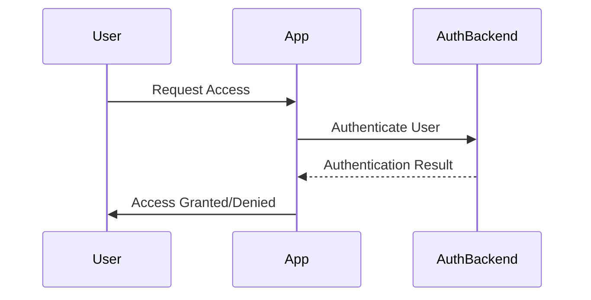

## 11.11. Security and Authentication Integration

In today's digital landscape, ensuring the security of applications is paramount. As developers, we must integrate robust security measures into our applications to protect sensitive data and maintain user trust. This section delves into the essential aspects of security and authentication integration in Clojure applications, focusing on best practices, libraries like Buddy, and strategies for secure user data handling.

### Understanding Security Requirements in Enterprise Applications

Enterprise applications often handle sensitive data, making security a critical concern. Common security requirements include:

- **Authentication**: Verifying the identity of users accessing the system.
- **Authorization**: Determining what authenticated users are allowed to do.
- **Data Encryption**: Protecting data in transit and at rest.
- **Audit Logging**: Keeping records of user actions for accountability.
- **Compliance**: Adhering to industry standards and regulations.

### Authentication and Authorization with Buddy

Buddy is a popular Clojure library that provides a comprehensive suite of tools for authentication and authorization. It supports various authentication methods, including session-based, token-based, and OAuth2.

#### Setting Up Buddy for Authentication

To get started with Buddy, add the following dependency to your `project.clj`:

```clojure
:dependencies [[buddy/buddy-auth "3.0.1"]]
```

##### Example: Implementing Basic Authentication

Let's implement basic authentication using Buddy:

```clojure
(ns myapp.auth
  (:require [buddy.auth :refer [authenticated?]]
            [buddy.auth.middleware :refer [wrap-authentication]]
            [buddy.auth.backends.basic :refer [basic-backend]]))

(defn my-auth-handler [request]
  (if (authenticated? request)
    {:status 200 :body "Welcome!"}
    {:status 401 :body "Unauthorized"}))

(def app
  (wrap-authentication my-auth-handler (basic-backend {:realm "MyApp"})))
```

In this example, we define an authentication handler `my-auth-handler` that checks if a request is authenticated. We use `wrap-authentication` to apply the `basic-backend` authentication strategy.

#### Role-Based Access Control (RBAC)

RBAC is a method of restricting access based on the roles assigned to users. It simplifies management by associating permissions with roles rather than individual users.

##### Implementing RBAC with Buddy

Buddy supports RBAC through its authorization features. Here's how you can implement RBAC:

```clojure
(ns myapp.auth
  (:require [buddy.auth :refer [authenticated?]]
            [buddy.auth.middleware :refer [wrap-authorization]]
            [buddy.auth.accessrules :refer [restrict]]
            [buddy.auth.backends.basic :refer [basic-backend]]))

(defn admin-only [request]
  (if (= (:role (:identity request)) "admin")
    true
    false))

(defn my-admin-handler [request]
  {:status 200 :body "Admin Access Granted"})

(def app
  (-> my-admin-handler
      (restrict {:handler admin-only})
      (wrap-authorization)))
```

In this example, we define an access rule `admin-only` that checks if the user's role is "admin". We use `restrict` to apply this rule to the `my-admin-handler`.

### Best Practices for Handling User Data Securely

Handling user data securely is crucial to prevent data breaches and maintain user trust. Here are some best practices:

- **Encrypt Sensitive Data**: Use encryption for sensitive data both in transit and at rest. Buddy provides tools for encryption and decryption.
- **Use Secure Password Storage**: Store passwords using strong hashing algorithms like bcrypt.
- **Implement Strong Authentication**: Use multi-factor authentication (MFA) to enhance security.
- **Regularly Update Dependencies**: Keep libraries and dependencies up-to-date to mitigate vulnerabilities.
- **Conduct Security Audits**: Regularly audit your application for security vulnerabilities.

#### Example: Encrypting Data with Buddy

Here's how you can encrypt and decrypt data using Buddy:

```clojure
(ns myapp.security
  (:require [buddy.core.crypto :as crypto]))

(def secret-key "my-secret-key")

(defn encrypt-data [data]
  (crypto/encrypt data secret-key))

(defn decrypt-data [encrypted-data]
  (crypto/decrypt encrypted-data secret-key))

;; Usage
(def encrypted (encrypt-data "Sensitive Information"))
(def decrypted (decrypt-data encrypted))
```

### Keeping Up with Security Updates

Security is an ever-evolving field, and staying informed about the latest threats and updates is essential. Here are some strategies:

- **Subscribe to Security Bulletins**: Follow security bulletins from libraries and frameworks you use.
- **Participate in Security Communities**: Engage with security communities to share knowledge and stay updated.
- **Automate Security Scans**: Use tools to automate security scans and identify vulnerabilities.

### Visualizing Security Integration

To better understand the flow of security integration in a Clojure application, let's visualize the process using a sequence diagram:



**Diagram Description**: This sequence diagram illustrates the authentication process in a Clojure application. The user requests access, the application authenticates the user via the authentication backend, and then grants or denies access based on the authentication result.

### Conclusion

Integrating security and authentication into your Clojure applications is a critical step in building robust and trustworthy software. By leveraging libraries like Buddy and following best practices, you can ensure that your applications are secure and compliant with industry standards. Remember, security is an ongoing process, and staying informed about the latest developments is key to maintaining a secure application.

### External Links

- [Buddy Authentication](https://funcool.github.io/buddy-auth/latest/)

## **Ready to Test Your Knowledge?**



### What is the primary purpose of authentication in enterprise applications?

- [x] Verifying the identity of users accessing the system
- [ ] Encrypting data in transit
- [ ] Logging user actions
- [ ] Managing user roles

> **Explanation:** Authentication is primarily about verifying the identity of users accessing the system.

### Which Clojure library is commonly used for authentication and authorization?

- [x] Buddy
- [ ] Ring
- [ ] Compojure
- [ ] Aleph

> **Explanation:** Buddy is a popular Clojure library for authentication and authorization.

### What is the role of RBAC in security?

- [x] Restricting access based on user roles
- [ ] Encrypting sensitive data
- [ ] Logging user actions
- [ ] Managing user sessions

> **Explanation:** RBAC (Role-Based Access Control) restricts access based on user roles.

### Which function in Buddy is used to apply authentication middleware?

- [x] wrap-authentication
- [ ] wrap-authorization
- [ ] restrict
- [ ] authenticated?

> **Explanation:** `wrap-authentication` is used to apply authentication middleware in Buddy.

### What is a best practice for storing passwords securely?

- [x] Use strong hashing algorithms like bcrypt
- [ ] Store passwords in plain text
- [ ] Use simple encryption
- [ ] Store passwords in cookies

> **Explanation:** Using strong hashing algorithms like bcrypt is a best practice for storing passwords securely.

### Why is it important to regularly update dependencies?

- [x] To mitigate vulnerabilities
- [ ] To improve performance
- [ ] To reduce code complexity
- [ ] To enhance user experience

> **Explanation:** Regularly updating dependencies helps mitigate vulnerabilities.

### What does the `restrict` function in Buddy do?

- [x] Applies access rules to handlers
- [ ] Encrypts sensitive data
- [ ] Logs user actions
- [ ] Manages user sessions

> **Explanation:** The `restrict` function applies access rules to handlers in Buddy.

### Which of the following is a common security requirement in enterprise applications?

- [x] Data Encryption
- [ ] User Interface Design
- [ ] Performance Optimization
- [ ] Code Refactoring

> **Explanation:** Data encryption is a common security requirement in enterprise applications.

### What is the purpose of audit logging?

- [x] Keeping records of user actions for accountability
- [ ] Encrypting data in transit
- [ ] Managing user sessions
- [ ] Enhancing user experience

> **Explanation:** Audit logging keeps records of user actions for accountability.

### True or False: Security is a one-time setup process.

- [ ] True
- [x] False

> **Explanation:** Security is an ongoing process, not a one-time setup.



Remember, this is just the beginning. As you progress, you'll build more secure and robust applications. Keep experimenting, stay curious, and enjoy the journey!
