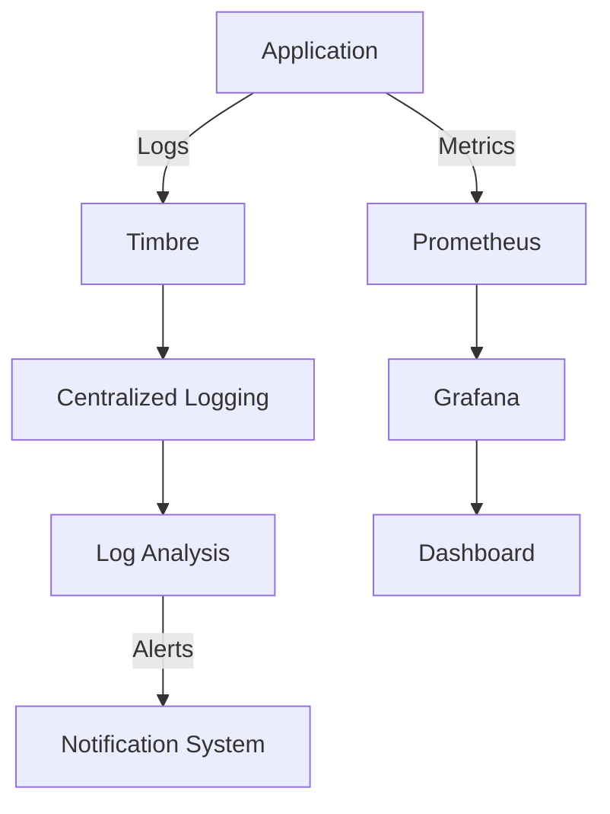

## 11.12. Monitoring and Logging Strategies

In the realm of enterprise software development, ensuring the reliability and performance of applications is paramount. Monitoring and logging are critical components of observability, enabling developers to gain insights into application behavior, diagnose issues, and maintain system health. In this section, we will delve into the strategies for effective monitoring and logging in Clojure applications, exploring tools, best practices, and implementation techniques.

### The Importance of Observability

Observability refers to the ability to understand the internal state of a system based on the data it produces. This concept is crucial for diagnosing issues, optimizing performance, and ensuring that applications meet their service level agreements (SLAs). Observability is typically achieved through three pillars: logging, metrics, and tracing.

- **Logging**: Captures detailed information about application events, errors, and user interactions.
- **Metrics**: Provides quantitative data on system performance, such as response times, error rates, and resource utilization.
- **Tracing**: Tracks the flow of requests through distributed systems, helping to identify bottlenecks and dependencies.

### Logging in Clojure with Timbre

Logging is a fundamental aspect of observability, providing a record of application events that can be used for debugging and auditing. In Clojure, the Timbre library is a popular choice for logging due to its simplicity and flexibility.

#### Introduction to Timbre

[Timbre](https://github.com/ptaoussanis/timbre) is a Clojure logging library that offers a rich set of features, including asynchronous logging, dynamic log levels, and support for various output formats. It is designed to be easy to use and integrate into Clojure applications.

#### Setting Up Timbre

To get started with Timbre, add it to your project dependencies:

```clojure
;; project.clj
:dependencies [[com.taoensso/timbre "5.1.2"]]
```

Next, configure Timbre in your application:

```clojure
(ns myapp.core
  (:require [taoensso.timbre :as timbre]))

;; Configure Timbre
(timbre/set-config!
 {:level :info
  :appenders {:console (timbre/console-appender)}})

;; Log a message
(timbre/info "Application started successfully.")
```

#### Structured Logging

Structured logging involves capturing log data in a structured format, such as JSON, which makes it easier to parse and analyze. Timbre supports structured logging through custom appenders.

```clojure
(defn json-appender []
  (timbre/make-appender
   {:enabled? true
    :async? false
    :min-level nil
    :output-fn (fn [{:keys [level msg_]}]
                 (str (json/write-str {:level level :message (msg_)})
                      "\n"))}))

(timbre/set-config!
 {:appenders {:json (json-appender)}})

(timbre/info "Structured logging example.")
```

### Metrics Collection and Monitoring

Metrics provide quantitative insights into application performance and resource usage. They are essential for proactive monitoring and alerting. Prometheus and Grafana are widely used tools for metrics collection and visualization.

#### Prometheus and Grafana

- **Prometheus**: An open-source monitoring system that collects metrics from configured targets at specified intervals, evaluates rule expressions, and can trigger alerts based on conditions.
- **Grafana**: A visualization tool that integrates with Prometheus to create dashboards and graphs for monitoring metrics.

#### Integrating Prometheus with Clojure

To integrate Prometheus with a Clojure application, you can use the `io.prometheus.client` library to expose metrics.

```clojure
(ns myapp.metrics
  (:require [io.prometheus.client :as prom]))

(def request-counter (prom/counter "http_requests_total" "Total HTTP requests."))

(defn record-request []
  (prom/inc request-counter))
```

Expose the metrics endpoint in your application:

```clojure
(ns myapp.server
  (:require [ring.adapter.jetty :refer [run-jetty]]
            [ring.middleware.defaults :refer [wrap-defaults site-defaults]]
            [io.prometheus.client.exporter :refer [HTTPServer]]))

(defn start-metrics-server []
  (HTTPServer. 8081))

(defn -main []
  (start-metrics-server)
  (run-jetty (wrap-defaults #'myapp.handler/app site-defaults) {:port 3000}))
```

### Best Practices for Logging and Monitoring

Implementing effective logging and monitoring strategies involves adhering to best practices that ensure data is actionable and systems are maintainable.

#### Log Management

- **Log Levels**: Use appropriate log levels (e.g., debug, info, warn, error) to categorize log messages by severity.
- **Log Rotation**: Implement log rotation to manage disk space and archive old logs.
- **Centralized Logging**: Use centralized logging solutions like ELK Stack (Elasticsearch, Logstash, Kibana) for aggregating and analyzing logs from multiple sources.

#### Alerting

- **Threshold-Based Alerts**: Set alerts based on predefined thresholds for metrics like CPU usage, memory consumption, and error rates.
- **Anomaly Detection**: Use machine learning techniques to detect anomalies in metrics and trigger alerts.
- **Notification Channels**: Integrate alerting with notification channels like email, Slack, or PagerDuty for timely response.

### Visualizing Monitoring and Logging Architecture

To better understand the flow of monitoring and logging in a Clojure application, let's visualize the architecture using a Mermaid.js diagram.



**Diagram Description**: This diagram illustrates the flow of logs and metrics in a Clojure application. Logs are captured by Timbre and sent to a centralized logging system for analysis. Metrics are collected by Prometheus and visualized in Grafana dashboards. Alerts are generated based on log analysis and metric thresholds, notifying the appropriate channels.

### Try It Yourself

Experiment with the provided code examples by modifying log levels, adding custom appenders, or integrating additional metrics. Consider setting up a local Prometheus and Grafana instance to visualize metrics from your Clojure application.

### Knowledge Check

To reinforce your understanding of monitoring and logging strategies, try answering the following questions:

1. What are the three pillars of observability?
2. How does structured logging differ from traditional logging?
3. What role does Prometheus play in monitoring?
4. Why is centralized logging important in enterprise systems?
5. How can anomaly detection improve alerting?

### Summary

In this section, we've explored the importance of monitoring and logging in Clojure applications, introduced tools like Timbre, Prometheus, and Grafana, and discussed best practices for log management and alerting. By implementing these strategies, you can ensure your applications are robust, reliable, and easy to maintain.

## **Ready to Test Your Knowledge?**



### What are the three pillars of observability?

- [x] Logging, Metrics, Tracing
- [ ] Logging, Monitoring, Debugging
- [ ] Metrics, Debugging, Tracing
- [ ] Logging, Debugging, Monitoring

> **Explanation:** The three pillars of observability are logging, metrics, and tracing, which together provide a comprehensive view of system behavior.

### How does structured logging differ from traditional logging?

- [x] Structured logging captures data in a structured format like JSON.
- [ ] Structured logging uses plain text for logs.
- [ ] Structured logging is only for error messages.
- [ ] Structured logging does not support log levels.

> **Explanation:** Structured logging captures log data in a structured format such as JSON, making it easier to parse and analyze compared to traditional plain text logs.

### What role does Prometheus play in monitoring?

- [x] Collects and stores metrics
- [ ] Visualizes metrics
- [ ] Sends notifications
- [ ] Manages log files

> **Explanation:** Prometheus is a monitoring system that collects and stores metrics from configured targets, enabling analysis and alerting.

### Why is centralized logging important in enterprise systems?

- [x] Aggregates logs from multiple sources for analysis
- [ ] Increases log file size
- [ ] Reduces the need for log rotation
- [ ] Eliminates the need for log levels

> **Explanation:** Centralized logging aggregates logs from multiple sources, making it easier to analyze and manage logs across distributed systems.

### How can anomaly detection improve alerting?

- [x] By identifying unusual patterns in metrics
- [ ] By reducing the number of alerts
- [ ] By increasing log verbosity
- [ ] By disabling alerts during maintenance

> **Explanation:** Anomaly detection identifies unusual patterns in metrics, allowing for more accurate and timely alerts compared to threshold-based alerting alone.

### What is the primary function of Grafana in monitoring?

- [x] Visualizing metrics
- [ ] Collecting metrics
- [ ] Sending alerts
- [ ] Managing log files

> **Explanation:** Grafana is a visualization tool that integrates with monitoring systems like Prometheus to create dashboards and graphs for metrics.

### Which library is commonly used for logging in Clojure?

- [x] Timbre
- [ ] Logback
- [ ] SLF4J
- [ ] Log4j

> **Explanation:** Timbre is a popular logging library in Clojure, known for its simplicity and flexibility.

### What is the benefit of using log levels?

- [x] Categorizes log messages by severity
- [ ] Increases log file size
- [ ] Reduces the need for structured logging
- [ ] Eliminates the need for log rotation

> **Explanation:** Log levels categorize log messages by severity, helping developers focus on the most critical issues.

### How can you expose metrics in a Clojure application for Prometheus?

- [x] By using the `io.prometheus.client` library
- [ ] By writing metrics to a log file
- [ ] By sending metrics via email
- [ ] By integrating with Grafana directly

> **Explanation:** The `io.prometheus.client` library is used to expose metrics in a Clojure application for Prometheus to collect.

### True or False: Anomaly detection can replace threshold-based alerting entirely.

- [ ] True
- [x] False

> **Explanation:** Anomaly detection complements threshold-based alerting by identifying unusual patterns, but it does not entirely replace the need for predefined thresholds.



Remember, this is just the beginning. As you progress, you'll build more complex and interactive monitoring and logging systems. Keep experimenting, stay curious, and enjoy the journey!
