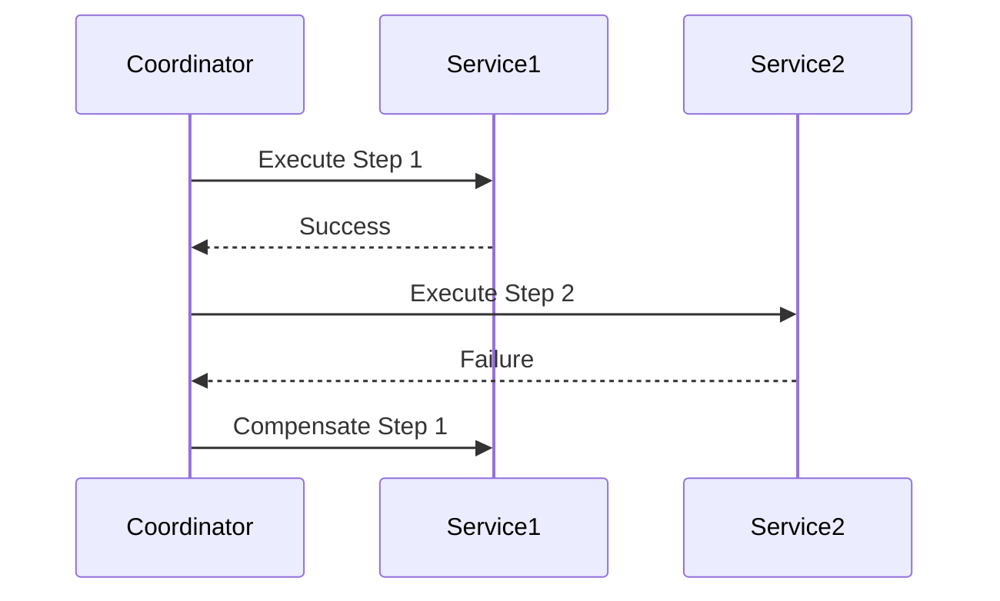
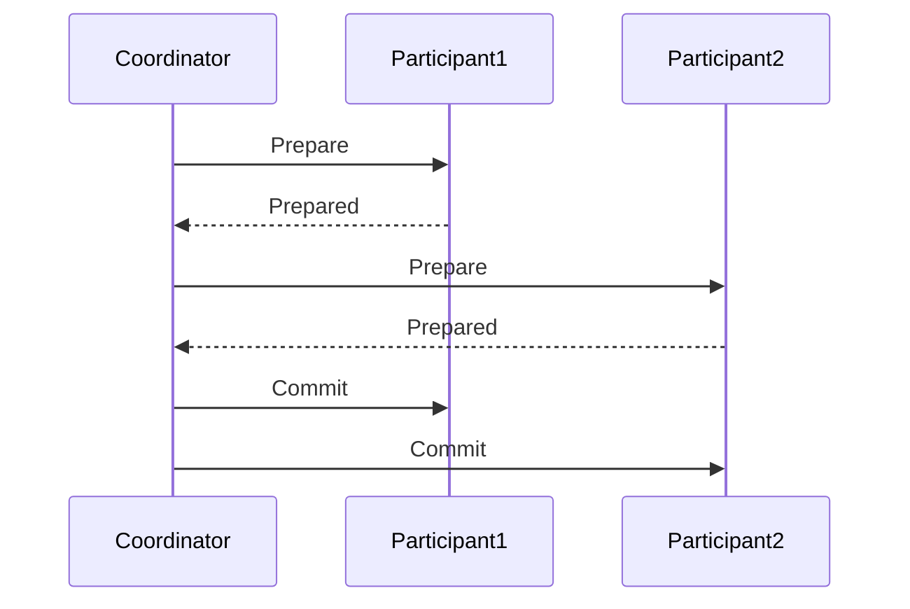

## 11.13. Patterns for Data Consistency

In the realm of distributed systems, ensuring data consistency is a complex yet crucial task. As systems scale and become more distributed, maintaining a consistent state across various nodes and services becomes challenging. This section delves into the patterns and strategies used to achieve data consistency in distributed systems, with a focus on Clojure implementations.

### Understanding the Challenges of Data Consistency

Distributed systems inherently face challenges in maintaining data consistency due to factors like network latency, partitioning, and node failures. The CAP theorem, which states that a distributed data store can only provide two out of the following three guarantees—Consistency, Availability, and Partition tolerance—highlights the trade-offs involved.

#### CAP Theorem

- **Consistency**: Every read receives the most recent write.
- **Availability**: Every request receives a response, without guarantee that it contains the most recent write.
- **Partition Tolerance**: The system continues to operate despite arbitrary partitioning due to network failures.

Understanding these trade-offs is essential when designing systems that require data consistency.

### Patterns for Data Consistency

Several patterns have emerged to address the challenges of data consistency in distributed systems. We will explore some of the most prominent ones, including the Saga pattern, Two-Phase Commit, and Idempotent operations.

#### Saga Pattern

The Saga pattern is a design pattern that provides a way to manage long-running transactions in a distributed system. Instead of using a single transaction that spans multiple services, the Saga pattern breaks it down into a series of smaller transactions that are coordinated to achieve the desired outcome.

##### Key Participants

- **Coordinator**: Manages the execution of the saga.
- **Participants**: Individual services that execute a part of the saga.

##### Applicability

- Use when you need to manage distributed transactions without locking resources for extended periods.
- Suitable for systems where eventual consistency is acceptable.

##### Sample Code Snippet

```clojure
(defn execute-saga [steps]
  (try
    (doseq [step steps]
      (step))
    (catch Exception e
      (println "Saga failed, compensating...")
      (doseq [step (reverse steps)]
        (compensate step)))))

(defn step1 []
  (println "Executing step 1")
  ;; perform operation
  )

(defn step2 []
  (println "Executing step 2")
  ;; perform operation
  )

(defn compensate [step]
  (println "Compensating step" step)
  ;; perform compensation
  )

(execute-saga [step1 step2])
```

##### Design Considerations

- Ensure each step in the saga is idempotent to handle retries.
- Design compensation logic to revert changes in case of failure.

#### Two-Phase Commit (2PC)

The Two-Phase Commit protocol is a distributed algorithm that ensures all participants in a transaction agree on the outcome (commit or abort) before the transaction is finalized.

##### Key Participants

- **Coordinator**: Initiates and manages the commit process.
- **Participants**: Services that need to agree on the transaction outcome.

##### Applicability

- Use when strong consistency is required across distributed services.
- Suitable for systems where availability can be sacrificed for consistency.

##### Sample Code Snippet

```clojure
(defn prepare-phase [participants]
  (doseq [participant participants]
    (if-not (prepare participant)
      (throw (Exception. "Prepare failed")))))

(defn commit-phase [participants]
  (doseq [participant participants]
    (commit participant)))

(defn two-phase-commit [participants]
  (try
    (prepare-phase participants)
    (commit-phase participants)
    (catch Exception e
      (println "Transaction aborted"))))

(defn prepare [participant]
  (println "Preparing" participant)
  ;; simulate preparation
  true)

(defn commit [participant]
  (println "Committing" participant)
  ;; simulate commit
  )
```

##### Design Considerations

- Be aware of the blocking nature of 2PC, which can lead to reduced availability.
- Handle failures gracefully to avoid leaving participants in an inconsistent state.

#### Idempotent Operations

Idempotent operations are operations that can be applied multiple times without changing the result beyond the initial application. This property is crucial in distributed systems to handle retries and ensure consistency.

##### Applicability

- Use when operations may be retried due to network failures or timeouts.
- Suitable for systems where operations need to be repeatable without side effects.

##### Sample Code Snippet

```clojure
(defn update-account-balance [account-id amount]
  (let [current-balance (get-balance account-id)]
    (if (not= current-balance amount)
      (set-balance account-id amount))))

(defn get-balance [account-id]
  ;; retrieve balance from database
  100)

(defn set-balance [account-id amount]
  (println "Setting balance for" account-id "to" amount)
  ;; update balance in database
  )
```

##### Design Considerations

- Ensure operations are designed to be idempotent by checking the current state before applying changes.
- Use unique identifiers for requests to prevent duplicate processing.

### Trade-offs Between Consistency and Availability

When designing distributed systems, it's essential to balance consistency and availability based on the system's requirements. The CAP theorem provides a framework for understanding these trade-offs, but practical considerations often dictate the choice of patterns and strategies.

#### Eventual Consistency

Eventual consistency is a consistency model used in distributed computing to achieve high availability. It guarantees that, given enough time, all replicas will converge to the same value.

##### Applicability

- Use when high availability is more critical than immediate consistency.
- Suitable for systems where temporary inconsistencies are acceptable.

##### Sample Code Snippet

```clojure
(defn update-replica [replica value]
  (println "Updating replica" replica "to" value)
  ;; simulate update
  )

(defn replicate-data [replicas value]
  (doseq [replica replicas]
    (future (update-replica replica value))))

(replicate-data ["replica1" "replica2" "replica3"] 42)
```

##### Design Considerations

- Design systems to handle temporary inconsistencies gracefully.
- Use mechanisms like versioning or conflict resolution to ensure eventual convergence.

### Visualizing Data Consistency Patterns

To better understand the flow and interactions in these patterns, let's visualize them using Mermaid.js diagrams.

#### Saga Pattern Flow



#### Two-Phase Commit Flow



### References and Further Reading

- [CAP Theorem](https://en.wikipedia.org/wiki/CAP_theorem)
- [Distributed Systems: Principles and Paradigms](https://www.amazon.com/Distributed-Systems-Principles-Paradigms-2nd/dp/0132392273)
- [Designing Data-Intensive Applications](https://www.oreilly.com/library/view/designing-data-intensive-applications/9781491903063/)

### Knowledge Check

To reinforce your understanding of data consistency patterns, consider the following questions and exercises.

## **Ready to Test Your Knowledge?**



### What is the primary trade-off highlighted by the CAP theorem?

- [x] Consistency vs. Availability
- [ ] Consistency vs. Scalability
- [ ] Availability vs. Security
- [ ] Scalability vs. Security

> **Explanation:** The CAP theorem highlights the trade-off between Consistency, Availability, and Partition tolerance in distributed systems.

### Which pattern is suitable for managing long-running transactions in distributed systems?

- [x] Saga Pattern
- [ ] Two-Phase Commit
- [ ] Idempotent Operations
- [ ] Eventual Consistency

> **Explanation:** The Saga pattern is designed for managing long-running transactions by breaking them into smaller, coordinated transactions.

### What is a key characteristic of idempotent operations?

- [x] They can be applied multiple times without changing the result.
- [ ] They require locking resources.
- [ ] They are always eventually consistent.
- [ ] They depend on network latency.

> **Explanation:** Idempotent operations can be repeated multiple times without affecting the outcome beyond the initial application.

### In the Two-Phase Commit protocol, what is the role of the coordinator?

- [x] To manage the commit process and ensure all participants agree on the outcome.
- [ ] To execute compensation logic in case of failure.
- [ ] To handle network partitioning.
- [ ] To ensure high availability.

> **Explanation:** The coordinator in the Two-Phase Commit protocol manages the commit process and ensures all participants agree on the transaction outcome.

### Which consistency model guarantees that all replicas will eventually converge to the same value?

- [x] Eventual Consistency
- [ ] Strong Consistency
- [ ] Weak Consistency
- [ ] Causal Consistency

> **Explanation:** Eventual consistency guarantees that, given enough time, all replicas will converge to the same value.

### What is a potential drawback of the Two-Phase Commit protocol?

- [x] It can lead to reduced availability due to its blocking nature.
- [ ] It does not guarantee consistency.
- [ ] It is not suitable for distributed systems.
- [ ] It requires eventual consistency.

> **Explanation:** The Two-Phase Commit protocol can lead to reduced availability because it is blocking and waits for all participants to agree.

### How can temporary inconsistencies be handled in systems using eventual consistency?

- [x] By designing systems to handle inconsistencies gracefully and using conflict resolution.
- [ ] By ensuring strong consistency at all times.
- [ ] By avoiding network partitioning.
- [ ] By using the Two-Phase Commit protocol.

> **Explanation:** Systems using eventual consistency should be designed to handle temporary inconsistencies gracefully and use conflict resolution mechanisms.

### What is the primary goal of the Saga pattern?

- [x] To manage distributed transactions without locking resources for extended periods.
- [ ] To ensure strong consistency across all services.
- [ ] To provide high availability.
- [ ] To handle network failures.

> **Explanation:** The Saga pattern aims to manage distributed transactions by breaking them into smaller, coordinated transactions without locking resources.

### Which of the following is NOT a key participant in the Saga pattern?

- [x] Network Partition
- [ ] Coordinator
- [ ] Participants
- [ ] Compensation Logic

> **Explanation:** Network Partition is not a participant in the Saga pattern; it is a factor considered in the CAP theorem.

### True or False: Idempotent operations are crucial for handling retries in distributed systems.

- [x] True
- [ ] False

> **Explanation:** Idempotent operations are crucial in distributed systems to handle retries without causing unintended side effects.



### Embrace the Journey

Remember, mastering data consistency patterns in distributed systems is a journey. As you continue to explore and implement these patterns, you'll gain a deeper understanding of the trade-offs and considerations involved. Keep experimenting, stay curious, and enjoy the process of building robust and reliable distributed systems with Clojure!
