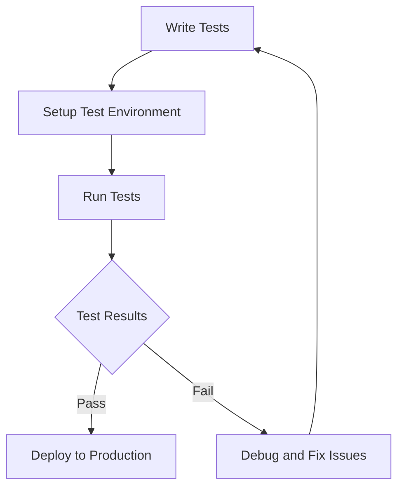

## 11.14. Integration Testing

Integration testing plays a crucial role in the software development lifecycle, ensuring that different components of an application work together seamlessly. In Clojure, a language known for its functional programming paradigm and immutable data structures, integration testing ensures that the various parts of your application interact correctly, providing a robust and reliable system. In this section, we'll explore the strategies and best practices for integration testing in Clojure, using tools like `clojure.test` and Midje, and discuss the importance of automated and repeatable tests.

### The Role of Integration Testing in Development

Integration testing is a level of software testing where individual units are combined and tested as a group. The primary goal is to identify any issues that may arise when different modules interact. This type of testing is essential because:

- **Detects Interface Defects**: Integration testing helps identify defects in the interfaces and interactions between integrated components or systems.
- **Ensures Component Compatibility**: It ensures that different components or systems work together as expected.
- **Facilitates System Testing**: It acts as a precursor to system testing, ensuring that the integrated components are ready for higher-level testing.
- **Reduces Risk**: By catching integration issues early, it reduces the risk of defects in the production environment.

### Setting Up Test Environments

A well-configured test environment is crucial for effective integration testing. Here are some strategies for setting up your test environment:

1. **Isolation**: Ensure that the test environment is isolated from the production environment to prevent any unintended interactions or data corruption.
   
2. **Consistency**: The test environment should mimic the production environment as closely as possible to ensure that test results are reliable and applicable to real-world scenarios.

3. **Automation**: Automate the setup and teardown of your test environment to ensure consistency and repeatability. Tools like Docker can be used to create containerized environments that are easy to manage and replicate.

4. **Data Management**: Use a consistent set of test data that covers various scenarios. This data should be reset before each test run to ensure tests are not affected by previous runs.

### Integration Testing with `clojure.test`

`clojure.test` is the standard testing library in Clojure, providing a simple and effective way to write and run tests. Here's how you can use `clojure.test` for integration testing:

```clojure
(ns myapp.integration-test
  (:require [clojure.test :refer :all]
            [myapp.core :as core]))

(deftest test-integration
  (testing "Integration of component A and B"
    (let [result (core/integrate-components)]
      (is (= expected-result result)))))
```

- **Setup and Teardown**: Use `use-fixtures` to set up and tear down your test environment. This ensures that each test runs in a clean state.

```clojure
(use-fixtures :each
  (fn [f]
    (setup-test-environment)
    (f)
    (teardown-test-environment)))
```

### Integration Testing with Midje

Midje is another popular testing framework in Clojure, known for its expressive syntax and support for behavior-driven development (BDD). Here's how you can use Midje for integration testing:

```clojure
(ns myapp.integration-test
  (:require [midje.sweet :refer :all]
            [myapp.core :as core]))

(fact "Integration of component A and B"
  (core/integrate-components) => expected-result)
```

- **Facts and Checks**: Midje uses `fact` and `check` constructs to define tests, making it easy to express expectations in a readable format.

### Using Mocks and Stubs

Mocks and stubs are essential tools in integration testing, allowing you to simulate the behavior of external systems and isolate the components under test.

- **Mocks**: Use mocks to simulate the behavior of external systems. This is particularly useful when testing components that interact with third-party services.

```clojure
(with-redefs [external-service (fn [_] mock-response)]
  (is (= expected-result (core/function-under-test))))
```

- **Stubs**: Use stubs to provide predefined responses to function calls. This helps isolate the component under test from its dependencies.

```clojure
(with-redefs [dependent-function (fn [_] stub-response)]
  (is (= expected-result (core/function-under-test))))
```

### Automated and Repeatable Tests

Automated and repeatable tests are crucial for maintaining the reliability and efficiency of your integration testing process.

- **Continuous Integration (CI)**: Integrate your tests into a CI pipeline to ensure they are run automatically on every code change. This helps catch integration issues early in the development process.

- **Test Coverage**: Aim for high test coverage to ensure that all critical paths and interactions are tested. Use tools like Cloverage to measure and improve your test coverage.

- **Repeatability**: Ensure that your tests are repeatable by using consistent test data and environment setups. This helps identify flaky tests and ensures reliable test results.

### Visualizing Integration Testing Workflow

To better understand the integration testing workflow, let's visualize the process using a Mermaid.js flowchart:



**Figure 1**: Integration Testing Workflow

This flowchart illustrates the typical workflow for integration testing, highlighting the iterative nature of testing and debugging.

### Key Takeaways

- Integration testing is essential for ensuring that different components of your application work together seamlessly.
- A well-configured test environment is crucial for reliable and repeatable test results.
- Use `clojure.test` and Midje for writing expressive and effective integration tests.
- Mocks and stubs are valuable tools for isolating components and simulating external systems.
- Automated and repeatable tests are key to maintaining the reliability and efficiency of your testing process.

### Try It Yourself

Now that we've covered the basics of integration testing in Clojure, try writing your own integration tests using `clojure.test` or Midje. Experiment with different setups and configurations to see how they affect your test results. Remember, the key to effective integration testing is consistency and repeatability.

## **Ready to Test Your Knowledge?**



### What is the primary goal of integration testing?

- [x] To identify issues in the interaction between components
- [ ] To test individual units in isolation
- [ ] To ensure code coverage
- [ ] To optimize performance

> **Explanation:** Integration testing focuses on identifying issues that arise when different components interact with each other.

### Which Clojure testing framework is known for its expressive syntax and BDD support?

- [ ] clojure.test
- [x] Midje
- [ ] Speclj
- [ ] Test.check

> **Explanation:** Midje is known for its expressive syntax and support for behavior-driven development (BDD).

### What is the purpose of using mocks in integration testing?

- [x] To simulate the behavior of external systems
- [ ] To test the performance of the system
- [ ] To measure code coverage
- [ ] To optimize memory usage

> **Explanation:** Mocks are used to simulate the behavior of external systems, allowing you to isolate the component under test.

### What tool can be used to automate the setup and teardown of test environments?

- [x] Docker
- [ ] Git
- [ ] Maven
- [ ] Gradle

> **Explanation:** Docker can be used to create containerized environments that are easy to manage and replicate.

### Which of the following is a benefit of automated tests?

- [x] They ensure consistency and repeatability
- [ ] They require manual intervention
- [ ] They are only run once
- [ ] They are not suitable for CI pipelines

> **Explanation:** Automated tests ensure consistency and repeatability, making them ideal for CI pipelines.

### What is the role of `use-fixtures` in `clojure.test`?

- [x] To set up and tear down the test environment
- [ ] To measure code coverage
- [ ] To simulate external systems
- [ ] To optimize performance

> **Explanation:** `use-fixtures` is used to set up and tear down the test environment, ensuring each test runs in a clean state.

### Which tool can be used to measure test coverage in Clojure?

- [x] Cloverage
- [ ] Leiningen
- [ ] Gradle
- [ ] Docker

> **Explanation:** Cloverage is a tool used to measure test coverage in Clojure.

### What is the benefit of using stubs in integration testing?

- [x] To provide predefined responses to function calls
- [ ] To measure code coverage
- [ ] To optimize performance
- [ ] To simulate user interactions

> **Explanation:** Stubs provide predefined responses to function calls, helping isolate the component under test.

### What is the purpose of a CI pipeline in integration testing?

- [x] To run tests automatically on every code change
- [ ] To manually test the application
- [ ] To optimize memory usage
- [ ] To deploy code to production

> **Explanation:** A CI pipeline runs tests automatically on every code change, helping catch integration issues early.

### True or False: Integration testing should be done in the production environment.

- [ ] True
- [x] False

> **Explanation:** Integration testing should be done in an isolated test environment to prevent any unintended interactions or data corruption.



Remember, integration testing is a vital part of the development process, ensuring that your application components work together seamlessly. Keep experimenting, stay curious, and enjoy the journey of mastering integration testing in Clojure!
