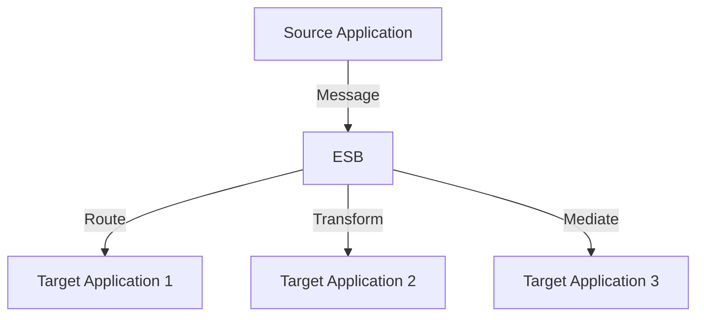

## 11.15. Enterprise Service Bus (ESB) Patterns

In the realm of enterprise software architecture, the Enterprise Service Bus (ESB) plays a pivotal role in facilitating communication and integration between disparate applications and services. This section delves into the concept of ESBs, explores common patterns such as routing, transformation, and mediation, and provides practical examples of implementing ESB functionalities using Clojure. We will also discuss the impact of the shift towards microservices on ESB usage and weigh the pros and cons of ESBs in modern architectures.

### What is an Enterprise Service Bus (ESB)?

An Enterprise Service Bus (ESB) is a software architecture model used for designing and implementing the interaction and communication between mutually interacting software applications in a service-oriented architecture (SOA). It acts as a middleware that provides the necessary infrastructure to enable different applications to communicate with each other, regardless of the platform or technology they are built on.

#### Role of ESB in Integration

The primary role of an ESB is to facilitate seamless integration by providing a common communication layer that connects various applications and services. It abstracts the complexity of communication protocols, message formats, and routing logic, allowing developers to focus on business logic rather than integration details.

### Key ESB Patterns

ESBs employ several patterns to achieve integration, including routing, transformation, and mediation. Let's explore each of these patterns in detail.

#### Routing

Routing is the process of determining the path that a message should take through the system. In an ESB, routing can be based on message content, headers, or other criteria. This pattern ensures that messages are delivered to the correct destination based on predefined rules.

**Example: Content-Based Routing in Clojure**

```clojure
(defn route-message [message]
  (cond
    (= (:type message) "order") (send-to-order-service message)
    (= (:type message) "invoice") (send-to-invoice-service message)
    :else (send-to-default-service message)))

(defn send-to-order-service [message]
  ;; Logic to send message to order service
  )

(defn send-to-invoice-service [message]
  ;; Logic to send message to invoice service
  )

(defn send-to-default-service [message]
  ;; Logic to send message to default service
  )
```

In this example, we use Clojure's `cond` function to implement content-based routing. Messages are routed to different services based on their type.

#### Transformation

Transformation involves converting a message from one format to another. This pattern is crucial when integrating systems that use different data formats or protocols.

**Example: Message Transformation in Clojure**

```clojure
(defn transform-message [message]
  (let [transformed-data (-> message
                             (assoc :new-key (get message :old-key))
                             (dissoc :old-key))]
    transformed-data))

(defn process-message [message]
  (let [transformed-message (transform-message message)]
    ;; Further processing of the transformed message
    ))
```

Here, we demonstrate a simple transformation where a message's key is changed. The `assoc` and `dissoc` functions are used to modify the message structure.

#### Mediation

Mediation involves managing the interaction between services, often by coordinating multiple service calls to achieve a business goal. This pattern can include tasks such as message enrichment, aggregation, and splitting.

**Example: Message Mediation in Clojure**

```clojure
(defn enrich-message [message]
  (assoc message :enriched-data (fetch-additional-data (:id message))))

(defn aggregate-messages [messages]
  (reduce (fn [acc msg] (merge acc msg)) {} messages))

(defn mediate-message-flow [messages]
  (let [enriched-messages (map enrich-message messages)
        aggregated-message (aggregate-messages enriched-messages)]
    ;; Further processing of the aggregated message
    ))
```

In this example, we enrich messages by fetching additional data and then aggregate multiple messages into a single message for further processing.

### Implementing ESB Functionalities with Clojure

Clojure, with its functional programming paradigm and rich set of libraries, is well-suited for implementing ESB functionalities. Its immutable data structures and powerful concurrency models make it ideal for building robust and scalable integration solutions.

#### Using Clojure for ESB

Clojure's interoperability with Java allows it to leverage existing ESB frameworks and libraries, such as Apache Camel or Mule ESB, while providing the flexibility to implement custom integration logic.

**Example: Integrating with Apache Camel**

```clojure
(ns my-esb.core
  (:import [org.apache.camel.builder RouteBuilder]
           [org.apache.camel.impl DefaultCamelContext]))

(defn create-route []
  (proxy [RouteBuilder] []
    (configure []
      (-> this
          (.from "direct:start")
          (.to "log:my-log")))))

(defn start-camel-context []
  (let [context (DefaultCamelContext.)]
    (.addRoutes context (create-route))
    (.start context)))

(start-camel-context)
```

In this example, we use Apache Camel to define a simple route that logs messages. Clojure's `proxy` is used to extend the `RouteBuilder` class and define the route configuration.

### The Shift Towards Microservices

The rise of microservices architecture has influenced the role of ESBs in modern software development. Microservices promote decentralized and independent services, which can reduce the need for a centralized ESB. However, ESBs can still play a role in managing communication and integration between microservices.

#### Impact on ESB Usage

- **Decentralization**: Microservices encourage decentralized communication, often using lightweight protocols like HTTP/REST or messaging systems like Kafka.
- **Flexibility**: ESBs can provide flexibility in integrating legacy systems with modern microservices.
- **Complexity**: The complexity of managing an ESB can be a drawback in microservices architectures, where simplicity and independence are valued.

### Pros and Cons of ESBs in Modern Architectures

#### Pros

- **Centralized Control**: ESBs provide a centralized point for managing integration logic, making it easier to implement changes and monitor communication.
- **Protocol Abstraction**: They abstract the complexity of different communication protocols, allowing developers to focus on business logic.
- **Scalability**: ESBs can handle large volumes of messages and scale to meet enterprise demands.

#### Cons

- **Complexity**: Implementing and managing an ESB can introduce additional complexity, especially in microservices architectures.
- **Single Point of Failure**: A centralized ESB can become a single point of failure if not properly managed.
- **Performance Overhead**: The additional layer of communication can introduce latency and performance overhead.

### Conclusion

Enterprise Service Bus (ESB) patterns play a crucial role in integrating applications and services within an enterprise. While the shift towards microservices has influenced the role of ESBs, they remain a valuable tool for managing complex integration scenarios. By leveraging Clojure's functional programming capabilities and interoperability with Java, developers can implement robust and scalable ESB solutions.

### Try It Yourself

Experiment with the provided Clojure code examples by modifying the routing logic, transformation rules, or mediation processes. Consider integrating with an existing ESB framework like Apache Camel or Mule ESB to explore more advanced integration scenarios.

### Visualizing ESB Patterns



**Figure 1**: Visual representation of ESB patterns, showing how messages are routed, transformed, and mediated between applications.

### References and Links

- [Apache Camel](https://camel.apache.org/)
- [MuleSoft](https://www.mulesoft.com/)
- [Enterprise Integration Patterns](https://www.enterpriseintegrationpatterns.com/)

## **Ready to Test Your Knowledge?**



### What is the primary role of an ESB?

- [x] Facilitate seamless integration between applications
- [ ] Provide a database management system
- [ ] Serve as a front-end framework
- [ ] Act as a cloud service provider

> **Explanation:** An ESB facilitates seamless integration by providing a common communication layer between applications.

### Which pattern involves converting a message from one format to another?

- [ ] Routing
- [x] Transformation
- [ ] Mediation
- [ ] Aggregation

> **Explanation:** Transformation involves converting a message from one format to another to ensure compatibility between systems.

### What is a common drawback of using an ESB in microservices architectures?

- [x] Complexity
- [ ] Decentralization
- [ ] Flexibility
- [ ] Scalability

> **Explanation:** The complexity of managing an ESB can be a drawback in microservices architectures, where simplicity and independence are valued.

### Which Clojure function is used to modify a message's structure in the transformation example?

- [ ] `cond`
- [x] `assoc`
- [ ] `proxy`
- [ ] `reduce`

> **Explanation:** The `assoc` function is used to modify a message's structure by adding or changing keys.

### What is the impact of microservices on ESB usage?

- [x] Encourages decentralized communication
- [ ] Increases the need for centralized control
- [ ] Reduces flexibility in integration
- [ ] Eliminates the need for protocol abstraction

> **Explanation:** Microservices encourage decentralized communication, often using lightweight protocols like HTTP/REST.

### Which ESB pattern involves managing the interaction between services?

- [ ] Routing
- [ ] Transformation
- [x] Mediation
- [ ] Aggregation

> **Explanation:** Mediation involves managing the interaction between services, often by coordinating multiple service calls.

### What is a benefit of using an ESB?

- [x] Centralized control of integration logic
- [ ] Increased complexity
- [ ] Single point of failure
- [ ] Performance overhead

> **Explanation:** ESBs provide centralized control of integration logic, making it easier to implement changes and monitor communication.

### Which Clojure feature is highlighted for implementing ESB functionalities?

- [ ] Object-oriented programming
- [x] Functional programming
- [ ] Procedural programming
- [ ] Imperative programming

> **Explanation:** Clojure's functional programming paradigm is well-suited for implementing ESB functionalities.

### What is the role of `proxy` in the Apache Camel integration example?

- [x] To extend the `RouteBuilder` class
- [ ] To transform messages
- [ ] To route messages
- [ ] To mediate message flow

> **Explanation:** The `proxy` function is used to extend the `RouteBuilder` class and define the route configuration.

### True or False: ESBs are no longer relevant in modern architectures.

- [ ] True
- [x] False

> **Explanation:** While the role of ESBs has evolved with the rise of microservices, they remain relevant for managing complex integration scenarios.



Remember, this is just the beginning. As you progress, you'll build more complex and interactive integration solutions. Keep experimenting, stay curious, and enjoy the journey!


