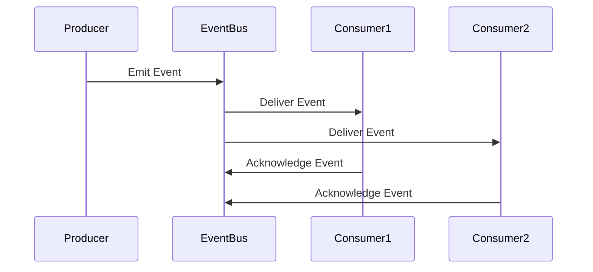

## 11.16. Event-Driven Architecture

Event-Driven Architecture (EDA) is a design paradigm that enables applications to respond to events, facilitating decoupled and scalable systems. In this section, we will explore the core concepts of EDA, its benefits, and how to implement it using Clojure. We will delve into designing applications around events, using messaging systems, and implementing patterns like Event Sourcing and Command Query Responsibility Segregation (CQRS). Additionally, we will discuss considerations for consistency and eventual consistency in event-driven systems.

### Understanding Event-Driven Architecture

**Event-Driven Architecture** is a software design pattern in which the flow of the program is determined by events such as user actions, sensor outputs, or messages from other programs. In EDA, components communicate by emitting and responding to events, which are typically represented as messages.

#### Benefits of Event-Driven Architecture

1. **Decoupling**: EDA promotes loose coupling between components, allowing them to evolve independently.
2. **Scalability**: Systems can scale more easily as components can be distributed across different nodes.
3. **Resilience**: By isolating failures to specific components, EDA enhances system resilience.
4. **Flexibility**: New features can be added by simply introducing new event handlers.
5. **Real-time Processing**: EDA is well-suited for applications requiring real-time data processing.

### Designing Applications Around Events

When designing an application using EDA, it is crucial to identify the events that drive the system's behavior. These events can be categorized into:

- **Domain Events**: Significant occurrences within the business domain.
- **Integration Events**: Events used for communication between different systems or services.

#### Steps to Design an Event-Driven Application

1. **Identify Events**: Determine the key events that the system should respond to.
2. **Define Event Producers and Consumers**: Identify which components will emit and handle events.
3. **Choose an Event Transport Mechanism**: Decide on the messaging system or event store to use.
4. **Implement Event Handlers**: Develop handlers that process events and trigger appropriate actions.

### Implementing Event-Driven Architecture in Clojure

Clojure, with its functional programming paradigm and immutable data structures, is well-suited for implementing EDA. Let's explore how to leverage Clojure's features to build event-driven systems.

#### Using Messaging Systems

Messaging systems like Apache Kafka, RabbitMQ, and Amazon SNS/SQS are commonly used in EDA to transport events between components. Clojure provides libraries to interact with these systems.

##### Example: Using Kafka with Clojure

```clojure
(ns myapp.kafka
  (:require [clj-kafka.producer :as producer]
            [clj-kafka.consumer :as consumer]))

;; Define a Kafka producer
(defn send-event [topic event]
  (producer/send-message {:topic topic :value event}))

;; Define a Kafka consumer
(defn consume-events [topic]
  (consumer/consume {:topic topic}
    (fn [message]
      (println "Received event:" (:value message)))))
```

In this example, we define a Kafka producer to send events and a consumer to process them. This setup allows for asynchronous communication between components.

#### Event Sourcing Pattern

**Event Sourcing** is a pattern where state changes are captured as a sequence of events. Instead of storing the current state, the system stores a log of state-changing events.

##### Implementing Event Sourcing in Clojure

```clojure
(defn apply-event [state event]
  ;; Update state based on the event
  (case (:type event)
    :user-created (assoc state :user (:data event))
    :user-updated (update state :user merge (:data event))
    state))

(defn replay-events [events]
  ;; Replay events to reconstruct the state
  (reduce apply-event {} events))

;; Example usage
(def events [{:type :user-created :data {:id 1 :name "Alice"}}
             {:type :user-updated :data {:name "Alice Smith"}}])

(def current-state (replay-events events))
;; => {:user {:id 1, :name "Alice Smith"}}
```

In this example, we define a function `apply-event` to update the state based on an event and `replay-events` to reconstruct the state by replaying a sequence of events.

#### Command Query Responsibility Segregation (CQRS)

**CQRS** is a pattern that separates the read and write operations of a system. Commands modify the state, while queries retrieve data. This separation allows for optimized handling of reads and writes.

##### Implementing CQRS in Clojure

```clojure
(defn handle-command [command]
  ;; Process command and return events
  (case (:type command)
    :create-user [{:type :user-created :data (:data command)}]
    :update-user [{:type :user-updated :data (:data command)}]
    []))

(defn query-state [state query]
  ;; Retrieve data based on query
  (case (:type query)
    :get-user (:user state)
    nil))

;; Example usage
(def command {:type :create-user :data {:id 1 :name "Alice"}})
(def events (handle-command command))
(def state (replay-events events))
(def user (query-state state {:type :get-user}))
;; => {:id 1, :name "Alice"}
```

In this example, we define `handle-command` to process commands and generate events, and `query-state` to retrieve data based on queries.

### Considerations for Consistency

In event-driven systems, achieving consistency can be challenging. Here are some considerations:

- **Eventual Consistency**: Accept that data may not be immediately consistent across components. Design the system to handle eventual consistency.
- **Idempotency**: Ensure that event handlers are idempotent, meaning they produce the same result even if the same event is processed multiple times.
- **Compensating Actions**: Implement compensating actions to handle failures and maintain consistency.

### Visualizing Event-Driven Architecture

Below is a diagram illustrating the flow of events in an event-driven architecture:



**Diagram Description**: This sequence diagram shows a producer emitting an event to an event bus, which then delivers the event to multiple consumers. Each consumer processes the event and acknowledges receipt.

### Try It Yourself

Experiment with the provided code examples by modifying the events and commands. Try implementing additional event handlers or integrating with a different messaging system.

### References and Further Reading

- [Apache Kafka Documentation](https://kafka.apache.org/documentation/)
- [RabbitMQ Documentation](https://www.rabbitmq.com/documentation.html)
- [Amazon SNS/SQS Documentation](https://aws.amazon.com/sns/)

### Knowledge Check

- What are the benefits of using Event-Driven Architecture?
- How does Event Sourcing differ from traditional state storage?
- What is the role of a messaging system in EDA?
- How can CQRS improve system performance?

### Embrace the Journey

Remember, mastering event-driven architecture is a journey. As you progress, you'll build more robust and scalable systems. Keep experimenting, stay curious, and enjoy the journey!

## **Ready to Test Your Knowledge?**



### What is a key benefit of Event-Driven Architecture?

- [x] Decoupling of components
- [ ] Increased complexity
- [ ] Reduced scalability
- [ ] Immediate consistency

> **Explanation:** Event-Driven Architecture promotes decoupling, allowing components to evolve independently.

### Which pattern involves capturing state changes as a sequence of events?

- [x] Event Sourcing
- [ ] CQRS
- [ ] Microservices
- [ ] RESTful API

> **Explanation:** Event Sourcing captures state changes as a sequence of events, rather than storing the current state.

### What is the primary role of a messaging system in EDA?

- [x] Transporting events between components
- [ ] Storing data persistently
- [ ] Executing business logic
- [ ] Managing user sessions

> **Explanation:** Messaging systems transport events between components, facilitating communication in EDA.

### How does CQRS separate system operations?

- [x] By separating read and write operations
- [ ] By combining read and write operations
- [ ] By using a single database
- [ ] By eliminating queries

> **Explanation:** CQRS separates read and write operations, allowing for optimized handling of each.

### What is a consideration for consistency in EDA?

- [x] Eventual consistency
- [ ] Immediate consistency
- [ ] Synchronous processing
- [ ] Single-threaded execution

> **Explanation:** Eventual consistency is a common consideration in EDA, where data may not be immediately consistent.

### What should event handlers be to ensure reliability?

- [x] Idempotent
- [ ] Stateful
- [ ] Synchronous
- [ ] Complex

> **Explanation:** Idempotency ensures that event handlers produce the same result even if the same event is processed multiple times.

### What is a compensating action?

- [x] An action to handle failures and maintain consistency
- [ ] A synchronous operation
- [ ] A redundant process
- [ ] A performance optimization

> **Explanation:** Compensating actions handle failures and maintain consistency in event-driven systems.

### What does the sequence diagram illustrate in EDA?

- [x] The flow of events between producer, event bus, and consumers
- [ ] The internal state of a component
- [ ] The database schema
- [ ] The user interface layout

> **Explanation:** The sequence diagram illustrates the flow of events between producer, event bus, and consumers.

### What is the role of a producer in EDA?

- [x] Emitting events
- [ ] Consuming events
- [ ] Storing data
- [ ] Managing user sessions

> **Explanation:** A producer emits events that are processed by consumers in an event-driven system.

### True or False: Event-Driven Architecture is suitable for real-time data processing.

- [x] True
- [ ] False

> **Explanation:** Event-Driven Architecture is well-suited for real-time data processing due to its asynchronous nature.


