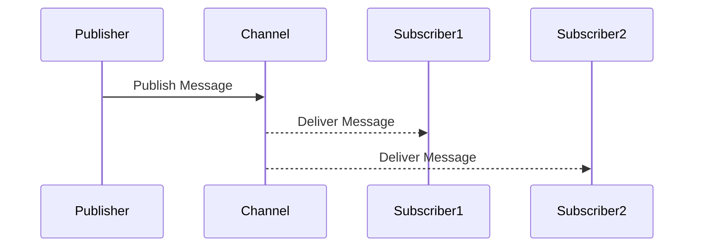
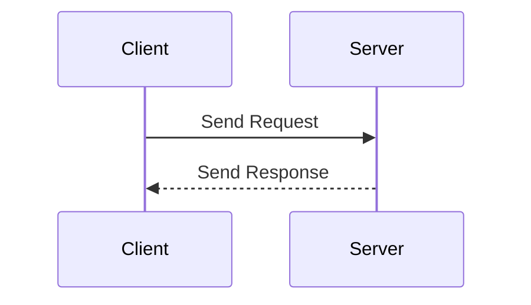
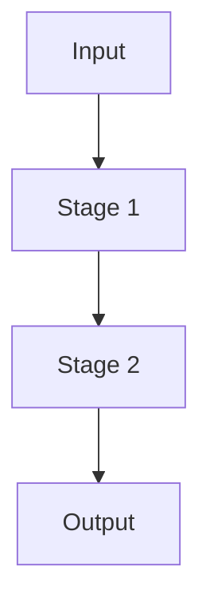

## 11.2. Messaging Patterns with core.async

In the realm of modern software development, asynchronous communication is a cornerstone for building responsive and scalable applications. Clojure's `core.async` library provides a robust framework for implementing messaging patterns that facilitate this kind of communication. In this section, we will delve into the messaging capabilities of `core.async`, exploring patterns such as Publish/Subscribe (Pub/Sub), Request/Reply, and Pipelines. We will provide practical examples and discuss the benefits and limitations of using `core.async` for messaging.

### Introduction to core.async

`core.async` is a Clojure library that brings asynchronous programming constructs to the language. It introduces the concept of channels, which are conduits for passing messages between different parts of a program. Channels can be thought of as queues that allow for communication between concurrent processes without sharing state.

#### Key Concepts

- **Channels**: The primary abstraction in `core.async`, channels are used to send and receive messages asynchronously.
- **Go Blocks**: These are lightweight threads that allow for non-blocking operations within `core.async`.
- **Buffers**: Channels can be buffered, allowing them to store a limited number of messages.
- **Alts!**: A function that allows for selecting from multiple channels, enabling complex coordination patterns.

### Publish/Subscribe Pattern

The Publish/Subscribe pattern is a messaging paradigm where senders (publishers) do not send messages directly to specific receivers (subscribers). Instead, messages are published to a channel, and subscribers receive messages from that channel.

#### Implementing Pub/Sub with core.async

Let's implement a simple Pub/Sub system using `core.async`.

```clojure
(require '[clojure.core.async :refer [chan pub sub put! go <!]])

;; Create a channel and a publication
(def messages (chan))
(def pub-sub (pub messages :topic))

;; Subscriber function
(defn subscriber [name topic]
  (let [sub-chan (chan)]
    (sub pub-sub topic sub-chan)
    (go (while true
          (let [msg (<! sub-chan)]
            (println (str name " received: " msg)))))))

;; Publisher function
(defn publisher [topic message]
  (put! messages {:topic topic :message message}))

;; Example usage
(subscriber "Subscriber1" :news)
(subscriber "Subscriber2" :sports)

(publisher :news "Breaking News!")
(publisher :sports "Sports Update!")
```

In this example, we create a channel `messages` and a publication `pub-sub`. Subscribers listen to specific topics, and publishers send messages tagged with a topic. This decouples the message producers from the consumers, allowing for flexible and scalable communication.

#### Benefits of Pub/Sub

- **Decoupling**: Publishers and subscribers are not aware of each other, promoting loose coupling.
- **Scalability**: Easily add new subscribers without modifying the publisher.
- **Flexibility**: Subscribers can choose which topics to listen to.

### Request/Reply Pattern

The Request/Reply pattern involves a client sending a request and waiting for a response from a server. This pattern is useful for synchronous communication where a response is expected.

#### Implementing Request/Reply with core.async

Here's how you can implement a simple Request/Reply pattern using `core.async`.

```clojure
(require '[clojure.core.async :refer [chan go >! <!]])

(defn request-reply [request]
  (let [response-chan (chan)]
    (go
      ;; Simulate processing request
      (Thread/sleep 1000)
      (>! response-chan (str "Response to " request)))
    response-chan))

;; Client function
(defn client [request]
  (let [response-chan (request-reply request)]
    (go
      (let [response (<! response-chan)]
        (println "Received:" response)))))

;; Example usage
(client "Request 1")
(client "Request 2")
```

In this example, the `request-reply` function simulates processing a request and sends a response back through a channel. The client function waits for the response and prints it.

#### Benefits of Request/Reply

- **Simplicity**: Straightforward pattern for synchronous communication.
- **Control**: Clients can handle responses as they arrive.

### Pipelines

Pipelines are used to process data through a series of stages, each performing a specific transformation. This pattern is useful for data processing tasks.

#### Implementing Pipelines with core.async

Let's create a simple pipeline using `core.async`.

```clojure
(require '[clojure.core.async :refer [chan pipeline >!! <!!]])

(defn process-stage [input output]
  (pipeline 1 output (map #(str % " processed")) input))

(defn run-pipeline []
  (let [input (chan)
        output (chan)]
    (process-stage input output)
    (go
      (while true
        (let [result (<! output)]
          (println "Pipeline output:" result))))
    (doseq [i (range 5)]
      (>!! input (str "Data " i)))))

(run-pipeline)
```

In this example, we define a `process-stage` function that processes data from an input channel and sends the result to an output channel. The `run-pipeline` function sets up the pipeline and feeds data into it.

#### Benefits of Pipelines

- **Modularity**: Each stage can be developed and tested independently.
- **Scalability**: Easily add more stages or parallelize processing.

### Limitations and Considerations

While `core.async` provides powerful tools for asynchronous messaging, there are some limitations and considerations to keep in mind:

- **Complexity**: Managing channels and go blocks can become complex in large systems.
- **Debugging**: Asynchronous code can be harder to debug due to non-deterministic execution.
- **Performance**: While `core.async` is efficient, it may not be suitable for high-throughput systems without careful tuning.

### Visualizing Messaging Patterns

To better understand how these patterns work, let's visualize them using Mermaid.js diagrams.

#### Pub/Sub Pattern



#### Request/Reply Pattern



#### Pipeline Pattern



### Conclusion

Messaging patterns with `core.async` offer a powerful way to build asynchronous and decoupled systems in Clojure. By leveraging channels and go blocks, we can implement patterns like Pub/Sub, Request/Reply, and Pipelines to handle complex communication scenarios. While there are challenges in managing complexity and debugging, the benefits of concurrency and scalability make `core.async` a valuable tool in the Clojure ecosystem.

### Try It Yourself

Experiment with the code examples provided. Try modifying the topics in the Pub/Sub example, or add more stages to the pipeline. Explore how `core.async` can be used to solve your specific messaging needs.

## **Ready to Test Your Knowledge?**



### What is the primary abstraction used in `core.async` for messaging?

- [x] Channels
- [ ] Buffers
- [ ] Go Blocks
- [ ] Alts!

> **Explanation:** Channels are the primary abstraction in `core.async` for passing messages asynchronously.

### Which pattern involves a client sending a request and waiting for a response?

- [ ] Pub/Sub
- [x] Request/Reply
- [ ] Pipelines
- [ ] Observer

> **Explanation:** The Request/Reply pattern involves a client sending a request and waiting for a response from a server.

### What is a key benefit of the Pub/Sub pattern?

- [ ] Synchronous communication
- [x] Decoupling of publishers and subscribers
- [ ] Direct communication between sender and receiver
- [ ] Simplified error handling

> **Explanation:** The Pub/Sub pattern decouples publishers and subscribers, allowing for flexible and scalable communication.

### In `core.async`, what function allows selecting from multiple channels?

- [ ] put!
- [ ] go
- [x] alts!
- [ ] sub

> **Explanation:** The `alts!` function allows for selecting from multiple channels in `core.async`.

### What is a limitation of using `core.async` for messaging?

- [x] Complexity in managing channels
- [ ] Lack of concurrency support
- [ ] Inability to handle asynchronous communication
- [ ] Limited to synchronous patterns

> **Explanation:** Managing channels and go blocks can become complex in large systems using `core.async`.

### Which pattern is useful for data processing tasks?

- [ ] Pub/Sub
- [ ] Request/Reply
- [x] Pipelines
- [ ] Observer

> **Explanation:** Pipelines are useful for processing data through a series of stages, each performing a specific transformation.

### What is the function of buffers in `core.async` channels?

- [ ] To block messages
- [ ] To synchronize communication
- [x] To store a limited number of messages
- [ ] To prioritize messages

> **Explanation:** Buffers in `core.async` channels allow them to store a limited number of messages.

### What is a benefit of using `core.async` for messaging?

- [x] Concurrency and decoupling
- [ ] Simplified synchronous communication
- [ ] Direct message passing
- [ ] Reduced complexity

> **Explanation:** `core.async` provides concurrency and decoupling, making it suitable for asynchronous communication.

### Which of the following is NOT a messaging pattern discussed in this section?

- [ ] Pub/Sub
- [ ] Request/Reply
- [ ] Pipelines
- [x] Observer

> **Explanation:** The Observer pattern is not discussed in this section; it focuses on Pub/Sub, Request/Reply, and Pipelines.

### True or False: `core.async` is suitable for high-throughput systems without any tuning.

- [ ] True
- [x] False

> **Explanation:** While `core.async` is efficient, it may not be suitable for high-throughput systems without careful tuning.



Remember, this is just the beginning. As you progress, you'll build more complex and interactive systems using `core.async`. Keep experimenting, stay curious, and enjoy the journey!
