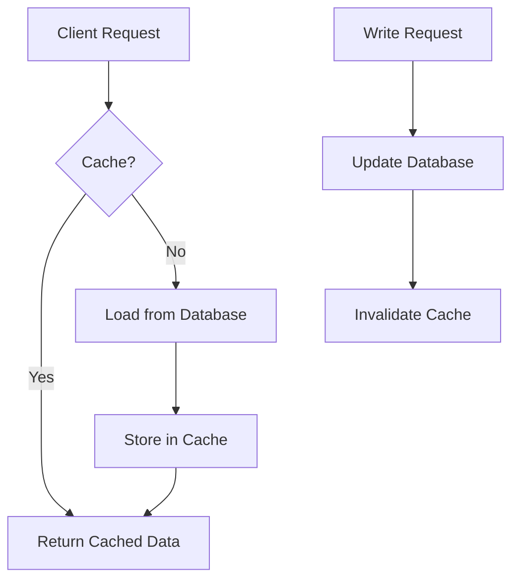

## 11.3.1 Cache-Aside Pattern

In modern software development, efficient data retrieval is crucial for application performance and user experience. The Cache-Aside Pattern, also known as Lazy Loading, is a popular caching strategy that helps improve data access speed by storing frequently accessed data in a cache. This pattern is particularly useful in scenarios where data reads are more frequent than writes, making it a perfect fit for many real-world applications.

### Introduction

The Cache-Aside Pattern is a caching strategy where the application code is responsible for loading data into the cache as needed. This pattern is widely used in systems where the cache is not always guaranteed to have the data, and the application must fetch it from the database when necessary. The primary goal of this pattern is to reduce the load on the database and improve the overall response time of the application.

### Detailed Explanation

#### Implementation Steps

The Cache-Aside Pattern involves two main operations: read and write. Let's explore each of these in detail:

##### Read Operation

1. **Check Cache:** When the application needs to read data, it first checks if the data is available in the cache.
2. **Return from Cache:** If the data is present in the cache, it is returned directly to the caller, ensuring a fast response.
3. **Load from Database:** If the data is not found in the cache, the application loads it from the database.
4. **Store in Cache:** After retrieving the data from the database, it is stored in the cache for future requests.
5. **Return Data:** Finally, the data is returned to the caller.

##### Write Operation

1. **Update Database:** When writing data, the application updates the database first.
2. **Invalidate Cache:** After updating the database, the corresponding cache entry is invalidated or updated to ensure consistency between the cache and the database.

#### Best Practices

- **Cache Invalidation:** Proper cache invalidation is critical to maintaining data consistency. Ensure that cache entries are invalidated or updated immediately after a write operation.
- **Time-to-Live (TTL):** Use appropriate TTL values for cached entries to prevent stale data from persisting in the cache indefinitely.
- **Cache Miss Handling:** Implement robust error handling for cache misses to ensure the application can gracefully fall back to the database.

### Visual Aids

To better understand the Cache-Aside Pattern, let's look at a conceptual diagram illustrating the read and write operations:



### Code Example

Let's implement a simple user profile lookup using the Cache-Aside Pattern in Go, leveraging Redis as the caching layer:

```go
package main

import (
	"context"
	"fmt"
	"log"
	"time"

	"github.com/go-redis/redis/v8"
)

var ctx = context.Background()

type UserProfile struct {
	ID   string
	Name string
	Age  int
}

func getUserProfileFromDB(userID string) (*UserProfile, error) {
	// Simulate a database call
	fmt.Println("Fetching from database...")
	time.Sleep(100 * time.Millisecond) // Simulate delay
	return &UserProfile{ID: userID, Name: "John Doe", Age: 30}, nil
}

func getUserProfile(client *redis.Client, userID string) (*UserProfile, error) {
	// Check cache
	val, err := client.Get(ctx, userID).Result()
	if err == redis.Nil {
		// Cache miss, load from database
		profile, err := getUserProfileFromDB(userID)
		if err != nil {
			return nil, err
		}
		// Store in cache
		err = client.Set(ctx, userID, fmt.Sprintf("%s,%d", profile.Name, profile.Age), 10*time.Minute).Err()
		if err != nil {
			return nil, err
		}
		return profile, nil
	} else if err != nil {
		return nil, err
	}

	// Cache hit, parse the result
	var name string
	var age int
	fmt.Sscanf(val, "%s,%d", &name, &age)
	return &UserProfile{ID: userID, Name: name, Age: age}, nil
}

func main() {
	client := redis.NewClient(&redis.Options{
		Addr: "localhost:6379",
	})

	userID := "12345"
	profile, err := getUserProfile(client, userID)
	if err != nil {
		log.Fatalf("Failed to get user profile: %v", err)
	}

	fmt.Printf("User Profile: %+v\n", profile)
}
```

### Use Cases

The Cache-Aside Pattern is suitable for various scenarios, including:

- **Read-Heavy Applications:** Applications with frequent read operations and infrequent writes, such as content delivery networks (CDNs) or social media platforms.
- **Data with High Latency:** Systems where accessing the database is time-consuming, and caching can significantly reduce response times.
- **Scalable Systems:** Applications that need to scale horizontally by offloading read operations from the database to the cache.

### Advantages and Disadvantages

#### Advantages

- **Improved Performance:** Reduces database load and improves response times by serving data from the cache.
- **Scalability:** Enables applications to handle more concurrent requests by offloading read operations to the cache.
- **Flexibility:** Allows selective caching of data based on application needs.

#### Disadvantages

- **Cache Inconsistency:** Risk of serving stale data if cache invalidation is not handled correctly.
- **Complexity:** Requires additional logic to manage cache reads, writes, and invalidations.
- **Memory Overhead:** Increases memory usage due to cached data storage.

### Best Practices

- **Consistent Hashing:** Use consistent hashing to distribute cache entries evenly across multiple cache nodes.
- **Monitoring and Metrics:** Implement monitoring to track cache hit/miss rates and optimize cache performance.
- **Graceful Degradation:** Ensure the application can gracefully degrade to database reads in case of cache failures.

### Comparisons

Compared to other caching strategies like Write-Through or Write-Behind, the Cache-Aside Pattern offers more control over cache management but requires explicit cache handling in the application code.

### Conclusion

The Cache-Aside Pattern is a powerful caching strategy that can significantly enhance application performance by reducing database load and improving response times. By carefully managing cache reads, writes, and invalidations, developers can leverage this pattern to build scalable and efficient systems.

## Quiz Time!



### What is the primary goal of the Cache-Aside Pattern?

- [x] To reduce the load on the database and improve response time
- [ ] To ensure data is always consistent between cache and database
- [ ] To simplify application code by removing caching logic
- [ ] To increase memory usage for better performance

> **Explanation:** The Cache-Aside Pattern aims to reduce database load and improve response times by caching frequently accessed data.

### In the Cache-Aside Pattern, what happens during a cache miss?

- [ ] The application returns an error
- [x] The application loads data from the database and stores it in the cache
- [ ] The application waits for the cache to be updated
- [ ] The application ignores the request

> **Explanation:** During a cache miss, the application retrieves the data from the database, stores it in the cache, and then returns it to the caller.

### What is a key consideration when using the Cache-Aside Pattern?

- [ ] Ensuring the cache is always empty
- [x] Handling cache invalidation carefully
- [ ] Using the cache for write operations only
- [ ] Avoiding the use of TTL values

> **Explanation:** Proper cache invalidation is crucial to maintaining consistency between the cache and the database.

### Which of the following is a disadvantage of the Cache-Aside Pattern?

- [ ] Improved performance
- [ ] Scalability
- [x] Cache inconsistency
- [ ] Flexibility

> **Explanation:** Cache inconsistency can occur if cache invalidation is not handled correctly, leading to stale data being served.

### What is the first step in a read operation using the Cache-Aside Pattern?

- [ ] Load data from the database
- [x] Check if the data exists in the cache
- [ ] Invalidate the cache entry
- [ ] Return data to the caller

> **Explanation:** The first step is to check if the data exists in the cache to determine if a database read is necessary.

### In the Cache-Aside Pattern, what should be done after updating the database in a write operation?

- [ ] Load data from the cache
- [ ] Return data to the caller
- [x] Invalidate or update the cache entry
- [ ] Ignore the cache

> **Explanation:** After updating the database, the cache entry should be invalidated or updated to maintain consistency.

### Which of the following is a best practice for implementing the Cache-Aside Pattern?

- [ ] Avoid using TTL values
- [ ] Use the cache for all data operations
- [x] Monitor cache hit/miss rates
- [ ] Store all data indefinitely in the cache

> **Explanation:** Monitoring cache hit/miss rates helps optimize cache performance and ensure efficient data retrieval.

### What type of applications benefit most from the Cache-Aside Pattern?

- [ ] Write-heavy applications
- [x] Read-heavy applications
- [ ] Applications with no database
- [ ] Applications with constant data changes

> **Explanation:** Read-heavy applications benefit from the Cache-Aside Pattern as it reduces database load and improves response times.

### How does the Cache-Aside Pattern handle data with high latency?

- [ ] By avoiding caching such data
- [ ] By frequently updating the cache
- [x] By caching the data to reduce response times
- [ ] By increasing database queries

> **Explanation:** Caching data with high latency reduces response times by serving it from the cache instead of the database.

### True or False: The Cache-Aside Pattern requires the application to manage cache reads and writes explicitly.

- [x] True
- [ ] False

> **Explanation:** The Cache-Aside Pattern requires explicit management of cache reads, writes, and invalidations in the application code.


