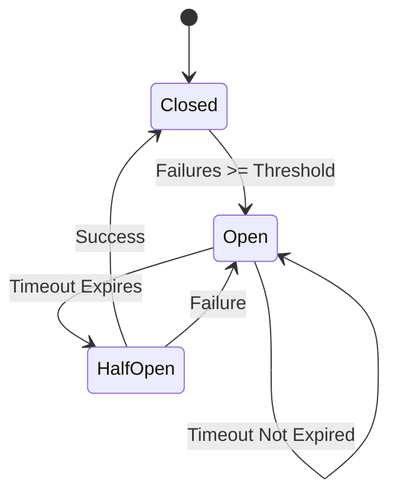

## 11.3 Circuit Breaker in Clojure

In the world of microservices, ensuring system resilience and fault tolerance is crucial. The Circuit Breaker pattern is a key design pattern that helps prevent cascading failures across services by monitoring service calls and managing failures effectively. This article delves into implementing the Circuit Breaker pattern in Clojure, providing insights into its states, logic, and practical application.

### Introduction

The Circuit Breaker pattern is designed to prevent a network or service failure from cascading to other services. It acts as a safety mechanism that monitors service calls and opens the circuit when failures exceed a predefined threshold. By doing so, it improves system resilience by avoiding repeated failed calls and allowing time for the service to recover.

### Detailed Explanation

#### Circuit Breaker States and Metrics

The Circuit Breaker pattern operates in three primary states:

- **Closed:** The circuit is closed, and requests are allowed to pass through. Failures are monitored, and if they exceed a threshold, the circuit transitions to the open state.
- **Open:** The circuit is open, and requests are blocked to prevent further failures. After a timeout, the circuit transitions to the half-open state to test if the service has recovered.
- **Half-Open:** A limited number of requests are allowed to pass through to test the service's health. If successful, the circuit closes; otherwise, it reopens.

Metrics tracked include failure counts and timestamps to manage state transitions effectively.

#### Implementing Circuit Breaker Logic

Below is a Clojure implementation of the Circuit Breaker pattern:

```clojure
(def circuit-breaker-state (atom {:state :closed :failures 0 :last-failure 0}))

(defn circuit-breaker [threshold timeout f & args]
  (let [{:keys [state failures last-failure]} @circuit-breaker-state
        now (System/currentTimeMillis)]
    (case state
      :closed
      (try
        (let [result (apply f args)]
          (reset! circuit-breaker-state {:state :closed :failures 0 :last-failure 0})
          result)
        (catch Exception e
          (swap! circuit-breaker-state update :failures inc)
          (when (>= (inc failures) threshold)
            (reset! circuit-breaker-state {:state :open :failures failures :last-failure now}))
          (throw e)))
      :open
      (if (> (- now last-failure) timeout)
        (do
          (reset! circuit-breaker-state {:state :half-open :failures failures :last-failure last-failure})
          (circuit-breaker threshold timeout f args))
        (throw (Exception. "Circuit breaker is open")))
      :half-open
      (try
        (let [result (apply f args)]
          (reset! circuit-breaker-state {:state :closed :failures 0 :last-failure 0})
          result)
        (catch Exception e
          (reset! circuit-breaker-state {:state :open :failures (inc failures) :last-failure now})
          (throw e))))))
```

### Visual Aids

#### Circuit Breaker State Transition Diagram



This diagram illustrates the state transitions of the Circuit Breaker pattern, showing how it moves between closed, open, and half-open states based on service call outcomes.

### Wrapping Service Calls with the Circuit Breaker

To utilize the Circuit Breaker, wrap your service calls as follows:

```clojure
(defn call-external-service [params]
  ;; Actual service call
  )

(defn safe-call-external-service [params]
  (circuit-breaker 5 10000 call-external-service params))
```

### Configuring Thresholds and Monitoring

- **Thresholds and Timeouts:** Set these based on the reliability and requirements of your service. A higher threshold may be suitable for less critical services, while critical services may require stricter thresholds.
- **Monitoring:** Log state changes and failures for analysis. This helps in understanding the service's behavior and adjusting thresholds as needed.

### Testing the Circuit Breaker

Simulate failures to ensure the Circuit Breaker behaves as expected. This involves deliberately causing failures and observing the state transitions and recovery process.

### Use Cases

The Circuit Breaker pattern is applicable in scenarios where:

- Services are prone to temporary failures.
- You need to prevent cascading failures in a microservices architecture.
- There is a need to improve system resilience and fault tolerance.

### Advantages and Disadvantages

**Advantages:**

- Prevents cascading failures.
- Improves system resilience.
- Allows services time to recover.

**Disadvantages:**

- Requires careful configuration of thresholds and timeouts.
- May introduce complexity in monitoring and management.

### Best Practices

- **Set Appropriate Thresholds:** Balance between sensitivity and resilience.
- **Monitor and Adjust:** Continuously monitor service performance and adjust configurations as needed.
- **Integrate with Logging:** Use logging to track state changes and failures for better insights.

### Comparisons

Compared to other fault tolerance patterns, the Circuit Breaker is proactive in preventing failures, whereas patterns like retries are reactive.

### Conclusion

The Circuit Breaker pattern is a powerful tool for enhancing the resilience of microservices. By preventing cascading failures and allowing services to recover, it plays a crucial role in maintaining system stability. Implementing this pattern in Clojure leverages the language's strengths in managing state and concurrency, providing a robust solution for fault tolerance.

## Quiz Time!



### What is the primary purpose of the Circuit Breaker pattern?

- [x] To prevent cascading failures in a system
- [ ] To enhance data processing speed
- [ ] To improve user interface responsiveness
- [ ] To manage database transactions

> **Explanation:** The Circuit Breaker pattern is designed to prevent cascading failures by monitoring service calls and managing failures effectively.

### Which state allows limited requests to test the service's health?

- [ ] Closed
- [ ] Open
- [x] Half-Open
- [ ] Faulty

> **Explanation:** In the Half-Open state, a limited number of requests are allowed to test if the service has recovered.

### What triggers the transition from Closed to Open state?

- [ ] Successful service calls
- [x] Failures exceeding a threshold
- [ ] Timeout expiration
- [ ] Manual intervention

> **Explanation:** The transition from Closed to Open occurs when failures exceed a predefined threshold.

### What is a key metric tracked by the Circuit Breaker?

- [ ] Memory usage
- [ ] CPU load
- [x] Failure counts
- [ ] Network latency

> **Explanation:** Failure counts are tracked to determine when to transition between states.

### How does the Circuit Breaker pattern improve system resilience?

- [x] By avoiding repeated failed calls
- [ ] By increasing service call frequency
- [ ] By reducing code complexity
- [ ] By enhancing user experience

> **Explanation:** The Circuit Breaker pattern improves resilience by avoiding repeated failed calls, allowing the system to recover.

### What is the role of the timeout in the Circuit Breaker pattern?

- [ ] To increase service call speed
- [x] To determine when to transition from Open to Half-Open
- [ ] To reduce memory usage
- [ ] To enhance logging capabilities

> **Explanation:** The timeout determines when the circuit transitions from Open to Half-Open to test service recovery.

### Which Clojure construct is used to manage the Circuit Breaker state?

- [ ] ref
- [x] atom
- [ ] agent
- [ ] var

> **Explanation:** An atom is used to manage the mutable state of the Circuit Breaker in Clojure.

### What should be done when the Circuit Breaker is in the Open state?

- [ ] Increase the request rate
- [ ] Decrease the timeout
- [x] Block requests and wait for the timeout
- [ ] Log additional data

> **Explanation:** In the Open state, requests are blocked to prevent further failures, and the system waits for the timeout to expire.

### Why is monitoring important in the Circuit Breaker pattern?

- [ ] To increase service call speed
- [ ] To enhance user interface design
- [x] To adjust thresholds and configurations based on performance
- [ ] To reduce code complexity

> **Explanation:** Monitoring helps in understanding service behavior and adjusting thresholds and configurations as needed.

### True or False: The Circuit Breaker pattern is reactive in nature.

- [ ] True
- [x] False

> **Explanation:** The Circuit Breaker pattern is proactive, as it prevents failures by opening the circuit before they cascade.


