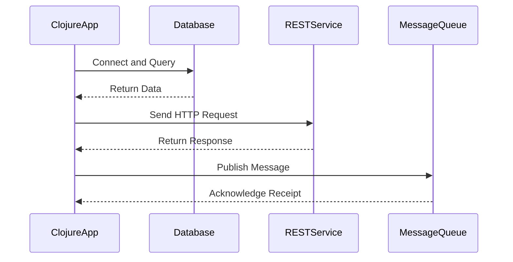

## 11.3. Integration with External Systems

In today's interconnected world, software systems rarely operate in isolation. They must communicate with databases, web services, legacy systems, and more. This section explores how Clojure, with its functional programming paradigm and JVM interoperability, excels in integrating with external systems. We'll cover databases, web services, message queues, and best practices for resilience and error handling.

### Importance of Interoperability in Enterprise Environments

Interoperability is crucial in enterprise environments where diverse systems need to work together seamlessly. Clojure's ability to run on the JVM makes it a powerful tool for integration, allowing it to leverage existing Java libraries and frameworks. This capability is essential for:

- **Connecting to Databases**: Accessing and manipulating data stored in relational and non-relational databases.
- **Consuming and Producing Web Services**: Interacting with RESTful and SOAP-based services for data exchange.
- **Interacting with Message Queues**: Facilitating asynchronous communication between distributed systems.
- **Integrating with Legacy Systems**: Bridging the gap between modern applications and older technologies.

### Connecting to Databases

Databases are the backbone of most applications, storing critical data that applications need to access and manipulate. Clojure provides several ways to connect to databases, with JDBC being the most common method.

#### Using JDBC with Clojure

JDBC (Java Database Connectivity) is a standard Java API for database access. Clojure can leverage JDBC to interact with databases, allowing developers to execute SQL queries and manage transactions.

```clojure
(require '[clojure.java.jdbc :as jdbc])

(def db-spec
  {:dbtype "h2" :dbname "test"})

;; Create a table
(jdbc/execute! db-spec ["CREATE TABLE users (id INT PRIMARY KEY, name VARCHAR(50))"])

;; Insert a record
(jdbc/insert! db-spec :users {:id 1 :name "Alice"})

;; Query the database
(jdbc/query db-spec ["SELECT * FROM users"])
```

In this example, we define a database specification and use `clojure.java.jdbc` to create a table, insert a record, and query the database.

#### Leveraging `next.jdbc`

[next.jdbc](https://github.com/seancorfield/next-jdbc) is a modern, idiomatic Clojure wrapper for JDBC. It offers a more functional approach to database interaction, emphasizing immutability and simplicity.

```clojure
(require '[next.jdbc :as jdbc])

(def db-spec
  {:dbtype "h2" :dbname "test"})

;; Create a connection
(def ds (jdbc/get-datasource db-spec))

;; Execute a query
(jdbc/execute! ds ["CREATE TABLE users (id INT PRIMARY KEY, name VARCHAR(50))"])

;; Insert data
(jdbc/execute! ds ["INSERT INTO users (id, name) VALUES (?, ?)" 1 "Alice"])

;; Fetch data
(jdbc/execute! ds ["SELECT * FROM users"])
```

`next.jdbc` provides a more streamlined API, making it easier to work with databases in a functional style.

### Consuming and Producing Web Services

Web services are essential for enabling communication between applications over the internet. Clojure can consume and produce both RESTful and SOAP-based services.

#### Consuming RESTful Services

REST (Representational State Transfer) is a popular architectural style for web services. Clojure can consume RESTful services using libraries like `clj-http`.

```clojure
(require '[clj-http.client :as client])

;; GET request
(def response (client/get "https://api.example.com/users"))

;; Parse JSON response
(def users (json/parse-string (:body response) true))
```

In this example, we use `clj-http` to send a GET request to a RESTful API and parse the JSON response.

#### Producing RESTful Services

Clojure can also produce RESTful services using libraries like Ring and Compojure.

```clojure
(require '[ring.adapter.jetty :refer [run-jetty]]
         '[compojure.core :refer [defroutes GET]])

(defroutes app-routes
  (GET "/users" [] "List of users"))

(run-jetty app-routes {:port 3000})
```

This code sets up a simple RESTful service that responds to GET requests at the `/users` endpoint.

#### Interacting with SOAP Services

SOAP (Simple Object Access Protocol) is another protocol for web services. Clojure can interact with SOAP services using libraries like `clj-soap`.

```clojure
(require '[clj-soap.core :as soap])

(def client (soap/client "http://example.com/soap?wsdl"))

;; Call a SOAP method
(soap/call client :GetUser {:id 1})
```

This example demonstrates how to create a SOAP client and call a method using `clj-soap`.

### Interacting with Message Queues

Message queues facilitate asynchronous communication between distributed systems. Clojure can interact with message queues using libraries like `clojurewerkz/machine_head` for MQTT or `langohr` for RabbitMQ.

#### Using RabbitMQ with Langohr

RabbitMQ is a popular message broker that supports various messaging protocols. `langohr` is a Clojure library for interacting with RabbitMQ.

```clojure
(require '[langohr.core :as rmq]
         '[langohr.channel :as lch]
         '[langohr.queue :as lq]
         '[langohr.basic :as lb])

(def conn (rmq/connect))
(def ch (lch/open conn))

;; Declare a queue
(lq/declare ch "test-queue")

;; Publish a message
(lb/publish ch "" "test-queue" "Hello, World!")

;; Consume messages
(lb/consume ch "test-queue" (fn [ch {:keys [delivery-tag]} ^bytes payload]
                              (println "Received:" (String. payload "UTF-8"))
                              (lb/ack ch delivery-tag)))
```

This example shows how to connect to RabbitMQ, declare a queue, publish a message, and consume messages using `langohr`.

### Best Practices for Resilience and Error Handling

When integrating with external systems, resilience and error handling are critical. Here are some best practices to consider:

- **Retry Logic**: Implement retry logic for transient errors, such as network timeouts or temporary service unavailability.
- **Circuit Breaker Pattern**: Use the circuit breaker pattern to prevent cascading failures when a service is down.
- **Graceful Degradation**: Design your application to degrade gracefully when external systems are unavailable.
- **Timeouts**: Set appropriate timeouts for network requests to avoid hanging indefinitely.
- **Logging and Monitoring**: Implement logging and monitoring to detect and diagnose issues with external integrations.

### Visualizing Clojure's Integration with External Systems

To better understand how Clojure integrates with external systems, let's visualize the architecture using a sequence diagram.



This diagram illustrates the interactions between a Clojure application and various external systems, including a database, a RESTful service, and a message queue.

### Knowledge Check

Before we wrap up, let's test your understanding of integrating Clojure with external systems. Consider the following questions:

1. What is the primary advantage of using `next.jdbc` over `clojure.java.jdbc`?
2. How can Clojure consume a RESTful service?
3. What library can be used to interact with RabbitMQ in Clojure?
4. Why is it important to implement retry logic when integrating with external systems?
5. What is the circuit breaker pattern, and how does it help in integration?

### Summary

In this section, we've explored how Clojure can integrate with external systems, including databases, web services, and message queues. We've discussed the importance of interoperability in enterprise environments and provided examples of using JDBC, `next.jdbc`, `clj-http`, and `langohr`. We've also highlighted best practices for resilience and error handling, ensuring your Clojure applications can communicate effectively with external systems.

Remember, this is just the beginning. As you continue to explore Clojure's integration capabilities, you'll discover more advanced techniques and patterns to enhance your applications. Keep experimenting, stay curious, and enjoy the journey!

## **Ready to Test Your Knowledge?**



### What is the primary advantage of using `next.jdbc` over `clojure.java.jdbc`?

- [x] It offers a more functional and idiomatic API.
- [ ] It is faster than `clojure.java.jdbc`.
- [ ] It supports more database types.
- [ ] It is easier to install.

> **Explanation:** `next.jdbc` provides a more functional and idiomatic API, making it easier to work with databases in a functional style.

### How can Clojure consume a RESTful service?

- [x] By using the `clj-http` library to send HTTP requests.
- [ ] By using the `clj-soap` library to send SOAP requests.
- [ ] By using the `langohr` library to interact with message queues.
- [ ] By using the `next.jdbc` library to query databases.

> **Explanation:** Clojure can consume RESTful services using the `clj-http` library to send HTTP requests and parse responses.

### What library can be used to interact with RabbitMQ in Clojure?

- [x] `langohr`
- [ ] `clj-http`
- [ ] `next.jdbc`
- [ ] `clj-soap`

> **Explanation:** `langohr` is a Clojure library for interacting with RabbitMQ, a popular message broker.

### Why is it important to implement retry logic when integrating with external systems?

- [x] To handle transient errors and improve resilience.
- [ ] To increase the speed of network requests.
- [ ] To reduce the number of external dependencies.
- [ ] To simplify the codebase.

> **Explanation:** Implementing retry logic helps handle transient errors, such as network timeouts, improving the resilience of the application.

### What is the circuit breaker pattern, and how does it help in integration?

- [x] It prevents cascading failures by stopping requests to a failing service.
- [ ] It speeds up network requests by caching responses.
- [ ] It simplifies error handling by logging all errors.
- [ ] It reduces the number of external dependencies.

> **Explanation:** The circuit breaker pattern prevents cascading failures by stopping requests to a failing service, allowing it to recover before resuming normal operations.

### Which library is used for SOAP-based web services in Clojure?

- [x] `clj-soap`
- [ ] `clj-http`
- [ ] `langohr`
- [ ] `next.jdbc`

> **Explanation:** `clj-soap` is used for interacting with SOAP-based web services in Clojure.

### What is the purpose of setting timeouts for network requests?

- [x] To avoid hanging indefinitely when a service is unresponsive.
- [ ] To speed up the processing of requests.
- [ ] To reduce the number of requests sent.
- [ ] To simplify error handling.

> **Explanation:** Setting timeouts helps avoid hanging indefinitely when a service is unresponsive, improving the application's resilience.

### How does Clojure's JVM interoperability benefit integration with external systems?

- [x] It allows leveraging existing Java libraries and frameworks.
- [ ] It makes Clojure faster than other languages.
- [ ] It simplifies the syntax of Clojure code.
- [ ] It reduces the size of Clojure applications.

> **Explanation:** Clojure's JVM interoperability allows leveraging existing Java libraries and frameworks, making it easier to integrate with external systems.

### What is the role of logging and monitoring in external system integration?

- [x] To detect and diagnose issues with integrations.
- [ ] To speed up network requests.
- [ ] To reduce the number of external dependencies.
- [ ] To simplify the codebase.

> **Explanation:** Logging and monitoring help detect and diagnose issues with integrations, ensuring the application runs smoothly.

### True or False: Clojure can only integrate with modern systems and not legacy systems.

- [ ] True
- [x] False

> **Explanation:** Clojure can integrate with both modern and legacy systems, thanks to its JVM interoperability and extensive library support.


