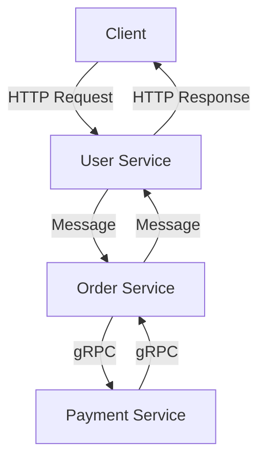

## 11.4. Service-Oriented Architecture (SOA)

Service-Oriented Architecture (SOA) is a design paradigm that enables the creation of distributed systems with loosely coupled services. In this section, we will explore the principles of SOA, its benefits, and how to design Clojure applications that align with SOA practices. We will also delve into the challenges of implementing SOA, such as service discovery and versioning, and provide practical examples of building services using Clojure.

### Understanding Service-Oriented Architecture

**Service-Oriented Architecture (SOA)** is a design approach where software components, known as services, provide functionality to other components over a network. These services are self-contained, reusable, and can be composed to create complex applications. SOA promotes interoperability, scalability, and flexibility, making it ideal for enterprise-level applications.

#### Key Principles of SOA

1. **Loose Coupling**: Services are designed to minimize dependencies on each other, allowing them to evolve independently.
2. **Interoperability**: Services communicate using standard protocols, enabling integration across different platforms and technologies.
3. **Reusability**: Services are designed to be reusable across different applications and contexts.
4. **Composability**: Services can be composed to form more complex services or applications.
5. **Discoverability**: Services are easily discoverable and can be located and invoked dynamically.

### Benefits of SOA

- **Scalability**: SOA allows for scaling individual services independently, optimizing resource usage.
- **Flexibility**: Services can be updated or replaced without affecting the entire system.
- **Interoperability**: SOA facilitates integration with external systems and technologies.
- **Maintainability**: Modular services simplify maintenance and updates.

### Designing Services in Clojure

When designing services in Clojure, it's essential to focus on defining clear interfaces and structuring services to adhere to SOA principles.

#### Structuring Services

1. **Define Clear Interfaces**: Use Clojure protocols and multimethods to define service interfaces. This promotes loose coupling and reusability.
2. **Encapsulate Business Logic**: Keep business logic within services, exposing only necessary operations through interfaces.
3. **Use Namespaces for Organization**: Organize services using Clojure namespaces to maintain a clean and manageable codebase.

#### Example: Building a Simple Service in Clojure

Let's create a simple service in Clojure that provides user management functionality.

```clojure
(ns user-management.service
  (:require [clojure.spec.alpha :as s]))

;; Define a spec for user data
(s/def ::user-id int?)
(s/def ::user-name string?)
(s/def ::user (s/keys :req [::user-id ::user-name]))

;; Define a protocol for user management
(defprotocol UserService
  (create-user [this user])
  (get-user [this user-id])
  (delete-user [this user-id]))

;; Implement the UserService protocol
(defrecord UserServiceImpl []
  UserService
  (create-user [this user]
    (println "Creating user:" user))
  (get-user [this user-id]
    (println "Fetching user with ID:" user-id))
  (delete-user [this user-id]
    (println "Deleting user with ID:" user-id)))

;; Create an instance of the service
(def user-service (->UserServiceImpl))

;; Example usage
(create-user user-service {:user-id 1 :user-name "Alice"})
(get-user user-service 1)
(delete-user user-service 1)
```

### Communication Patterns Between Services

In SOA, services communicate over a network using standard protocols. Clojure provides several libraries and tools to facilitate service communication.

#### Common Communication Patterns

1. **RESTful APIs**: Use libraries like `ring` and `compojure` to expose services as RESTful APIs.
2. **Message Queues**: Use message brokers like RabbitMQ or Kafka for asynchronous communication between services.
3. **gRPC**: Use gRPC for efficient, low-latency communication between services.

#### Example: Exposing a Service as a RESTful API

```clojure
(ns user-management.api
  (:require [ring.adapter.jetty :refer [run-jetty]]
            [compojure.core :refer [defroutes GET POST DELETE]]
            [compojure.route :as route]
            [user-management.service :refer [user-service create-user get-user delete-user]]))

(defroutes app-routes
  (POST "/users" [user-id user-name]
    (create-user user-service {:user-id (Integer. user-id) :user-name user-name})
    {:status 201 :body "User created"})
  (GET "/users/:user-id" [user-id]
    (get-user user-service (Integer. user-id))
    {:status 200 :body "User fetched"})
  (DELETE "/users/:user-id" [user-id]
    (delete-user user-service (Integer. user-id))
    {:status 200 :body "User deleted"})
  (route/not-found "Not Found"))

(defn -main []
  (run-jetty app-routes {:port 3000}))
```

### Challenges in Implementing SOA

Implementing SOA comes with its own set of challenges, such as service discovery, versioning, and managing distributed systems.

#### Service Discovery

Service discovery is crucial in SOA to locate and invoke services dynamically. Tools like Consul and Eureka can be used for service registration and discovery.

#### Versioning

Managing different versions of services is essential to ensure backward compatibility. Use versioning strategies like URL versioning or header-based versioning to handle service updates.

#### Managing Distributed Systems

Distributed systems introduce complexities like network latency, fault tolerance, and data consistency. Use patterns like Circuit Breaker and Retry to handle failures gracefully.

### Visualizing SOA in Clojure

Below is a diagram illustrating a simple SOA setup with Clojure services communicating over a network.



**Caption**: A simple SOA setup with Clojure services communicating over HTTP, message queues, and gRPC.

### Conclusion

Service-Oriented Architecture (SOA) provides a robust framework for building scalable, flexible, and maintainable applications. By leveraging Clojure's functional programming capabilities and rich ecosystem, you can design and implement services that adhere to SOA principles. Remember to address challenges like service discovery and versioning to ensure a successful SOA implementation.

### Try It Yourself

Experiment with the code examples provided in this section. Try modifying the `UserService` protocol to add new operations or expose the service using different communication patterns like gRPC or message queues.

## **Ready to Test Your Knowledge?**



### What is a key principle of Service-Oriented Architecture (SOA)?

- [x] Loose Coupling
- [ ] Tight Coupling
- [ ] Monolithic Design
- [ ] Centralized Control

> **Explanation:** Loose coupling is a key principle of SOA, allowing services to evolve independently.

### Which Clojure feature is used to define service interfaces?

- [x] Protocols
- [ ] Macros
- [ ] Atoms
- [ ] Agents

> **Explanation:** Protocols in Clojure are used to define service interfaces, promoting loose coupling and reusability.

### What is a common communication pattern in SOA?

- [x] RESTful APIs
- [ ] Direct Database Access
- [ ] File Sharing
- [ ] Local Function Calls

> **Explanation:** RESTful APIs are a common communication pattern in SOA, enabling services to communicate over a network.

### Which tool can be used for service discovery in SOA?

- [x] Consul
- [ ] Git
- [ ] Docker
- [ ] Maven

> **Explanation:** Consul is a tool used for service discovery, allowing services to be located and invoked dynamically.

### What is a challenge in implementing SOA?

- [x] Service Discovery
- [ ] Single-threaded Execution
- [ ] Local State Management
- [ ] Direct Memory Access

> **Explanation:** Service discovery is a challenge in SOA, as it involves locating and invoking services dynamically.

### Which library can be used to expose a Clojure service as a RESTful API?

- [x] Compojure
- [ ] Core.Async
- [ ] Ring
- [ ] Aleph

> **Explanation:** Compojure is a library used to expose Clojure services as RESTful APIs.

### What is a benefit of using SOA?

- [x] Scalability
- [ ] Increased Complexity
- [ ] Tight Coupling
- [ ] Centralized Control

> **Explanation:** Scalability is a benefit of SOA, allowing individual services to be scaled independently.

### Which protocol is commonly used for efficient, low-latency communication between services?

- [x] gRPC
- [ ] FTP
- [ ] SMTP
- [ ] HTTP

> **Explanation:** gRPC is commonly used for efficient, low-latency communication between services.

### What strategy can be used for managing different versions of services?

- [x] URL Versioning
- [ ] Direct Database Access
- [ ] File Sharing
- [ ] Local Function Calls

> **Explanation:** URL versioning is a strategy used for managing different versions of services.

### True or False: SOA promotes interoperability and flexibility.

- [x] True
- [ ] False

> **Explanation:** SOA promotes interoperability and flexibility, making it ideal for enterprise-level applications.


