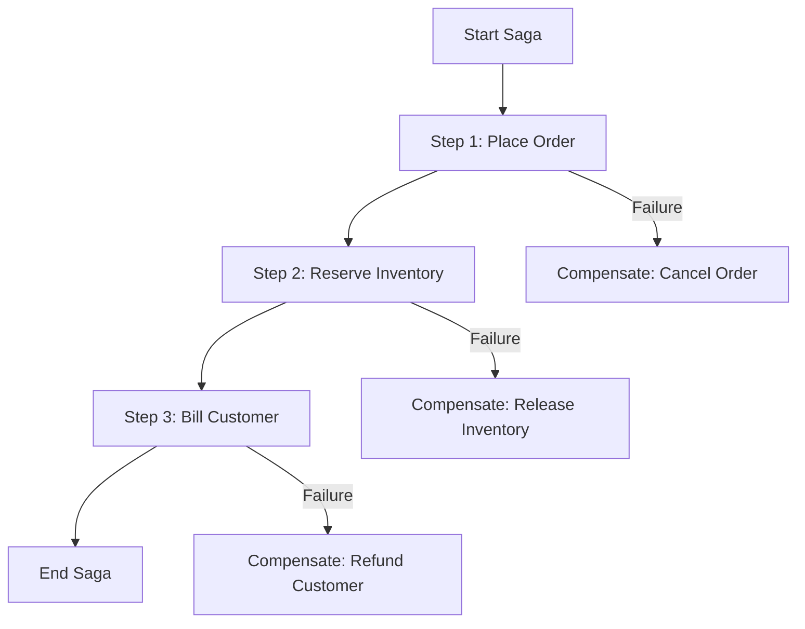

## 11.4 Saga Pattern in Clojure for Microservices

In the realm of microservices, managing distributed transactions is a challenging task due to the lack of a global transaction manager. The Saga pattern offers a solution by coordinating a sequence of local transactions, each with a compensating action to maintain data consistency across multiple services. This article delves into implementing the Saga pattern in Clojure, leveraging its functional programming paradigms to handle distributed transactions effectively.

### Introduction

The Saga pattern is a design pattern that manages distributed transactions by breaking them into a series of smaller, manageable local transactions. Each transaction in the sequence is followed by a compensating transaction that can undo the changes made by the previous transaction if necessary. This approach ensures eventual consistency without the need for distributed transactions, which can be complex and resource-intensive.

### Detailed Explanation

#### Components of the Saga Pattern

1. **Saga Steps:** Each step in a saga represents a local transaction that performs a specific action.
2. **Compensating Actions:** For every saga step, there is a compensating action that can revert the changes made by the step if a failure occurs.
3. **Saga Execution Coordinator:** Manages the execution of saga steps and triggers compensating actions in case of failures.

#### Workflow

The saga pattern executes each step sequentially. If a step fails, the saga coordinator triggers the compensating actions for all previously completed steps in reverse order, ensuring that the system returns to a consistent state.

### Visual Aids

#### Conceptual Diagram



This diagram illustrates the flow of a saga with three steps and their corresponding compensating actions.

### Code Examples

#### Define Saga Steps and Compensations

```clojure
(def saga-definition
  [{:action place-order      :compensate cancel-order}
   {:action reserve-inventory :compensate release-inventory}
   {:action bill-customer    :compensate refund-customer}])
```

#### Implement Saga Execution Function

```clojure
(defn execute-saga [saga context]
  (loop [steps saga completed [] ctx context]
    (if (empty? steps)
      ctx
      (let [{:keys [action compensate]} (first steps)]
        (try
          (let [new-ctx (action ctx)]
            (recur (rest steps) (conj completed {:compensate compensate :ctx new-ctx}) new-ctx))
          (catch Exception e
            (doseq [{:keys [compensate ctx]} (reverse completed)]
              (compensate ctx))
            (throw e)))))))
```

#### Implement Actions and Compensations

- **Action Functions:**

  ```clojure
  (defn place-order [ctx]
    ;; Place order logic
    (println "Order placed")
    (assoc ctx :order-id 123))

  (defn reserve-inventory [ctx]
    ;; Reserve inventory logic
    (println "Inventory reserved")
    (assoc ctx :inventory-id 456))

  (defn bill-customer [ctx]
    ;; Billing logic
    (println "Customer billed")
    (assoc ctx :billing-id 789))
  ```

- **Compensation Functions:**

  ```clojure
  (defn cancel-order [ctx]
    ;; Cancel order logic
    (println "Order canceled"))

  (defn release-inventory [ctx]
    ;; Release inventory logic
    (println "Inventory released"))

  (defn refund-customer [ctx]
    ;; Refund logic
    (println "Customer refunded"))
  ```

#### Execute the Saga

```clojure
(def initial-context {})

(try
  (execute-saga saga-definition initial-context)
  (catch Exception e
    (println "Saga failed:" (.getMessage e))))
```

### Best Practices

1. **Ensure Idempotency:** Actions and compensations should be idempotent to handle retries safely.
2. **Handle Concurrency:** Use locks or other mechanisms to prevent data races and ensure consistency.
3. **Log Saga Progress:** Record the state of each step for auditing and debugging purposes.

### Use Cases

- **Order Processing:** Managing the lifecycle of an order across multiple services, such as inventory, billing, and shipping.
- **Travel Booking:** Coordinating bookings across flights, hotels, and car rentals, with compensations for cancellations.

### Advantages and Disadvantages

**Advantages:**

- Ensures data consistency without distributed transactions.
- Provides a clear rollback mechanism through compensating actions.

**Disadvantages:**

- Increased complexity in managing compensating actions.
- Requires careful design to ensure idempotency and concurrency handling.

### Conclusion

The Saga pattern is a powerful tool for managing distributed transactions in microservices architectures. By leveraging Clojure's functional programming capabilities, developers can implement sagas that are both efficient and reliable. This pattern not only ensures data consistency but also provides a robust mechanism for handling failures gracefully.

## Quiz Time!



### What is the primary purpose of the Saga pattern?

- [x] To manage distributed transactions by coordinating a sequence of local transactions.
- [ ] To provide a global transaction manager for microservices.
- [ ] To replace all local transactions with a single distributed transaction.
- [ ] To eliminate the need for compensating actions.

> **Explanation:** The Saga pattern manages distributed transactions by coordinating a sequence of local transactions, each with a compensating action.

### In the Saga pattern, what is a compensating action?

- [x] An action that undoes changes made by a previous transaction step if necessary.
- [ ] An action that enhances the changes made by a previous transaction step.
- [ ] An action that initiates the next step in the saga.
- [ ] An action that finalizes the saga execution.

> **Explanation:** A compensating action is designed to undo changes made by a previous transaction step in case of a failure.

### How does the Saga pattern ensure data consistency?

- [x] By executing a series of local transactions with compensating actions for rollback.
- [ ] By using a global transaction manager to coordinate all transactions.
- [ ] By ensuring all transactions are idempotent.
- [ ] By using distributed locks to prevent data races.

> **Explanation:** The Saga pattern ensures data consistency by executing local transactions with compensating actions to handle failures.

### What is a key advantage of using the Saga pattern?

- [x] It provides data consistency without using distributed transactions.
- [ ] It eliminates the need for compensating actions.
- [ ] It simplifies the management of distributed transactions.
- [ ] It guarantees immediate consistency across all services.

> **Explanation:** The Saga pattern provides data consistency without the complexity of distributed transactions.

### Which of the following is a best practice when implementing the Saga pattern?

- [x] Ensure actions and compensations are idempotent.
- [ ] Use distributed transactions for all saga steps.
- [ ] Avoid logging saga progress to reduce overhead.
- [ ] Implement compensating actions only if necessary.

> **Explanation:** Ensuring actions and compensations are idempotent is crucial for handling retries safely.

### What is the role of the Saga Execution Coordinator?

- [x] To manage the execution of saga steps and trigger compensating actions if needed.
- [ ] To replace all local transactions with distributed transactions.
- [ ] To ensure all transactions are executed in parallel.
- [ ] To log the progress of each saga step.

> **Explanation:** The Saga Execution Coordinator manages the execution of saga steps and triggers compensating actions in case of failures.

### In a saga, what happens if a step fails?

- [x] Compensating actions are triggered for all previously completed steps.
- [ ] The saga continues with the next step.
- [ ] The entire saga is restarted from the beginning.
- [ ] The failure is ignored, and the saga completes.

> **Explanation:** If a step fails, compensating actions are triggered for all previously completed steps to revert changes.

### What is a disadvantage of the Saga pattern?

- [x] Increased complexity in managing compensating actions.
- [ ] It requires a global transaction manager.
- [ ] It cannot handle distributed transactions.
- [ ] It does not provide data consistency.

> **Explanation:** The Saga pattern increases complexity due to the need to manage compensating actions for each step.

### Why is idempotency important in the Saga pattern?

- [x] To ensure actions and compensations can be safely retried.
- [ ] To eliminate the need for compensating actions.
- [ ] To guarantee immediate consistency.
- [ ] To simplify the saga execution process.

> **Explanation:** Idempotency ensures that actions and compensations can be safely retried without adverse effects.

### True or False: The Saga pattern eliminates the need for compensating actions.

- [ ] True
- [x] False

> **Explanation:** The Saga pattern relies on compensating actions to handle failures and ensure data consistency.


