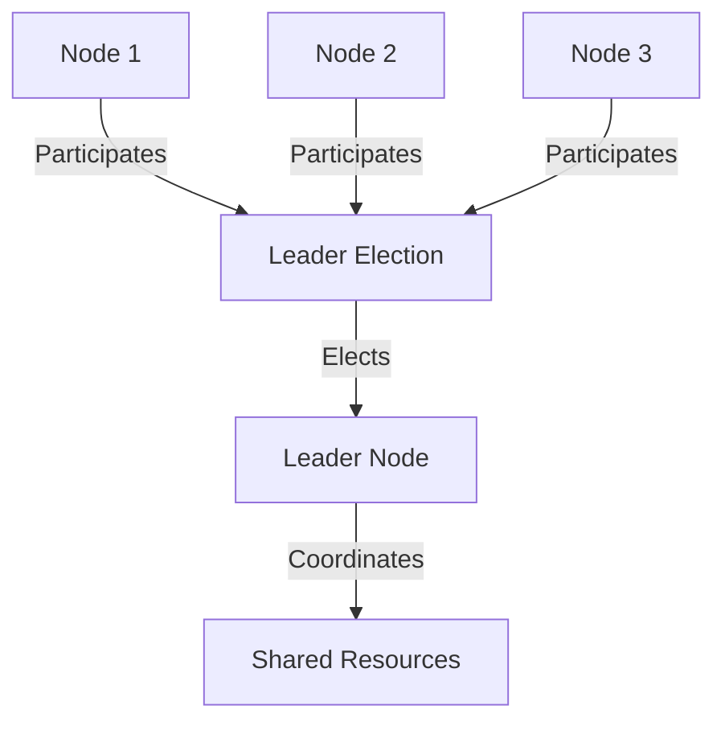

## 11.5 Leader Election in Clojure

In distributed systems, leader election is a critical pattern that allows a cluster of nodes to select a single coordinator, or leader, to manage shared resources and tasks. This ensures that tasks are not duplicated and that there is a clear point of coordination, preventing conflicts and ensuring smooth operation. In this section, we will explore how to implement leader election in Clojure using Apache Curator with ZooKeeper, a popular coordination service.

### Introduction to Leader Election

Leader election is a fundamental concept in distributed systems where multiple nodes need to agree on a single node to act as the leader. This leader is responsible for managing shared resources, coordinating tasks, and making decisions that require consensus. The leader election process ensures that there is always one active leader at any given time, even if the current leader fails or steps down.

### Why Use Leader Election?

- **Conflict Prevention:** Ensures that only one node performs critical tasks, avoiding conflicts.
- **Coordination:** Provides a single point of coordination for distributed tasks.
- **Fault Tolerance:** Automatically elects a new leader if the current one fails, ensuring continuity.

### Implementing Leader Election with ZooKeeper Using Apache Curator

Apache Curator is a high-level library that simplifies the use of ZooKeeper, providing recipes for common patterns like leader election. Below, we will walk through setting up a leader election system using Curator in Clojure.

#### Step 1: Add Dependency

First, add the Curator recipes dependency to your project:

```clojure
;; project.clj
[org.apache.curator/curator-recipes "5.2.1"]
```

#### Step 2: Set Up ZooKeeper Client

Next, set up the ZooKeeper client using Curator:

```clojure
(require '[curator.framework :as curator])

(def client (-> (curator/curator-framework)
                (curator/connect-string "localhost:2181")
                (curator/build)))
(curator/start client)
```

This code initializes a ZooKeeper client that connects to a ZooKeeper server running on `localhost:2181`.

#### Step 3: Create Leader Selector

Create a leader selector that will manage the leader election process:

```clojure
(import '[org.apache.curator.framework.recipes.leader LeaderSelector LeaderSelectorListener])

(defn leader-listener []
  (proxy [LeaderSelectorListener] []
    (takeLeadership [client]
      (println "I am the leader now")
      ;; Perform leader tasks
      ;; Block until leadership is relinquished
      )
    (stateChanged [client newState]
      (println "State changed:" newState))))

(def selector (LeaderSelector. client "/leader-election" (leader-listener)))
(.start selector)
```

In this code, we define a `LeaderSelectorListener` using a proxy. The `takeLeadership` method is called when the node becomes the leader, and it should contain the logic for leader-specific tasks. The `stateChanged` method handles changes in the connection state.

#### Step 4: Implement Leader Tasks

Place the logic for tasks that should be performed by the leader inside the `takeLeadership` method. This could include tasks like managing distributed locks, coordinating task execution, or updating shared state.

#### Step 5: Handle Leadership Re-election

ZooKeeper and Curator handle re-election automatically. If the current leader node fails or releases leadership, another node in the cluster will be elected as the new leader.

#### Step 6: Clean Up on Shutdown

Ensure that resources are properly released when the application shuts down:

```clojure
(.close selector)
(curator/close client)
```

This code closes the leader selector and the ZooKeeper client, ensuring a clean shutdown.

### Alternative Tools and Approaches

While ZooKeeper is a popular choice for leader election, other tools and algorithms can be used:

- **etcd:** A distributed key-value store that supports leader election.
- **Consul:** Provides service discovery and configuration, including leader election.
- **Raft Algorithm:** A consensus algorithm that can be implemented for leader election.

### Visualizing Leader Election

Below is a conceptual diagram illustrating the leader election process in a distributed system:



### Advantages and Disadvantages

**Advantages:**
- Ensures single-point coordination.
- Automatically handles leader failure.
- Simplifies distributed task management.

**Disadvantages:**
- Requires additional infrastructure (e.g., ZooKeeper).
- Can introduce latency in leader re-election.
- Complexity in handling network partitions.

### Best Practices

- **Monitor Leader Health:** Regularly check the health of the leader node to ensure it is functioning correctly.
- **Graceful Leadership Handover:** Implement mechanisms to gracefully hand over leadership to minimize disruption.
- **Use Reliable Coordination Services:** Choose robust and well-supported tools like ZooKeeper or etcd for leader election.

### Conclusion

Leader election is a crucial pattern for managing distributed systems, ensuring that tasks are coordinated and conflicts are avoided. By using Apache Curator with ZooKeeper, Clojure developers can implement leader election efficiently, leveraging the power of these tools to manage distributed coordination seamlessly.

## Quiz Time!



### What is the primary purpose of leader election in distributed systems?

- [x] To select a single node to coordinate tasks and manage resources
- [ ] To increase the number of nodes in the system
- [ ] To reduce the overall system latency
- [ ] To ensure all nodes perform the same tasks simultaneously

> **Explanation:** Leader election selects a single node to coordinate tasks and manage resources, preventing conflicts and ensuring smooth operation.

### Which library is used in Clojure to simplify the use of ZooKeeper for leader election?

- [ ] core.async
- [x] Apache Curator
- [ ] Integrant
- [ ] Specter

> **Explanation:** Apache Curator is a high-level library that simplifies the use of ZooKeeper, providing recipes for common patterns like leader election.

### What method in the LeaderSelectorListener is called when a node becomes the leader?

- [ ] stateChanged
- [x] takeLeadership
- [ ] relinquishLeadership
- [ ] becomeLeader

> **Explanation:** The `takeLeadership` method is called when a node becomes the leader, and it should contain the logic for leader-specific tasks.

### Which of the following is NOT an alternative tool for leader election?

- [ ] etcd
- [ ] Consul
- [x] Redis
- [ ] Raft Algorithm

> **Explanation:** Redis is not typically used for leader election. etcd, Consul, and the Raft Algorithm are alternatives for leader election.

### What is the role of the `stateChanged` method in the LeaderSelectorListener?

- [ ] To perform leader-specific tasks
- [x] To handle changes in the connection state
- [ ] To initiate leader election
- [ ] To close the ZooKeeper client

> **Explanation:** The `stateChanged` method handles changes in the connection state, allowing the application to respond to state transitions.

### Why is it important to clean up resources on shutdown in a leader election setup?

- [x] To ensure a clean shutdown and release of resources
- [ ] To increase the number of leader nodes
- [ ] To prevent other nodes from becoming leaders
- [ ] To reduce network latency

> **Explanation:** Cleaning up resources on shutdown ensures a clean shutdown and release of resources, preventing resource leaks and ensuring system stability.

### Which of the following is a disadvantage of using ZooKeeper for leader election?

- [ ] Ensures single-point coordination
- [ ] Automatically handles leader failure
- [x] Requires additional infrastructure
- [ ] Simplifies distributed task management

> **Explanation:** Using ZooKeeper for leader election requires additional infrastructure, which can be a disadvantage in terms of complexity and cost.

### What is the main advantage of leader election in distributed systems?

- [x] It ensures single-point coordination and prevents conflicts.
- [ ] It increases the number of nodes in the system.
- [ ] It reduces the overall system latency.
- [ ] It ensures all nodes perform the same tasks simultaneously.

> **Explanation:** The main advantage of leader election is that it ensures single-point coordination and prevents conflicts, allowing for efficient management of distributed tasks.

### Which of the following is a best practice for leader election?

- [x] Monitor leader health regularly
- [ ] Increase the number of leader nodes
- [ ] Use unreliable coordination services
- [ ] Avoid graceful leadership handover

> **Explanation:** Monitoring leader health regularly is a best practice to ensure the leader node is functioning correctly and to minimize disruption.

### True or False: Leader election can be implemented using the Raft Algorithm.

- [x] True
- [ ] False

> **Explanation:** True. The Raft Algorithm is a consensus algorithm that can be used for leader election in distributed systems.


