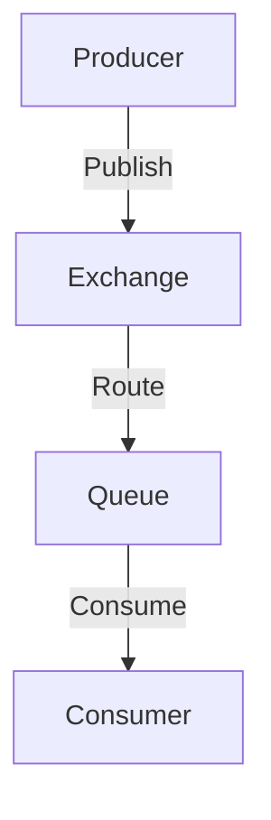
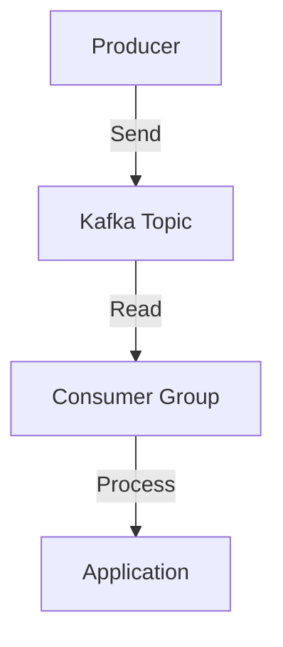

## 11.5. Using Message Brokers (RabbitMQ, Kafka)

In modern software architecture, message brokers play a crucial role in enabling reliable and scalable communication between different components of an application. RabbitMQ and Kafka are two of the most popular message brokers used in the industry today. In this section, we will explore how to integrate these brokers with Clojure, focusing on their primary features, how to connect to them using Clojure libraries, and how to produce and consume messages. We will also discuss patterns such as event sourcing and stream processing, and highlight considerations for performance and fault tolerance.

### Introduction to RabbitMQ and Kafka

#### RabbitMQ

RabbitMQ is an open-source message broker that implements the Advanced Message Queuing Protocol (AMQP). It is known for its reliability, flexibility, and ease of use. RabbitMQ supports multiple messaging patterns, including point-to-point, publish/subscribe, and request/reply. It provides features such as message acknowledgments, routing, and message persistence, making it suitable for a wide range of applications.

**Key Features of RabbitMQ:**

- **Flexible Routing:** RabbitMQ allows messages to be routed through exchanges before reaching queues, supporting complex routing logic.
- **Reliability:** It offers message acknowledgments, persistent messages, and publisher confirms to ensure message delivery.
- **Clustering and High Availability:** RabbitMQ can be deployed in a cluster to provide high availability and fault tolerance.
- **Plugins and Extensibility:** RabbitMQ supports plugins to extend its functionality, such as adding support for different protocols.

#### Kafka

Apache Kafka is a distributed event streaming platform designed for high-throughput, fault-tolerant, and scalable messaging. Kafka is often used for building real-time data pipelines and streaming applications. Unlike traditional message brokers, Kafka stores messages in a distributed log, allowing consumers to read messages at their own pace.

**Key Features of Kafka:**

- **High Throughput:** Kafka is designed to handle large volumes of data with low latency.
- **Scalability:** Kafka can scale horizontally by adding more brokers to the cluster.
- **Durability:** Messages are stored on disk, providing durability and fault tolerance.
- **Stream Processing:** Kafka integrates with stream processing frameworks like Kafka Streams and Apache Flink.

### Connecting to RabbitMQ and Kafka Using Clojure

To interact with RabbitMQ and Kafka from Clojure, we can use libraries that provide idiomatic Clojure interfaces to these brokers. Let's explore how to set up connections and perform basic operations with each broker.

#### Connecting to RabbitMQ

To connect to RabbitMQ from Clojure, we can use the `langohr` library, which is a Clojure client for RabbitMQ. It provides a simple and idiomatic API for interacting with RabbitMQ.

**Installation:**

Add the following dependency to your `project.clj` file:

```clojure
[com.novemberain/langohr "5.0.0"]
```

**Connecting to RabbitMQ:**

```clojure
(ns myapp.rabbitmq
  (:require [langohr.core :as rmq]
            [langohr.channel :as lch]
            [langohr.queue :as lq]
            [langohr.basic :as lb]))

(defn connect []
  (let [conn (rmq/connect {:host "localhost"})
        ch   (lch/open conn)]
    {:connection conn :channel ch}))

(defn close [conn]
  (rmq/close (:connection conn)))
```

**Producing Messages:**

```clojure
(defn publish-message [ch exchange routing-key message]
  (lb/publish ch exchange routing-key (.getBytes message)))
```

**Consuming Messages:**

```clojure
(defn consume-messages [ch queue]
  (lq/subscribe ch queue (fn [ch metadata payload]
                           (println "Received message:" (String. payload)))))
```

#### Connecting to Kafka

For Kafka, we can use the `clj-kafka` library, which provides a Clojure wrapper around the Kafka Java client.

**Installation:**

Add the following dependency to your `project.clj` file:

```clojure
[clj-kafka "0.3.0"]
```

**Connecting to Kafka:**

```clojure
(ns myapp.kafka
  (:require [clj-kafka.producer :as producer]
            [clj-kafka.consumer :as consumer]))

(def producer-config
  {:bootstrap.servers "localhost:9092"
   :key.serializer "org.apache.kafka.common.serialization.StringSerializer"
   :value.serializer "org.apache.kafka.common.serialization.StringSerializer"})

(def consumer-config
  {:bootstrap.servers "localhost:9092"
   :group.id "my-group"
   :key.deserializer "org.apache.kafka.common.serialization.StringDeserializer"
   :value.deserializer "org.apache.kafka.common.serialization.StringDeserializer"
   :auto.offset.reset "earliest"})
```

**Producing Messages:**

```clojure
(defn send-message [topic key value]
  (producer/send producer-config topic key value))
```

**Consuming Messages:**

```clojure
(defn consume-messages [topic]
  (let [consumer (consumer/create consumer-config)]
    (consumer/subscribe consumer [topic])
    (while true
      (let [records (consumer/poll consumer 100)]
        (doseq [record records]
          (println "Received message:" (.value record)))))))
```

### Patterns: Event Sourcing and Stream Processing

#### Event Sourcing

Event sourcing is a pattern where state changes are stored as a sequence of events. This pattern is particularly useful in systems where auditability and traceability are important. Both RabbitMQ and Kafka can be used to implement event sourcing.

**Using Kafka for Event Sourcing:**

Kafka's log-based storage makes it an ideal choice for event sourcing. Each event is stored as a message in a Kafka topic, and consumers can replay these events to reconstruct the state.

**Example:**

```clojure
(defn save-event [event]
  (send-message "events" (:id event) (pr-str event)))

(defn replay-events [process-event]
  (consume-messages "events" process-event))
```

#### Stream Processing

Stream processing involves processing data in real-time as it flows through the system. Kafka's integration with stream processing frameworks makes it a powerful tool for building streaming applications.

**Using Kafka Streams:**

Kafka Streams is a library for building stream processing applications on top of Kafka. It allows you to process data in real-time and build complex data pipelines.

**Example:**

```clojure
(ns myapp.streams
  (:require [clj-kafka.streams :as streams]))

(defn process-stream []
  (let [builder (streams/stream-builder)]
    (streams/stream builder "input-topic")
    (streams/to builder "output-topic")
    (streams/start builder)))
```

### Considerations for Performance and Fault Tolerance

When integrating RabbitMQ and Kafka into your applications, it's important to consider performance and fault tolerance.

#### Performance Considerations

- **Batching:** Both RabbitMQ and Kafka support batching of messages, which can improve throughput.
- **Compression:** Use compression to reduce the size of messages and improve network efficiency.
- **Partitioning:** In Kafka, partitioning can be used to parallelize message processing and improve throughput.

#### Fault Tolerance

- **Replication:** Kafka supports replication of messages across multiple brokers, providing fault tolerance.
- **Acknowledgments:** Use message acknowledgments in RabbitMQ to ensure messages are not lost.
- **Retries:** Implement retry logic to handle transient failures.

### Visualizing Message Flow

To better understand how messages flow through RabbitMQ and Kafka, let's visualize the process using Mermaid.js diagrams.

#### RabbitMQ Message Flow



**Description:** This diagram illustrates the flow of messages in RabbitMQ, where a producer publishes messages to an exchange, which routes them to a queue. Consumers then consume messages from the queue.

#### Kafka Message Flow



**Description:** This diagram shows the flow of messages in Kafka, where a producer sends messages to a Kafka topic. Consumer groups read messages from the topic and process them in the application.

### Try It Yourself

Now that we've covered the basics of using RabbitMQ and Kafka with Clojure, it's time to experiment with the code examples provided. Try modifying the examples to:

- Change the message content and observe how it affects the output.
- Implement a new consumer that processes messages differently.
- Experiment with different configurations for performance tuning.

### External Links

For more information on RabbitMQ and Kafka, visit their official websites:

- [RabbitMQ](https://www.rabbitmq.com/)
- [Kafka](https://kafka.apache.org/)

### Summary

In this section, we've explored how to integrate RabbitMQ and Kafka with Clojure to enable reliable and scalable messaging in applications. We've covered how to connect to these brokers, produce and consume messages, and implement patterns like event sourcing and stream processing. We've also discussed considerations for performance and fault tolerance. By leveraging the power of RabbitMQ and Kafka, you can build robust and scalable messaging systems in your Clojure applications.

## **Ready to Test Your Knowledge?**



### What is RabbitMQ primarily known for?

- [x] Reliability and flexibility
- [ ] High throughput
- [ ] Stream processing
- [ ] Horizontal scalability

> **Explanation:** RabbitMQ is known for its reliability and flexibility, supporting various messaging patterns and features like message acknowledgments and routing.

### Which protocol does RabbitMQ implement?

- [x] AMQP
- [ ] HTTP
- [ ] MQTT
- [ ] WebSocket

> **Explanation:** RabbitMQ implements the Advanced Message Queuing Protocol (AMQP).

### What is a key feature of Kafka?

- [x] High throughput
- [ ] Message routing
- [ ] Request/reply pattern
- [ ] Clustering

> **Explanation:** Kafka is designed for high throughput, handling large volumes of data with low latency.

### Which Clojure library is used to connect to RabbitMQ?

- [x] langohr
- [ ] clj-kafka
- [ ] core.async
- [ ] aleph

> **Explanation:** The `langohr` library is a Clojure client for RabbitMQ.

### What is the purpose of Kafka's log-based storage?

- [x] To allow consumers to read messages at their own pace
- [ ] To provide message routing
- [ ] To enable request/reply messaging
- [ ] To support clustering

> **Explanation:** Kafka's log-based storage allows consumers to read messages at their own pace, making it suitable for event sourcing.

### Which pattern involves storing state changes as a sequence of events?

- [x] Event sourcing
- [ ] Stream processing
- [ ] Request/reply
- [ ] Publish/subscribe

> **Explanation:** Event sourcing involves storing state changes as a sequence of events.

### What is a benefit of using Kafka for event sourcing?

- [x] Log-based storage
- [ ] Message routing
- [ ] Request/reply pattern
- [ ] Clustering

> **Explanation:** Kafka's log-based storage makes it an ideal choice for event sourcing.

### What is a common use case for RabbitMQ?

- [x] Reliable message delivery
- [ ] High throughput
- [ ] Stream processing
- [ ] Horizontal scalability

> **Explanation:** RabbitMQ is commonly used for reliable message delivery, supporting features like message acknowledgments and persistence.

### Which feature of Kafka supports fault tolerance?

- [x] Replication
- [ ] Message routing
- [ ] Request/reply pattern
- [ ] Clustering

> **Explanation:** Kafka supports replication of messages across multiple brokers, providing fault tolerance.

### True or False: Kafka can be used for building real-time data pipelines.

- [x] True
- [ ] False

> **Explanation:** Kafka is often used for building real-time data pipelines and streaming applications.


