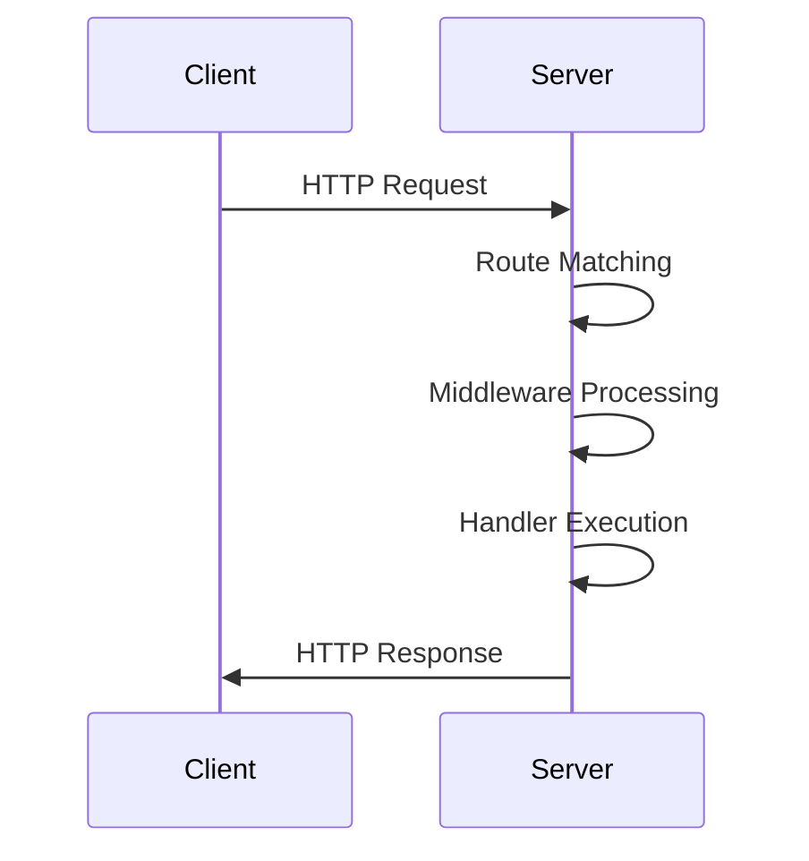

## 11.6. Implementing RESTful APIs with Ring and Compojure

In this section, we will explore how to build RESTful web services in Clojure using Ring and Compojure. These libraries provide a powerful and flexible foundation for creating web applications and APIs in a functional programming style. We will cover the essential concepts of REST, demonstrate how to define routes and handle requests, and discuss best practices for designing resource-oriented APIs. Additionally, we will highlight the use of middleware for handling cross-cutting concerns and address important considerations such as versioning, documentation, and testing.

### Introduction to Ring and Compojure

#### What is Ring?

Ring is a Clojure web application library that provides a simple and unifying interface for handling HTTP requests and responses. It is inspired by Ruby's Rack and Python's WSGI, offering a minimalistic approach to web development. Ring abstracts the HTTP protocol into a Clojure map, making it easy to manipulate requests and responses in a functional manner.

#### What is Compojure?

Compojure is a routing library built on top of Ring that simplifies the process of defining routes and handling HTTP requests. It provides a concise DSL (Domain-Specific Language) for specifying routes and their corresponding handlers, making it easier to build complex web applications and APIs.

### Setting Up a Basic Project

Before we dive into building a RESTful API, let's set up a basic Clojure project using Leiningen, a popular build tool for Clojure.

1. **Create a New Project**: Open your terminal and run the following command to create a new Leiningen project:

   ```bash
   lein new app rest-api-example
   ```

2. **Add Dependencies**: Open the `project.clj` file and add Ring and Compojure as dependencies:

   ```clojure
   (defproject rest-api-example "0.1.0-SNAPSHOT"
     :dependencies [[org.clojure/clojure "1.10.3"]
                    [ring/ring-core "1.9.0"]
                    [ring/ring-jetty-adapter "1.9.0"]
                    [compojure "1.6.2"]])
   ```

3. **Create a Main Namespace**: In the `src/rest_api_example` directory, create a file named `core.clj` and add the following code:

   ```clojure
   (ns rest-api-example.core
     (:require [compojure.core :refer :all]
               [compojure.route :as route]
               [ring.adapter.jetty :refer [run-jetty]]
               [ring.middleware.defaults :refer [wrap-defaults site-defaults]]))

   (defroutes app-routes
     (GET "/" [] "Welcome to the REST API Example!")
     (route/not-found "Not Found"))

   (def app
     (wrap-defaults app-routes site-defaults))

   (defn -main [& args]
     (run-jetty app {:port 3000 :join? false}))
   ```

4. **Run the Application**: Start the application by running the following command in your terminal:

   ```bash
   lein run
   ```

   You should see the message "Welcome to the REST API Example!" when you visit `http://localhost:3000` in your web browser.

### Defining Routes and Handling Requests

With our basic setup complete, let's explore how to define routes and handle requests using Compojure.

#### Defining Routes

Routes in Compojure are defined using macros such as `GET`, `POST`, `PUT`, `DELETE`, etc. Each route is associated with a handler function that processes the request and returns a response.

```clojure
(defroutes app-routes
  (GET "/hello" [] "Hello, World!")
  (POST "/echo" [body] body)
  (PUT "/update" [id] (str "Update resource with ID: " id))
  (DELETE "/delete" [id] (str "Delete resource with ID: " id))
  (route/not-found "Not Found"))
```

- **GET**: Handles HTTP GET requests. The route `/hello` returns a simple "Hello, World!" message.
- **POST**: Handles HTTP POST requests. The route `/echo` echoes back the request body.
- **PUT**: Handles HTTP PUT requests. The route `/update` updates a resource identified by an `id`.
- **DELETE**: Handles HTTP DELETE requests. The route `/delete` deletes a resource identified by an `id`.

#### Handling Requests

Compojure allows you to extract parameters from the request URL, query string, and body using destructuring. This makes it easy to access the data you need to process the request.

```clojure
(POST "/submit" [name age]
  (str "Received submission from " name ", age " age))
```

In this example, the `POST` route `/submit` extracts the `name` and `age` parameters from the request and returns a response string.

### Designing RESTful APIs

REST (Representational State Transfer) is an architectural style for designing networked applications. It relies on stateless communication and uses HTTP methods to perform CRUD (Create, Read, Update, Delete) operations on resources.

#### REST Principles

1. **Statelessness**: Each request from a client contains all the information needed to understand and process the request. The server does not store any session information.

2. **Resource-Oriented**: Resources are identified by URLs, and operations on resources are performed using standard HTTP methods.

3. **Representation**: Resources can have multiple representations, such as JSON, XML, or HTML. Clients can request specific representations using the `Accept` header.

4. **Uniform Interface**: RESTful APIs use a consistent and predictable interface, making it easier for clients to interact with the API.

#### Designing Resource-Oriented APIs

When designing a RESTful API, it's important to focus on resources and their relationships. Each resource should have a unique URL, and operations on resources should be performed using appropriate HTTP methods.

```clojure
(defroutes api-routes
  (GET "/users" [] (get-all-users))
  (GET "/users/:id" [id] (get-user-by-id id))
  (POST "/users" [name email] (create-user name email))
  (PUT "/users/:id" [id name email] (update-user id name email))
  (DELETE "/users/:id" [id] (delete-user id)))
```

- **GET /users**: Retrieves a list of all users.
- **GET /users/:id**: Retrieves a specific user by ID.
- **POST /users**: Creates a new user with the provided name and email.
- **PUT /users/:id**: Updates an existing user with the provided name and email.
- **DELETE /users/:id**: Deletes a user by ID.

### Middleware for Cross-Cutting Concerns

Middleware in Ring is a powerful mechanism for handling cross-cutting concerns such as authentication, logging, and error handling. Middleware functions wrap the application and can modify requests and responses.

#### Using Middleware

To use middleware, you can wrap your application with one or more middleware functions. Ring provides several built-in middleware functions, and you can also create your own.

```clojure
(def app
  (-> app-routes
      (wrap-defaults site-defaults)
      (wrap-logger)
      (wrap-authentication)))
```

- **wrap-defaults**: Provides a set of default middleware for handling common tasks such as session management and content type negotiation.
- **wrap-logger**: Logs incoming requests and outgoing responses.
- **wrap-authentication**: Handles user authentication.

### Considerations for RESTful API Design

When building RESTful APIs, there are several important considerations to keep in mind to ensure your API is robust, maintainable, and easy to use.

#### Versioning

APIs evolve over time, and it's important to manage changes without breaking existing clients. Versioning allows you to introduce changes while maintaining backward compatibility.

- **URL Versioning**: Include the version number in the URL, e.g., `/v1/users`.
- **Header Versioning**: Use a custom header to specify the version, e.g., `X-API-Version: 1`.

#### Documentation

Comprehensive documentation is essential for helping developers understand how to use your API. Consider using tools like Swagger or API Blueprint to generate interactive documentation.

#### Testing

Testing is crucial for ensuring the reliability and correctness of your API. Use tools like `clojure.test` and `midje` for unit testing, and consider using `clj-http` for integration testing.

### Try It Yourself

Now that we've covered the basics of building RESTful APIs with Ring and Compojure, it's time to experiment on your own. Try modifying the code examples to add new routes, implement additional features, or integrate middleware for authentication and logging. As you explore, remember to keep REST principles in mind and strive for a clean, consistent API design.

### Visualizing the Request-Response Flow

To better understand how requests are processed in a Ring and Compojure application, let's visualize the request-response flow using a Mermaid.js diagram.



This diagram illustrates the flow of an HTTP request through a Ring and Compojure application. The request is first matched to a route, then processed by middleware, and finally handled by the appropriate handler function. The response is then sent back to the client.

### References and Links

For further reading and exploration, check out the following resources:

- [Ring GitHub Repository](https://github.com/ring-clojure/ring)
- [Compojure GitHub Repository](https://github.com/weavejester/compojure)
- [RESTful Web Services](https://restfulapi.net/)

### Knowledge Check

To reinforce your understanding of building RESTful APIs with Ring and Compojure, try answering the following questions and challenges.

## **Ready to Test Your Knowledge?**



### What is the primary role of Ring in a Clojure web application?

- [x] To provide a simple interface for handling HTTP requests and responses.
- [ ] To define routes and handle HTTP requests.
- [ ] To manage database connections.
- [ ] To generate HTML templates.

> **Explanation:** Ring provides a simple and unifying interface for handling HTTP requests and responses in Clojure.

### Which library is used for defining routes in a Clojure web application?

- [ ] Ring
- [x] Compojure
- [ ] Leiningen
- [ ] Jetty

> **Explanation:** Compojure is a routing library built on top of Ring, used for defining routes and handling HTTP requests.

### What HTTP method is used to retrieve a resource in a RESTful API?

- [x] GET
- [ ] POST
- [ ] PUT
- [ ] DELETE

> **Explanation:** The GET method is used to retrieve a resource in a RESTful API.

### How can you include versioning in your API URLs?

- [x] By including the version number in the URL, e.g., `/v1/users`.
- [ ] By using a query parameter, e.g., `?version=1`.
- [ ] By using a custom header, e.g., `X-API-Version: 1`.
- [ ] By including the version number in the request body.

> **Explanation:** URL versioning involves including the version number in the URL path, such as `/v1/users`.

### Which middleware function is used for logging requests and responses?

- [ ] wrap-defaults
- [x] wrap-logger
- [ ] wrap-authentication
- [ ] wrap-session

> **Explanation:** The `wrap-logger` middleware function is used for logging incoming requests and outgoing responses.

### What is a key principle of RESTful APIs?

- [x] Statelessness
- [ ] Stateful sessions
- [ ] Client-side storage
- [ ] Server-side rendering

> **Explanation:** Statelessness is a key principle of RESTful APIs, meaning each request contains all the information needed to process it.

### What tool can be used for generating interactive API documentation?

- [ ] Leiningen
- [ ] Jetty
- [x] Swagger
- [ ] Compojure

> **Explanation:** Swagger is a tool that can be used to generate interactive API documentation.

### What is the purpose of middleware in a Ring application?

- [ ] To define routes and handle requests.
- [x] To handle cross-cutting concerns such as authentication and logging.
- [ ] To manage database connections.
- [ ] To generate HTML templates.

> **Explanation:** Middleware in Ring is used to handle cross-cutting concerns such as authentication, logging, and error handling.

### Which HTTP method is used to update a resource in a RESTful API?

- [ ] GET
- [ ] POST
- [x] PUT
- [ ] DELETE

> **Explanation:** The PUT method is used to update a resource in a RESTful API.

### True or False: In a RESTful API, resources are identified by URLs.

- [x] True
- [ ] False

> **Explanation:** In a RESTful API, resources are identified by URLs, and operations on resources are performed using standard HTTP methods.



Remember, this is just the beginning. As you progress, you'll build more complex and interactive web services. Keep experimenting, stay curious, and enjoy the journey!
