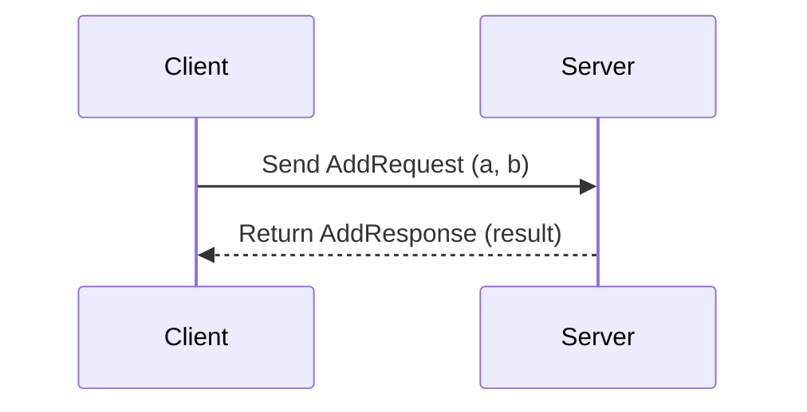

## 11.7. gRPC and Protobuf Integration in Clojure

In today's interconnected world, building applications that can communicate efficiently across different languages and platforms is crucial. gRPC and Protocol Buffers (Protobuf) are powerful tools that enable high-performance, cross-language communication. In this section, we will explore how to integrate these technologies with Clojure, leveraging libraries like [clojure-grpc](https://github.com/penpot/clojure-grpc) to build robust and efficient systems.

### Understanding gRPC and Protocol Buffers

**gRPC** is a modern, open-source remote procedure call (RPC) framework developed by Google. It uses HTTP/2 for transport, Protocol Buffers as the interface description language, and provides features such as authentication, load balancing, and more. gRPC is designed for high-performance and low-latency communication, making it ideal for microservices and distributed systems.

**Protocol Buffers (Protobuf)** is a language-agnostic, platform-neutral, extensible mechanism for serializing structured data. It is used by gRPC to define service interfaces and messages, ensuring efficient serialization and deserialization across different programming languages.

### Benefits of Using gRPC Over Traditional REST

1. **Performance**: gRPC uses HTTP/2, which allows for multiplexing multiple requests over a single connection, reducing latency and improving throughput.
2. **Strong Typing**: Protobuf provides a strongly-typed schema, reducing errors and improving code quality.
3. **Bi-directional Streaming**: gRPC supports streaming requests and responses, enabling real-time data exchange.
4. **Cross-Language Support**: gRPC and Protobuf support multiple languages, making it easier to build polyglot systems.
5. **Built-in Code Generation**: Protobuf generates client and server code, reducing boilerplate and ensuring consistency.

### Setting Up gRPC and Protobuf in Clojure

To integrate gRPC and Protobuf in Clojure, we will use the [clojure-grpc](https://github.com/penpot/clojure-grpc) library, which provides a Clojure-friendly interface for working with gRPC.

#### Step 1: Install Dependencies

First, add the necessary dependencies to your `project.clj` or `deps.edn` file:

```clojure
;; project.clj
(defproject my-grpc-project "0.1.0-SNAPSHOT"
  :dependencies [[org.clojure/clojure "1.10.3"]
                 [clojure-grpc "0.1.0"]])
```

```clojure
;; deps.edn
{:deps {org.clojure/clojure {:mvn/version "1.10.3"}
        clojure-grpc {:mvn/version "0.1.0"}}}
```

#### Step 2: Define Protobuf Messages and Services

Create a `.proto` file to define your service and messages. For example, let's define a simple service for a calculator:

```protobuf
syntax = "proto3";

package calculator;

// Define the service
service Calculator {
  rpc Add (AddRequest) returns (AddResponse);
}

// Define the request message
message AddRequest {
  int32 a = 1;
  int32 b = 2;
}

// Define the response message
message AddResponse {
  int32 result = 1;
}
```

#### Step 3: Generate Clojure Code

Use the Protobuf compiler (`protoc`) to generate Clojure code from your `.proto` file. Ensure you have the `protoc` tool installed on your system.

```bash
protoc --clojure_out=src --proto_path=proto proto/calculator.proto
```

This command will generate Clojure code in the `src` directory based on the definitions in `calculator.proto`.

#### Step 4: Implement the gRPC Server

Now, let's implement the gRPC server in Clojure using the generated code:

```clojure
(ns my-grpc-project.server
  (:require [clojure-grpc.server :as grpc-server]
            [calculator.Calculator :as calc]))

(defn add-handler [request]
  (let [a (:a request)
        b (:b request)
        result (+ a b)]
    {:result result}))

(defn start-server []
  (grpc-server/start
    {:port 50051
     :services {calc/Calculator {:Add add-handler}}}))

(defn -main []
  (start-server)
  (println "gRPC server running on port 50051"))
```

#### Step 5: Implement the gRPC Client

Next, let's create a client to interact with the server:

```clojure
(ns my-grpc-project.client
  (:require [clojure-grpc.client :as grpc-client]
            [calculator.Calculator :as calc]))

(defn add [a b]
  (let [client (grpc-client/connect "localhost:50051")
        request {:a a :b b}
        response (grpc-client/invoke client calc/Calculator :Add request)]
    (:result response)))

(defn -main []
  (println "Result of 3 + 5:" (add 3 5)))
```

### Challenges and Solutions in Integrating gRPC with Clojure

1. **Tooling and Setup**: Setting up the Protobuf compiler and generating Clojure code can be challenging. Ensure you have the correct version of `protoc` and the necessary plugins installed.

2. **Error Handling**: gRPC provides detailed error codes and messages. Implement robust error handling in your Clojure code to manage network failures and service errors gracefully.

3. **Streaming Support**: Implementing streaming in Clojure requires careful management of asynchronous data flows. Use core.async or similar libraries to handle streaming data efficiently.

4. **Performance Tuning**: Optimize your gRPC services by tuning HTTP/2 settings and managing connection pools effectively.

### Visualizing gRPC Communication

To better understand how gRPC facilitates communication between client and server, let's visualize the process using a sequence diagram:



This diagram illustrates the simple request-response cycle in a gRPC communication, where the client sends an `AddRequest` to the server, and the server responds with an `AddResponse`.

### Try It Yourself

To deepen your understanding, try modifying the code examples:

- Add more operations to the `Calculator` service, such as subtraction, multiplication, and division.
- Implement error handling for invalid inputs or server errors.
- Experiment with bi-directional streaming by creating a chat service.

### External Resources

For further reading and exploration, consider the following resources:

- [gRPC Official Documentation](https://grpc.io/)
- [Protocol Buffers Documentation](https://developers.google.com/protocol-buffers)
- [clojure-grpc GitHub Repository](https://github.com/penpot/clojure-grpc)

### Summary

Integrating gRPC and Protobuf with Clojure provides a powerful way to build high-performance, cross-language applications. By leveraging the strengths of gRPC and Protobuf, you can create efficient, scalable systems that communicate seamlessly across different platforms. Remember, this is just the beginning. As you progress, you'll discover more advanced patterns and techniques to enhance your applications. Keep experimenting, stay curious, and enjoy the journey!

## **Ready to Test Your Knowledge?**



### What is gRPC?

- [x] A modern, open-source remote procedure call (RPC) framework.
- [ ] A database management system.
- [ ] A programming language.
- [ ] A web development framework.

> **Explanation:** gRPC is a modern, open-source remote procedure call (RPC) framework developed by Google.

### What is the primary transport protocol used by gRPC?

- [x] HTTP/2
- [ ] HTTP/1.1
- [ ] FTP
- [ ] SMTP

> **Explanation:** gRPC uses HTTP/2 as its transport protocol, which allows for multiplexing multiple requests over a single connection.

### What is Protocol Buffers?

- [x] A language-agnostic, platform-neutral mechanism for serializing structured data.
- [ ] A web server.
- [ ] A database query language.
- [ ] A front-end framework.

> **Explanation:** Protocol Buffers is a language-agnostic, platform-neutral, extensible mechanism for serializing structured data.

### Which library is used for gRPC integration in Clojure?

- [x] clojure-grpc
- [ ] clojure-http
- [ ] clojure-db
- [ ] clojure-web

> **Explanation:** The `clojure-grpc` library is used for gRPC integration in Clojure.

### What is one advantage of gRPC over traditional REST?

- [x] Bi-directional streaming support.
- [ ] Uses XML for data serialization.
- [ ] Requires less setup than REST.
- [ ] Only works with Java applications.

> **Explanation:** One advantage of gRPC over traditional REST is its support for bi-directional streaming, enabling real-time data exchange.

### How do you define services and messages in gRPC?

- [x] Using Protocol Buffers (.proto files).
- [ ] Using XML configuration files.
- [ ] Using JSON schemas.
- [ ] Using YAML files.

> **Explanation:** Services and messages in gRPC are defined using Protocol Buffers (.proto files).

### What command is used to generate Clojure code from a .proto file?

- [x] protoc --clojure_out=src --proto_path=proto proto/calculator.proto
- [ ] clj --generate=proto
- [ ] grpc-gen --clojure
- [ ] proto-gen --clj

> **Explanation:** The `protoc` command is used to generate Clojure code from a .proto file.

### What is a common challenge when integrating gRPC with Clojure?

- [x] Tooling and setup for Protobuf compiler.
- [ ] Lack of support for HTTP/2.
- [ ] Incompatibility with Java.
- [ ] Difficulty in defining REST endpoints.

> **Explanation:** A common challenge when integrating gRPC with Clojure is the tooling and setup for the Protobuf compiler.

### What is the purpose of the `clojure-grpc` library?

- [x] To provide a Clojure-friendly interface for working with gRPC.
- [ ] To manage database connections.
- [ ] To create web applications.
- [ ] To handle file I/O operations.

> **Explanation:** The `clojure-grpc` library provides a Clojure-friendly interface for working with gRPC.

### gRPC supports bi-directional streaming. True or False?

- [x] True
- [ ] False

> **Explanation:** gRPC supports bi-directional streaming, allowing for real-time data exchange between client and server.


