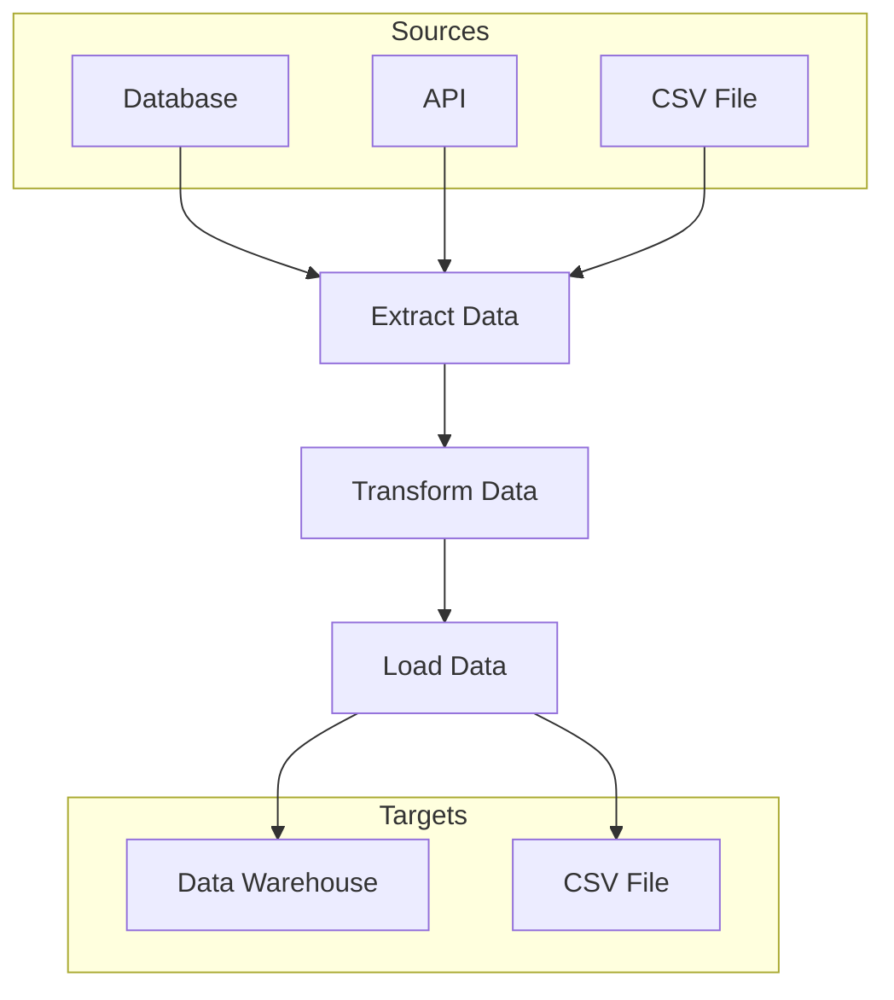

## 11.8. Batch Processing and ETL Pipelines

In the realm of data engineering, batch processing and ETL (Extract, Transform, Load) pipelines are crucial for handling large volumes of data efficiently. Clojure, with its functional programming paradigm and robust ecosystem, offers powerful tools and libraries to build scalable and reliable data processing systems. In this section, we will explore the challenges of batch processing and ETL, discuss tools like Onyx and Apache Beam, and provide examples and best practices for building efficient data pipelines in Clojure.

### Understanding Batch Processing and ETL

**Batch Processing** involves processing large volumes of data in groups or batches, typically at scheduled intervals. This approach is ideal for tasks that do not require real-time processing, such as generating reports, performing data backups, or processing large datasets for analytics.

**ETL Pipelines** are a specific type of batch processing where data is extracted from various sources, transformed into a suitable format, and loaded into a target system, such as a data warehouse. ETL processes are essential for data integration, ensuring that data from disparate sources is harmonized and made available for analysis.

#### Challenges of Batch Processing and ETL

1. **Scalability**: Handling large datasets efficiently requires scalable architectures that can distribute processing across multiple nodes.
2. **Reliability**: Ensuring data integrity and consistency throughout the ETL process is critical.
3. **Performance**: Optimizing data processing to minimize latency and maximize throughput.
4. **Complexity**: Managing dependencies and orchestrating complex workflows can be challenging.
5. **Error Handling**: Implementing robust error handling and recovery mechanisms to deal with failures.

### Tools and Libraries for Batch Processing and ETL in Clojure

#### Onyx

[Onyx](http://www.onyxplatform.org/) is a distributed, masterless, fault-tolerant data processing system designed for high-throughput and low-latency workloads. It is particularly well-suited for building complex ETL pipelines in Clojure.

- **Key Features**:
  - **Flexible Data Model**: Supports both batch and stream processing.
  - **Fault Tolerance**: Built-in mechanisms for handling failures and ensuring data consistency.
  - **Scalability**: Easily scales to handle large volumes of data across distributed systems.
  - **Extensibility**: Highly customizable with support for user-defined functions and plugins.

#### Apache Beam

[Apache Beam](https://beam.apache.org/) is a unified model for defining both batch and streaming data processing pipelines. It provides a rich set of APIs and integrates with various execution engines, such as Apache Flink, Apache Spark, and Google Cloud Dataflow.

- **Key Features**:
  - **Unified Programming Model**: Write once, run anywhere approach for both batch and streaming data.
  - **Portability**: Supports multiple runners, allowing you to choose the best execution engine for your needs.
  - **Rich Ecosystem**: Extensive library of connectors and transforms for common data processing tasks.

### Building ETL Pipelines with Clojure

#### Extracting Data

The first step in an ETL pipeline is extracting data from various sources. This can include databases, APIs, files, and more. In Clojure, you can use libraries like `clojure.java.jdbc` for database access, `clj-http` for HTTP requests, and `clojure.data.csv` for reading CSV files.

```clojure
(require '[clojure.java.jdbc :as jdbc])
(require '[clj-http.client :as http])
(require '[clojure.data.csv :as csv])
(require '[clojure.java.io :as io])

;; Example: Extract data from a database
(def db-spec {:dbtype "postgresql" :dbname "mydb" :user "user" :password "pass"})

(defn extract-from-db []
  (jdbc/query db-spec ["SELECT * FROM my_table"]))

;; Example: Extract data from an API
(defn extract-from-api []
  (let [response (http/get "https://api.example.com/data")]
    (-> response :body)))

;; Example: Extract data from a CSV file
(defn extract-from-csv [file-path]
  (with-open [reader (io/reader file-path)]
    (doall
      (csv/read-csv reader))))
```

#### Transforming Data

Data transformation involves cleaning, filtering, and aggregating data to prepare it for loading. Clojure's functional programming features, such as higher-order functions and transducers, make it ideal for data transformation tasks.

```clojure
;; Example: Transform data using map and filter
(defn transform-data [data]
  (->> data
       (map #(update % :value inc)) ; Increment the value field
       (filter #(> (:value %) 10)))) ; Filter out values less than or equal to 10

;; Example: Use transducers for efficient transformation
(defn transform-with-transducers [data]
  (transduce
    (comp (map #(update % :value inc))
          (filter #(> (:value %) 10)))
    conj
    []
    data))
```

#### Loading Data

The final step in an ETL pipeline is loading the transformed data into a target system. This could be a database, a data warehouse, or a file system. Clojure provides various libraries for interacting with different data stores.

```clojure
;; Example: Load data into a database
(defn load-to-db [data]
  (jdbc/insert-multi! db-spec :my_table data))

;; Example: Write data to a CSV file
(defn load-to-csv [file-path data]
  (with-open [writer (io/writer file-path)]
    (csv/write-csv writer data)))
```

### Patterns for Data Transformation, Aggregation, and Loading

1. **Map-Reduce Pattern**: Use map and reduce functions to transform and aggregate data in parallel.
2. **Pipeline Pattern**: Chain multiple transformations together using function composition or transducers.
3. **Batch Processing Pattern**: Process data in fixed-size batches to optimize resource usage and performance.
4. **Streaming Pattern**: Use streaming libraries like Onyx or Apache Beam to process data in real-time.

### Best Practices for Reliability and Scalability

1. **Idempotency**: Ensure that operations can be safely retried without causing duplicate effects.
2. **Fault Tolerance**: Implement mechanisms for detecting and recovering from failures, such as retries and checkpoints.
3. **Scalability**: Design your pipeline to scale horizontally by distributing processing across multiple nodes.
4. **Monitoring and Logging**: Use logging and monitoring tools to track the performance and health of your pipeline.
5. **Data Validation**: Validate data at each stage of the pipeline to catch errors early and ensure data quality.

### Visualizing ETL Pipeline Architecture

Below is a diagram illustrating a typical ETL pipeline architecture using Clojure:



**Diagram Description**: This flowchart represents a typical ETL pipeline architecture. Data is extracted from various sources, transformed, and then loaded into target systems.

### Try It Yourself

Experiment with the code examples provided by modifying the data transformation logic or changing the data sources and targets. For instance, try adding a new transformation step that normalizes data or integrates a new data source like a JSON API.

### References and Further Reading

- [Onyx Platform Documentation](http://www.onyxplatform.org/docs)
- [Apache Beam Documentation](https://beam.apache.org/documentation/)
- [Clojure Java JDBC](https://clojure.github.io/java.jdbc/)
- [Clojure Data CSV](https://github.com/clojure/data.csv)

### Knowledge Check

Reflect on the concepts covered in this section and consider the following questions:

- How can you ensure data consistency in an ETL pipeline?
- What are the advantages of using Onyx for batch processing in Clojure?
- How can transducers improve the efficiency of data transformations?

### Summary

In this section, we explored the challenges and solutions for building batch processing and ETL pipelines in Clojure. We discussed tools like Onyx and Apache Beam, provided examples of data extraction, transformation, and loading, and highlighted best practices for reliability and scalability. Remember, this is just the beginning. As you progress, you'll build more complex and efficient data pipelines. Keep experimenting, stay curious, and enjoy the journey!

## **Ready to Test Your Knowledge?**



### What is the primary purpose of an ETL pipeline?

- [x] To extract, transform, and load data from various sources into a target system
- [ ] To execute real-time data processing
- [ ] To handle user authentication
- [ ] To manage network communications

> **Explanation:** An ETL pipeline is designed to extract data from various sources, transform it into a suitable format, and load it into a target system for analysis or storage.

### Which Clojure library is commonly used for database access in ETL pipelines?

- [x] clojure.java.jdbc
- [ ] clj-http
- [ ] clojure.data.csv
- [ ] core.async

> **Explanation:** `clojure.java.jdbc` is a library used for interacting with databases in Clojure, making it suitable for data extraction in ETL pipelines.

### What is a key feature of Onyx for data processing?

- [x] Fault tolerance
- [ ] Real-time user interface
- [ ] Image processing
- [ ] Video streaming

> **Explanation:** Onyx is designed to be fault-tolerant, ensuring data consistency and reliability in distributed data processing systems.

### How can transducers improve data transformation efficiency?

- [x] By reducing intermediate data structures
- [ ] By increasing network bandwidth
- [ ] By enhancing graphical rendering
- [ ] By optimizing memory allocation

> **Explanation:** Transducers allow for efficient data transformation by eliminating the need for intermediate data structures, thus improving performance.

### What is a common pattern for processing data in parallel?

- [x] Map-Reduce Pattern
- [ ] Singleton Pattern
- [ ] Observer Pattern
- [ ] Factory Pattern

> **Explanation:** The Map-Reduce Pattern is commonly used for parallel data processing, allowing for distributed computation across multiple nodes.

### Which tool provides a unified model for both batch and streaming data processing?

- [x] Apache Beam
- [ ] Onyx
- [ ] Leiningen
- [ ] Ring

> **Explanation:** Apache Beam offers a unified programming model that supports both batch and streaming data processing, making it versatile for various use cases.

### What is the advantage of idempotency in ETL operations?

- [x] Operations can be safely retried without causing duplicate effects
- [ ] It increases the speed of data processing
- [ ] It enhances graphical user interfaces
- [ ] It reduces the need for error handling

> **Explanation:** Idempotency ensures that operations can be retried without causing duplicate effects, which is crucial for maintaining data consistency in ETL pipelines.

### Which of the following is a best practice for ensuring ETL pipeline reliability?

- [x] Implementing fault tolerance mechanisms
- [ ] Using synchronous data processing
- [ ] Avoiding data validation
- [ ] Minimizing logging

> **Explanation:** Implementing fault tolerance mechanisms is essential for ensuring the reliability and robustness of ETL pipelines, allowing them to recover from failures gracefully.

### What does the "Load" step in ETL involve?

- [x] Loading transformed data into a target system
- [ ] Extracting data from a source
- [ ] Transforming data into a new format
- [ ] Validating data integrity

> **Explanation:** The "Load" step in ETL involves loading the transformed data into a target system, such as a database or data warehouse.

### True or False: Onyx is specifically designed for real-time user interface development.

- [ ] True
- [x] False

> **Explanation:** False. Onyx is designed for distributed data processing, not specifically for real-time user interface development.


