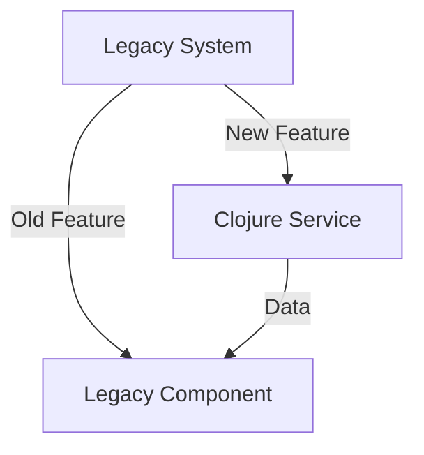

## 11.9. Handling Legacy Systems

Legacy systems are often the backbone of many organizations, providing critical functionality that has been developed and refined over many years. However, these systems can become a bottleneck, limiting innovation and agility. In this section, we will explore strategies for integrating with or migrating from legacy systems using Clojure, ensuring minimal disruption and maximizing value.

### Understanding the Challenges of Legacy Systems

Legacy systems are typically characterized by outdated technology stacks, monolithic architectures, and a lack of documentation. These systems can be difficult to maintain and extend, often requiring specialized knowledge that may no longer be readily available. Key challenges include:

- **Technical Debt**: Accumulated inefficiencies and outdated practices that make changes risky and costly.
- **Integration Complexity**: Difficulty in interfacing with modern systems and technologies.
- **Performance Limitations**: Inability to scale or meet current performance expectations.
- **Security Vulnerabilities**: Exposure to security risks due to outdated software and practices.

### Techniques for Interfacing with Legacy Codebases

When dealing with legacy systems, it is often necessary to interface with existing codebases. Clojure, with its strong interoperability with Java, provides several techniques for achieving this:

#### 1. **Java Interoperability**

Clojure runs on the Java Virtual Machine (JVM), which allows seamless integration with Java libraries and applications. This interoperability can be leveraged to interface with legacy Java codebases.

```clojure
(ns legacy-integration.core
  (:import (legacy.system LegacyClass)))

(defn call-legacy-method []
  (let [legacy-instance (LegacyClass.)]
    (.legacyMethod legacy-instance)))
```

In this example, we import a class from a legacy Java system and call its method from Clojure. This approach allows us to gradually introduce Clojure into a Java-based legacy system.

#### 2. **RESTful APIs**

Many legacy systems expose functionality through RESTful APIs. Clojure's rich ecosystem of HTTP libraries, such as `clj-http`, can be used to interact with these APIs.

```clojure
(require '[clj-http.client :as client])

(defn fetch-legacy-data []
  (let [response (client/get "http://legacy-system/api/data")]
    (:body response)))
```

This code snippet demonstrates how to fetch data from a legacy system's API using Clojure.

#### 3. **Message Queues**

Message queues, such as RabbitMQ or Kafka, can be used to decouple systems and facilitate communication between Clojure applications and legacy systems.

```clojure
(require '[clojure.core.async :refer [go <! >! chan]])

(defn process-legacy-messages [queue]
  (go (while true
        (let [message (<! queue)]
          (println "Processing message:" message)))))
```

Using Clojure's `core.async`, we can process messages from a queue that interfaces with a legacy system.

### Methods for Gradual Migration to Clojure

Migrating from a legacy system to Clojure should be approached gradually to minimize risk and disruption. Here are some methods to consider:

#### 1. **Strangler Application Pattern**

The strangler application pattern involves gradually replacing parts of a legacy system with new functionality written in Clojure. This pattern allows for incremental migration without a complete system overhaul.



*Diagram: Strangler Application Pattern*

In this diagram, new features are implemented in Clojure and gradually replace old features in the legacy system.

#### 2. **Anti-Corruption Layer**

The anti-corruption layer pattern involves creating a boundary between the legacy system and new Clojure components. This layer translates between the two systems, allowing them to coexist without direct integration.

```clojure
(defn legacy-to-clojure [legacy-data]
  ;; Transform legacy data to Clojure-friendly format
  )

(defn clojure-to-legacy [clojure-data]
  ;; Transform Clojure data to legacy format
  )
```

This code snippet shows how to implement an anti-corruption layer that transforms data between legacy and Clojure systems.

#### 3. **Feature Toggles**

Feature toggles allow new Clojure features to be deployed alongside legacy features, enabling gradual rollout and testing.

```clojure
(defn feature-enabled? [feature]
  ;; Check if the feature is enabled
  )

(defn process-request [request]
  (if (feature-enabled? :new-feature)
    (process-with-clojure request)
    (process-with-legacy request)))
```

This approach allows for controlled experimentation and rollback if necessary.

### Patterns for Legacy System Integration

Several design patterns can facilitate the integration of Clojure with legacy systems:

#### 1. **Adapter Pattern**

The adapter pattern can be used to wrap legacy components, providing a Clojure-friendly interface.

```clojure
(defprotocol LegacyAdapter
  (adapt [this]))

(defrecord LegacyComponentAdapter [legacy-component]
  LegacyAdapter
  (adapt [this]
    ;; Adapt legacy component to Clojure
    ))
```

#### 2. **Facade Pattern**

The facade pattern provides a simplified interface to complex legacy systems, making them easier to interact with from Clojure.

```clojure
(defn legacy-facade []
  ;; Provide a simplified interface to legacy system
  )
```

### Emphasizing Careful Planning and Testing

When dealing with legacy systems, careful planning and testing are crucial. Here are some best practices:

- **Comprehensive Testing**: Ensure thorough testing of new Clojure components and their interactions with legacy systems.
- **Incremental Changes**: Implement changes incrementally to reduce risk and facilitate rollback if necessary.
- **Documentation**: Maintain clear documentation of integration points and migration strategies.
- **Stakeholder Communication**: Keep stakeholders informed of progress and potential impacts.

### Conclusion

Handling legacy systems is a complex but rewarding challenge. By leveraging Clojure's strengths and following best practices, we can integrate with or migrate from legacy systems effectively. Remember, this is just the beginning. As you progress, you'll build more robust and modern systems. Keep experimenting, stay curious, and enjoy the journey!

## **Ready to Test Your Knowledge?**



### What is a key challenge of working with legacy systems?

- [x] Technical Debt
- [ ] Modern Technology Stack
- [ ] Easy Integration
- [ ] High Scalability

> **Explanation:** Legacy systems often have accumulated inefficiencies and outdated practices, known as technical debt, which make changes risky and costly.

### Which Clojure feature allows seamless integration with Java libraries?

- [x] Java Interoperability
- [ ] RESTful APIs
- [ ] Message Queues
- [ ] Core.Async

> **Explanation:** Clojure runs on the JVM, allowing seamless integration with Java libraries and applications through Java interoperability.

### What pattern involves gradually replacing parts of a legacy system with new functionality?

- [x] Strangler Application Pattern
- [ ] Anti-Corruption Layer
- [ ] Adapter Pattern
- [ ] Facade Pattern

> **Explanation:** The strangler application pattern involves gradually replacing parts of a legacy system with new functionality, allowing for incremental migration.

### What is the purpose of an anti-corruption layer?

- [x] To create a boundary between legacy and new systems
- [ ] To replace legacy systems entirely
- [ ] To simplify legacy system interfaces
- [ ] To enable direct integration with legacy systems

> **Explanation:** An anti-corruption layer creates a boundary between legacy and new systems, translating between them to allow coexistence without direct integration.

### Which pattern provides a simplified interface to complex legacy systems?

- [x] Facade Pattern
- [ ] Adapter Pattern
- [ ] Strangler Application Pattern
- [ ] Anti-Corruption Layer

> **Explanation:** The facade pattern provides a simplified interface to complex legacy systems, making them easier to interact with from Clojure.

### What is a benefit of using feature toggles?

- [x] Gradual rollout and testing of new features
- [ ] Immediate replacement of legacy features
- [ ] Direct integration with legacy systems
- [ ] Simplified legacy system interfaces

> **Explanation:** Feature toggles allow new features to be deployed alongside legacy features, enabling gradual rollout and testing.

### What is a best practice when dealing with legacy systems?

- [x] Comprehensive Testing
- [ ] Immediate System Overhaul
- [ ] Minimal Documentation
- [ ] Stakeholder Isolation

> **Explanation:** Comprehensive testing is crucial when dealing with legacy systems to ensure thorough testing of new components and their interactions with legacy systems.

### Which Clojure library can be used to interact with RESTful APIs?

- [x] clj-http
- [ ] core.async
- [ ] Leiningen
- [ ] Ring

> **Explanation:** The `clj-http` library can be used to interact with RESTful APIs in Clojure.

### What is a common characteristic of legacy systems?

- [x] Outdated Technology Stack
- [ ] Modern Architecture
- [ ] High Scalability
- [ ] Easy Maintenance

> **Explanation:** Legacy systems are often characterized by outdated technology stacks, making them difficult to maintain and extend.

### True or False: The adapter pattern can be used to wrap legacy components, providing a Clojure-friendly interface.

- [x] True
- [ ] False

> **Explanation:** The adapter pattern can be used to wrap legacy components, providing a Clojure-friendly interface to facilitate integration.


