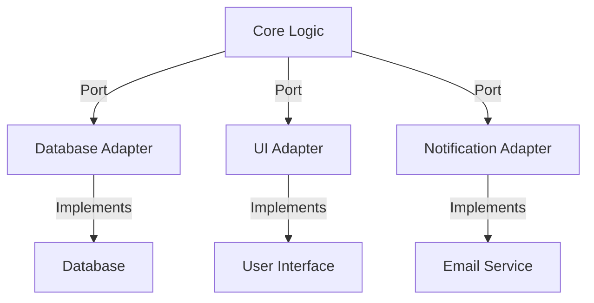

## 12.1 Hexagonal Architecture (Ports and Adapters) in Clojure

Hexagonal Architecture, also known as Ports and Adapters, is a design pattern that aims to decouple the core business logic of an application from external concerns such as databases, user interfaces, or messaging systems. This architecture promotes flexibility, testability, and maintainability by isolating changes in external systems from the core domain logic.

### Introduction

Hexagonal Architecture was introduced by Alistair Cockburn to address the challenges of building software that is adaptable to change. By separating the core logic from external dependencies, the architecture allows for easier testing and maintenance. In Clojure, this pattern can be effectively implemented using namespaces, protocols, and records.

### Detailed Explanation

#### Core Concepts

- **Ports:** Interfaces or protocols that define how the core interacts with external systems. They act as the entry and exit points for the application logic.
- **Adapters:** Implementations of the ports that connect the core logic to specific technologies or frameworks. They translate between the core's language and the external system's language.

#### Architectural Diagram

Below is a conceptual diagram illustrating the Hexagonal Architecture:



### Implementing Hexagonal Architecture in Clojure

#### Define Core Domain Logic Separately

The core domain logic should be defined in a separate namespace without dependencies on external systems. This ensures that the business logic remains pure and testable.

```clojure
;; src/myapp/domain.clj
(ns myapp.domain)

(defn process-order [order repository notifier]
  ;; Business logic that processes an order
  (repository/save-order repository order)
  (notifier/send-notification notifier "Order processed"))
```

#### Define Ports Using Protocols

Protocols in Clojure are used to define the interfaces for external interactions. They specify the methods that need to be implemented by any adapter.

```clojure
;; src/myapp/ports.clj
(ns myapp.ports)

(defprotocol OrderRepository
  (save-order [this order])
  (get-order [this order-id]))

(defprotocol Notifier
  (send-notification [this message]))
```

#### Implement Adapters for Each Port

Adapters are specific implementations of the ports. They handle the interaction with external systems.

- **Database Adapter Example:**

```clojure
;; src/myapp/adapters/database.clj
(ns myapp.adapters.database
  (:require [myapp.ports :refer [OrderRepository]]
            [clojure.java.jdbc :as jdbc]))

(defrecord DatabaseAdapter [db-spec]
  OrderRepository
  (save-order [this order]
    (jdbc/insert! db-spec :orders order))
  (get-order [this order-id]
    (first (jdbc/query db-spec ["SELECT * FROM orders WHERE id=?" order-id]))))
```

- **Notification Adapter Example:**

```clojure
;; src/myapp/adapters/notifier.clj
(ns myapp.adapters.notifier
  (:require [myapp.ports :refer [Notifier]]))

(defrecord EmailNotifier [smtp-config]
  Notifier
  (send-notification [this message]
    ;; Implementation to send email
    ))
```

#### Compose the Application at the Boundaries

At the application's entry point, inject the adapters into the core functions. This composition allows the core logic to remain agnostic of the specific technologies used.

```clojure
;; src/myapp/app.clj
(ns myapp.app
  (:require [myapp.domain :refer [process-order]]
            [myapp.adapters.database :refer [->DatabaseAdapter]]
            [myapp.adapters.notifier :refer [->EmailNotifier]]))

(defn -main []
  (let [db-adapter (->DatabaseAdapter {:dbtype "h2" :dbname "orders_db"})
        email-notifier (->EmailNotifier {:host "smtp.example.com" :port 587})
        order {...}]
    (process-order order db-adapter email-notifier)))
```

#### Facilitate Testing with Mock Adapters

To test the core logic in isolation, implement mock adapters that simulate the behavior of the real adapters.

```clojure
;; src/myapp/mocks.clj
(ns myapp.mocks
  (:require [myapp.ports :refer [OrderRepository Notifier]]))

(defrecord MockRepository []
  OrderRepository
  (save-order [this order]
    (println "Mock save order:" order))
  (get-order [this order-id]
    {:id order-id}))

(defrecord MockNotifier []
  Notifier
  (send-notification [this message]
    (println "Mock notification sent:" message)))
```

#### Test the Core Logic Independently

With mock adapters, you can write tests for the core logic without relying on external systems.

```clojure
;; test/myapp/domain_test.clj
(ns myapp.domain-test
  (:require [clojure.test :refer :all]
            [myapp.domain :refer [process-order]]
            [myapp.mocks :refer [->MockRepository ->MockNotifier]]))

(deftest test-process-order
  (let [mock-repo (->MockRepository)
        mock-notifier (->MockNotifier)
        order {:id 1 :items []}]
    (process-order order mock-repo mock-notifier)
    ;; Add assertions here
    ))
```

### Advantages and Disadvantages

**Advantages:**

- **Decoupling:** Separates core logic from external systems, making the application more adaptable to change.
- **Testability:** Core logic can be tested independently of external systems.
- **Flexibility:** Easily swap out adapters to integrate with different technologies.

**Disadvantages:**

- **Complexity:** Adds an additional layer of abstraction, which can increase complexity.
- **Initial Setup:** Requires careful planning and setup to define ports and adapters correctly.

### Best Practices

- **Keep Core Logic Pure:** Ensure that the core logic does not depend on any external systems.
- **Use Protocols Wisely:** Define clear and concise protocols that capture the necessary interactions with external systems.
- **Leverage Mocking for Testing:** Use mock adapters to test the core logic in isolation, ensuring that tests are fast and reliable.

### Conclusion

Hexagonal Architecture in Clojure provides a robust framework for building applications that are flexible, maintainable, and testable. By decoupling the core business logic from external systems, developers can create software that is easier to adapt and extend.

## Quiz Time!



### What is the main goal of Hexagonal Architecture?

- [x] To decouple the core business logic from external systems
- [ ] To integrate as many external systems as possible
- [ ] To simplify the user interface design
- [ ] To focus on database optimization

> **Explanation:** Hexagonal Architecture aims to decouple the core business logic from external systems like databases and user interfaces, promoting flexibility and testability.

### In Hexagonal Architecture, what are ports?

- [x] Interfaces or protocols that define how the core interacts with external systems
- [ ] Physical network ports used for communication
- [ ] Specific implementations of external systems
- [ ] User interface components

> **Explanation:** Ports are interfaces or protocols that define how the core logic interacts with external systems.

### What role do adapters play in Hexagonal Architecture?

- [x] They implement ports to connect the core logic to specific technologies
- [ ] They define the core business logic
- [ ] They serve as the main entry point for the application
- [ ] They are used for testing purposes only

> **Explanation:** Adapters implement the ports to connect the core logic to specific technologies or frameworks.

### How does Hexagonal Architecture promote testability?

- [x] By allowing core logic to be tested independently of external systems
- [ ] By requiring fewer tests overall
- [ ] By integrating testing frameworks directly into the core logic
- [ ] By simplifying the user interface

> **Explanation:** Hexagonal Architecture allows core logic to be tested independently of external systems by using mock adapters.

### Which Clojure feature is used to define ports in Hexagonal Architecture?

- [x] Protocols
- [ ] Macros
- [ ] Atoms
- [ ] Agents

> **Explanation:** Protocols in Clojure are used to define ports, which are interfaces for external interactions.

### What is a potential disadvantage of Hexagonal Architecture?

- [x] It can increase complexity due to additional abstraction layers
- [ ] It makes testing more difficult
- [ ] It tightly couples the core logic with external systems
- [ ] It limits the choice of programming languages

> **Explanation:** Hexagonal Architecture can increase complexity due to the additional abstraction layers introduced by ports and adapters.

### How can you test the core logic in Hexagonal Architecture?

- [x] By using mock adapters to simulate external systems
- [ ] By directly integrating with external systems
- [ ] By writing tests only for the adapters
- [ ] By using real databases and services

> **Explanation:** Mock adapters can be used to simulate external systems, allowing the core logic to be tested in isolation.

### What is the purpose of the `process-order` function in the example?

- [x] To demonstrate core business logic that processes an order
- [ ] To serve as a user interface component
- [ ] To handle database migrations
- [ ] To configure the application environment

> **Explanation:** The `process-order` function demonstrates core business logic that processes an order, interacting with a repository and notifier.

### Which of the following is NOT a benefit of Hexagonal Architecture?

- [ ] Decoupling core logic from external systems
- [ ] Flexibility in integrating with different technologies
- [ ] Improved testability
- [x] Simplified user interface design

> **Explanation:** While Hexagonal Architecture offers decoupling, flexibility, and improved testability, it does not directly simplify user interface design.

### True or False: Hexagonal Architecture is also known as Ports and Adapters.

- [x] True
- [ ] False

> **Explanation:** True. Hexagonal Architecture is also referred to as Ports and Adapters, highlighting its focus on decoupling core logic from external systems.


