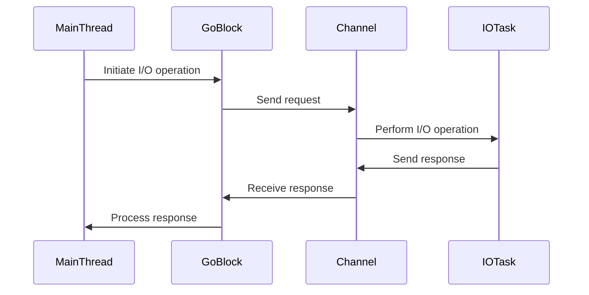

## 12.1. Asynchronous I/O with core.async

Asynchronous I/O is a critical concept in modern software development, especially when dealing with I/O-bound operations such as network requests, file system interactions, and database queries. In this section, we will explore how Clojure's `core.async` library enables developers to perform asynchronous I/O operations efficiently, leveraging non-blocking I/O and event-driven models to build scalable and high-performance applications.

### Understanding the Challenges of I/O-Bound Operations

I/O-bound operations are tasks that spend most of their time waiting for input/output operations to complete. These operations can significantly slow down applications if not handled properly, as they often involve waiting for external resources, such as network responses or disk reads/writes. Traditional synchronous I/O operations block the execution thread until the operation completes, leading to inefficient resource utilization and reduced application throughput.

### Non-Blocking I/O and Event-Driven Models

Non-blocking I/O allows applications to initiate an I/O operation and continue executing other tasks while waiting for the operation to complete. This approach is often implemented using event-driven models, where the application registers callbacks or handlers to be invoked when the I/O operation finishes. This model improves resource utilization and responsiveness, making it ideal for high-concurrency environments.

### Introducing core.async

Clojure's `core.async` library provides powerful abstractions for asynchronous programming, allowing developers to write non-blocking code using channels and go blocks. Channels are used to communicate between different parts of the application, while go blocks enable asynchronous execution of code. Let's dive into some examples to see how `core.async` can be used for asynchronous I/O operations.

### Example: Asynchronous HTTP Requests

Suppose we want to perform an HTTP GET request asynchronously. We can use `core.async` to achieve this by creating a channel to handle the response and a go block to perform the request.

```clojure
(require '[clojure.core.async :refer [go chan <! >!]])
(require '[clj-http.client :as http])

(defn async-http-get [url]
  (let [response-chan (chan)]
    (go
      (let [response (http/get url {:async? true})]
        (>! response-chan response)))
    response-chan))

;; Usage
(let [url "http://example.com"
      response-chan (async-http-get url)]
  (go
    (let [response (<! response-chan)]
      (println "Received response:" response))))
```

In this example, we define a function `async-http-get` that takes a URL and returns a channel. Inside a go block, we perform the HTTP GET request asynchronously and put the response onto the channel. Another go block waits for the response and prints it once received.

### Benefits of Asynchronous I/O with core.async

Using `core.async` for asynchronous I/O operations offers several benefits:

- **Scalability**: By avoiding blocking threads, applications can handle more concurrent operations, leading to better scalability.
- **Responsiveness**: Non-blocking I/O improves application responsiveness, as threads are not tied up waiting for I/O operations to complete.
- **Simplified Code**: `core.async` provides a straightforward way to write asynchronous code, reducing the complexity associated with traditional callback-based models.

### Integration with Asynchronous Libraries and Frameworks

`core.async` can be seamlessly integrated with various asynchronous libraries and frameworks, enhancing their capabilities. For instance, when working with web servers like Aleph or HttpKit, `core.async` can be used to handle asynchronous request processing, improving throughput and reducing latency.

### Example: Asynchronous File Reading

Let's consider an example of reading a file asynchronously using `core.async`. We'll use a channel to read the file contents and process them without blocking the main thread.

```clojure
(require '[clojure.core.async :refer [go chan <! >!]])
(require '[clojure.java.io :as io])

(defn async-file-read [file-path]
  (let [file-chan (chan)]
    (go
      (with-open [reader (io/reader file-path)]
        (let [content (slurp reader)]
          (>! file-chan content))))
    file-chan))

;; Usage
(let [file-path "example.txt"
      file-chan (async-file-read file-path)]
  (go
    (let [content (<! file-chan)]
      (println "File content:" content))))
```

In this example, we define a function `async-file-read` that reads a file asynchronously and returns its content via a channel. The main thread can continue executing other tasks while the file is being read.

### Visualizing Asynchronous I/O with core.async

To better understand how `core.async` facilitates asynchronous I/O, let's visualize the flow of data using a Mermaid.js diagram.



**Diagram Description**: This sequence diagram illustrates the flow of an asynchronous I/O operation using `core.async`. The main thread initiates the operation, which is handled by a go block. The go block communicates with the I/O task via a channel, allowing the main thread to remain unblocked.

### Try It Yourself

To deepen your understanding of asynchronous I/O with `core.async`, try modifying the examples provided:

- **Experiment with Different I/O Operations**: Replace the HTTP request with other I/O operations, such as database queries or file writes.
- **Handle Multiple Concurrent Requests**: Modify the HTTP example to handle multiple URLs concurrently and process their responses.
- **Implement Error Handling**: Add error handling to the examples to gracefully handle failures in I/O operations.

### Key Takeaways

- **Asynchronous I/O** is essential for building scalable and responsive applications, especially in I/O-bound scenarios.
- **core.async** provides a powerful abstraction for asynchronous programming in Clojure, using channels and go blocks.
- **Non-blocking I/O** improves resource utilization and application throughput by allowing other tasks to execute while waiting for I/O operations.
- **Integration** with asynchronous libraries and frameworks enhances their capabilities and improves application performance.

### Further Reading

For more information on asynchronous I/O and `core.async`, consider exploring the following resources:

- [Clojure core.async Documentation](https://clojure.github.io/core.async/)
- [clj-http Library Documentation](https://github.com/dakrone/clj-http)
- [Aleph Web Server](https://github.com/ztellman/aleph)
- [HttpKit Web Server](http://http-kit.org/)

## **Ready to Test Your Knowledge?**



### What is the main advantage of using asynchronous I/O?

- [x] Improved scalability and responsiveness
- [ ] Simplified code structure
- [ ] Reduced memory usage
- [ ] Enhanced security

> **Explanation:** Asynchronous I/O improves scalability and responsiveness by allowing applications to handle more concurrent operations without blocking threads.

### Which Clojure library provides abstractions for asynchronous programming?

- [ ] clj-http
- [x] core.async
- [ ] aleph
- [ ] http-kit

> **Explanation:** The `core.async` library provides abstractions for asynchronous programming in Clojure, using channels and go blocks.

### What is a key feature of non-blocking I/O?

- [x] It allows other tasks to execute while waiting for I/O operations.
- [ ] It simplifies error handling.
- [ ] It reduces the need for callbacks.
- [ ] It improves security.

> **Explanation:** Non-blocking I/O allows other tasks to execute while waiting for I/O operations to complete, improving resource utilization.

### How does `core.async` facilitate communication between different parts of an application?

- [ ] By using callbacks
- [x] By using channels
- [ ] By using threads
- [ ] By using locks

> **Explanation:** `core.async` uses channels to facilitate communication between different parts of an application, allowing for asynchronous data exchange.

### What is the purpose of a go block in `core.async`?

- [x] To execute code asynchronously
- [ ] To handle errors
- [ ] To manage threads
- [ ] To perform synchronous I/O

> **Explanation:** A go block in `core.async` is used to execute code asynchronously, allowing for non-blocking operations.

### Which of the following is a benefit of using `core.async` for asynchronous I/O?

- [x] Simplified code structure
- [ ] Increased memory usage
- [ ] Reduced security risks
- [ ] Improved error handling

> **Explanation:** `core.async` simplifies the code structure for asynchronous I/O operations, making it easier to write and maintain.

### How can `core.async` be integrated with web servers like Aleph or HttpKit?

- [x] By handling asynchronous request processing
- [ ] By managing thread pools
- [ ] By simplifying error handling
- [ ] By improving security

> **Explanation:** `core.async` can be integrated with web servers like Aleph or HttpKit to handle asynchronous request processing, improving throughput and reducing latency.

### What is a common use case for asynchronous I/O?

- [x] Performing network requests
- [ ] Managing memory allocation
- [ ] Handling user authentication
- [ ] Simplifying error handling

> **Explanation:** Asynchronous I/O is commonly used for performing network requests, as it allows applications to handle multiple requests concurrently without blocking.

### Which of the following is a challenge of I/O-bound operations?

- [x] They can significantly slow down applications if not handled properly.
- [ ] They simplify code structure.
- [ ] They improve security.
- [ ] They reduce memory usage.

> **Explanation:** I/O-bound operations can significantly slow down applications if not handled properly, as they often involve waiting for external resources.

### True or False: Non-blocking I/O improves application responsiveness.

- [x] True
- [ ] False

> **Explanation:** Non-blocking I/O improves application responsiveness by allowing threads to continue executing other tasks while waiting for I/O operations to complete.



Remember, this is just the beginning. As you progress, you'll build more complex and interactive applications using `core.async`. Keep experimenting, stay curious, and enjoy the journey!
