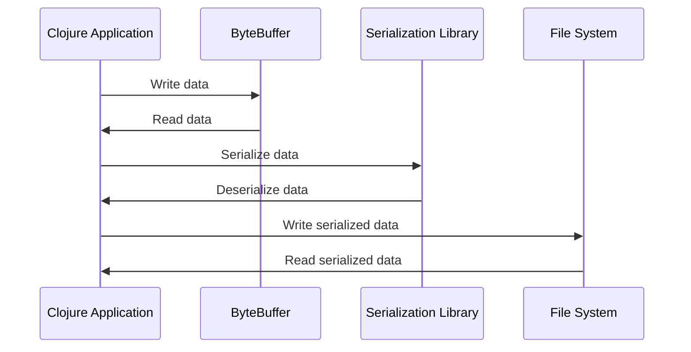

## 12.10. Handling Binary Data and Serialization

Handling binary data and serialization is a critical aspect of many applications, especially those involving network communication, file storage, and data caching. In this section, we will explore how Clojure, a functional programming language that runs on the Java Virtual Machine (JVM), provides tools and libraries to efficiently manage binary data and serialization tasks.

### Understanding the Challenges of Handling Binary Data

Binary data handling involves dealing with raw bytes, which can be challenging due to the need for precise control over data representation and manipulation. Common challenges include:

- **Endianness**: The order in which bytes are stored can vary between systems, affecting data interpretation.
- **Data Alignment**: Ensuring that data structures are aligned correctly in memory.
- **Performance**: Efficiently processing large volumes of binary data without excessive memory or CPU usage.
- **Complexity**: Managing the complexity of encoding and decoding various data types.

### Working with ByteBuffers and Input/Output Streams

Clojure leverages Java's `ByteBuffer` and input/output streams to handle binary data. These tools provide a way to read and write binary data efficiently.

#### ByteBuffers

`ByteBuffer` is a class in Java's `java.nio` package that allows for the manipulation of byte arrays. It provides methods to read and write primitive data types, making it ideal for handling binary data.

```clojure
(import '[java.nio ByteBuffer])

;; Create a ByteBuffer with a capacity of 1024 bytes
(def buffer (ByteBuffer/allocate 1024))

;; Write data to the buffer
(.putInt buffer 42)
(.putDouble buffer 3.14159)

;; Flip the buffer for reading
(.flip buffer)

;; Read data from the buffer
(def int-value (.getInt buffer))
(def double-value (.getDouble buffer))

(println "Integer:" int-value)
(println "Double:" double-value)
```

**Explanation**: In this example, we create a `ByteBuffer`, write an integer and a double to it, and then read the values back. The `flip` method is used to prepare the buffer for reading after writing.

#### Input/Output Streams

Clojure can also utilize Java's input/output streams for reading and writing binary data. These streams provide a way to handle data in a sequential manner.

```clojure
(import '[java.io ByteArrayOutputStream ByteArrayInputStream DataOutputStream DataInputStream])

;; Write binary data to a byte array
(def baos (ByteArrayOutputStream.))
(def dos (DataOutputStream. baos))
(.writeInt dos 42)
(.writeDouble dos 3.14159)
(.close dos)

;; Read binary data from the byte array
(def bais (ByteArrayInputStream. (.toByteArray baos)))
(def dis (DataInputStream. bais))
(def int-value (.readInt dis))
(def double-value (.readDouble dis))

(println "Integer:" int-value)
(println "Double:" double-value)
```

**Explanation**: This example demonstrates writing and reading binary data using `DataOutputStream` and `DataInputStream`. We write an integer and a double to a `ByteArrayOutputStream`, then read them back using a `ByteArrayInputStream`.

### Serialization Libraries: Nippy and Fressian

Serialization is the process of converting data structures or objects into a format that can be stored or transmitted and then reconstructed later. Clojure offers several libraries for serialization, including Nippy and Fressian.

#### Nippy

[Nippy](https://github.com/ptaoussanis/nippy) is a fast, compact, and flexible serialization library for Clojure. It supports a wide range of data types and is designed for performance.

```clojure
(require '[taoensso.nippy :as nippy])

;; Serialize data
(def data {:name "Alice" :age 30 :scores [95 87 92]})
(def serialized-data (nippy/freeze data))

;; Deserialize data
(def deserialized-data (nippy/thaw serialized-data))

(println "Original data:" data)
(println "Deserialized data:" deserialized-data)
```

**Explanation**: In this example, we use Nippy to serialize a map containing a name, age, and scores. The `freeze` function serializes the data, and the `thaw` function deserializes it.

#### Fressian

[Fressian](https://github.com/clojure/data.fressian) is another serialization library that provides a compact binary format. It is designed to be extensible and efficient.

```clojure
(require '[clojure.data.fressian :as fressian])

;; Serialize data
(def data {:name "Bob" :age 25 :scores [88 90 85]})
(def baos (ByteArrayOutputStream.))
(fressian/write baos data)

;; Deserialize data
(def bais (ByteArrayInputStream. (.toByteArray baos)))
(def deserialized-data (fressian/read bais))

(println "Original data:" data)
(println "Deserialized data:" deserialized-data)
```

**Explanation**: This example shows how to use Fressian to serialize and deserialize a map. We write the data to a `ByteArrayOutputStream` and read it back using a `ByteArrayInputStream`.

### Use Cases for Binary Data and Serialization

Handling binary data and serialization is essential in various scenarios:

- **Protocol Implementation**: Many network protocols require precise binary data handling for encoding and decoding messages.
- **Caching**: Serialized data can be stored in caches to improve performance by avoiding repeated computation or data retrieval.
- **File Storage**: Binary serialization is often used for efficient file storage, especially for large datasets.
- **Inter-process Communication**: Serialization allows data to be shared between different processes or systems.

### Performance Considerations

When working with binary data and serialization, performance is a critical consideration. Here are some tips to optimize performance:

- **Choose the Right Library**: Select a serialization library that meets your performance and feature requirements.
- **Minimize Serialization Overhead**: Avoid unnecessary serialization and deserialization operations.
- **Use Efficient Data Structures**: Choose data structures that are optimized for your use case.
- **Profile and Benchmark**: Regularly profile and benchmark your code to identify bottlenecks and optimize performance.

### Visualizing Binary Data Handling

To better understand the flow of binary data handling, let's visualize the process using a sequence diagram.



**Description**: This diagram illustrates the interaction between a Clojure application, a `ByteBuffer`, a serialization library, and the file system. The application writes and reads data using the `ByteBuffer`, serializes and deserializes data using a library, and interacts with the file system for storage.

### Try It Yourself

To deepen your understanding, try modifying the code examples provided:

- Change the data types being written and read in the `ByteBuffer` and input/output stream examples.
- Experiment with different data structures and see how Nippy and Fressian handle serialization and deserialization.
- Measure the performance of serialization and deserialization operations using different libraries and data sizes.

### Knowledge Check

- What are the main challenges of handling binary data?
- How does `ByteBuffer` help in managing binary data?
- What are the key features of Nippy and Fressian?
- Why is serialization important in protocol implementation and caching?
- How can you optimize the performance of serialization operations?

### Summary

In this section, we've explored the challenges and techniques for handling binary data and serialization in Clojure. We've seen how to use `ByteBuffer` and input/output streams for binary data manipulation and how libraries like Nippy and Fressian facilitate efficient serialization. By understanding these concepts and tools, you can effectively manage binary data in your Clojure applications.

Remember, this is just the beginning. As you progress, you'll discover more advanced techniques and optimizations for handling binary data and serialization. Keep experimenting, stay curious, and enjoy the journey!

## **Ready to Test Your Knowledge?**



### What is a common challenge when handling binary data?

- [x] Endianness
- [ ] Syntax errors
- [ ] Variable naming
- [ ] Code indentation

> **Explanation:** Endianness refers to the order in which bytes are stored, which can vary between systems and affect data interpretation.

### Which class in Java's `java.nio` package is used for manipulating byte arrays?

- [x] ByteBuffer
- [ ] DataInputStream
- [ ] FileOutputStream
- [ ] ObjectOutputStream

> **Explanation:** `ByteBuffer` is a class in Java's `java.nio` package that allows for the manipulation of byte arrays.

### What method is used to prepare a `ByteBuffer` for reading after writing?

- [x] flip
- [ ] rewind
- [ ] clear
- [ ] compact

> **Explanation:** The `flip` method is used to prepare a `ByteBuffer` for reading after writing.

### Which serialization library is known for being fast and compact in Clojure?

- [x] Nippy
- [ ] Fressian
- [ ] Avro
- [ ] Protobuf

> **Explanation:** Nippy is a fast, compact, and flexible serialization library for Clojure.

### What is a use case for binary data serialization?

- [x] Protocol implementation
- [ ] Syntax highlighting
- [ ] Code formatting
- [ ] Variable declaration

> **Explanation:** Binary data serialization is essential for protocol implementation, where precise encoding and decoding of messages are required.

### How can you optimize serialization performance?

- [x] Minimize serialization overhead
- [ ] Increase code complexity
- [ ] Use global variables
- [ ] Avoid data validation

> **Explanation:** Minimizing serialization overhead helps optimize performance by reducing unnecessary operations.

### Which method is used to write an integer to a `DataOutputStream`?

- [x] writeInt
- [ ] writeByte
- [ ] writeChar
- [ ] writeObject

> **Explanation:** The `writeInt` method is used to write an integer to a `DataOutputStream`.

### What is the purpose of serialization in caching?

- [x] To store data efficiently
- [ ] To increase code readability
- [ ] To improve syntax highlighting
- [ ] To enhance variable naming

> **Explanation:** Serialization allows data to be stored efficiently in caches, improving performance by avoiding repeated computation or data retrieval.

### Which library provides a compact binary format and is designed to be extensible?

- [x] Fressian
- [ ] Nippy
- [ ] JSON
- [ ] XML

> **Explanation:** Fressian provides a compact binary format and is designed to be extensible and efficient.

### True or False: Serialization is only useful for file storage.

- [ ] True
- [x] False

> **Explanation:** Serialization is useful for various purposes, including protocol implementation, caching, file storage, and inter-process communication.


