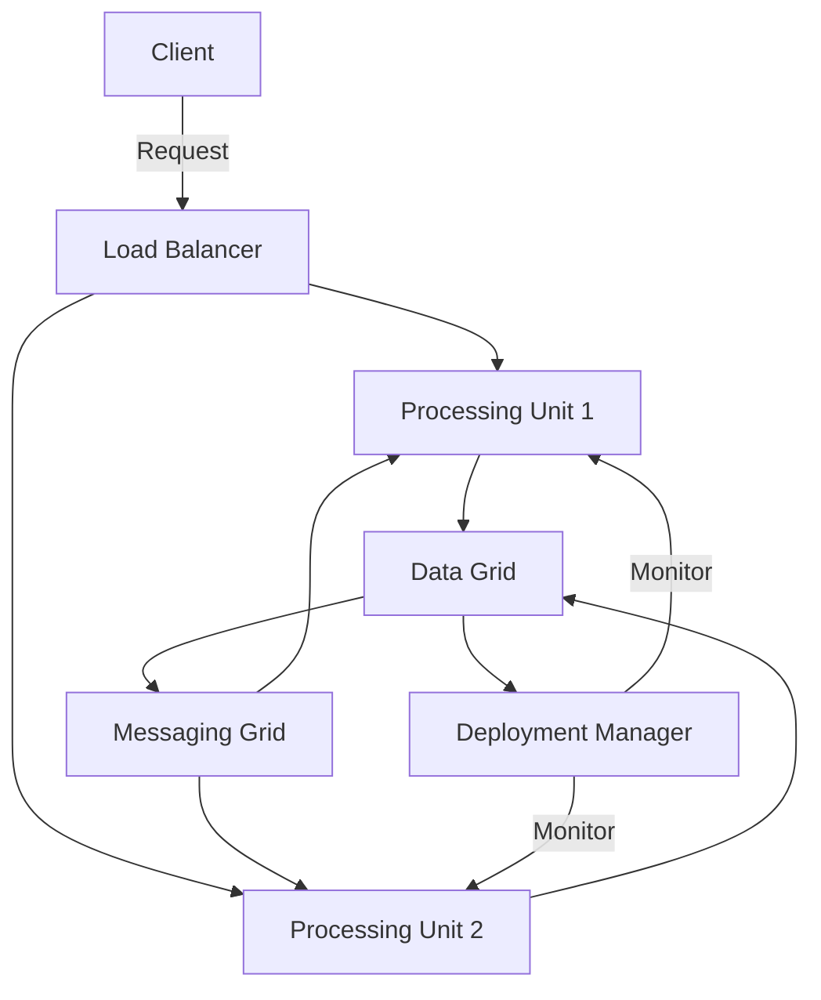

## 12.10 Space-Based Architecture in Clojure

Space-Based Architecture (SBA) is a design pattern that distributes processing and data across multiple nodes to achieve high scalability and fault tolerance. This architecture is particularly suited for applications with unpredictable workloads and high data throughput requirements. In this article, we will explore how to implement Space-Based Architecture in Clojure, leveraging modern tools and libraries to build robust distributed systems.

### Introduction to Space-Based Architecture

Space-Based Architecture is inspired by the concept of tuple spaces, where data is stored in a distributed, in-memory data grid. The architecture is designed to handle large volumes of concurrent transactions by distributing both the processing and the data storage across multiple nodes. This approach helps in achieving linear scalability and high availability.

#### Core Components of Space-Based Architecture

1. **Processing Units:** Stateless services that encapsulate business logic and can be deployed across multiple nodes.
2. **Data Grid:** An in-memory data store that holds the application's state and supports data partitioning and replication.
3. **Messaging Grid:** A distributed messaging system that facilitates communication between components.
4. **Deployment Manager:** Manages the deployment, scaling, and monitoring of the system.

### Implementing Space-Based Architecture in Clojure

#### In-Memory Data Grid

In-memory data grids are crucial for storing and managing data across distributed nodes. Apache Ignite and Hazelcast are popular choices for implementing data grids. In Clojure, we can interact with these systems using Java interop or available client libraries.

**Example using Hazelcast:**

```clojure
(require '[hazelcast.core :as hazelcast])

(def hz-instance (hazelcast/new-instance))
(def data-map (.getMap hz-instance "data-map"))

;; Example of putting and getting data
(.put data-map "key1" "value1")
(println (.get data-map "key1"))  ;; Output: value1
```

#### Designing Processing Units

Processing units are stateless components that execute business logic. They should be designed to be easily deployable across multiple nodes to handle load distribution.

```clojure
(defn process-data [data]
  ;; Business logic here
  (println "Processing data:" data))

;; Example usage
(process-data {:id 1 :value "sample"})
```

#### Setting Up the Messaging Grid

A messaging grid enables asynchronous communication between distributed components. Systems like Kafka or RabbitMQ can be used to implement this layer.

**Example using Kafka:**

```clojure
(require '[clj-kafka.producer :as producer])

(def kafka-producer (producer/make-producer {"bootstrap.servers" "localhost:9092"}))

(defn send-message [topic message]
  (producer/send kafka-producer topic message))

;; Example of sending a message
(send-message "events" "New event data")
```

#### Managing Elastic Scalability

Elastic scalability allows the system to dynamically adjust to varying loads by adding or removing nodes. This is crucial for maintaining performance during peak times.

- **Dynamic Node Management:** Use orchestration tools like Kubernetes to manage node scaling.
- **Workload Redistribution:** Ensure that the system can redistribute workloads when nodes are added or removed.

#### Implementing Data Replication and Partitioning

Data replication and partitioning are essential for ensuring data availability and consistency across nodes.

- **Data Replication:** Configure the data grid to replicate data across nodes to prevent data loss.
- **Data Partitioning:** Use consistent hashing to partition data, ensuring even distribution across nodes.

#### Deployment and Monitoring

Deploying and monitoring a distributed system requires robust tools and practices.

- **Deployment Tools:** Use Kubernetes for container orchestration and deployment management.
- **Monitoring:** Implement health checks and monitoring for each node using tools like Prometheus and Grafana.

#### Handling Failover and Recovery

Design the system to handle node failures gracefully, ensuring data consistency and availability.

- **Failover Strategies:** Implement automatic failover mechanisms to redirect traffic from failed nodes to healthy ones.
- **Data Recovery:** Ensure that the system can recover data from backups or replicas in case of failures.

### Visualizing Space-Based Architecture

Below is a conceptual diagram illustrating the components and interactions in a Space-Based Architecture:



### Advantages and Disadvantages

#### Advantages

- **Scalability:** Easily scale by adding more nodes.
- **Fault Tolerance:** High availability through data replication and failover mechanisms.
- **Performance:** In-memory data grids provide fast data access.

#### Disadvantages

- **Complexity:** Requires careful design and management of distributed components.
- **Cost:** Infrastructure and management overhead can be significant.

### Best Practices

- **Stateless Design:** Ensure processing units are stateless to facilitate easy scaling.
- **Consistent Hashing:** Use consistent hashing for efficient data partitioning.
- **Monitoring and Alerts:** Implement comprehensive monitoring and alerting to quickly address issues.

### Conclusion

Space-Based Architecture in Clojure offers a powerful approach to building scalable and fault-tolerant systems. By leveraging in-memory data grids, distributed processing units, and messaging grids, developers can create applications capable of handling high loads and ensuring high availability. With the right tools and practices, Clojure developers can effectively implement this architecture to meet modern application demands.

## Quiz Time!



### What is the primary goal of Space-Based Architecture?

- [x] Achieving high scalability and fault tolerance
- [ ] Simplifying codebase
- [ ] Reducing development time
- [ ] Enhancing user interface design

> **Explanation:** Space-Based Architecture is designed to distribute processing and data across multiple nodes to achieve high scalability and fault tolerance.

### Which component in Space-Based Architecture handles business logic?

- [ ] Data Grid
- [x] Processing Units
- [ ] Messaging Grid
- [ ] Deployment Manager

> **Explanation:** Processing Units are stateless services that encapsulate business logic and can be deployed across multiple nodes.

### What is the role of the Data Grid in Space-Based Architecture?

- [x] Store and manage application state in-memory
- [ ] Facilitate communication between components
- [ ] Manage deployment and scaling
- [ ] Handle user authentication

> **Explanation:** The Data Grid is an in-memory data store that holds the application's state and supports data partitioning and replication.

### Which tool is commonly used for orchestrating deployments in Space-Based Architecture?

- [ ] RabbitMQ
- [ ] Apache Ignite
- [x] Kubernetes
- [ ] Hazelcast

> **Explanation:** Kubernetes is commonly used for container orchestration and deployment management in distributed systems.

### How does Space-Based Architecture handle node failures?

- [x] Automatic failover mechanisms
- [ ] Manual intervention
- [ ] Ignoring failures
- [ ] Restarting the entire system

> **Explanation:** Space-Based Architecture implements automatic failover mechanisms to redirect traffic from failed nodes to healthy ones.

### What is consistent hashing used for in Space-Based Architecture?

- [ ] Encrypting data
- [x] Data partitioning
- [ ] Monitoring system health
- [ ] Managing user sessions

> **Explanation:** Consistent hashing is used for data partitioning, ensuring even distribution of data across nodes.

### Which messaging system can be used to set up a messaging grid in Space-Based Architecture?

- [x] Kafka
- [ ] Prometheus
- [ ] Grafana
- [ ] Kubernetes

> **Explanation:** Kafka is a distributed messaging system that can be used to implement a messaging grid for asynchronous communication.

### What is a disadvantage of Space-Based Architecture?

- [ ] High scalability
- [ ] Fault tolerance
- [x] Complexity
- [ ] Fast data access

> **Explanation:** Space-Based Architecture can be complex to design and manage due to its distributed nature.

### Which Clojure library can be used to interact with Hazelcast?

- [x] hazelcast.core
- [ ] clj-kafka.producer
- [ ] core.async
- [ ] integrant.core

> **Explanation:** The `hazelcast.core` library can be used to interact with Hazelcast in Clojure.

### True or False: Space-Based Architecture is suitable for applications with low data throughput requirements.

- [ ] True
- [x] False

> **Explanation:** Space-Based Architecture is particularly suited for applications with high data throughput requirements.


