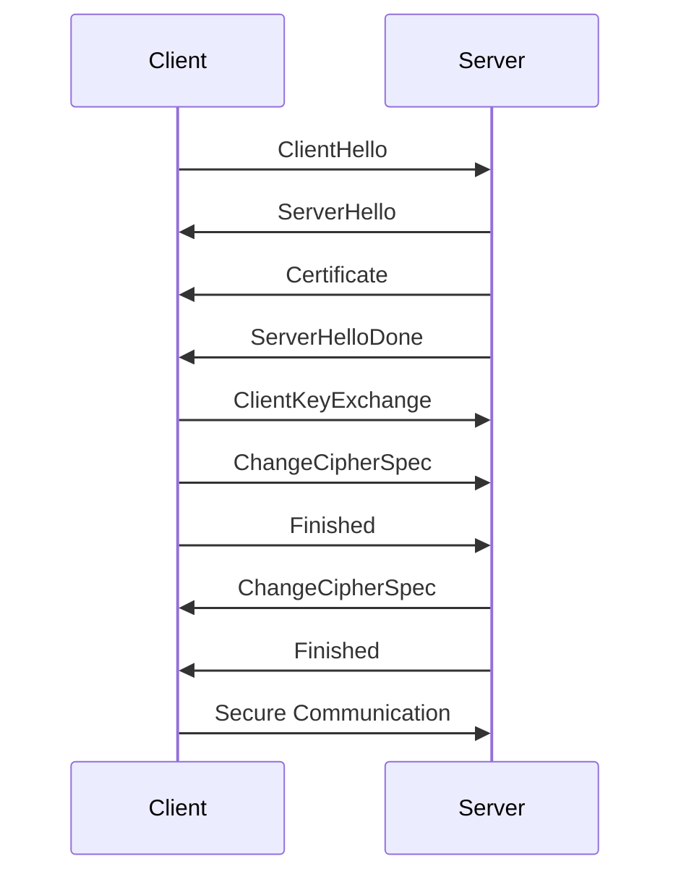

## 12.11. Network Security and TLS

In today's digital landscape, securing network communications is paramount. As developers, we must ensure that data transmitted over networks is protected from eavesdropping, tampering, and forgery. This section delves into network security, focusing on Transport Layer Security (TLS) and its implementation in Clojure applications. We will explore the importance of secure communications, demonstrate how to implement TLS using popular Clojure libraries, and discuss best practices for certificate management and validation.

### Importance of Securing Network Communications

Network security is crucial for protecting sensitive data and maintaining user trust. Without proper security measures, data transmitted over networks can be intercepted, altered, or stolen by malicious actors. TLS is a widely adopted protocol that provides encryption, authentication, and data integrity, ensuring secure communications over networks.

#### Key Benefits of TLS

- **Encryption**: TLS encrypts data, making it unreadable to unauthorized parties.
- **Authentication**: TLS verifies the identity of the communicating parties, preventing impersonation.
- **Data Integrity**: TLS ensures that data is not altered during transmission.

### Implementing TLS in Clojure

Clojure, being a JVM language, can leverage Java's robust security libraries to implement TLS. Additionally, Clojure-specific libraries like Aleph and http-kit provide built-in support for secure communications.

#### Setting Up TLS with Aleph

Aleph is a Clojure library that provides asynchronous communication capabilities, including support for TLS. Let's explore how to set up a secure server using Aleph.

```clojure
(require '[aleph.http :as http])

(defn handler [request]
  {:status 200
   :headers {"content-type" "text/plain"}
   :body "Hello, secure world!"})

(defn start-secure-server []
  (http/start-server handler
                     {:port 8443
                      :ssl-context (http/ssl-context
                                    {:key-store "path/to/keystore.jks"
                                     :key-store-password "your-password"})}))

(start-secure-server)
```

- **Key Points**:
  - The `ssl-context` function is used to configure the SSL/TLS settings.
  - A Java KeyStore (JKS) file is required to store the server's private key and certificate.

#### Setting Up TLS with http-kit

http-kit is another popular Clojure library for building web applications. It also supports TLS configuration.

```clojure
(require '[org.httpkit.server :as server])

(defn handler [request]
  {:status 200
   :headers {"content-type" "text/plain"}
   :body "Hello, secure world!"})

(defn start-secure-server []
  (server/run-server handler
                     {:port 8443
                      :ssl? true
                      :keystore "path/to/keystore.jks"
                      :key-password "your-password"}))

(start-secure-server)
```

- **Key Points**:
  - The `:ssl?` option enables TLS.
  - The `:keystore` and `:key-password` options specify the path to the KeyStore and its password.

### Certificate Management and Validation

Certificates are essential for establishing trust in TLS communications. They verify the identity of the server and, optionally, the client. Proper certificate management and validation are crucial for maintaining secure communications.

#### Obtaining and Managing Certificates

- **Certificate Authorities (CAs)**: Obtain certificates from trusted CAs like Let's Encrypt, DigiCert, or GlobalSign.
- **Self-Signed Certificates**: For development purposes, you can create self-signed certificates using tools like OpenSSL.

#### Validating Certificates

- **Certificate Chain Validation**: Ensure that the certificate chain is valid and trusted.
- **Hostname Verification**: Verify that the certificate's subject matches the hostname of the server.
- **Revocation Checking**: Check for certificate revocation using CRLs (Certificate Revocation Lists) or OCSP (Online Certificate Status Protocol).

### Best Practices for Secure Network Programming

Implementing TLS is just one aspect of secure network programming. Here are some best practices to follow:

- **Use Strong Cipher Suites**: Configure your server to use strong, secure cipher suites.
- **Keep Software Updated**: Regularly update your libraries and dependencies to patch security vulnerabilities.
- **Limit Exposure**: Minimize the number of open ports and exposed services.
- **Monitor and Log**: Implement logging and monitoring to detect and respond to security incidents.
- **Educate and Train**: Ensure that your team is aware of security best practices and stays informed about the latest threats.

### Visualizing TLS Handshake Process

To better understand how TLS works, let's visualize the TLS handshake process using a Mermaid.js sequence diagram.



- **Description**: This diagram illustrates the TLS handshake process, where the client and server exchange messages to establish a secure connection.

### Try It Yourself

Experiment with the code examples provided above. Try modifying the server configurations, such as changing the port number or using a different KeyStore file. Observe how these changes affect the server's behavior.

### References and Links

- [TLS Overview - MDN Web Docs](https://developer.mozilla.org/en-US/docs/Web/Security/Transport_Layer_Security)
- [Java Secure Socket Extension (JSSE) Reference Guide](https://docs.oracle.com/javase/8/docs/technotes/guides/security/jsse/JSSERefGuide.html)
- [Let's Encrypt - Free SSL/TLS Certificates](https://letsencrypt.org/)

### Knowledge Check

- What are the key benefits of using TLS for network security?
- How can you implement TLS in a Clojure application using Aleph or http-kit?
- What are some best practices for managing and validating certificates?

### Embrace the Journey

Remember, securing network communications is an ongoing process. As you implement TLS and other security measures, stay curious and continue learning about the latest security trends and technologies. Your efforts will help protect your applications and users from potential threats.

## **Ready to Test Your Knowledge?**



### What is the primary purpose of TLS in network communications?

- [x] To encrypt data and ensure secure communication
- [ ] To increase network speed
- [ ] To reduce server load
- [ ] To manage network traffic

> **Explanation:** TLS is primarily used to encrypt data and ensure secure communication over networks.

### Which Clojure library provides built-in support for TLS?

- [x] Aleph
- [ ] Ring
- [ ] Compojure
- [ ] Luminus

> **Explanation:** Aleph is a Clojure library that provides built-in support for TLS.

### What is a Java KeyStore (JKS) used for in TLS configuration?

- [x] To store the server's private key and certificate
- [ ] To manage network connections
- [ ] To increase server performance
- [ ] To log network activity

> **Explanation:** A Java KeyStore (JKS) is used to store the server's private key and certificate for TLS configuration.

### What is the role of a Certificate Authority (CA) in TLS?

- [x] To issue and verify digital certificates
- [ ] To manage network traffic
- [ ] To encrypt data
- [ ] To monitor server performance

> **Explanation:** A Certificate Authority (CA) issues and verifies digital certificates, establishing trust in TLS communications.

### Which protocol is used for checking certificate revocation?

- [x] OCSP
- [ ] HTTP
- [ ] FTP
- [ ] SMTP

> **Explanation:** OCSP (Online Certificate Status Protocol) is used for checking certificate revocation.

### What is the purpose of hostname verification in TLS?

- [x] To ensure the certificate's subject matches the server's hostname
- [ ] To increase network speed
- [ ] To reduce server load
- [ ] To manage network traffic

> **Explanation:** Hostname verification ensures that the certificate's subject matches the server's hostname, preventing impersonation.

### Which of the following is a best practice for secure network programming?

- [x] Use strong cipher suites
- [ ] Open all network ports
- [ ] Disable logging
- [ ] Ignore software updates

> **Explanation:** Using strong cipher suites is a best practice for secure network programming.

### What is the purpose of the `ssl-context` function in Aleph?

- [x] To configure SSL/TLS settings
- [ ] To manage network connections
- [ ] To increase server performance
- [ ] To log network activity

> **Explanation:** The `ssl-context` function in Aleph is used to configure SSL/TLS settings.

### Which of the following is NOT a benefit of TLS?

- [ ] Encryption
- [ ] Authentication
- [ ] Data Integrity
- [x] Increased network speed

> **Explanation:** TLS provides encryption, authentication, and data integrity, but it does not increase network speed.

### True or False: Self-signed certificates are suitable for production environments.

- [ ] True
- [x] False

> **Explanation:** Self-signed certificates are generally not suitable for production environments due to trust issues.


