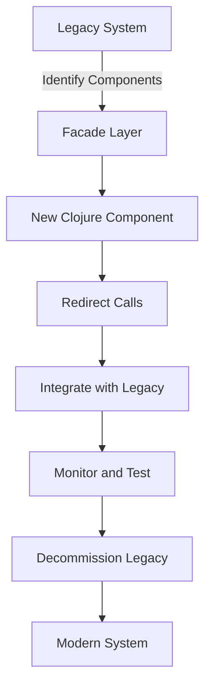

## 12.12 Strangler Pattern in Clojure

The Strangler Pattern is a powerful architectural strategy for incrementally migrating legacy systems to modern architectures. This pattern allows developers to replace old components with new ones gradually, minimizing risk and avoiding the need for a complete system rewrite. In the context of Clojure, this pattern can be particularly effective due to Clojure's seamless interoperability with Java, enabling integration with existing Java-based codebases.

### Introduction

Legacy systems often pose significant challenges due to outdated technologies, complex codebases, and the risk of introducing errors during a complete overhaul. The Strangler Pattern offers a solution by allowing developers to incrementally replace parts of the legacy system with new components. This approach not only reduces risk but also allows for continuous delivery of new features and improvements.

### Detailed Explanation

The Strangler Pattern involves several key steps to ensure a smooth transition from legacy to modern systems:

1. **Identify Components to Replace:**
   - Begin by analyzing the legacy system to identify components that are outdated, inefficient, or difficult to maintain. This analysis helps prioritize which parts of the system should be replaced first.
   - Plan the replacement process in manageable increments, focusing on one component or feature at a time.

2. **Create Facades Over Legacy Components:**
   - Implement facades to abstract and encapsulate the legacy components. This allows new components to interact with the legacy system without being tightly coupled to its implementation.
   - Example:
     ```clojure
     (defn legacy-facade [args]
       ;; Call legacy system functions
       )
     ```

3. **Develop New Components in Clojure:**
   - Use idiomatic Clojure to implement new functionality. Clojure's functional programming paradigm and immutable data structures can lead to more robust and maintainable code.
   - Example:
     ```clojure
     (defn new-component [args]
       ;; New implementation
       )
     ```

4. **Redirect Calls Gradually:**
   - Gradually redirect calls from the legacy components to the new ones. This can be controlled using feature toggles or configuration flags, allowing for easy rollback if issues arise.
   - This step ensures that the transition is seamless and that users experience minimal disruption.

5. **Integrate New Components with Legacy System:**
   - Leverage Clojure's Java interoperability to integrate new components with the existing legacy system. This allows for calling Java methods or classes directly from Clojure.
   - Example:
     ```clojure
     (import 'com.legacy.SystemClass)
     
     (defn call-legacy [arg]
       (.legacyMethod (SystemClass.) arg))
     ```

6. **Monitor and Test Each Migration Step:**
   - Thoroughly test each new component to ensure it functions correctly within the system. Monitoring tools can help track performance and identify any issues early.
   - Be prepared to roll back changes if necessary to maintain system stability.

7. **Decommission Legacy Components:**
   - Once all functionality has been successfully migrated, remove the old components from the system. This includes cleaning up any dependencies and ensuring that the system remains stable.

8. **Maintain Documentation and Communication:**
   - Keep all stakeholders informed about the migration progress. Regular updates and thorough documentation help ensure that everyone is aligned and aware of changes.

### Visual Aids

To better understand the Strangler Pattern, consider the following conceptual diagram illustrating the gradual replacement of legacy components:



### Code Examples

Here's a practical example of how you might implement a facade and a new component in Clojure:

**Legacy Facade:**
```clojure
(defn legacy-facade [args]
  ;; Simulate calling a legacy system function
  (println "Calling legacy system with" args))
```

**New Clojure Component:**
```clojure
(defn new-component [args]
  ;; New implementation using Clojure
  (println "Executing new component logic with" args))
```

**Redirecting Calls:**
```clojure
(defn execute [args use-new?]
  (if use-new?
    (new-component args)
    (legacy-facade args)))
```

### Use Cases

The Strangler Pattern is particularly useful in scenarios where:

- A legacy system is critical to business operations, and downtime must be minimized.
- The system is too complex to be rewritten in a single effort.
- New features need to be delivered continuously without waiting for a complete migration.

### Advantages and Disadvantages

**Advantages:**
- **Reduced Risk:** Incremental changes reduce the risk of system failure.
- **Continuous Delivery:** New features can be delivered alongside the migration process.
- **Improved Code Quality:** New components can be developed using modern practices and technologies.

**Disadvantages:**
- **Complexity:** Managing two systems (legacy and new) simultaneously can be complex.
- **Resource Intensive:** Requires careful planning and resource allocation.

### Best Practices

- **Thorough Planning:** Plan each migration step carefully to avoid disruptions.
- **Automated Testing:** Use automated tests to ensure new components work as expected.
- **Stakeholder Communication:** Keep stakeholders informed to manage expectations and gather feedback.

### Comparisons

Compared to a complete system rewrite, the Strangler Pattern offers a more flexible and less risky approach. It allows for gradual improvements and continuous delivery, making it a preferred choice for many organizations.

### Conclusion

The Strangler Pattern provides a pragmatic approach to modernizing legacy systems. By leveraging Clojure's strengths and Java interoperability, developers can incrementally replace outdated components, ensuring a smooth transition to a modern architecture. This pattern not only reduces risk but also allows for continuous improvement and delivery of new features.

## Quiz Time!



### What is the primary goal of the Strangler Pattern?

- [x] Incrementally migrate legacy systems to modern architectures
- [ ] Completely rewrite legacy systems in one go
- [ ] Maintain legacy systems without changes
- [ ] Integrate new technologies without replacing old ones

> **Explanation:** The Strangler Pattern aims to incrementally migrate legacy systems by gradually replacing old components with new ones.

### How does the Strangler Pattern minimize risk during migration?

- [x] By replacing components incrementally
- [ ] By rewriting the entire system at once
- [ ] By ignoring legacy components
- [ ] By using only new technologies

> **Explanation:** The pattern minimizes risk by allowing for incremental changes, reducing the chance of system failure.

### In Clojure, what feature is leveraged to integrate with existing Java codebases?

- [x] Java interoperability
- [ ] Macros
- [ ] Transducers
- [ ] Protocols

> **Explanation:** Clojure's Java interoperability allows seamless integration with existing Java codebases.

### What is a facade in the context of the Strangler Pattern?

- [x] An abstraction layer over legacy components
- [ ] A new component replacing old functionality
- [ ] A testing tool for new components
- [ ] A database migration tool

> **Explanation:** A facade acts as an abstraction layer over legacy components, allowing new components to interact with them.

### What is a key advantage of using the Strangler Pattern?

- [x] Continuous delivery of new features
- [ ] Immediate system overhaul
- [ ] Reduced development time
- [ ] Elimination of all legacy code

> **Explanation:** The pattern allows for continuous delivery of new features alongside the migration process.

### What is a potential disadvantage of the Strangler Pattern?

- [x] Managing two systems simultaneously can be complex
- [ ] It requires a complete system rewrite
- [ ] It eliminates the need for testing
- [ ] It increases system downtime

> **Explanation:** Managing both legacy and new systems simultaneously can add complexity to the migration process.

### How can calls be redirected from legacy to new components?

- [x] Using feature toggles or configuration flags
- [ ] By hardcoding new component calls
- [ ] By disabling legacy components
- [ ] By rewriting the entire system

> **Explanation:** Feature toggles or configuration flags allow for controlled redirection of calls.

### What should be done once all functionality is migrated to new components?

- [x] Decommission legacy components
- [ ] Keep legacy components as backups
- [ ] Rewrite the new components
- [ ] Ignore the legacy components

> **Explanation:** Once migration is complete, legacy components should be decommissioned to clean up the system.

### Why is stakeholder communication important during migration?

- [x] To manage expectations and gather feedback
- [ ] To avoid any changes to the system
- [ ] To ensure no one is aware of the migration
- [ ] To delay the migration process

> **Explanation:** Keeping stakeholders informed helps manage expectations and gather valuable feedback.

### True or False: The Strangler Pattern requires a complete rewrite of the legacy system.

- [ ] True
- [x] False

> **Explanation:** The Strangler Pattern does not require a complete rewrite; it focuses on incremental replacement of components.


