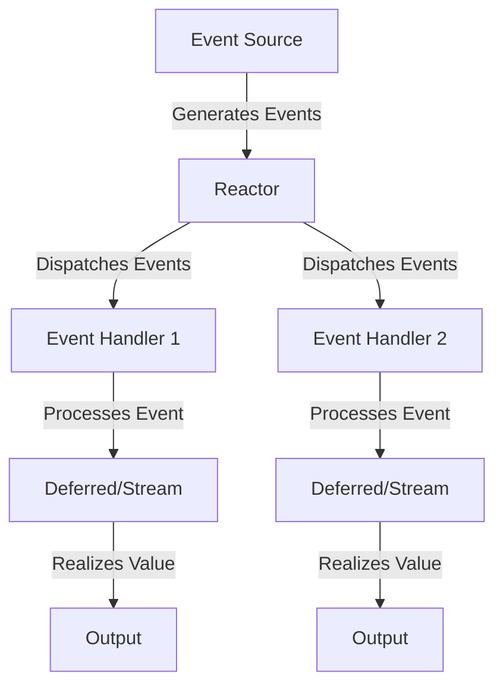

## 12.12. Reactor Pattern with Manifold

### Introduction

In modern software development, handling asynchronous events efficiently is crucial, especially in network applications. The Reactor Pattern is a design pattern that provides a mechanism to handle service requests delivered concurrently to an application by one or more inputs. This pattern is particularly useful in scenarios where you need to manage multiple I/O operations without blocking the main execution thread.

In this section, we will explore how to implement the Reactor Pattern using **Manifold**, a Clojure library that provides abstractions over deferreds and streams, enabling reactive programming. We will also discuss how Manifold integrates with **Aleph**, a Clojure library for asynchronous network programming, to build scalable network applications.

### Understanding the Reactor Pattern

The Reactor Pattern is a behavioral design pattern that handles service requests that are delivered concurrently to an application. It demultiplexes incoming requests and dispatches them synchronously to the associated request handlers. This pattern is widely used in network servers and GUI applications.

#### Key Participants

- **Event Source**: The entity that generates events.
- **Reactor**: The core component that listens for events and dispatches them to the appropriate handlers.
- **Event Handlers**: Components that process the events.

#### Applicability

The Reactor Pattern is applicable when:

- You need to handle multiple concurrent I/O operations.
- You want to avoid blocking the main execution thread.
- You require a scalable solution for event-driven applications.

### Introducing Manifold

**Manifold** is a Clojure library that provides abstractions for asynchronous programming. It offers two primary abstractions: **deferreds** and **streams**.

- **Deferreds**: Represent a value that will be available in the future. They are similar to promises or futures in other programming languages.
- **Streams**: Represent a sequence of values that can be processed asynchronously.

Manifold's abstractions make it easier to work with asynchronous data flows and integrate seamlessly with Clojure's functional programming paradigm.

### Handling Asynchronous Events with Manifold

Let's explore how to handle asynchronous events using Manifold's deferreds and streams.

#### Using Deferreds

Deferreds in Manifold are used to represent a value that will be available at some point in the future. They allow you to compose asynchronous operations in a clean and readable way.

```clojure
(require '[manifold.deferred :as d])

;; Create a deferred
(def my-deferred (d/deferred))

;; Add a callback to be executed when the deferred is realized
(d/chain my-deferred
         (fn [value]
           (println "Deferred realized with value:" value)))

;; Realize the deferred with a value
(d/success! my-deferred 42)
```

In this example, we create a deferred and add a callback using `d/chain`. When the deferred is realized with a value, the callback is executed.

#### Using Streams

Streams in Manifold are used to represent a sequence of values that can be processed asynchronously. They are particularly useful for handling data streams in network applications.

```clojure
(require '[manifold.stream :as s])

;; Create a stream
(def my-stream (s/stream))

;; Consume values from the stream
(s/consume println my-stream)

;; Put values onto the stream
(s/put! my-stream "Hello, World!")
(s/put! my-stream "Welcome to Manifold!")
```

In this example, we create a stream and consume values from it using `s/consume`. We then put values onto the stream using `s/put!`.

### Integrating Manifold with Aleph

**Aleph** is a Clojure library built on top of Netty, providing asynchronous network programming capabilities. It integrates seamlessly with Manifold, allowing you to build scalable network applications.

#### Building a Simple HTTP Server

Let's build a simple HTTP server using Aleph and Manifold.

```clojure
(require '[aleph.http :as http])
(require '[manifold.stream :as s])

(defn handler [request]
  (let [response-stream (s/stream)]
    (s/put! response-stream "Hello, World!")
    {:status 200
     :headers {"Content-Type" "text/plain"}
     :body response-stream}))

;; Start the server
(def server (http/start-server handler {:port 8080}))

(println "Server running on http://localhost:8080")
```

In this example, we define a handler function that returns a response stream. We start the server using `http/start-server`, passing the handler and server options.

#### Handling WebSocket Connections

Aleph also supports WebSocket connections, which can be used for real-time communication.

```clojure
(require '[aleph.http :as http])
(require '[manifold.stream :as s])

(defn ws-handler [conn]
  (s/consume #(println "Received message:" %) conn)
  (s/put! conn "Welcome to the WebSocket server!"))

;; Start the WebSocket server
(def ws-server (http/start-server ws-handler {:port 8081 :websocket? true}))

(println "WebSocket server running on ws://localhost:8081")
```

In this example, we define a WebSocket handler that consumes messages from the connection and sends a welcome message.

### Performance Benefits and Use Cases

Using Manifold and Aleph provides several performance benefits:

- **Non-blocking I/O**: Both libraries are built on top of Netty, which provides non-blocking I/O capabilities, allowing you to handle thousands of concurrent connections efficiently.
- **Reactive Programming**: Manifold's abstractions make it easy to implement reactive programming patterns, enabling you to build responsive and resilient applications.
- **Scalability**: The combination of Manifold and Aleph allows you to build scalable network applications that can handle high loads.

#### Use Cases

- **Real-time Data Processing**: Use Manifold and Aleph to build applications that process data in real-time, such as chat applications or live data feeds.
- **Microservices**: Build microservices that communicate asynchronously using HTTP or WebSocket protocols.
- **Event-Driven Architectures**: Implement event-driven architectures where components react to events and process them asynchronously.

### Visualizing the Reactor Pattern with Manifold

To better understand how the Reactor Pattern works with Manifold, let's visualize the flow of events and data.



**Diagram Description**: This diagram illustrates the flow of events in the Reactor Pattern using Manifold. The Event Source generates events, which are dispatched by the Reactor to the appropriate Event Handlers. The handlers process the events using deferreds or streams, which eventually realize values that are outputted.

### Design Considerations

When using the Reactor Pattern with Manifold, consider the following:

- **Concurrency**: Ensure that your event handlers are thread-safe, as they may be executed concurrently.
- **Error Handling**: Implement robust error handling to manage exceptions that may occur during event processing.
- **Resource Management**: Manage resources such as streams and deferreds carefully to avoid memory leaks.

### Clojure Unique Features

Clojure's functional programming paradigm and immutable data structures make it an excellent fit for reactive programming. Manifold leverages these features to provide a clean and efficient way to handle asynchronous events.

### Differences and Similarities

The Reactor Pattern is often compared to the Observer Pattern. While both patterns deal with event handling, the Reactor Pattern is more focused on demultiplexing and dispatching events, whereas the Observer Pattern is about notifying observers of state changes.

### Try It Yourself

Experiment with the code examples provided in this section. Try modifying the HTTP server to handle different types of requests or implement a simple chat application using WebSockets. Explore the Manifold and Aleph documentation for more advanced features and use cases.

### References and Links

- [Manifold GitHub Repository](https://github.com/clj-commons/manifold)
- [Aleph GitHub Repository](https://github.com/clj-commons/aleph)
- [Netty Project](https://netty.io/)

### Knowledge Check

To reinforce your understanding of the Reactor Pattern with Manifold, try answering the following questions.

## **Ready to Test Your Knowledge?**



### What is the primary purpose of the Reactor Pattern?

- [x] To handle service requests delivered concurrently to an application.
- [ ] To notify observers of state changes.
- [ ] To manage global state in an application.
- [ ] To provide a mechanism for dependency injection.

> **Explanation:** The Reactor Pattern is designed to handle service requests delivered concurrently to an application by demultiplexing incoming requests and dispatching them to the appropriate handlers.

### What are the two primary abstractions provided by Manifold?

- [x] Deferreds and Streams
- [ ] Promises and Futures
- [ ] Channels and Queues
- [ ] Observables and Subjects

> **Explanation:** Manifold provides deferreds, which represent a value that will be available in the future, and streams, which represent a sequence of values that can be processed asynchronously.

### How does Aleph integrate with Manifold?

- [x] Aleph uses Manifold's abstractions to handle asynchronous network programming.
- [ ] Aleph provides a GUI for managing Manifold streams.
- [ ] Aleph is a replacement for Manifold in network applications.
- [ ] Aleph and Manifold are unrelated libraries.

> **Explanation:** Aleph integrates with Manifold by using its abstractions, such as deferreds and streams, to handle asynchronous network programming efficiently.

### Which of the following is a benefit of using Manifold and Aleph?

- [x] Non-blocking I/O
- [ ] Synchronous event handling
- [ ] Increased memory usage
- [ ] Reduced scalability

> **Explanation:** Manifold and Aleph provide non-blocking I/O capabilities, allowing you to handle thousands of concurrent connections efficiently, which enhances scalability.

### What is a common use case for the Reactor Pattern with Manifold?

- [x] Real-time data processing
- [ ] Batch processing
- [ ] Static website hosting
- [ ] Manual data entry

> **Explanation:** The Reactor Pattern with Manifold is commonly used for real-time data processing, such as chat applications or live data feeds, where asynchronous event handling is crucial.

### What is the role of the Reactor in the Reactor Pattern?

- [x] To listen for events and dispatch them to the appropriate handlers.
- [ ] To generate events for the application.
- [ ] To store the application's global state.
- [ ] To provide a user interface for event management.

> **Explanation:** The Reactor is responsible for listening for events and dispatching them to the appropriate handlers for processing.

### How can you handle WebSocket connections using Aleph?

- [x] By defining a WebSocket handler and starting a WebSocket server.
- [ ] By using HTTP handlers exclusively.
- [ ] By implementing a custom protocol from scratch.
- [ ] By using synchronous I/O operations.

> **Explanation:** Aleph supports WebSocket connections, allowing you to define a WebSocket handler and start a WebSocket server for real-time communication.

### What should you consider when using the Reactor Pattern with Manifold?

- [x] Concurrency, error handling, and resource management
- [ ] Only error handling
- [ ] Only resource management
- [ ] Only concurrency

> **Explanation:** When using the Reactor Pattern with Manifold, it's important to consider concurrency, error handling, and resource management to ensure efficient and robust event processing.

### What is the difference between the Reactor Pattern and the Observer Pattern?

- [x] The Reactor Pattern focuses on demultiplexing and dispatching events, while the Observer Pattern is about notifying observers of state changes.
- [ ] The Reactor Pattern is about notifying observers of state changes, while the Observer Pattern focuses on demultiplexing and dispatching events.
- [ ] Both patterns are identical in functionality.
- [ ] The Reactor Pattern is used for GUI applications, while the Observer Pattern is used for network applications.

> **Explanation:** The Reactor Pattern focuses on demultiplexing and dispatching events to handlers, whereas the Observer Pattern is about notifying observers of state changes.

### True or False: Manifold's streams are used to represent a sequence of values that can be processed synchronously.

- [ ] True
- [x] False

> **Explanation:** Manifold's streams are used to represent a sequence of values that can be processed asynchronously, not synchronously.



Remember, this is just the beginning. As you progress, you'll build more complex and interactive applications using the Reactor Pattern with Manifold. Keep experimenting, stay curious, and enjoy the journey!
