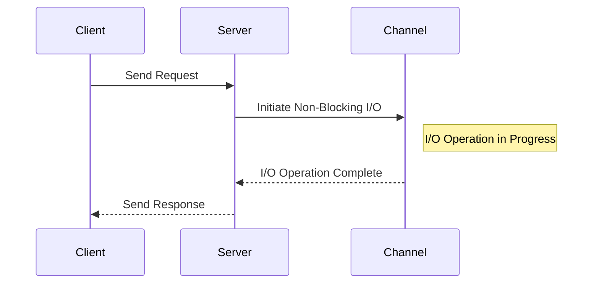

## 12.13. Non-Blocking I/O Patterns

In modern software development, handling input and output operations efficiently is crucial for building scalable and responsive applications. Non-blocking I/O patterns are essential for achieving high concurrency and optimal resource utilization, especially in networked applications. In this section, we will delve into the concepts, tools, and techniques for implementing non-blocking I/O in Clojure, focusing on libraries like `core.async` and Netty.

### Understanding Blocking vs. Non-Blocking I/O

Before diving into non-blocking I/O patterns, it's important to understand the fundamental differences between blocking and non-blocking I/O operations.

- **Blocking I/O**: In a blocking I/O operation, the execution of a program is halted until the operation completes. This means that a thread is occupied and cannot perform other tasks while waiting for the I/O operation to finish. This can lead to inefficient use of resources, especially in applications that handle many simultaneous I/O operations.

- **Non-Blocking I/O**: Non-blocking I/O allows a program to initiate an I/O operation and continue executing other tasks without waiting for the operation to complete. This approach improves resource utilization and scalability, as threads are not tied up waiting for I/O operations to finish.

### Non-Blocking I/O in Clojure

Clojure, with its emphasis on functional programming and concurrency, provides several tools and libraries to facilitate non-blocking I/O operations. Two of the most prominent tools are `core.async` and Netty.

#### Core.Async

`core.async` is a Clojure library that provides facilities for asynchronous programming using channels. It allows developers to write concurrent code that is easy to reason about, using constructs like channels, go blocks, and alts.

##### Key Concepts in Core.Async

- **Channels**: Channels are the primary means of communication between different parts of a program in `core.async`. They can be thought of as queues that can hold values and allow different threads or go blocks to communicate asynchronously.

- **Go Blocks**: Go blocks are lightweight threads that can perform asynchronous operations. They allow you to write code that looks synchronous but is executed asynchronously.

- **Alts**: The `alts` function allows you to wait for multiple channel operations to complete, providing a way to handle multiple asynchronous events.

##### Example: Non-Blocking I/O with Core.Async

Let's look at a simple example of using `core.async` for non-blocking I/O operations:

```clojure
(ns non-blocking-io.core
  (:require [clojure.core.async :refer [chan go <! >!]]))

(defn fetch-data [url]
  ;; Simulate a non-blocking I/O operation
  (let [c (chan)]
    (go
      (let [response (<! (http-get url))] ; Assume http-get is a non-blocking HTTP request function
        (>! c response)))
    c))

(defn process-data [url]
  (let [c (fetch-data url)]
    (go
      (let [data (<! c)]
        (println "Data received:" data)))))

(process-data "http://example.com/api/data")
```

In this example, `fetch-data` initiates a non-blocking HTTP request and returns a channel. The `process-data` function waits for the data to be available on the channel and then processes it. This approach allows the program to remain responsive while waiting for the I/O operation to complete.

#### Netty

Netty is a high-performance network application framework that provides tools for building scalable network servers and clients. It is widely used for implementing non-blocking I/O operations in Java and can be easily integrated with Clojure.

##### Key Features of Netty

- **Event-Driven Architecture**: Netty uses an event-driven architecture, which allows it to handle a large number of connections efficiently.

- **Asynchronous I/O**: Netty provides support for asynchronous I/O operations, enabling applications to handle I/O events without blocking.

- **High Throughput and Low Latency**: Netty is designed for high throughput and low latency, making it suitable for performance-critical applications.

##### Example: Non-Blocking I/O with Netty

Here is a basic example of using Netty in a Clojure application:

```clojure
(ns non-blocking-io.netty
  (:import (io.netty.bootstrap ServerBootstrap)
           (io.netty.channel.nio NioEventLoopGroup)
           (io.netty.channel ChannelInitializer)
           (io.netty.channel.socket.nio NioServerSocketChannel)
           (io.netty.channel.socket SocketChannel)
           (io.netty.handler.codec.string StringDecoder StringEncoder)))

(defn start-server []
  (let [boss-group (NioEventLoopGroup.)
        worker-group (NioEventLoopGroup.)]
    (try
      (let [bootstrap (ServerBootstrap.)]
        (.group bootstrap boss-group worker-group)
        (.channel bootstrap NioServerSocketChannel)
        (.childHandler bootstrap
                       (proxy [ChannelInitializer] []
                         (initChannel [ch]
                           (let [pipeline (.pipeline ch)]
                             (.addLast pipeline (StringDecoder.))
                             (.addLast pipeline (StringEncoder.))))))
        (let [channel-future (.bind bootstrap 8080)]
          (.sync channel-future)
          (.closeFuture (.channel channel-future))
          (.sync)))
      (finally
        (.shutdownGracefully boss-group)
        (.shutdownGracefully worker-group)))))

(start-server)
```

In this example, we set up a simple Netty server that listens on port 8080. The server uses non-blocking I/O to handle incoming connections and data.

### Backpressure and Flow Control

In non-blocking I/O systems, managing backpressure and flow control is crucial to ensure that the system remains stable and responsive. Backpressure occurs when the rate of incoming data exceeds the system's ability to process it, leading to potential resource exhaustion and performance degradation.

#### Techniques for Managing Backpressure

- **Buffering**: Use buffers to temporarily store incoming data until it can be processed. This approach can help smooth out spikes in data flow but requires careful management to avoid excessive memory usage.

- **Rate Limiting**: Implement rate limiting to control the flow of data into the system. This can prevent the system from being overwhelmed by too much data at once.

- **Feedback Mechanisms**: Use feedback mechanisms to adjust the rate of data production based on the system's current load and processing capacity.

### Challenges and Solutions in Non-Blocking Programming

While non-blocking I/O offers significant benefits, it also introduces several challenges that developers must address:

- **Complexity**: Non-blocking I/O can increase the complexity of code, making it harder to understand and maintain. Using libraries like `core.async` can help manage this complexity by providing higher-level abstractions.

- **Error Handling**: Asynchronous operations can make error handling more challenging. It's important to implement robust error handling strategies to ensure that errors are detected and handled appropriately.

- **Testing**: Testing non-blocking I/O code can be more difficult than testing synchronous code. Use tools and techniques specifically designed for testing asynchronous code to ensure that your tests are effective.

### Visualizing Non-Blocking I/O Patterns

To better understand the flow of non-blocking I/O operations, let's visualize a typical non-blocking I/O pattern using a sequence diagram.



This diagram illustrates the sequence of events in a non-blocking I/O operation. The client sends a request to the server, which initiates a non-blocking I/O operation. The server can continue processing other requests while the I/O operation is in progress. Once the operation completes, the server sends a response back to the client.

### Try It Yourself

To deepen your understanding of non-blocking I/O patterns in Clojure, try modifying the provided examples:

- Experiment with different types of I/O operations, such as file I/O or database queries, using `core.async`.
- Implement a simple chat server using Netty and explore how it handles multiple simultaneous connections.
- Add backpressure management to the `core.async` example by implementing a simple rate limiter.

### Further Reading

For more information on non-blocking I/O and related topics, consider exploring the following resources:

- [Clojure Core.Async Documentation](https://clojure.github.io/core.async/)
- [Netty Project](https://netty.io/)
- [Understanding Backpressure in Reactive Systems](https://www.reactivemanifesto.org/glossary#Back-Pressure)

### Summary

Non-blocking I/O patterns are essential for building scalable and responsive applications in Clojure. By leveraging tools like `core.async` and Netty, developers can implement efficient non-blocking I/O operations that improve resource utilization and scalability. While non-blocking programming introduces some challenges, careful design and robust error handling can help mitigate these issues. Remember, mastering non-blocking I/O is a journey, so keep experimenting and exploring new techniques to enhance your skills.

## **Ready to Test Your Knowledge?**



### What is the primary advantage of non-blocking I/O over blocking I/O?

- [x] Improved resource utilization and scalability
- [ ] Simpler code structure
- [ ] Faster execution of individual operations
- [ ] Reduced memory usage

> **Explanation:** Non-blocking I/O allows a program to continue executing other tasks while waiting for I/O operations to complete, leading to better resource utilization and scalability.

### Which Clojure library is commonly used for asynchronous programming?

- [x] core.async
- [ ] clojure.java.io
- [ ] clojure.data.json
- [ ] clojure.set

> **Explanation:** `core.async` is a Clojure library that provides facilities for asynchronous programming using channels and go blocks.

### What is a key feature of Netty?

- [x] Event-driven architecture
- [ ] Synchronous I/O operations
- [ ] Built-in database support
- [ ] Automatic code generation

> **Explanation:** Netty uses an event-driven architecture, which allows it to handle a large number of connections efficiently.

### How does `core.async` facilitate communication between different parts of a program?

- [x] Using channels
- [ ] Using global variables
- [ ] Using shared memory
- [ ] Using direct function calls

> **Explanation:** Channels in `core.async` act as queues that allow different threads or go blocks to communicate asynchronously.

### What is a common technique for managing backpressure in non-blocking I/O systems?

- [x] Buffering
- [ ] Polling
- [ ] Thread pooling
- [ ] Synchronous processing

> **Explanation:** Buffering involves temporarily storing incoming data until it can be processed, helping to manage backpressure.

### Which of the following is a challenge in non-blocking programming?

- [x] Increased complexity
- [ ] Reduced concurrency
- [ ] Limited scalability
- [ ] Lack of libraries

> **Explanation:** Non-blocking I/O can increase the complexity of code, making it harder to understand and maintain.

### What is the role of go blocks in `core.async`?

- [x] To perform asynchronous operations
- [ ] To manage memory allocation
- [ ] To handle exceptions
- [ ] To synchronize threads

> **Explanation:** Go blocks are lightweight threads in `core.async` that allow you to write code that looks synchronous but is executed asynchronously.

### What does the `alts` function in `core.async` do?

- [x] Waits for multiple channel operations to complete
- [ ] Initiates a new channel
- [ ] Closes a channel
- [ ] Synchronizes threads

> **Explanation:** The `alts` function allows you to wait for multiple channel operations to complete, providing a way to handle multiple asynchronous events.

### True or False: Non-blocking I/O operations always execute faster than blocking I/O operations.

- [ ] True
- [x] False

> **Explanation:** Non-blocking I/O operations do not necessarily execute faster; they allow other tasks to be performed concurrently, improving overall resource utilization.

### What is the primary purpose of using Netty in a Clojure application?

- [x] To implement high-performance network servers and clients
- [ ] To perform data serialization
- [ ] To manage database connections
- [ ] To generate HTML content

> **Explanation:** Netty is used for building scalable network servers and clients, providing tools for non-blocking I/O operations.


