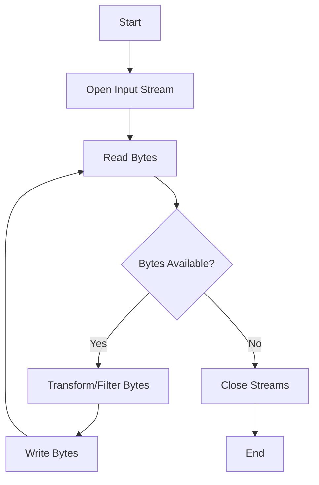

## 12.14. Streaming Data with Byte Streams

In today's data-driven world, the ability to efficiently process streaming data is crucial. Clojure, with its functional programming paradigm and robust Java interoperability, provides powerful tools for handling byte streams. This section delves into the requirements for streaming data processing, demonstrates reading and writing byte streams, and explores patterns for data transformation and filtering. We will also emphasize resource management and error handling to ensure robust and efficient applications.

### Understanding Streaming Data Processing

Streaming data processing involves handling continuous flows of data, often in real-time. This requires efficient input/output operations, as well as the ability to transform and filter data on-the-fly. Key requirements include:

- **Low Latency**: Minimizing delay in data processing to ensure timely insights.
- **Scalability**: Handling increasing volumes of data without degradation in performance.
- **Fault Tolerance**: Ensuring the system can recover from errors without data loss.
- **Resource Efficiency**: Managing memory and CPU usage to optimize performance.

### Reading and Writing Byte Streams in Clojure

Clojure provides several ways to work with byte streams, leveraging its interoperability with Java. The `java.io` package is commonly used for this purpose. Let's explore how to read and write byte streams in Clojure.

#### Reading Byte Streams

To read byte streams, we can use `java.io.InputStream`. Here's a simple example of reading data from a file:

```clojure
(ns streaming-example.core
  (:import [java.io FileInputStream]))

(defn read-bytes [file-path]
  (with-open [stream (FileInputStream. file-path)]
    (let [buffer (byte-array 1024)]
      (loop [bytes-read (.read stream buffer)]
        (when (pos? bytes-read)
          (println "Read bytes:" (take bytes-read buffer))
          (recur (.read stream buffer)))))))

;; Usage
(read-bytes "path/to/your/file.txt")
```

- **Explanation**: This function opens a file input stream, reads data into a buffer, and prints the bytes read. The `with-open` macro ensures the stream is closed automatically.

#### Writing Byte Streams

Writing byte streams involves using `java.io.OutputStream`. Here's how you can write data to a file:

```clojure
(ns streaming-example.core
  (:import [java.io FileOutputStream]))

(defn write-bytes [file-path data]
  (with-open [stream (FileOutputStream. file-path)]
    (.write stream data)))

;; Usage
(write-bytes "path/to/your/output.txt" (.getBytes "Hello, Clojure!"))
```

- **Explanation**: This function writes a byte array to a file. The `with-open` macro is used to ensure the output stream is closed properly.

### Using Libraries for Byte Streams

The [Byte Streams](https://github.com/clojure/java.data) library provides a more idiomatic way to work with byte streams in Clojure, abstracting some of the boilerplate code involved in using Java's I/O classes.

#### Example: Using Byte Streams Library

```clojure
(ns streaming-example.core
  (:require [clojure.java.io :as io]
            [byte-streams :as bs]))

(defn read-byte-stream [file-path]
  (let [stream (io/input-stream file-path)]
    (bs/to-byte-array stream)))

;; Usage
(println (read-byte-stream "path/to/your/file.txt"))
```

- **Explanation**: This example uses the `byte-streams` library to read a file into a byte array. The library provides convenient functions like `to-byte-array` to simplify byte stream operations.

### Patterns for Data Transformation and Filtering

When processing streaming data, it's often necessary to transform and filter data as it flows through the system. Clojure's functional programming features make it well-suited for these tasks.

#### Transforming Data

You can use higher-order functions like `map` to transform data in a stream. Here's an example:

```clojure
(defn transform-bytes [byte-array]
  (map #(bit-xor % 0xFF) byte-array))

;; Usage
(println (transform-bytes (byte-array [1 2 3 4 5])))
```

- **Explanation**: This function applies a bitwise XOR operation to each byte in the array, effectively transforming the data.

#### Filtering Data

Filtering can be achieved using functions like `filter`. Here's an example of filtering out specific bytes:

```clojure
(defn filter-bytes [byte-array]
  (filter #(> % 128) byte-array))

;; Usage
(println (filter-bytes (byte-array [100 150 200 250])))
```

- **Explanation**: This function filters out bytes that are less than or equal to 128.

### Resource Management and Error Handling

Efficient resource management and robust error handling are critical in streaming data applications to prevent resource leaks and ensure system reliability.

#### Resource Management

Using the `with-open` macro is a best practice for managing resources like streams. It ensures that resources are closed properly, even if an exception occurs.

#### Error Handling

In Clojure, you can use `try-catch` blocks to handle exceptions. Here's an example:

```clojure
(defn safe-read-bytes [file-path]
  (try
    (read-bytes file-path)
    (catch Exception e
      (println "Error reading file:" (.getMessage e)))))
```

- **Explanation**: This function wraps the `read-bytes` function in a `try-catch` block to handle any exceptions that may occur during file reading.

### Visualizing Byte Stream Processing

To better understand the flow of data in a byte stream processing system, let's visualize it using a flowchart.



- **Description**: This flowchart represents the process of reading bytes from an input stream, transforming or filtering them, writing them to an output stream, and closing the streams when done.

### Try It Yourself

Now that we've covered the basics, try experimenting with the code examples. Here are some suggestions:

- Modify the `transform-bytes` function to apply a different transformation.
- Implement a function that writes filtered bytes to a new file.
- Experiment with different buffer sizes in the `read-bytes` function to see how it affects performance.

### References and Further Reading

- [Clojure Java Interop](https://clojure.org/reference/java_interop)
- [Byte Streams Library](https://github.com/clojure/java.data)
- [Java I/O Tutorial](https://docs.oracle.com/javase/tutorial/essential/io/)

### Key Takeaways

- Streaming data processing requires efficient handling of continuous data flows.
- Clojure's interoperability with Java allows for robust byte stream operations.
- Libraries like Byte Streams simplify working with byte streams in Clojure.
- Functional programming patterns enable effective data transformation and filtering.
- Proper resource management and error handling are essential for reliable applications.

## **Ready to Test Your Knowledge?**



### What is a key requirement for streaming data processing?

- [x] Low Latency
- [ ] High Latency
- [ ] Manual Resource Management
- [ ] Synchronous Processing

> **Explanation:** Low latency is crucial for streaming data processing to ensure timely insights and responsiveness.

### Which Clojure library simplifies working with byte streams?

- [x] Byte Streams
- [ ] Core.Async
- [ ] Ring
- [ ] Compojure

> **Explanation:** The Byte Streams library provides convenient functions for handling byte streams in Clojure.

### What does the `with-open` macro do?

- [x] Ensures resources are closed properly
- [ ] Opens files for reading
- [ ] Transforms data
- [ ] Filters data

> **Explanation:** The `with-open` macro ensures that resources like streams are closed properly, even if an exception occurs.

### How can you transform data in a byte stream?

- [x] Using higher-order functions like `map`
- [ ] Using `try-catch` blocks
- [ ] Using `with-open` macro
- [ ] Using `println`

> **Explanation:** Higher-order functions like `map` can be used to apply transformations to data in a byte stream.

### What is the purpose of a `try-catch` block in Clojure?

- [x] Handle exceptions
- [ ] Open files
- [ ] Transform data
- [ ] Filter data

> **Explanation:** A `try-catch` block is used to handle exceptions that may occur during program execution.

### Which function is used to read bytes from a file in the provided example?

- [x] `read-bytes`
- [ ] `write-bytes`
- [ ] `transform-bytes`
- [ ] `filter-bytes`

> **Explanation:** The `read-bytes` function is used to read bytes from a file in the provided example.

### What does the `filter` function do?

- [x] Filters data based on a predicate
- [ ] Transforms data
- [ ] Writes data to a file
- [ ] Opens a file for reading

> **Explanation:** The `filter` function is used to filter data based on a predicate, removing elements that do not satisfy the condition.

### What is the role of the `byte-array` function in the examples?

- [x] Creates an array of bytes
- [ ] Opens a file
- [ ] Writes data to a file
- [ ] Handles exceptions

> **Explanation:** The `byte-array` function creates an array of bytes, which can be used for reading or writing byte streams.

### What is a benefit of using the Byte Streams library?

- [x] Simplifies byte stream operations
- [ ] Increases latency
- [ ] Requires manual resource management
- [ ] Reduces scalability

> **Explanation:** The Byte Streams library simplifies byte stream operations by providing convenient functions and abstractions.

### True or False: The `with-open` macro is used for error handling.

- [ ] True
- [x] False

> **Explanation:** The `with-open` macro is used for resource management, ensuring that resources are closed properly. Error handling is done using `try-catch` blocks.



Remember, this is just the beginning. As you progress, you'll build more complex and interactive applications. Keep experimenting, stay curious, and enjoy the journey!
