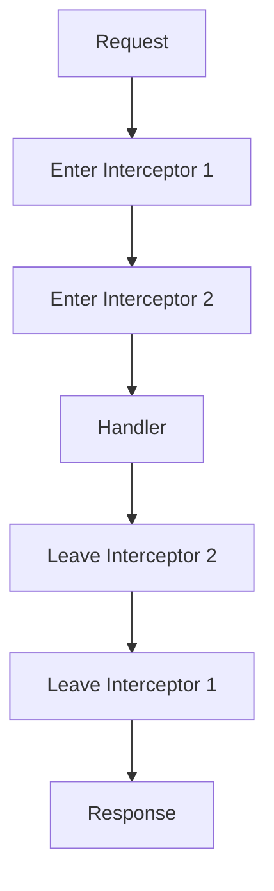

## 12.15. RESTful Services with Pedestal

In this section, we will delve into the world of RESTful services using Pedestal, a robust and flexible web framework for Clojure. Pedestal is designed to support the development of high-performance web applications and services, offering a rich set of features that make it a compelling choice for Clojure developers. We will explore how to set up a Pedestal service, define routes, utilize interceptors, and leverage advanced features such as WebSockets. Additionally, we will compare Pedestal with other popular Clojure frameworks like Ring and Compojure.

### Introduction to Pedestal

Pedestal is a Clojure-based web framework that emphasizes simplicity, composability, and performance. It provides a comprehensive set of tools for building web applications and services, including support for RESTful APIs, WebSockets, and server-sent events. Pedestal's architecture is built around the concept of interceptors, which are functions that can be composed to handle various aspects of request processing.

#### Key Features of Pedestal

- **Interceptor-based Architecture**: Pedestal uses interceptors to manage the flow of HTTP requests and responses, allowing for flexible and reusable request processing logic.
- **Asynchronous Processing**: Pedestal supports asynchronous request handling, enabling high-performance applications that can handle many concurrent connections.
- **WebSockets and Server-Sent Events**: Pedestal provides built-in support for WebSockets and server-sent events, making it easy to build real-time applications.
- **Routing**: Pedestal offers a powerful routing system that supports both static and dynamic routes, as well as route parameters and constraints.

### Setting Up a Pedestal Service

To get started with Pedestal, you need to set up a new Clojure project. You can use Leiningen, a popular build tool for Clojure, to create a new project with Pedestal as a dependency.

```bash
lein new pedestal-service my-pedestal-service
```

This command will generate a new project structure with the necessary dependencies for Pedestal. Next, navigate to the project directory and open the `project.clj` file to ensure that Pedestal is included as a dependency.

```clojure
(defproject my-pedestal-service "0.0.1-SNAPSHOT"
  :dependencies [[org.clojure/clojure "1.10.3"]
                 [io.pedestal/pedestal.service "0.5.9"]
                 [io.pedestal/pedestal.jetty "0.5.9"]])
```

### Defining Routes

Routes in Pedestal are defined using a data structure that maps HTTP methods and paths to handler functions. Here's a simple example of defining routes in Pedestal:

```clojure
(ns my-pedestal-service.service
  (:require [io.pedestal.http :as http]
            [io.pedestal.http.route :as route]))

(def routes
  (route/expand-routes
    #{["/hello" :get (fn [request] {:status 200 :body "Hello, World!"})]}))
```

In this example, we define a single route that responds to GET requests at the `/hello` path with a "Hello, World!" message. The `route/expand-routes` function is used to expand the route definitions into a format that Pedestal can use.

### Interceptors and Request Processing

Interceptors are a core concept in Pedestal, providing a way to compose request processing logic. An interceptor is a map with `:enter`, `:leave`, and `:error` keys, each associated with a function that takes a context map as an argument.

```clojure
(defn log-request
  [context]
  (println "Request received:" (:request context))
  context)

(defn log-response
  [context]
  (println "Response sent:" (:response context))
  context)

(def log-interceptor
  {:name ::log
   :enter log-request
   :leave log-response})
```

In this example, we define a logging interceptor that logs incoming requests and outgoing responses. The `:enter` function is called when a request is received, and the `:leave` function is called before a response is sent.

### Advanced Features: WebSockets Support

Pedestal provides built-in support for WebSockets, allowing you to build real-time applications with ease. To use WebSockets in Pedestal, you need to define a WebSocket handler and add it to your service.

```clojure
(defn ws-handler
  [ws]
  (println "WebSocket connection established")
  (ws/send! ws "Welcome to the WebSocket server!"))

(def routes
  (route/expand-routes
    #{["/ws" :get (http/websocket ws-handler)]}))
```

In this example, we define a WebSocket handler that sends a welcome message to the client when a connection is established. The `http/websocket` function is used to create a WebSocket endpoint.

### Comparing Pedestal with Ring/Compojure

Pedestal, Ring, and Compojure are all popular choices for building web applications in Clojure, but they have different strengths and use cases.

- **Pedestal**: Offers a comprehensive set of features for building high-performance web services, including interceptors, asynchronous processing, and WebSockets support. It is well-suited for complex applications that require fine-grained control over request processing.
- **Ring**: A minimalist web server interface for Clojure, providing a simple way to handle HTTP requests and responses. Ring is often used as a foundation for other frameworks, such as Compojure.
- **Compojure**: A routing library built on top of Ring, providing a concise syntax for defining routes. Compojure is ideal for simple web applications and APIs that don't require the advanced features of Pedestal.

### Visualizing Pedestal's Interceptor Chain

To better understand how interceptors work in Pedestal, let's visualize the interceptor chain using a Mermaid.js diagram.



This diagram illustrates the flow of a request through a series of interceptors, with each interceptor having an `:enter` and `:leave` phase. The handler is invoked after the `:enter` phase of all interceptors, and the response is processed during the `:leave` phase.

### Try It Yourself

Now that we've covered the basics of building RESTful services with Pedestal, it's time to try it yourself. Experiment with the code examples provided, and try modifying them to add new routes, interceptors, or WebSocket handlers. You can also explore Pedestal's documentation for more advanced features and use cases.

### References and Links

- [Pedestal GitHub Repository](https://github.com/pedestal/pedestal)
- [Pedestal Documentation](https://pedestal.io/documentation)
- [Ring GitHub Repository](https://github.com/ring-clojure/ring)
- [Compojure GitHub Repository](https://github.com/weavejester/compojure)

### Knowledge Check

To reinforce your understanding of RESTful services with Pedestal, try answering the following questions.

## **Ready to Test Your Knowledge?**



### What is the primary architectural concept used in Pedestal for request processing?

- [x] Interceptors
- [ ] Middleware
- [ ] Filters
- [ ] Controllers

> **Explanation:** Pedestal uses interceptors as the primary architectural concept for managing request processing.

### How do you define routes in Pedestal?

- [x] Using a data structure with HTTP methods and paths
- [ ] Using XML configuration files
- [ ] Using JSON configuration files
- [ ] Using YAML configuration files

> **Explanation:** Routes in Pedestal are defined using a data structure that maps HTTP methods and paths to handler functions.

### What function is used to expand route definitions in Pedestal?

- [x] `route/expand-routes`
- [ ] `route/define-routes`
- [ ] `route/create-routes`
- [ ] `route/setup-routes`

> **Explanation:** The `route/expand-routes` function is used to expand route definitions into a format that Pedestal can use.

### What is the purpose of the `:enter` key in an interceptor?

- [x] To define a function that processes the request before it reaches the handler
- [ ] To define a function that processes the response after it leaves the handler
- [ ] To define a function that handles errors during request processing
- [ ] To define a function that initializes the interceptor

> **Explanation:** The `:enter` key in an interceptor is used to define a function that processes the request before it reaches the handler.

### What built-in feature does Pedestal provide for real-time applications?

- [x] WebSockets support
- [ ] GraphQL support
- [ ] SOAP support
- [ ] FTP support

> **Explanation:** Pedestal provides built-in support for WebSockets, which is useful for building real-time applications.

### Which of the following is NOT a feature of Pedestal?

- [ ] Interceptor-based architecture
- [ ] Asynchronous processing
- [ ] WebSockets support
- [x] Built-in database ORM

> **Explanation:** Pedestal does not include a built-in database ORM; it focuses on web service features like interceptors and WebSockets.

### How does Pedestal compare to Ring?

- [x] Pedestal offers more advanced features like interceptors and WebSockets
- [ ] Pedestal is a simpler framework than Ring
- [ ] Pedestal is only for building static websites
- [ ] Pedestal does not support RESTful services

> **Explanation:** Pedestal offers more advanced features compared to Ring, such as interceptors and WebSockets support.

### What command is used to create a new Pedestal service project with Leiningen?

- [x] `lein new pedestal-service my-pedestal-service`
- [ ] `lein create pedestal-service my-pedestal-service`
- [ ] `lein init pedestal-service my-pedestal-service`
- [ ] `lein generate pedestal-service my-pedestal-service`

> **Explanation:** The `lein new pedestal-service my-pedestal-service` command is used to create a new Pedestal service project with Leiningen.

### What is the role of the `:leave` function in an interceptor?

- [x] To process the response before it is sent to the client
- [ ] To process the request before it reaches the handler
- [ ] To handle errors during request processing
- [ ] To initialize the interceptor

> **Explanation:** The `:leave` function in an interceptor is used to process the response before it is sent to the client.

### True or False: Pedestal can be used to build both RESTful services and real-time applications.

- [x] True
- [ ] False

> **Explanation:** True. Pedestal supports both RESTful services and real-time applications through features like interceptors and WebSockets.



Remember, this is just the beginning. As you progress, you'll build more complex and interactive web services with Pedestal. Keep experimenting, stay curious, and enjoy the journey!
