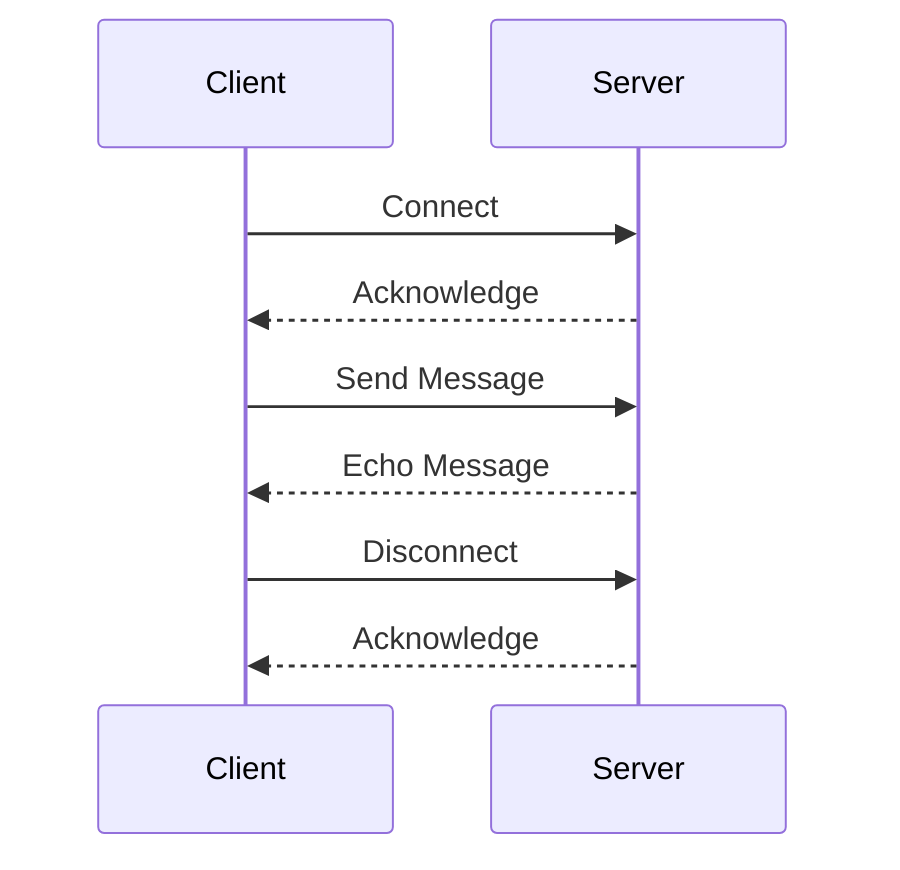

## 12.2. Network Programming Basics in Clojure

Network programming is a crucial aspect of modern software development, enabling applications to communicate over networks. In this section, we will explore the basics of network programming in Clojure, focusing on TCP/IP, sockets, protocols, and data transmission. We will demonstrate how to create clients and servers using Java interop and Clojure libraries, discuss concurrency and error handling, and highlight common protocols and data formats.

### Understanding TCP/IP and Network Communication

TCP/IP (Transmission Control Protocol/Internet Protocol) is the fundamental suite of protocols that governs how data is transmitted over the internet. Understanding TCP/IP is essential for network programming as it provides the rules and conventions for communication between network devices.

#### Key Concepts of TCP/IP

- **IP Address**: A unique identifier for a device on a network.
- **Port**: A logical endpoint for communication, allowing multiple services to run on a single IP address.
- **TCP**: A connection-oriented protocol that ensures reliable data transmission.
- **UDP**: A connectionless protocol that allows faster, but less reliable, data transmission.

### Creating Clients and Servers Using Java Interop

Clojure runs on the Java Virtual Machine (JVM), which allows us to leverage Java's extensive networking capabilities. We can use Java interop to create network clients and servers in Clojure.

#### Creating a TCP Server

Let's start by creating a simple TCP server using Java's `ServerSocket` class.

```clojure
(ns network-programming.tcp-server
  (:import (java.net ServerSocket Socket)
           (java.io BufferedReader InputStreamReader PrintWriter)))

(defn start-server [port]
  (let [server-socket (ServerSocket. port)]
    (println "Server started on port" port)
    (while true
      (let [client-socket (.accept server-socket)
            in (BufferedReader. (InputStreamReader. (.getInputStream client-socket)))
            out (PrintWriter. (.getOutputStream client-socket) true)]
        (println "Client connected")
        (.println out "Welcome to the Clojure TCP server!")
        (loop []
          (let [line (.readLine in)]
            (when line
              (println "Received:" line)
              (.println out (str "Echo: " line))
              (recur))))))))

;; Start the server on port 8080
(start-server 8080)
```

**Explanation**:
- We create a `ServerSocket` listening on the specified port.
- The server waits for client connections using `.accept`.
- For each client, we set up input and output streams to read from and write to the client.
- The server echoes back any messages received from the client.

#### Creating a TCP Client

Next, let's create a simple TCP client to connect to our server.

```clojure
(ns network-programming.tcp-client
  (:import (java.net Socket)
           (java.io BufferedReader InputStreamReader PrintWriter)))

(defn start-client [host port]
  (let [client-socket (Socket. host port)
        in (BufferedReader. (InputStreamReader. (.getInputStream client-socket)))
        out (PrintWriter. (.getOutputStream client-socket) true)]
    (println "Connected to server")
    (.println out "Hello, server!")
    (println "Server says:" (.readLine in))
    (.close client-socket)))

;; Connect to the server on localhost:8080
(start-client "localhost" 8080)
```

**Explanation**:
- We create a `Socket` to connect to the server at the specified host and port.
- We set up input and output streams to communicate with the server.
- The client sends a message to the server and prints the server's response.

### Using Libraries for Network Programming

While Java interop provides a solid foundation for network programming, Clojure libraries can simplify the process and offer additional functionality.

#### Aleph: Asynchronous Networking

Aleph is a Clojure library that provides asynchronous networking capabilities. It is built on top of Netty, a high-performance networking framework.

##### Creating a Server with Aleph

```clojure
(ns network-programming.aleph-server
  (:require [aleph.tcp :as tcp]
            [manifold.stream :as s]))

(defn handle-connection [s]
  (s/consume
    (fn [msg]
      (println "Received:" msg)
      (s/put! s (str "Echo: " msg)))
    s))

(defn start-server [port]
  (tcp/start-server handle-connection {:port port})
  (println "Aleph server started on port" port))

;; Start the server on port 8080
(start-server 8080)
```

**Explanation**:
- We define a `handle-connection` function to process incoming messages.
- The server echoes back any received messages.
- `tcp/start-server` starts the server on the specified port.

##### Creating a Client with Aleph

```clojure
(ns network-programming.aleph-client
  (:require [aleph.tcp :as tcp]
            [manifold.stream :as s]))

(defn start-client [host port]
  (let [client (tcp/client {:host host :port port})]
    (s/put! client "Hello, Aleph server!")
    (s/consume println client)))

;; Connect to the server on localhost:8080
(start-client "localhost" 8080)
```

**Explanation**:
- We create a client using `tcp/client` to connect to the server.
- The client sends a message and prints any responses from the server.

### Concurrency and Error Handling

Network programming often involves handling multiple connections simultaneously, which requires concurrency. Clojure provides several concurrency primitives, such as atoms, refs, agents, and core.async channels, to manage concurrent operations.

#### Using Core.Async for Concurrency

Core.async is a Clojure library that provides facilities for asynchronous programming using channels.

```clojure
(ns network-programming.async-server
  (:require [clojure.core.async :as async :refer [go chan <! >!]]
            [aleph.tcp :as tcp]
            [manifold.stream :as s]))

(defn handle-connection [s]
  (let [c (chan)]
    (s/consume #(go (>! c %)) s)
    (go-loop []
      (when-let [msg (<! c)]
        (println "Received:" msg)
        (s/put! s (str "Echo: " msg))
        (recur)))))

(defn start-server [port]
  (tcp/start-server handle-connection {:port port})
  (println "Async server started on port" port))

;; Start the server on port 8080
(start-server 8080)
```

**Explanation**:
- We use a core.async channel to handle incoming messages.
- The `go-loop` processes messages asynchronously, allowing the server to handle multiple connections concurrently.

#### Error Handling in Network Programming

Error handling is crucial in network programming to ensure robustness and reliability. Common errors include connection timeouts, data transmission errors, and server overloads.

- **Connection Timeouts**: Use timeouts to prevent blocking operations from hanging indefinitely.
- **Data Transmission Errors**: Validate and sanitize data to prevent errors during transmission.
- **Server Overloads**: Implement rate limiting and load balancing to manage high traffic.

### Common Protocols and Data Formats

Network communication often involves using standard protocols and data formats to ensure interoperability between different systems.

#### HTTP and REST

HTTP (Hypertext Transfer Protocol) is a widely used protocol for web communication. REST (Representational State Transfer) is an architectural style that uses HTTP for building web services.

- **Ring**: A Clojure library for building web applications.
- **Compojure**: A routing library for Ring.

#### JSON and XML

JSON (JavaScript Object Notation) and XML (eXtensible Markup Language) are common data formats for network communication.

- **Cheshire**: A Clojure library for JSON encoding and decoding.
- **clojure.data.xml**: A library for working with XML data.

### Visualizing Network Communication

To better understand network communication, let's visualize the interaction between a client and a server using a sequence diagram.



**Description**: This diagram illustrates the basic flow of communication between a client and a server. The client connects to the server, sends a message, receives an echo of the message, and then disconnects.

### Knowledge Check

Before we wrap up, let's reinforce what we've learned with a few questions:

- What is the difference between TCP and UDP?
- How can we handle multiple client connections concurrently in Clojure?
- What are some common protocols and data formats used in network programming?

### Try It Yourself

Experiment with the provided code examples by modifying the port numbers, message content, or adding new features such as logging or authentication. This hands-on practice will deepen your understanding of network programming in Clojure.

### Summary

In this section, we've covered the basics of network programming in Clojure, including TCP/IP, creating clients and servers using Java interop and Clojure libraries, handling concurrency and errors, and using common protocols and data formats. Remember, network programming is a vast field, and this is just the beginning. Keep exploring and experimenting to master these concepts.

## **Ready to Test Your Knowledge?**



### What is the primary protocol used for reliable data transmission over the internet?

- [x] TCP
- [ ] UDP
- [ ] HTTP
- [ ] FTP

> **Explanation:** TCP (Transmission Control Protocol) is the primary protocol used for reliable data transmission over the internet, ensuring that data packets are delivered in order and without errors.

### Which Clojure library provides asynchronous networking capabilities?

- [x] Aleph
- [ ] Ring
- [ ] Compojure
- [ ] Cheshire

> **Explanation:** Aleph is a Clojure library that provides asynchronous networking capabilities, built on top of Netty.

### How can we handle multiple client connections concurrently in Clojure?

- [x] Using core.async channels
- [ ] Using a single thread
- [ ] Using blocking I/O
- [ ] Using a single socket

> **Explanation:** Core.async channels allow us to handle multiple client connections concurrently by providing facilities for asynchronous programming.

### What is the purpose of the `ServerSocket` class in Java?

- [x] To listen for incoming client connections
- [ ] To send data to a client
- [ ] To encode and decode JSON
- [ ] To manage HTTP requests

> **Explanation:** The `ServerSocket` class in Java is used to listen for incoming client connections on a specified port.

### Which data format is commonly used for network communication due to its lightweight nature?

- [x] JSON
- [ ] XML
- [ ] CSV
- [ ] YAML

> **Explanation:** JSON (JavaScript Object Notation) is commonly used for network communication due to its lightweight and easy-to-read nature.

### What is the role of the `PrintWriter` class in the TCP client example?

- [x] To send data to the server
- [ ] To read data from the server
- [ ] To manage client connections
- [ ] To handle errors

> **Explanation:** The `PrintWriter` class is used to send data to the server by writing to the output stream of the socket.

### Which protocol is typically used for web communication?

- [x] HTTP
- [ ] TCP
- [ ] UDP
- [ ] FTP

> **Explanation:** HTTP (Hypertext Transfer Protocol) is typically used for web communication, enabling the transfer of hypertext documents.

### What is the advantage of using Aleph for network programming in Clojure?

- [x] Asynchronous networking capabilities
- [ ] Synchronous networking capabilities
- [ ] Built-in JSON support
- [ ] Built-in XML support

> **Explanation:** Aleph provides asynchronous networking capabilities, allowing for non-blocking I/O operations and efficient handling of multiple connections.

### What is the purpose of the `BufferedReader` class in the TCP server example?

- [x] To read data from the client
- [ ] To send data to the client
- [ ] To manage server connections
- [ ] To handle errors

> **Explanation:** The `BufferedReader` class is used to read data from the client by reading from the input stream of the socket.

### True or False: UDP is a connection-oriented protocol that ensures reliable data transmission.

- [ ] True
- [x] False

> **Explanation:** False. UDP (User Datagram Protocol) is a connectionless protocol that allows faster data transmission but does not ensure reliability.



Remember, this is just the beginning. As you progress, you'll build more complex and interactive network applications. Keep experimenting, stay curious, and enjoy the journey!
