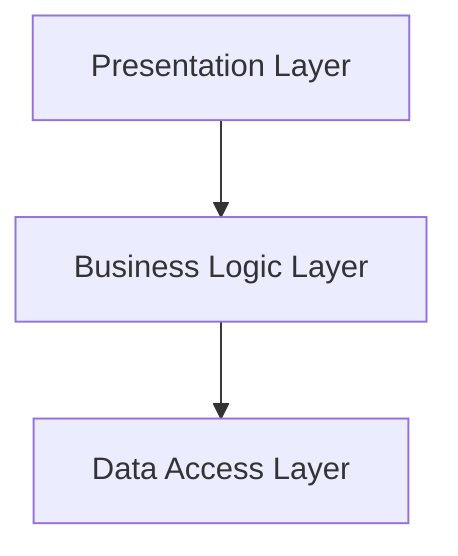

## 12.3 Layered Architecture in Clojure

Layered Architecture is a widely adopted architectural pattern that divides an application into distinct layers, each with specific responsibilities. This separation of concerns enhances maintainability, scalability, and testability. In this article, we will explore how to implement a Layered Architecture in Clojure, leveraging its functional programming paradigms and modern libraries.

### Introduction

Layered Architecture organizes an application into horizontal layers, each responsible for a specific aspect of the application's functionality. The primary layers typically include:

- **Presentation Layer:** Manages the user interface or API endpoints.
- **Business Logic Layer:** Encapsulates the core business rules and workflows.
- **Data Access Layer:** Handles interactions with the database or external data sources.

This architecture promotes a clean separation of concerns, allowing each layer to evolve independently. It also enforces a strict communication flow, where each layer only interacts with its adjacent layers, reducing coupling and enhancing modularity.

### Detailed Explanation

#### Layered Architecture Components

1. **Presentation Layer:**
   - **Role:** Handles all interactions with the user or external systems. This layer is responsible for rendering views or processing API requests.
   - **Example:**
     ```clojure
     ;; src/myapp/presentation.clj
     (ns myapp.presentation
       (:require [myapp.business :as business]))

     (defn create-user-handler [request]
       (let [user-data (:params request)
             result (business/create-user user-data)]
         {:status 200 :body result}))
     ```

2. **Business Logic Layer:**
   - **Role:** Contains the core business logic, rules, and workflows. This layer processes data received from the Presentation Layer and interacts with the Data Access Layer.
   - **Example:**
     ```clojure
     ;; src/myapp/business.clj
     (ns myapp.business
       (:require [myapp.data :as data]))

     (defn create-user [user-data]
       ;; Business rules can be applied here
       (data/save-user user-data))
     ```

3. **Data Access Layer:**
   - **Role:** Manages data persistence and retrieval, abstracting the database operations from the rest of the application.
   - **Example:**
     ```clojure
     ;; src/myapp/data.clj
     (ns myapp.data
       (:require [clojure.java.jdbc :as jdbc]))

     (def db-spec {...})

     (defn save-user [user]
       (jdbc/insert! db-spec :users user))
     ```

#### Enforcing Layered Communication

To maintain the integrity of the Layered Architecture, it's crucial to enforce strict communication rules:

- **Presentation Layer ↔ Business Logic Layer ↔ Data Access Layer:** Each layer should only communicate with its direct neighbor. For instance, the Presentation Layer should never directly access the Data Access Layer.

#### Facilitating Testing at Each Layer

Testing is a critical aspect of maintaining a robust application. In a Layered Architecture, you can test each layer in isolation by mocking the dependencies of the lower layers. This approach ensures that the logic within each layer is thoroughly validated without interference from other layers.

### Visual Representation

Below is a conceptual diagram illustrating the Layered Architecture:



### Code Examples

Let's delve into a practical example of a simple user management system using Layered Architecture in Clojure.

#### Presentation Layer Example

The Presentation Layer handles HTTP requests and delegates processing to the Business Logic Layer.

```clojure
(ns myapp.presentation
  (:require [myapp.business :as business]))

(defn create-user-handler [request]
  (let [user-data (:params request)
        result (business/create-user user-data)]
    {:status 200 :body result}))
```

#### Business Logic Layer Example

The Business Logic Layer applies business rules and interacts with the Data Access Layer.

```clojure
(ns myapp.business
  (:require [myapp.data :as data]))

(defn create-user [user-data]
  ;; Apply business rules here
  (data/save-user user-data))
```

#### Data Access Layer Example

The Data Access Layer abstracts database operations using Clojure's JDBC library.

```clojure
(ns myapp.data
  (:require [clojure.java.jdbc :as jdbc]))

(def db-spec {:dbtype "h2" :dbname "test"})

(defn save-user [user]
  (jdbc/insert! db-spec :users user))
```

### Use Cases

Layered Architecture is suitable for various applications, including:

- **Web Applications:** Separating the UI, business logic, and data access concerns.
- **Enterprise Systems:** Modularizing complex systems for easier maintenance and scalability.
- **API Services:** Structuring services to handle requests, process business logic, and manage data persistence.

### Advantages and Disadvantages

#### Advantages

- **Modularity:** Each layer can be developed and maintained independently.
- **Testability:** Layers can be tested in isolation, improving test coverage and reliability.
- **Scalability:** The architecture supports scaling individual layers as needed.

#### Disadvantages

- **Complexity:** Introducing multiple layers can increase the complexity of the system.
- **Performance Overhead:** Additional layers may introduce latency due to inter-layer communication.

### Best Practices

- **Adhere to SOLID Principles:** Ensure each layer adheres to the Single Responsibility Principle and other SOLID principles to enhance maintainability.
- **Use Dependency Injection:** Facilitate testing and decouple layers by injecting dependencies.
- **Leverage Modern Libraries:** Use libraries like `Integrant` or `Component` to manage application lifecycle and dependencies.

### Comparisons

Layered Architecture can be compared with other architectural patterns like Hexagonal Architecture, which also emphasizes separation of concerns but allows more flexible interactions between components.

### Conclusion

Layered Architecture in Clojure provides a robust framework for building modular, maintainable, and scalable applications. By dividing the application into distinct layers, developers can focus on specific concerns, leading to cleaner and more organized codebases. While it introduces some complexity, the benefits of improved testability and scalability often outweigh the drawbacks.

## Quiz Time!



### What is the primary purpose of Layered Architecture?

- [x] To separate concerns into distinct layers for better modularity and maintainability.
- [ ] To increase the complexity of the application.
- [ ] To allow direct access between all layers.
- [ ] To eliminate the need for testing.

> **Explanation:** Layered Architecture aims to separate concerns into distinct layers, enhancing modularity and maintainability.

### Which layer is responsible for handling user interactions in a Layered Architecture?

- [x] Presentation Layer
- [ ] Business Logic Layer
- [ ] Data Access Layer
- [ ] Integration Layer

> **Explanation:** The Presentation Layer handles user interactions, such as UI rendering or API request processing.

### In a Layered Architecture, which layer should the Presentation Layer directly interact with?

- [x] Business Logic Layer
- [ ] Data Access Layer
- [ ] Database Layer
- [ ] All layers

> **Explanation:** The Presentation Layer should directly interact with the Business Logic Layer, not the Data Access Layer.

### What is a key advantage of using Layered Architecture?

- [x] Improved testability by isolating layers.
- [ ] Increased performance due to fewer layers.
- [ ] Direct access to the database from the UI.
- [ ] Reduced need for documentation.

> **Explanation:** Layered Architecture improves testability by allowing layers to be tested in isolation.

### Which Clojure library can be used to manage dependencies and lifecycle in a Layered Architecture?

- [x] Integrant
- [ ] Ring
- [ ] Compojure
- [ ] Reagent

> **Explanation:** Integrant is a Clojure library that helps manage dependencies and lifecycle in applications.

### What is a potential disadvantage of Layered Architecture?

- [x] Increased complexity due to multiple layers.
- [ ] Lack of modularity.
- [ ] Difficulty in testing.
- [ ] Inability to scale.

> **Explanation:** Layered Architecture can increase complexity due to the introduction of multiple layers.

### How can testing be facilitated in a Layered Architecture?

- [x] By mocking lower layers to test upper layers in isolation.
- [ ] By testing all layers together without isolation.
- [ ] By avoiding tests for the Data Access Layer.
- [ ] By using only manual testing methods.

> **Explanation:** Testing can be facilitated by mocking lower layers, allowing upper layers to be tested in isolation.

### Which principle is important to follow in a Layered Architecture to enhance maintainability?

- [x] SOLID Principles
- [ ] DRY Principle
- [ ] KISS Principle
- [ ] YAGNI Principle

> **Explanation:** Following SOLID Principles enhances maintainability in a Layered Architecture.

### What is the role of the Data Access Layer in a Layered Architecture?

- [x] To manage data persistence and retrieval.
- [ ] To handle user interface rendering.
- [ ] To apply business rules.
- [ ] To manage application configuration.

> **Explanation:** The Data Access Layer is responsible for managing data persistence and retrieval.

### True or False: In a Layered Architecture, the Presentation Layer can directly access the Data Access Layer.

- [ ] True
- [x] False

> **Explanation:** In a Layered Architecture, the Presentation Layer should not directly access the Data Access Layer; it should interact through the Business Logic Layer.


