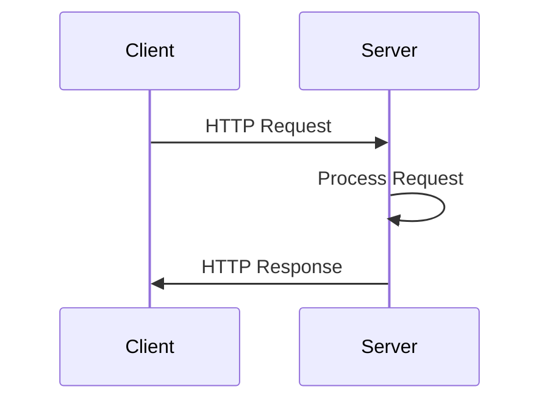

## 12.3. Implementing Servers and Clients with Aleph and http-kit

In the world of Clojure, building high-performance servers and clients is made efficient and straightforward with libraries like Aleph and http-kit. These libraries leverage Clojure's strengths in handling asynchronous operations and concurrency, making them ideal for modern web applications that require scalability and responsiveness.

### Introduction to Aleph and http-kit

**Aleph** and **http-kit** are two popular Clojure libraries for building web servers and clients. Both libraries offer robust features for handling HTTP requests and responses, asynchronous processing, and WebSocket communication. Let's dive into each library's unique offerings and explore how they can be utilized in your Clojure applications.

#### Aleph

Aleph is built on top of Netty, a high-performance, asynchronous event-driven network application framework. This foundation allows Aleph to handle a large number of concurrent connections efficiently. Aleph provides:

- **Asynchronous HTTP server and client**: Aleph's non-blocking architecture makes it suitable for applications that require high concurrency.
- **WebSocket support**: Aleph includes built-in support for WebSocket communication, enabling real-time data exchange.
- **Streaming capabilities**: Aleph supports streaming data, which is essential for handling large payloads or continuous data flows.

#### http-kit

http-kit is known for its simplicity and performance. It is a lightweight HTTP server and client library that provides:

- **Asynchronous request handling**: Like Aleph, http-kit is designed for non-blocking I/O operations.
- **WebSocket support**: http-kit also supports WebSocket, making it suitable for real-time applications.
- **Ease of use**: http-kit's API is straightforward, making it easy to integrate into existing Clojure projects.

### Setting Up HTTP Servers and Clients

Let's explore how to set up HTTP servers and clients using Aleph and http-kit. We'll start with Aleph.

#### Setting Up an Aleph Server

To create a simple HTTP server with Aleph, follow these steps:

1. **Add Aleph to Your Project**: Include Aleph in your `project.clj` dependencies.

   ```clojure
   :dependencies [[aleph "0.4.7"]]
   ```

2. **Create a Basic Server**: Use Aleph's `start-server` function to create a server.

   ```clojure
   (ns myapp.server
     (:require [aleph.http :as http]
               [manifold.stream :as s]))

   (defn handler [request]
     {:status 200
      :headers {"Content-Type" "text/plain"}
      :body "Hello, Aleph!"})

   (defn start-server []
     (http/start-server handler {:port 8080}))
   ```

   - **Explanation**: The `handler` function processes incoming requests and returns a response map. The `start-server` function initializes the server on port 8080.

3. **Run the Server**: Start the server by calling `start-server`.

   ```clojure
   (start-server)
   ```

#### Setting Up an Aleph Client

To make HTTP requests using Aleph's client capabilities:

1. **Create a Basic Client**: Use Aleph's `http/request` function to perform HTTP requests.

   ```clojure
   (ns myapp.client
     (:require [aleph.http :as http]
               [manifold.deferred :as d]))

   (defn fetch-url [url]
     (let [response (http/request {:method :get :url url})]
       (d/chain response
                (fn [resp]
                  (println "Response:" (:body resp))))))
   ```

   - **Explanation**: The `fetch-url` function performs a GET request to the specified URL and prints the response body.

#### Setting Up an http-kit Server

Setting up a server with http-kit is similarly straightforward:

1. **Add http-kit to Your Project**: Include http-kit in your `project.clj` dependencies.

   ```clojure
   :dependencies [[http-kit "2.5.3"]]
   ```

2. **Create a Basic Server**: Use http-kit's `run-server` function to create a server.

   ```clojure
   (ns myapp.server
     (:require [org.httpkit.server :as http]))

   (defn handler [request]
     {:status 200
      :headers {"Content-Type" "text/plain"}
      :body "Hello, http-kit!"})

   (defn start-server []
     (http/run-server handler {:port 8080}))
   ```

   - **Explanation**: The `handler` function processes requests, and `run-server` starts the server on port 8080.

3. **Run the Server**: Start the server by calling `start-server`.

   ```clojure
   (start-server)
   ```

#### Setting Up an http-kit Client

To make HTTP requests using http-kit's client capabilities:

1. **Create a Basic Client**: Use http-kit's `client/get` function to perform HTTP requests.

   ```clojure
   (ns myapp.client
     (:require [org.httpkit.client :as client]))

   (defn fetch-url [url]
     (client/get url
                 {:timeout 5000}
                 (fn [{:keys [status headers body error]}]
                   (if error
                     (println "Failed, exception is " error)
                     (println "Async HTTP GET: " status)))))
   ```

   - **Explanation**: The `fetch-url` function performs a GET request to the specified URL and prints the status of the response.

### Asynchronous Request Handling and WebSocket Support

Both Aleph and http-kit excel in asynchronous request handling, which is crucial for building scalable applications. Let's explore how each library handles asynchronous operations and WebSocket communication.

#### Asynchronous Request Handling

**Aleph**: Aleph uses the Manifold library to handle asynchronous operations. Manifold provides deferreds, which are similar to promises or futures in other languages. This allows you to chain operations and handle results asynchronously.

**http-kit**: http-kit uses a callback-based approach for asynchronous operations. You provide a callback function that processes the response once the request is complete.

#### WebSocket Support

**Aleph**: Aleph's WebSocket support is built on top of its asynchronous architecture. You can easily create WebSocket servers and clients using Aleph's API.

```clojure
(ns myapp.websocket
  (:require [aleph.http :as http]
            [manifold.stream :as s]))

(defn websocket-handler [req]
  (let [socket (http/websocket-connection req)]
    (s/consume #(println "Received message:" %) socket)
    (s/put! socket "Welcome to Aleph WebSocket!")))

(defn start-websocket-server []
  (http/start-server websocket-handler {:port 8080}))
```

- **Explanation**: The `websocket-handler` function establishes a WebSocket connection and handles incoming messages. The server is started on port 8080.

**http-kit**: http-kit also supports WebSocket communication. You can create WebSocket servers and clients using its API.

```clojure
(ns myapp.websocket
  (:require [org.httpkit.server :as http]))

(defn websocket-handler [req]
  (http/with-channel req channel
    (http/on-receive channel (fn [msg] (println "Received:" msg)))
    (http/send! channel "Welcome to http-kit WebSocket!")))

(defn start-websocket-server []
  (http/run-server websocket-handler {:port 8080}))
```

- **Explanation**: The `websocket-handler` function handles WebSocket connections and messages. The server is started on port 8080.

### Performance Benefits and Use Cases

Both Aleph and http-kit offer significant performance benefits due to their non-blocking architectures. They are well-suited for applications that require:

- **High concurrency**: Both libraries can handle thousands of concurrent connections efficiently.
- **Real-time communication**: With built-in WebSocket support, they are ideal for applications that require real-time data exchange, such as chat applications or live updates.
- **Scalability**: Their asynchronous nature allows for easy scaling to accommodate increased load.

### Choosing Between Aleph and http-kit

When deciding between Aleph and http-kit, consider the following factors:

- **Complexity**: Aleph offers more features and flexibility, which may be beneficial for complex applications. However, this comes at the cost of increased complexity.
- **Simplicity**: http-kit is simpler and easier to use, making it a good choice for smaller projects or when ease of integration is a priority.
- **Performance**: Both libraries offer excellent performance, but Aleph's use of Netty may provide an edge in scenarios requiring extreme concurrency.

### Visualizing the Architecture

To better understand the architecture of Aleph and http-kit, let's visualize the flow of a typical HTTP request in both libraries.



- **Description**: This diagram illustrates the basic flow of an HTTP request and response between a client and server. Both Aleph and http-kit follow this pattern, with the added benefit of asynchronous processing.

### Try It Yourself

To get hands-on experience with Aleph and http-kit, try modifying the provided code examples:

- **Experiment with different HTTP methods**: Modify the server and client to handle POST, PUT, and DELETE requests.
- **Implement additional WebSocket features**: Add functionality to broadcast messages to all connected clients.
- **Benchmark performance**: Compare the performance of Aleph and http-kit under different loads.

### References and Links

For further reading and resources, check out the official documentation for [Aleph](https://github.com/clj-commons/aleph) and [http-kit](http://www.http-kit.org/).

### Knowledge Check

To reinforce your understanding, let's test your knowledge with a few questions.

## **Ready to Test Your Knowledge?**



### Which library is built on top of Netty?

- [x] Aleph
- [ ] http-kit
- [ ] Ring
- [ ] Compojure

> **Explanation:** Aleph is built on top of Netty, which provides a high-performance, asynchronous event-driven network application framework.

### What is the primary advantage of using asynchronous request handling?

- [x] High concurrency
- [ ] Simplicity
- [ ] Synchronous processing
- [ ] Blocking I/O

> **Explanation:** Asynchronous request handling allows for high concurrency by enabling non-blocking I/O operations.

### Which library uses a callback-based approach for asynchronous operations?

- [ ] Aleph
- [x] http-kit
- [ ] Ring
- [ ] Compojure

> **Explanation:** http-kit uses a callback-based approach for handling asynchronous operations.

### What is a key feature of both Aleph and http-kit?

- [x] WebSocket support
- [ ] Synchronous processing
- [ ] Built-in database support
- [ ] GUI development

> **Explanation:** Both Aleph and http-kit support WebSocket communication, enabling real-time data exchange.

### Which library is known for its simplicity and ease of use?

- [ ] Aleph
- [x] http-kit
- [ ] Ring
- [ ] Compojure

> **Explanation:** http-kit is known for its simplicity and ease of use, making it a popular choice for smaller projects.

### What is the primary use case for WebSocket support?

- [x] Real-time communication
- [ ] File storage
- [ ] Batch processing
- [ ] Static content delivery

> **Explanation:** WebSocket support is primarily used for real-time communication, such as chat applications or live updates.

### Which library provides streaming capabilities?

- [x] Aleph
- [ ] http-kit
- [ ] Ring
- [ ] Compojure

> **Explanation:** Aleph provides streaming capabilities, which are essential for handling large payloads or continuous data flows.

### What is a common use case for high concurrency?

- [x] Handling thousands of concurrent connections
- [ ] Single-threaded applications
- [ ] Static content delivery
- [ ] GUI development

> **Explanation:** High concurrency is commonly used to handle thousands of concurrent connections efficiently.

### Which library is built on top of Netty?

- [x] True
- [ ] False

> **Explanation:** Aleph is built on top of Netty, which provides a high-performance, asynchronous event-driven network application framework.

### What is the primary advantage of using asynchronous request handling?

- [x] High concurrency
- [ ] Simplicity
- [ ] Synchronous processing
- [ ] Blocking I/O

> **Explanation:** Asynchronous request handling allows for high concurrency by enabling non-blocking I/O operations.



Remember, this is just the beginning. As you progress, you'll build more complex and interactive web applications. Keep experimenting, stay curious, and enjoy the journey!
