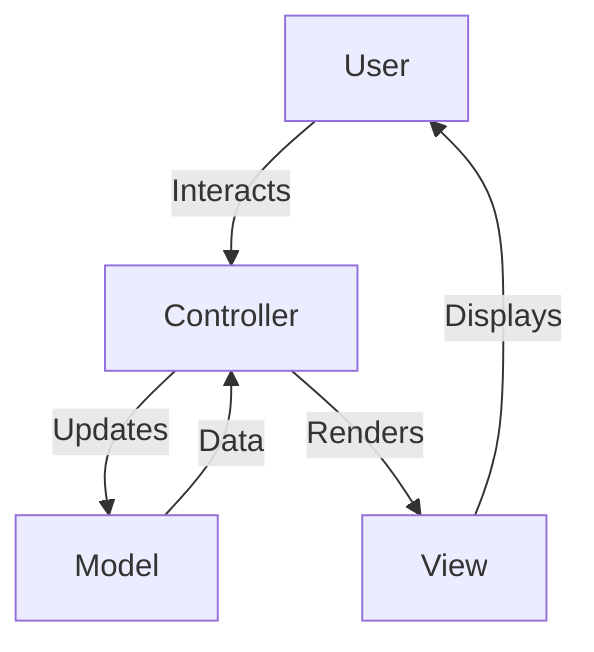

## 12.4 Model-View-Controller (MVC) in Clojure

The Model-View-Controller (MVC) pattern is a foundational architectural pattern that separates an application into three interconnected components: Model, View, and Controller. This separation of concerns facilitates organized code, making it easier to manage, scale, and maintain applications. In this article, we will delve into how MVC can be effectively implemented in Clojure, leveraging its functional programming paradigms and modern libraries.

### Introduction to MVC

The MVC pattern is designed to separate the internal representations of information from the ways that information is presented and accepted by the user. Here's a brief overview of each component:

- **Model:** Manages the data and business logic of the application. It is responsible for retrieving, storing, and processing data.
- **View:** Handles the presentation layer, displaying data to the user and sending user commands to the controller.
- **Controller:** Acts as an intermediary between the Model and the View. It processes user input, interacts with the model, and selects the view for response.

### Detailed Explanation

#### Model

The Model component is responsible for the core functionality of the application, including data management and business rules. In Clojure, the Model can be implemented using functions that interact with databases or in-memory data structures.

```clojure
;; src/myapp/model.clj
(ns myapp.model)

(defn get-items []
  ;; Retrieve items from database or in-memory data
  )

(defn add-item [item]
  ;; Add item to data store
  )
```

#### View

The View component is responsible for rendering the user interface. In Clojure, libraries like Hiccup can be used to generate HTML content programmatically.

```clojure
;; src/myapp/view.clj
(ns myapp.view
  (:require [hiccup.page :refer [html5]]
            [hiccup.element :refer [h1 ul li]]))

(defn render-items [items]
  (html5
    [:head [:title "Items List"]]
    [:body
     (h1 "Items")
     (ul (for [item items]
           (li item)))]))
```

#### Controller

The Controller component handles user input and updates the Model. It also selects the appropriate View to render the response.

```clojure
;; src/myapp/controller.clj
(ns myapp.controller
  (:require [myapp.model :as model]
            [myapp.view :as view]
            [ring.util.response :refer [response]]))

(defn list-items [request]
  (let [items (model/get-items)]
    (response (view/render-items items))))
```

### Setting Up Routes

Routing is an essential part of web applications, directing incoming requests to the appropriate controller actions. In Clojure, Compojure is a popular library for defining routes.

```clojure
;; src/myapp/routes.clj
(ns myapp.routes
  (:require [compojure.core :refer [defroutes GET]]
            [myapp.controller :refer [list-items]]))

(defroutes app-routes
  (GET "/items" [] list-items))
```

### Launching the Application

To run the application, we use a web server like Jetty. The `run-jetty` function from the Ring library is used to start the server.

```clojure
;; src/myapp/server.clj
(ns myapp.server
  (:require [ring.adapter.jetty :refer [run-jetty]]
            [myapp.routes :refer [app-routes]]))

(defn -main []
  (run-jetty app-routes {:port 3000}))
```

### Visualizing MVC in Clojure

Below is a conceptual diagram illustrating the MVC architecture in Clojure:



### Use Cases

The MVC pattern is widely used in web applications where separation of concerns is crucial. It allows developers to work on different components independently, making it easier to manage complex applications. Some real-world scenarios include:

- **E-commerce Platforms:** Managing product listings, user accounts, and order processing.
- **Content Management Systems:** Handling content creation, storage, and presentation.
- **Social Media Applications:** Managing user interactions, content feeds, and notifications.

### Advantages and Disadvantages

#### Advantages

- **Separation of Concerns:** Each component has a distinct responsibility, making the codebase easier to manage.
- **Scalability:** The pattern supports the addition of new features without affecting existing components.
- **Testability:** Components can be tested independently, improving the reliability of the application.

#### Disadvantages

- **Complexity:** The pattern can introduce complexity, especially in smaller applications.
- **Overhead:** Setting up the MVC structure can require more initial effort compared to simpler architectures.

### Best Practices

- **Keep Controllers Thin:** Controllers should delegate most of the work to the Model and View to maintain simplicity.
- **Use Libraries Wisely:** Leverage Clojure libraries like Hiccup for views and Compojure for routing to simplify development.
- **Embrace Functional Programming:** Utilize Clojure's functional programming features to create clean and maintainable code.

### Comparisons

MVC is often compared with other architectural patterns like MVVM (Model-View-ViewModel) and MVP (Model-View-Presenter). While MVC is suitable for many web applications, MVVM and MVP offer different advantages in terms of data binding and separation of presentation logic.

### Conclusion

The Model-View-Controller pattern is a powerful tool for structuring Clojure applications, particularly in web development. By separating concerns into distinct components, MVC promotes organized, scalable, and maintainable code. As you explore MVC in Clojure, consider the specific needs of your application and leverage the rich ecosystem of libraries available to streamline your development process.

## Quiz Time!



### What is the primary purpose of the Model component in MVC?

- [x] To manage data and business logic
- [ ] To handle user input
- [ ] To render the user interface
- [ ] To define application routes

> **Explanation:** The Model component is responsible for managing data and business logic in the MVC architecture.

### Which Clojure library is commonly used for HTML generation in the View component?

- [x] Hiccup
- [ ] Compojure
- [ ] Ring
- [ ] Reagent

> **Explanation:** Hiccup is a Clojure library used for generating HTML content programmatically.

### What role does the Controller play in the MVC pattern?

- [x] It acts as an intermediary between the Model and the View
- [ ] It manages the application's data
- [ ] It renders the user interface
- [ ] It defines the application's routes

> **Explanation:** The Controller acts as an intermediary between the Model and the View, processing user input and updating the Model.

### Which library is used for routing in the provided Clojure MVC example?

- [x] Compojure
- [ ] Hiccup
- [ ] Ring
- [ ] Reagent

> **Explanation:** Compojure is used for defining routes in the provided Clojure MVC example.

### What is a key advantage of using the MVC pattern?

- [x] Separation of concerns
- [ ] Increased complexity
- [ ] Reduced scalability
- [ ] Tight coupling of components

> **Explanation:** A key advantage of the MVC pattern is the separation of concerns, which makes the codebase easier to manage.

### In the MVC pattern, which component is responsible for rendering the user interface?

- [x] View
- [ ] Model
- [ ] Controller
- [ ] Router

> **Explanation:** The View component is responsible for rendering the user interface in the MVC pattern.

### What is a potential disadvantage of the MVC pattern?

- [x] Complexity
- [ ] Lack of scalability
- [ ] Tight coupling
- [ ] Poor testability

> **Explanation:** A potential disadvantage of the MVC pattern is the complexity it can introduce, especially in smaller applications.

### How does the Controller interact with the Model in MVC?

- [x] It updates the Model based on user input
- [ ] It renders the Model's data
- [ ] It defines the Model's structure
- [ ] It stores the Model's data

> **Explanation:** The Controller updates the Model based on user input in the MVC pattern.

### Which component in MVC is responsible for handling user input?

- [x] Controller
- [ ] Model
- [ ] View
- [ ] Router

> **Explanation:** The Controller is responsible for handling user input in the MVC pattern.

### True or False: The MVC pattern is only suitable for web applications.

- [ ] True
- [x] False

> **Explanation:** False. While MVC is commonly used in web applications, it can be applied to other types of applications as well.


