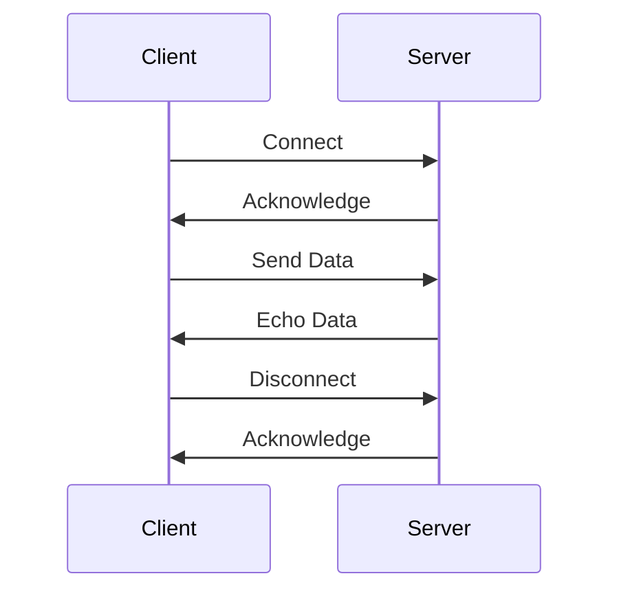

## 12.4. Protocol Design and Implementation

Designing and implementing network protocols is a crucial aspect of building robust and efficient networked applications. In this section, we will delve into the principles of protocol design, explore serialization formats, and demonstrate how to implement protocols over TCP and UDP using Clojure. We will also highlight tools and libraries that assist with protocol parsing, and emphasize the importance of testing and compatibility considerations.

### Principles of Protocol Design

When designing a network protocol, several key principles should be considered to ensure that the protocol is efficient, reliable, and easy to implement:

1. **Simplicity**: Keep the protocol as simple as possible. A simple protocol is easier to implement, debug, and maintain.

2. **Extensibility**: Design the protocol to accommodate future extensions without breaking existing implementations. This can be achieved by including version numbers or reserved fields.

3. **Efficiency**: Minimize the overhead of the protocol to ensure efficient use of network resources. This includes optimizing the size of messages and reducing the number of round trips.

4. **Reliability**: Ensure that the protocol can handle errors gracefully. This may involve implementing mechanisms for error detection and correction.

5. **Security**: Consider security aspects from the beginning. This includes authentication, encryption, and protection against common attacks such as replay attacks.

6. **Interoperability**: Design the protocol to be interoperable with other systems and platforms. This often involves adhering to established standards and conventions.

### Serialization Formats

Serialization is the process of converting data structures into a format that can be easily transmitted over a network. Choosing the right serialization format is crucial for the performance and compatibility of your protocol. Common serialization formats include:

- **JSON**: A lightweight, text-based format that is easy to read and write. It is widely used for web APIs and is supported by most programming languages.

- **XML**: A flexible, text-based format that is more verbose than JSON but supports complex data structures and schemas.

- **Protocol Buffers**: A binary serialization format developed by Google. It is more efficient than JSON and XML in terms of size and speed but requires a schema definition.

- **MessagePack**: A binary format that is more compact than JSON and is designed to be efficient for both serialization and deserialization.

- **Avro**: A binary format developed by Apache that supports schema evolution, making it suitable for data-intensive applications.

### Implementing Protocols over TCP/UDP

TCP and UDP are the two main transport protocols used for network communication. TCP provides reliable, ordered, and error-checked delivery of data, while UDP is a simpler, connectionless protocol that does not guarantee delivery or order.

#### Implementing a TCP Protocol in Clojure

Let's implement a simple echo protocol over TCP using Clojure. The echo protocol sends back any data it receives from a client.

```clojure
(ns echo-server.core
  (:require [clojure.java.io :as io])
  (:import (java.net ServerSocket Socket)))

(defn handle-client [client-socket]
  (with-open [in (io/reader client-socket)
              out (io/writer client-socket)]
    (loop []
      (when-let [line (.readLine in)]
        (.write out (str line "\n"))
        (.flush out)
        (recur)))))

(defn start-server [port]
  (let [server-socket (ServerSocket. port)]
    (println (str "Echo server started on port " port))
    (while true
      (let [client-socket (.accept server-socket)]
        (future (handle-client client-socket))))))

;; Start the server on port 8080
(start-server 8080)
```

In this example, we create a TCP server that listens on a specified port. When a client connects, we handle the connection in a separate thread using `future`. The `handle-client` function reads lines from the client and writes them back, effectively echoing the input.

#### Implementing a UDP Protocol in Clojure

UDP is often used for applications where low latency is more important than reliability. Let's implement a simple UDP echo server in Clojure.

```clojure
(ns udp-echo-server.core
  (:import (java.net DatagramSocket DatagramPacket InetAddress)))

(defn start-udp-server [port]
  (let [socket (DatagramSocket. port)
        buffer (byte-array 1024)]
    (println (str "UDP Echo server started on port " port))
    (while true
      (let [packet (DatagramPacket. buffer (count buffer))]
        (.receive socket packet)
        (let [response-packet (DatagramPacket. (.getData packet)
                                               (.getLength packet)
                                               (.getAddress packet)
                                               (.getPort packet))]
          (.send socket response-packet))))))

;; Start the UDP server on port 8080
(start-udp-server 8080)
```

In this UDP example, we create a `DatagramSocket` to listen for incoming packets. When a packet is received, we create a response packet with the same data and send it back to the client.

### Tools and Libraries for Protocol Parsing

Clojure provides several libraries that can assist with protocol parsing and serialization:

- **Cheshire**: A fast JSON library for Clojure that provides easy-to-use functions for encoding and decoding JSON data.

- **clojure.data.xml**: A library for parsing and generating XML data in Clojure.

- **clojure.data.codec**: A library for encoding and decoding data in various formats, including Base64 and Hex.

- **protobuf-clj**: A Clojure library for working with Protocol Buffers, allowing you to serialize and deserialize data using Google's Protocol Buffers format.

- **msgpack-clj**: A Clojure library for working with MessagePack, providing functions for serializing and deserializing data in the MessagePack format.

### Testing and Compatibility Considerations

Testing is a critical part of protocol design and implementation. Here are some key considerations:

1. **Unit Testing**: Write unit tests for each component of your protocol implementation. This includes tests for serialization and deserialization, message parsing, and error handling.

2. **Integration Testing**: Test the protocol implementation in a real network environment. This includes testing with different clients and servers to ensure compatibility.

3. **Performance Testing**: Measure the performance of your protocol implementation under different network conditions. This includes testing for latency, throughput, and resource usage.

4. **Compatibility Testing**: Ensure that your protocol implementation is compatible with other implementations. This may involve testing with different versions of the protocol and different serialization formats.

5. **Security Testing**: Test the protocol implementation for security vulnerabilities. This includes testing for common attacks such as buffer overflows, injection attacks, and replay attacks.

### Visualizing Protocol Design

To better understand the flow of data in a network protocol, let's visualize a simple TCP communication between a client and a server using a sequence diagram.



This diagram illustrates the basic steps of a TCP echo protocol, where the client connects to the server, sends data, receives the echoed data, and then disconnects.

### Knowledge Check

To reinforce your understanding of protocol design and implementation in Clojure, consider the following questions:

- What are the key principles of protocol design?
- How do serialization formats impact the performance and compatibility of a protocol?
- What are the differences between TCP and UDP, and when would you use each?
- How can you test the compatibility of your protocol implementation with other systems?
- What tools and libraries can assist with protocol parsing in Clojure?

### Embrace the Journey

Remember, designing and implementing network protocols is a complex but rewarding task. As you progress, you'll gain a deeper understanding of how data flows across networks and how to build efficient, reliable, and secure networked applications. Keep experimenting, stay curious, and enjoy the journey!

## **Ready to Test Your Knowledge?**



### What is a key principle of protocol design?

- [x] Simplicity
- [ ] Complexity
- [ ] Obfuscation
- [ ] Redundancy

> **Explanation:** Simplicity is a key principle of protocol design, making it easier to implement, debug, and maintain.

### Which serialization format is known for being lightweight and text-based?

- [x] JSON
- [ ] XML
- [ ] Protocol Buffers
- [ ] MessagePack

> **Explanation:** JSON is a lightweight, text-based serialization format widely used for web APIs.

### What is a characteristic of TCP?

- [x] Reliable, ordered delivery
- [ ] Connectionless communication
- [ ] Unordered delivery
- [ ] Low latency

> **Explanation:** TCP provides reliable, ordered, and error-checked delivery of data.

### Which Clojure library is used for working with Protocol Buffers?

- [x] protobuf-clj
- [ ] Cheshire
- [ ] clojure.data.xml
- [ ] msgpack-clj

> **Explanation:** protobuf-clj is a Clojure library for working with Protocol Buffers.

### What is a common use case for UDP?

- [x] Low latency applications
- [ ] Reliable data transfer
- [ ] Ordered delivery
- [ ] Error correction

> **Explanation:** UDP is often used for applications where low latency is more important than reliability.

### What should be considered when testing a protocol implementation?

- [x] Compatibility
- [ ] Ignoring security
- [ ] Only unit testing
- [ ] Avoiding performance tests

> **Explanation:** Compatibility is crucial when testing a protocol implementation to ensure it works with other systems.

### Which tool assists with JSON parsing in Clojure?

- [x] Cheshire
- [ ] clojure.data.xml
- [ ] protobuf-clj
- [ ] msgpack-clj

> **Explanation:** Cheshire is a fast JSON library for Clojure.

### What is a benefit of using Protocol Buffers?

- [x] Efficient size and speed
- [ ] Text-based format
- [ ] No schema required
- [ ] Verbose data representation

> **Explanation:** Protocol Buffers are more efficient than JSON and XML in terms of size and speed but require a schema definition.

### Which diagram type is used to visualize protocol communication?

- [x] Sequence diagram
- [ ] Class diagram
- [ ] Flowchart
- [ ] Pie chart

> **Explanation:** Sequence diagrams are used to visualize the flow of communication between participants in a protocol.

### True or False: UDP guarantees the order of data delivery.

- [ ] True
- [x] False

> **Explanation:** UDP is a connectionless protocol that does not guarantee the order of data delivery.


